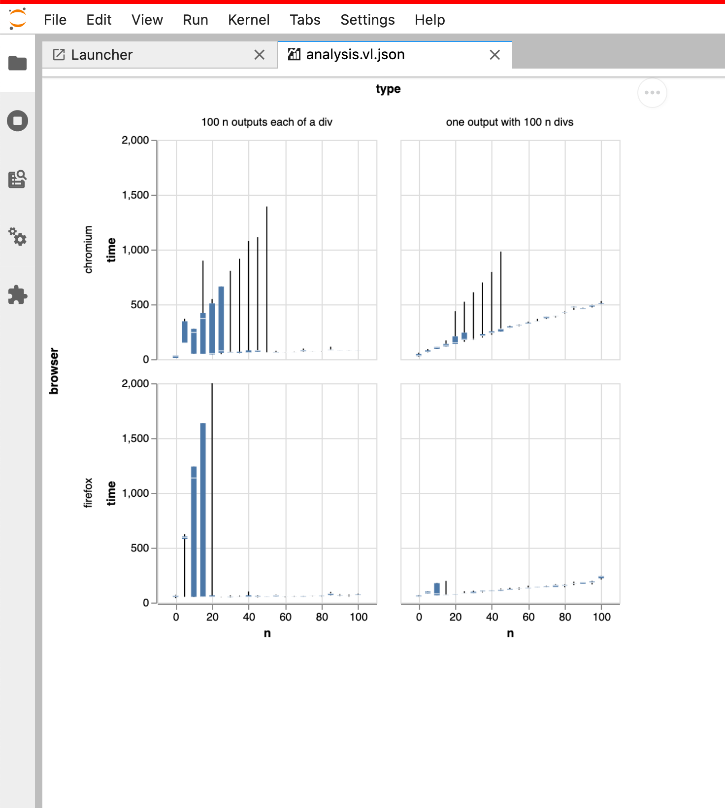

# Benchmarks

This package contains some scripts to run benchmarks against JupyterLab.

Currently it runs one type benchmark, switching between open notebooks, with a variety
of different notebook sizes and types.

To run the benchmarks against notebooks with long outputs and notebooks with many outputs, and to see how the times change as the notebooks grow:

```bash
jplm # First install dependencies

env 'BENCHMARK_NOTEBOOKS=["./longOutput", "./manyOutputs"]' jlpm all
```



`BENCHMARK_NOTEBOOKS` should be a list strings that node can import that return a description of how to create a notebook. They should have a default export of the type `NotebookType` in [`./src/notebookType.ts`](./src/notebookType.ts). If you don't provide it, it will be run against all built in benchmark, which require installing some extensions below.

It will keep increasing the `n` until either it reaches a maximum or the time exceeds a certain budget.

It will run on both firefox and chrome.

## Plotly

We also build in support to run this against some plotly ipywidgets, to get a sense of
how rendering time is impacted by heavier mime render types:

First add the plotly and ipywidgets to the `dev_mode/package.json`:

```json
    "externalExtensions": {
      "@jupyter-widgets/jupyterlab-manager": "2.0.0",
      "plotlywidget": "1.5.4",
      "jupyterlab-plotly": "1.5.4"
    },
```

Then install the python packages:

```bash
pip install plotly==4.5.4 ipywidgets==7.5.1
```

Then run the build, run the benchmarks, and view the results:

```bash
env 'BENCHMARK_NOTEBOOKS=["./largePlotly", "./manyPlotly"]' jlpm all
```

## React Fixed Data Tables

We add support for testing against a mime render of [`fixed-data-table-2`](https://github.com/schrodinger/fixed-data-table-2) which
is an example of a cell output that takes a while to render:

```json
    "externalExtensions": {
      "fdtmime": "file:../benchmarks/extensions/fixed-data-table"
    },
```

```bash
env 'BENCHMARK_NOTEBOOKS=["./fixedDataTable", "./manyOutputs"]' jlpm all
```

## Comparing Benchmarks

We also support comparing two runs of benchmarks to give a sense of the relative changes:

```bash
# Create `old.csv` and `new.csv` files
env 'BENCHMARK_NOTEBOOKS=["./manyOutputs", "./longOutput"]' BENCHMARK_OUTPUT=old.csv jlpm start:benchmark
env 'BENCHMARK_NOTEBOOKS=["./manyOutputs", "./longOutput"]' BENCHMARK_OUTPUT=new.csv jlpm start:benchmark
# Create comparison csv file
jlpm run start:compare
# Create and open graph to view results
jlpm run start:compare-graph
```
