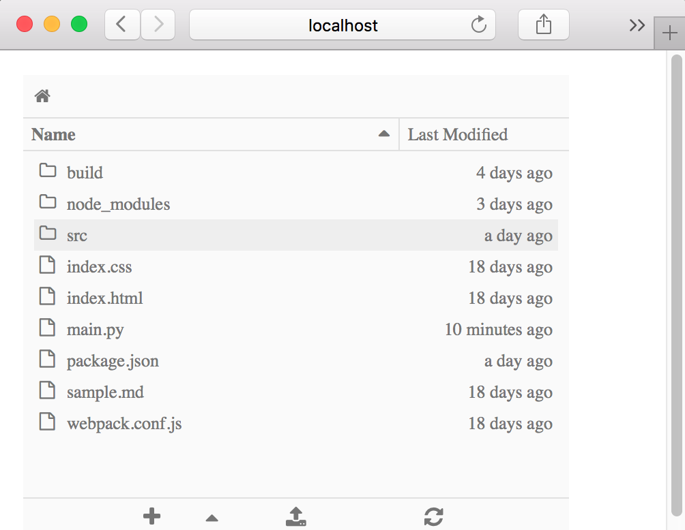

# Examples

The `examples` directory in the JupyterLab repo contains:
- several stand-alone examples (`console`, `filebrowser`,
  `notebook`, `terminal`)
- a more complex example (`lab`).

Installation instructions for the examples are found in the project's
README.

After installing the jupyter notebook server 4.2+, follow the steps for
installing the development version of JupyterLab. To build the examples,
enter from the ``jupyterlab`` repo root directory: 

    npm run build:examples

To run a particular example, navigate to the example's subdirectory in the
``examples`` directory and enter: 

    python main.py

##  Dissecting the 'filebrowser' example

The filebrowser example provides a stand-alone implementation of a 
filebrowser. Here's what the filebrowser's user interface looks like:

Let's take a closer look at the source code in ``examples/filebrowser``.

### Directory structure of 'filebrowser' example

The filebrowser in ``examples/filebrowser`` is comprised by a handful of files and
the ``src`` directory:

The filebrowser example has two key source files:

- ``src/index.ts``: the TypeScript file that defines the functionality
- ``main.py``: the Python file that enables the example to be run

Reviewing the source code of each file will help you see the role that each
file plays in the stand-alone filebrowser example.
