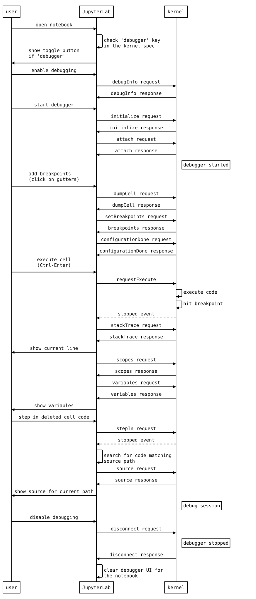
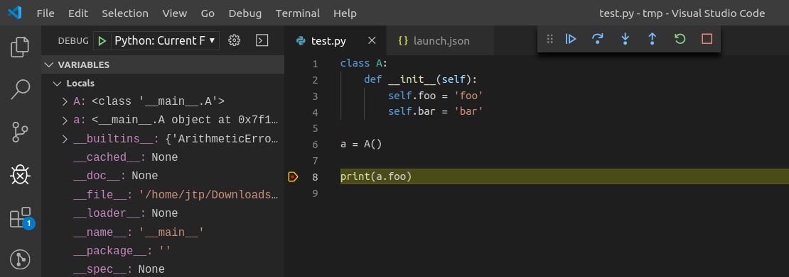

.. Copyright (c) Jupyter Development Team.
.. Distributed under the terms of the Modified BSD License.

Contribute
==========

If you're reading this section, you're probably interested in
contributing to JupyterLab. Welcome and thanks for your interest in
contributing!

Please take a look at the Contributor documentation, familiarize
yourself with using JupyterLab, and introduce yourself to the community
(on the mailing list or discourse) and share what area of the project
you are interested in working on. Please also see the Jupyter `Community
Guides <https://jupyter.readthedocs.io/en/latest/community/content-community.html>`__.

We have labeled some issues as `good first
issue <https://github.com/jupyterlab/jupyterlab/issues?q=is%3Aopen+is%3Aissue+label%3A%22good+first+issue%22>`__
or `help
wanted <https://github.com/jupyterlab/jupyterlab/issues?q=is%3Aissue+is%3Aopen+label%3A%22help+wanted%22>`__
that we believe are good examples of small, self-contained changes. We
encourage those that are new to the code base to implement and/or ask
questions about these issues. You are not required to ask for a permission
to work on such issue, but if you do and do not get a reply within 48 hours
please assume that no one else is working on it (even if someone previously
volunteered) and open a pull request with proposed implementation.
If you are not certain about the implementation, using draft pull requests is encouraged.

If you believe you’ve found a security vulnerability in JupyterLab or
any Jupyter project, please report it to security@ipython.org. If you
prefer to encrypt your security reports, you can use `this PGP public
key <https://raw.githubusercontent.com/jupyter/notebook/master/docs/source/ipython_security.asc>`__.

.. toctree::
   :hidden:

   repo
   components
   patterns
   internationalization
   css
   performance
   api

.. contents:: Table of contents
    :local:
    :depth: 1

General Guidelines for Contributing
-----------------------------------

For general documentation about contributing to Jupyter projects, see
the `Project Jupyter Contributor
Documentation <https://jupyter.readthedocs.io/en/latest/contributing/content-contributor.html>`__
and `Code of
Conduct <https://github.com/jupyter/governance/blob/master/conduct/code_of_conduct.md>`__.

We maintain the **two most recently released major versions of JupyterLab**,
JupyterLab v2 and JupyterLab v3. After JupyterLab v4 is released, we will no
longer maintain v2.
All JupyterLab v2 users are strongly advised to upgrade as soon as possible.

All source code is written in
`TypeScript <https://www.typescriptlang.org/Handbook>`__. See the `Style
Guide <https://github.com/jupyterlab/jupyterlab/wiki/TypeScript-Style-Guide>`__.

All non-python source code is formatted using `prettier <https://prettier.io>`__, and python source code is formatted using `black <https://github.com/psf/black>`__.
When code is modified and committed, all staged files will be
automatically formatted using pre-commit git hooks (with help from
`pre-commit <https://github.com/pre-commit/pre-commit>`__). The benefit of
using a code formatters like ``prettier`` and ``black`` is that it removes the topic of
code style from the conversation when reviewing pull requests, thereby
speeding up the review process.

As long as your code is valid,
the pre-commit hook should take care of how it should look.
`pre-commit` and its associated hooks will automatically be installed when
you run ``pip install -e ".[dev,test]"``

To install ``pre-commit`` manually, run the following::

    pip install pre-commit
    pre-commit install

You can invoke the pre-commit hook by hand at any time with::

    pre-commit run

which should run any autoformatting on your code
and tell you about any errors it couldn't fix automatically.
You may also install `black integration <https://github.com/psf/black#editor-integration>`__
into your text editor to format code automatically.

If you have already committed files before setting up the pre-commit
hook with ``pre-commit install``, you can fix everything up using
``pre-commit run --all-files``. You need to make the fixing commit
yourself after that.

You may also use the prettier npm script (e.g. ``npm run prettier`` or
``yarn prettier`` or ``jlpm prettier``) to format the entire code base.
We recommend installing a prettier extension for your code editor and
configuring it to format your code with a keyboard shortcut or
automatically on save.

Submitting a Pull Request Contribution
--------------------------------------

Generally, an issue should be opened describing a piece of proposed work
and the issues it solves before a pull request is opened. A triager will
ensure that your issue meets our definition of ready before we can merge
any pull requests that relate to it.

Pull requests must target the development branch (= ``master``) even if
it aims at addressing an issue seen in a stable release. Once the pull
request is merged on the development branch, it will be backported to
the stable branch using a bot action (or manually if the bot action
failed).

.. note::

   Don't hesitate to mention the targeted version in a PR description.
   A maintainer will set the milestone accordingly.

Issue Management
^^^^^^^^^^^^^^^^

Opening an issue lets community members participate in the design
discussion, makes others aware of work being done, and sets the stage
for a fruitful community interaction. When you open a new bug or
enhancement request, please provide all the requested information
in the issue template
so that a responder will be able to triage your bug without delay.

A pull request should reference
the issue it is addressing. Once the pull request is merged, the issue
related to it will also be closed. If there is additional discussion
around implementation the issue may be re-opened. Once 30 days have
passed with no additional discussion, the `lock
bot <https://github.com/apps/lock>`__ will lock the issue. If additional
discussion is desired, or if the pull request doesn't fully address the
locked issue, please open a new issue referencing the locked issue.

New issues are subject to triage. A developer with triage permissions
(a *triager*) will do the following:

1. Read the issue
2. Search the existing issues and mark it as a duplicate if necessary
3. If additional information is required, add a comment requesting it
4. If the issue is ready to be worked on, assign it to a milestone
5. Apply appropriate labels to the issue (see examples below)

A developer may start to work on an issue as soon as it is filed. Please
work with a triager if they have any questions about your issue so that
your changes can be merged in without delay.

Definition of Ready
^^^^^^^^^^^^^^^^^^^

One of the main goals of triage is to get issues into a state where they
are **ready** for someone to work on. Once a triager is satisfied that an
issue meets the definition below, they will remove the ``status:Needs Triage``
label from it. We will not merge a pull request for an issue that still
needs triage.

Triagers should also ensure that the issue has appropriate labels that
describe it, such as labels with the ``pkg:`` prefix for issues that
affect one or more packages.

**All requested information, where applicable, is provided.** From the
templates in JupyterLab’s issues:

For a **bug**:

* Description, preferably including screen shots
* Steps to reproduce
* Expected behavior
* Context, such as OS, browser, JupyterLab version, and output or log excerpts

For a **feature request**:

* Description of the problem
* Description of the proposed solution
* Additional context

**The issue should represent real, relevant, feasible work**. In short, if a
knowledgeable person were to be assigned this issue, they would be able to
complete it with a reasonable amount of effort and assistance, and it
furthers the goals of the Jupyter project.

* Issues should be unique; triage is the best time to identify duplicates.
* Bugs represent valid expectations for use of Jupyter products and services.
* Expectations for security, performance, accessibility, and localization match
  generally-accepted norms in the community that uses Jupyter products.
* The issue represents work that one developer can commit to owning, even if
  they collaborate with other developers for feedback. Excessively large issues
  should be split into multiple issues, each triaged individually, or into
  `team-compass <https://github.com/jupyterlab/team-compass>`__ issues to discuss
  more substantive changes.

Labels Used by Triagers
^^^^^^^^^^^^^^^^^^^^^^^

All new bugs and enhancement requests have the ``status:Needs Triage`` label.

On a regular basis, Jupyter contributors (triage reviewers or triagers)
review JupyterLab issues tagged
with ``status:Needs Triage``, starting with the oldest, and determine
whether they meet the definition of ready.

Once triaged, if the issue is ready, the reviewer removes the
``status:Needs Triage`` label; no additional label is required. If there
is not enough information in the issue as filed, the triage reviewer applies
the ``status:Needs Info`` label and leaves ``status:Needs Triage`` in place.
If an issue has remained in ``status:Needs Info`` for more than 14 days
without any follow-up communication, the reviewer should apply
``status:Blocked``. A blocked issue should be closed after another 14 days
pass without a reply that unblocks it.

Our expectation is that every new issue should be examined within a week of
its creation.

Tagging Issues with Labels
^^^^^^^^^^^^^^^^^^^^^^^^^^

Users without the commit rights to the JupyterLab repository can tag
issues with labels using the ``@meeseeksdev`` bot. For example: To apply
the label ``foo`` and ``bar baz`` to an issue, comment
``@meeseeksdev tag foo "bar baz"`` on the issue.

Contributing from within the browser
------------------------------------

Contributing to JupyterLab codebase is also possible without setting up
a local environment, directly from the Web browser:

-  `Gitpod <https://www.gitpod.io/>`__ integration is enabled,
   however it is not actively maintained,
-  GitHub's
   `built-in editor <https://docs.github.com/en/repositories/working-with-files/managing-files/editing-files>`__
   is suitable for contributing very small fixes,
-  more advanced `github.dev <https://docs.github.com/en/codespaces/the-githubdev-web-based-editor>`__
   editor can be accessed by pressing the dot (``.``) key while in the JupyterLab GitHub repository,
-  `jupyterlab-playground <https://github.com/jupyterlab/jupyterlab-plugin-playground>`__,
   allows to prototype JupyterLab extensions from within JupyterLab and
   can be run without installation in the browser using Binder.

Using `Binder <https://mybinder.org>`__, you can test the current master branch and your
changes within the browser as well. We recommend you have at least 8 GB of RAM for this.
To build and launch an instance of the latest JupyterLab master, open
`this link <https://mybinder.org/v2/gh/jupyterlab/jupyterlab/master?urlpath=lab-dev/>`__
in a new tab. The build takes about 7 minutes to complete.

To test your own branch hosted on GitHub, enter it on https://mybinder.org.
If everything goes right, filling out the form takes about 2 minutes, and the build should take
about 7 minutes again.

Setting up a local development environment
------------------------------------------
This section explains how to set up a local development environment. We assume you use GNU/Linux,
macOS, or Windows Subsystem for Linux.

Installing Node.js and jlpm
^^^^^^^^^^^^^^^^^^^^^^^^^^^

Building JupyterLab from its GitHub source code requires Node.js. The
development version requires Node.js version 18+, as defined in the
``engines`` specification in
`dev_mode/package.json <https://github.com/jupyterlab/jupyterlab/blob/master/dev_mode/package.json>`__.

If you use `conda <https://conda.io>`__, you can get it with:

.. code:: bash

   conda install -c conda-forge nodejs

If you use `Homebrew <https://brew.sh>`__ on macOS:

.. code:: bash

   brew install node

You can also use the installer from the `Node.js <https://nodejs.org>`__
website.

To check which version of Node.js is installed:

.. code:: bash

   node -v

.. _Installing Node.js and jlpm section:

The canvas node package is not properly packaged for macOS with ARM architectures (M1 and M2).
To build JupyterLab on such platforms, you need a few additional packages:

With conda:

.. code:: bash

   conda install -c conda-forge pkg-config pango libpng cairo jpeg giflib librsvg glib pixman
   export PKG_CONFIG_PATH=$CONDA_PREFIX/lib/pkgconfig

With Homebrew:

.. code:: bash

   brew install pkg-config cairo pango libpng jpeg giflib librsvg

Using automation to set up a local development environment
^^^^^^^^^^^^^^^^^^^^^^^^^^^^^^^^^^^^^^^^^^^^^^^^^^^^^^^^^^

While there is a lot to learn by following the steps above, they can be automated to save time. This section shows how
to do that using Vagrant as an example.

The main advantages of using automation are: reduced time to get the environment up-and-running, reduced time to
re-build the environment, better standardisation ("baseline", reproducible environments).

A practical example can be found `there <https://github.com/markgreene74/jupyterlab-local-dev-with-vagrant>`_ and
includes a ``Vagrantfile``, the bootstrap files and additional documentation.

Installing JupyterLab
---------------------

Fork the JupyterLab
`repository <https://github.com/jupyterlab/jupyterlab>`__.

Then use the following steps:

.. code:: bash

   git clone https://github.com/<your-github-username>/jupyterlab.git
   cd jupyterlab
   pip install -e ".[dev,test]"
   jlpm install
   jlpm run build  # Build the dev mode assets (optional)

Additionally, you might want to execute the following optional commands:

.. code:: bash

   # Build the core mode assets (optional)
   jlpm run build:core

   # Build the app dir assets (optional)
   jupyter lab build

Notes:

-  A few of the scripts will run "python". If your target python is
   called something else (such as "python3") then parts of the build
   will fail. You may wish to build in a conda environment, or make an
   alias.
-  Some of the packages used in the development environment require
   Python 3.0 or higher. If you encounter an ImportError during the
   installation, make sure Python 3.0+ is installed. Also, try using the
   Python 3.0+ version of ``pip`` or ``pip3 install -e .`` command to
   install JupyterLab from the forked repository.
-  If you see an error that says ``Call to 'pkg-config pixman-1 --libs'
   returned exit status 127 while in binding.gyp`` while running the
   ``pip install`` command above, you may be missing packages required
   by ``canvas``. Please see `Installing Node.js and jlpm section`_
   of this guide for instructions on how to install these packages.
-  The ``jlpm`` command is a JupyterLab-provided, locked version of the
   `yarn <https://classic.yarnpkg.com/en/>`__ package manager. If you have
   ``yarn`` installed already, you can use the ``yarn`` command when
   developing, and it will use the local version of ``yarn`` in
   ``jupyterlab/yarn.js`` when run in the repository or a built
   application directory.
-  If you decide to use the ``jlpm`` command and encounter the
   ``jlpm: command not found`` error, try adding the user-level bin
   directory to your ``PATH`` environment variable. You already
   installed ``jlpm`` along with JupyterLab in the previous command, but
   ``jlpm`` might not be accessible due to ``PATH`` environment variable
   related issues. If you are using a Unix derivative (FreeBSD, GNU /
   Linux, OS X), you can achieve this by using
   ``export PATH="$HOME/.local/bin:$PATH"`` command.
-  At times, it may be necessary to clean your local repo with the
   command ``npm run clean:slate``. This will clean the repository, and
   re-install and rebuild.
-  If ``pip`` gives a ``VersionConflict`` error, it usually means that
   the installed version of ``jupyterlab_server`` is out of date. Run
   ``pip install --upgrade jupyterlab_server`` to get the latest
   version.
-  To install JupyterLab in isolation for a single conda/virtual
   environment, you can add the ``--sys-prefix`` flag to the extension
   activation above; this will tie the installation to the
   ``sys.prefix`` location of your environment, without writing anything
   in your user-wide settings area (which are visible to all your envs):
-  You can run ``jlpm run build:dev:prod`` to build more accurate
   sourcemaps that show the original Typescript code when debugging.
   However, it takes a bit longer to build the sources, so is used only
   to build for production by default.

If you are using a version of Jupyter Notebook earlier than 5.3, then
you must also run the following command to enable the JupyterLab server
extension:

.. code:: bash

   jupyter serverextension enable --py --sys-prefix jupyterlab

For installation instructions to write documentation, please see
`Writing Documentation <#writing-documentation>`__

Run JupyterLab
^^^^^^^^^^^^^^

Start JupyterLab in development mode:

.. code:: bash

   jupyter lab --dev-mode

Development mode ensures that you are running the JavaScript assets that
are built in the dev-installed Python package. Note that when running in
dev mode, extensions will not be activated by default - refer
:ref:`documentation on extension development <prebuilt_dev_workflow>` to know more.

When running in dev mode, a red stripe will appear at the top of the
page; this is to indicate running an unreleased version.

If you want to change the TypeScript code and rebuild on the fly
(needs page refresh after each rebuild):

.. code:: bash

   jupyter lab --dev-mode --watch

Build and Run the Tests
^^^^^^^^^^^^^^^^^^^^^^^

.. code:: bash

   jlpm run build:testutils
   jlpm test

You can run tests for an individual package by changing to the
appropriate package folder:

.. code:: bash

   cd packages/notebook
   jlpm run build:test
   jlpm test --runInBand

.. note::

    ``--runInBand`` option will run all tests serially in the current process.
    We advice to use it as some tests are spinning a Jupyter Server that does not
    like to be executed in parallel.

If you see a test run fail with ``Library not loaded: '@rpath/libpixman-1.0.dylib'``
(or a different library, such as ``libcairo.2.dylib`` for Mac computers with Apple
Silicon chips) while running the
``jlpm test`` command above, you may be missing packages required
by ``canvas``. Please see
`Installing Node.js and jlpm section`_
of this guide for instructions on how to install these packages.

We use ``jest`` for all tests, so standard ``jest`` workflows apply.
Tests can be debugged in either VSCode or Chrome. It can help to add an
``it.only`` to a specific test when debugging. All of the ``test*``
scripts in each package accept ``jest`` `cli
options <https://jestjs.io/docs/cli>`__.

VSCode Debugging
""""""""""""""""

To debug in VSCode, open a package folder in VSCode. We provide a launch
configuration in each package folder. In a terminal, run
``jlpm test:debug:watch``. In VSCode, select "Attach to Jest" from the
"Run" sidebar to begin debugging. See `VSCode docs on
debugging <https://code.visualstudio.com/docs/editor/debugging>`__ for
more details.

Chrome Debugging
""""""""""""""""

To debug in Chrome, run ``jlpm test:debug:watch`` in the terminal. Open
Chrome and go to ``chrome://inspect/``. Select the remote device and
begin debugging.

Testing Utilities
"""""""""""""""""

There are some helper functions in ``testutils`` (which is a public npm
package called ``@jupyterlab/testutils``) that are used by many of the
tests.

For tests that rely on ``@jupyterlab/services`` (starting kernels,
interacting with files, etc.), there are two options. If a simple
interaction is needed, the ``Mock`` namespace exposed by ``testutils``
has a number of mock implementations (see ``testutils/src/mock.ts``). If
a full server interaction is required, use the ``JupyterServer`` class.

We have a helper function called ``testEmission`` to help with writing
tests that use ``Lumino`` signals, as well as a ``framePromise``
function to get a ``Promise`` for a ``requestAnimationFrame``. We
sometimes have to set a sentinel value inside a ``Promise`` and then
check that the sentinel was set if we need a promise to run without
blocking.

Internationalization
--------------------

Translatable strings update
^^^^^^^^^^^^^^^^^^^^^^^^^^^

The translatable strings update cannot occur on patch release. They
must be delayed on minor or major versions.

Performance Testing
-------------------

Benchmark of JupyterLab is done using Playwright. The actions measured are:

- Opening a file
- Switching from the file to a simple text file
- Switching back to the file
- Closing the file

Two files are tested: a notebook with many code cells and another with many markdown cells.

The test is run on the CI by comparing the result in the commit at which a PR branch started and the PR branch head on
the same CI job to ensure using the same hardware.
The benchmark job is triggered on:

- Approved PR review
- PR review that contains the sentence ``please run benchmark``

The tests are located in the subfolder ``galata/test/benchmark``. And they can be
executed with the following command:

.. code:: bash

   jlpm run test:benchmark

A special report will be generated in the folder ``benchmark-results`` that will contain 4 files:

- ``lab-benchmark.json``: The execution time of the tests and some metadata.
- ``lab-benchmark.md``: A report in Markdown
- ``lab-benchmark.png``: A comparison of execution time distribution
- ``lab-benchmark.vl.json``: The `Vega-Lite <https://vega.github.io/vega-lite>`__ description used to produce the PNG file.

The reference, tagged *expected*, is stored in ``lab-benchmark-expected.json``. It can be
created using the ``-u`` option of Playwright; i.e. ``jlpm run test:benchmark -u``.

Benchmark parameters
^^^^^^^^^^^^^^^^^^^^

The benchmark can be customized using the following environment variables:

- ``BENCHMARK_NUMBER_SAMPLES``: Number of samples to compute the execution time distribution; default 20.
- ``BENCHMARK_OUTPUTFILE``: Benchmark result output file; default ``benchmark.json``. It is overridden in the ``playwright-benchmark.config.js``.
- ``BENCHMARK_REFERENCE``: Reference name of the data; default is ``actual`` for current data and ``expected`` for the reference.

More tests can be carried out manually on JupyterLab branches and run weekly on the default branch in
`jupyterlab/benchmarks <https://github.com/jupyterlab/benchmarks/#readme>`__ repository.

Visual Regression and UI Tests
------------------------------

As part of JupyterLab CI workflows, UI tests are run with visual regression checks.
`Galata <https://github.com/jupyterlab/jupyterlab/tree/master/galata>`__ is used for UI
testing. Galata provides `Playwright <https://playwright.dev>`__ helpers to control and
inspect JupyterLab UI programmatically.

UI tests are run for each commit into JupyterLab project in PRs or direct commits. Code
changes can sometimes cause UI tests to fail for various reasons. After each test run,
Galata generates a user friendly test result report which can be used to inspect failing
UI tests. Result report shows the failure reason, call-stack up to the failure and
detailed information on visual regression issues. For visual regression errors, reference
image and test capture image, along with diff image generated during comparison are
provided in the report. You can use these information to debug failing tests. Galata test
report can be downloaded from GitHub Actions page for a UI test run. Test artifact is
named ``galata-report`` and once you extract it, you can access the report by launching
a server to serve the files ``python -m http.server -d <path-to-extracted-report>``.
Then open *http://localhost:8000* with your web browser.

Main reasons for UI test failures are:

1. **A visual regression caused by code changes**:

   Sometimes unintentional UI changes are introduced by modifications to project source
   code. Goal of visual regression testing is to detect this kind of UI changes. If your
   PR / commit is causing visual regression, then debug and fix the regression caused.
   You can locally run and debug the UI tests to fix the visual regression. To debug your
   test, you may run ``PWDEBUG=1 jlpm playwright test <path-to-test-file>``. Once you
   have a fix, you can push the change to your GitHub branch and test with GitHub actions.

2. **An intended update to user interface**:

   If your code change is introducing an update to UI which causes existing UI Tests to
   fail, then you will need to update reference image(s) for the failing tests. In order
   to do that, you can post a comment on your PR with the following content:

   - ``please update galata snapshots``: A bot will push a new commit to your PR updating galata
     test snaphsots.
   - ``please update documentation snapshots``: A bot will push a new commit to your PR updating
     documentation test snapshots.
   - ``please update snapshots``: Combine the two previous comments effects.

For more information on UI Testing, please read the `UI Testing developer documentation <https://github.com/jupyterlab/jupyterlab/blob/master/galata/README.md>`__
and `Playwright documentation <https://playwright.dev/docs/intro>`__.

Good Practices for Integration tests
^^^^^^^^^^^^^^^^^^^^^^^^^^^^^^^^^^^^

Here are some good practices to follow when writing integration tests:

- Don't compare multiple screenshots in the same test; if the first comparison breaks,
  it will require running multiple times the CI workflow to fix all tests.

Contributing to the debugger front-end
--------------------------------------

To make changes to the debugger extension, a kernel with support for debugging is required.

Check out the user documentation to learn how to install such kernel: :ref:`debugger`.

Then refresh the page and the debugger sidebar should appear in the right area.

The Debugger Adapter Protocol
^^^^^^^^^^^^^^^^^^^^^^^^^^^^^

The following diagram illustrates the types of messages sent between the JupyterLab extension and the kernel.

essage types are discussed in the subsequent text.

Inspecting Debug Messages in VS Code
^^^^^^^^^^^^^^^^^^^^^^^^^^^^^^^^^^^^

Inspecting the debug messages in VS Code can be useful to understand when debug requests are made (for example triggered by a UI action), and to compare the behavior of the JupyterLab debugger with the Python debugger in VS Code.

The first step is to create a test file and a debug configuration (``launch.json``):

.. code:: json

   {
      "version": "0.2.0",
      "configurations": [
         {
            "name": "Python: Current File",
            "type": "python",
            "request": "launch",
            "program": "${file}",
            "console": "integratedTerminal",
            "env": { "DEBUGPY_LOG_DIR": "/path/to/logs/folder" }
         }
      ]
   }

Then start the debugger:

The content of the log file looks like this:

.. code:: bash

   ...

   D00000.032: IDE --> {
                  "command": "initialize",
                  "arguments": {
                     "clientID": "vscode",
                     "clientName": "Visual Studio Code",
                     "adapterID": "python",
                     "pathFormat": "path",
                     "linesStartAt1": true,
                     "columnsStartAt1": true,
                     "supportsVariableType": true,
                     "supportsVariablePaging": true,
                     "supportsRunInTerminalRequest": true,
                     "locale": "en-us"
                  },
                  "type": "request",
                  "seq": 1
               }

   ...

With:

- ``IDE`` = VS Code
- ``PYD`` = pydev debugger
- Messages follow the `DAP <https://microsoft.github.io/debug-adapter-protocol/specification>`_

References
^^^^^^^^^^

- Dump cell and state restoration: https://github.com/jupyterlab/debugger/issues/52
- Protocol Overview: https://microsoft.github.io/debug-adapter-protocol/overview
- Specification: https://microsoft.github.io/debug-adapter-protocol/specification

Build and run the stand-alone examples
--------------------------------------

To install and build the examples in the ``examples`` directory:

.. code:: bash

   jlpm run build:examples

To run a specific example, change to the examples directory (i.e.
``examples/filebrowser``) and enter:

.. code:: bash

   python main.py

Debugging in the Browser
------------------------

All methods of building JupyterLab produce source maps. The source maps
should be available in the source files view of your browser's
development tools under the ``webpack://`` header.

When running JupyterLab normally, expand the ``~`` header to see the
source maps for individual packages.

When running in ``--dev-mode``, the core packages are available under
``packages/``, while the third party libraries are available under
``~``. Note: it is recommended to use ``jupyter lab --watch --dev-mode``
while debugging.

When running a test, the packages will be available at the top level
(e.g. ``application/src``), and the current set of test files available
under ``/src``. Note: it is recommended to use ``jlpm run watch`` in the
test folder while debugging test options. See
`above <#build-and-run-the-tests>`__ for more info.

--------------

High level Architecture
-----------------------

The JupyterLab application is made up of two major parts:

-  an npm package
-  a Jupyter server extension (Python package)

Each part is named ``jupyterlab``. The :ref:`developer tutorial
documentation <developer-guide>`
provides additional architecture information.

The NPM Packages
----------------

The repository consists of many npm packages that are managed using the
lerna build tool. The npm package source files are in the ``packages/``
subdirectory.

Build the NPM Packages from Source
^^^^^^^^^^^^^^^^^^^^^^^^^^^^^^^^^^

.. code:: bash

   git clone https://github.com/jupyterlab/jupyterlab.git
   cd jupyterlab
   pip install -e .
   jlpm
   jlpm run build:packages

**Rebuild**

.. code:: bash

   jlpm run clean
   jlpm run build:packages

Writing Documentation
---------------------

Documentation is written in Markdown and reStructuredText. In
particular, the documentation on our Read the Docs page is written in
reStructuredText. To ensure that the Read the Docs page builds, you'll
need to install the documentation dependencies with ``pip``:

.. code:: bash

   pip install -e .[docs]

To test the docs run:

.. code:: bash

   python -m pytest --check-links -k .md . || python -m pytest --check-links -k .md --lf .

The Read the Docs pages can be built using ``make``:

.. code:: bash

   cd docs
   make html

Or with ``jlpm``:

.. code:: bash

   jlpm run docs

Writing Style
^^^^^^^^^^^^^

-  Write documentation in the second person, referring
   to the reader as "you". Do not use the first person plural "we."
   The author of the documentation is not sitting next to the user, so
   using "we" can lead to frustration when things don't work as
   expected.
-  Avoid words that trivialize using JupyterLab such as "simply" or
   "just." Tasks that developers find simple or easy may not be for
   users.
-  Write in the active tense. For example, "drag the notebook cells…" rather
   than "notebook cells can be dragged…".
-  The beginning of each section should begin with a short (1–2
   sentence) high-level description of the topic, feature or component.
-  Use "enable" rather than "allow" to indicate what JupyterLab makes
   possible for users. Using "allow" connotes that we are giving them
   permission, whereas "enable" connotes empowerment.

User Interface Naming Conventions
^^^^^^^^^^^^^^^^^^^^^^^^^^^^^^^^^

Documents, Files, and Activities
""""""""""""""""""""""""""""""""

Refer to files as either files or documents, depending on the context.

*Documents* are more human centered. If human viewing, interpretation,
or interaction is an important part of the experience, use the term
"document". For example, notebooks and Markdown files will often be
referred to as documents except in the context of a file system
(e.g., the notebook filename).

Use the term *files* in a less human-focused context. For example,
refer to files in relation to a file system or file name.

*Activities* are either an opened document or another UI panel that is
not related to a file, such as terminals, consoles or the inspector.

Notebook Cells
""""""""""""""

A notebook contains *cells*, each of which have *input* and one or more
*outputs*. When the user runs a cell, the kernel reads and executes the
input and generates outputs. The notebook then displays the cell's output.
The term *output* describes one of possibly multiple results of running a
cell. *Cell output* describes the collective output of one cell. Use
*outputs of all cells* to describe all outputs from all cells.

Command Names
"""""""""""""

Command names appear in menus, in the Command Palette, and in toolbar buttons
(where the name typically appears on hover).

-  Keep command names short, concise, and unambiguous.
-  Add an ellipsis (…) after any command name that requires more options. This
   tells the user that they should expect a pop-up window to appear before they
   execute the command.
-  Commands should use verbs in the imperative case. Do not use articles with nouns.
   For example, write "Clear Cell", not "Clear the Cell" or "Clearing Cell".

Element Names
"""""""""""""

-  The generic content area of a tabbed UI is a *panel*. Refer to a panel
   by its most specific name, such as “File browser.” *Tab bars*
   have *tabs* that let a user view different panels.
-  The *menu bar* contains *menu items* that have their own *submenus*.
-  Refer to the *main work area* as the work area when the name
   is unambiguous.
-  When describing elements in the UI, prefer colloquial names over
   technical names. For example, use “File browser” instead of “Files panel”.

Write most element names in lowercase. These names include:

-  tab
-  panel
-  menu bar
-  sidebar
-  file
-  document
-  activity
-  tab bar
-  main work area
-  file browser
-  command palette
-  cell inspector
-  code console

Write the following sections of the user interface with one or more
initial capitals, mirroring their use in the UI:

-  Activity Bar
-  File menu
-  Files tab
-  Running panel
-  Tabs panel
-  Simple Interface mode

See :ref:`interface` for descriptions of elements in the UI.

The Jupyter Server Extension
----------------------------

The Jupyter server extension source files are in the jupyterlab/
subdirectory. To use this extension, make sure the Jupyter Notebook
server version 4.3 or later is installed.

Build the JupyterLab server extension
^^^^^^^^^^^^^^^^^^^^^^^^^^^^^^^^^^^^^

When you make a change to JupyterLab npm package source files, run:

.. code:: bash

   jlpm run build

to build the changes, and then refresh your browser to see the changes.

To have the system build after each source file change, run:

.. code:: bash

   jupyter lab --dev-mode --watch

Build Utilities
---------------

There is a range of build utilities for maintaining the repository. To
get a suggested version for a library use
``jlpm run get:dependency foo``. To update the version of a library
across the repo use ``jlpm run update:dependency foo ^latest``. To
remove an unwanted dependency use ``jlpm run remove:dependency foo``.

The key utility is ``jlpm run integrity``, which ensures the integrity
of the packages in the repo. It will:

-  Ensure the core package version dependencies match everywhere.
-  Ensure imported packages match dependencies.
-  Ensure a consistent version of all packages.
-  Manage the meta package.

The ``packages/metapackage`` package is used to build all of the
TypeScript in the repository at once, instead of 50+ individual builds.

The integrity script also allows you to automatically add a dependency
for a package by importing from it in the TypeScript file, and then
running: ``jlpm run integrity`` from the repo root.

We also have scripts for creating and removing packages in
``packages/``, ``jlpm run create:package`` and
``jlpm run remove:package``. When creating a package, if it is meant to
be included in the core bundle, add the
``jupyterlab: { coreDependency: true }`` metadata to the
``package.json``. Packages with ``extension`` or ``mimeExtension``
metadata are considered to be a core dependency unless they are
explicitly marked otherwise.

Testing Changes to External Packages
------------------------------------

Linking/Unlinking Packages to JupyterLab
^^^^^^^^^^^^^^^^^^^^^^^^^^^^^^^^^^^^^^^^

If you want to make changes to one of JupyterLab's external packages
(for example, `Lumino <https://github.com/jupyterlab/lumino>`__) and test
them out against your copy of JupyterLab, you can easily do so using the
``link`` command:

1. Make your changes and then build the external package
2. Register a link to the modified external package

   -  navigate to the external package dir and run ``jlpm link``

3. Link JupyterLab to modded package

   -  navigate to top level of your JupyterLab repo, then run
      ``jlpm link "<package-of-interest>"``

You can then (re)build JupyterLab (eg ``jlpm run build``) and your
changes should be picked up by the build.

To restore JupyterLab to its original state, you use the ``unlink``
command:

1. Unlink JupyterLab and modded package

   -  navigate to top level of your JupyterLab repo, then run
      ``jlpm unlink "<package-of-interest>"``

2. Reinstall original version of the external package in JupyterLab

   -  run ``jlpm install --check-files``

You can then (re)build JupyterLab and everything should be back to
default.

Possible Linking Pitfalls
^^^^^^^^^^^^^^^^^^^^^^^^^

If you're working on an external project with more than one package,
you'll probably have to link in your copies of every package in the
project, including those you made no changes to. Failing to do so may
cause issues relating to duplication of shared state.

Specifically, when working with Lumino, you'll probably have to link
your copy of the ``"@lumino/messaging"`` package (in addition to
whatever packages you actually made changes to). This is due to
potential duplication of objects contained in the ``MessageLoop``
namespace provided by the ``messaging`` package.

Keyboard Shortcuts
------------------

Typeset keyboard shortcuts as follows:

-  Monospace typeface, with spaces between individual keys:
   ``Shift Enter``.
-  For modifiers, use the platform independent word describing key:
   ``Shift``.
-  For the ``Accel`` key use the phrase: ``Command/Ctrl``.
-  Don’t use platform specific icons for modifier keys, as they are
   difficult to display in a platform specific way on Sphinx/RTD.

Screenshots and Animations
--------------------------

Our documentation should contain screenshots and animations that
illustrate and demonstrate the software. Here are some guidelines for
preparing them:

-  Make sure the screenshot does not contain copyrighted material
   (preferable), or the license is allowed in our documentation and
   clearly stated.
-  For screenshots, you should prefer creating visual tests. This allows
   to update them dynamically. Those tests are defined in ``galata/test/documentation``
   folder.
-  If taking a png screenshot, use the Firefox or Chrome developer tools
   to do the following:

   -  set the browser viewport to 1280x720 pixels
   -  set the device pixel ratio to 1:1 (i.e., non-hidpi, non-retina)
   -  screenshot the entire *viewport* using the browser developer
      tools. Screenshots should not include any browser elements such as
      the browser address bar, browser title bar, etc., and should not
      contain any desktop background.

-  If creating a movie, adjust the settings as above (1280x720 viewport
   resolution, non-hidpi) and use a screen capture utility of your
   choice to capture just the browser viewport.
-  For PNGs, reduce their size using ``pngquant --speed 1 <filename>``.
   The resulting filename will have ``-fs8`` appended, so make sure to
   rename it and use the resulting file. Commit the optimized png file
   to the main repository. Each png file should be no more than a few
   hundred kilobytes.
-  For movies, upload them to the IPython/Jupyter YouTube channel and
   add them to the
   `jupyterlab-media <https://github.com/jupyterlab/jupyterlab-media>`__
   repository. To embed a movie in the documentation, use the
   ``www.youtube-nocookie.com`` website, which can be found by clicking
   on the 'privacy-enhanced' embedding option in the Share dialog on
   YouTube. Add the following parameters the end of the URL
   ``?rel=0&amp;showinfo=0``. This disables the video title and related
   video suggestions.
-  Screenshots or animations should be preceded by a sentence describing
   the content, such as "To open a file, double-click on its name in the
   File Browser:".
-  We have custom CSS that will add box shadows, and proper sizing of
   screenshots and embedded YouTube videos. See examples in the
   documentation for how to embed these assets.

To help us organize screenshots and animations, please name the files
with a prefix that matches the names of the source file in which they
are used:

   ::

      sourcefile.rst
      sourcefile_filebrowser.png
      sourcefile_editmenu.png

This will help us to keep track of the images as documentation content
evolves.

Notes
-----

-  By default, the application will load from the JupyterLab staging
   directory (default is ``<sys-prefix>/share/jupyter/lab/build``. If
   you wish to run the core application in
   ``<git root>/jupyterlab/build``, run ``jupyter lab --core-mode``.
   This is the core application that will be shipped.
-  If working with extensions, see the :ref:`extension documentation <developer_extensions>`.
-  The npm modules are fully compatible with Node/Babel/ES6/ES5. Simply
   omit the type declarations when using a language other than
   TypeScript.
