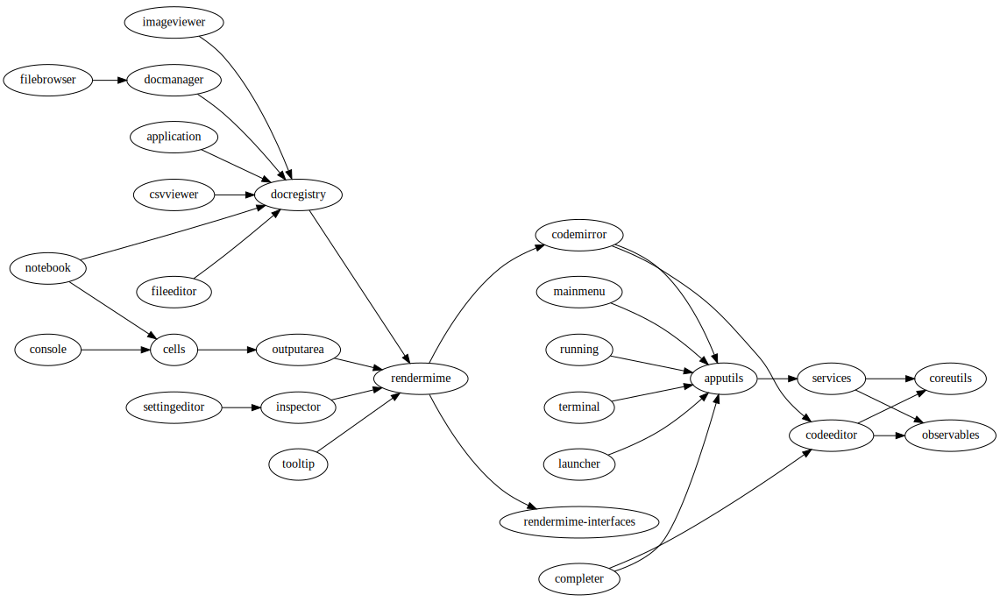

.. _developer_extensions:

Extension Developer Guide
-------------------------
JupyterLab can be extended in four ways via:

-  **application plugins (top level):** Application plugins extend the
   functionality of JupyterLab itself.
-  **mime renderer extensions (top level):** Mime Renderer extensions are
   a convenience for creating an extension that can render mime data and
   potentially render files of a given type.
-  **theme extensions (top level):** Theme extensions allow you to customize the appearance of
   JupyterLab by adding your own fonts, CSS rules, and graphics to the application.
-  **document widget extensions (lower level):** Document widget extensions
   extend the functionality of document widgets added to the
   application, and we cover them in :ref:`documents`.

A JupyterLab application is comprised of:

-  A core Application object
-  Plugins

Extensions are distributed as JavaScript packages, so you can write extensions in JavaScript or any language that compiles to JavaScript. We recommend writing extensions in `TypeScript <https://www.typescriptlang.org/>`_, which is used for the JupyterLab core extensions and many popular community extensions.

Tutorials
~~~~~~~~~

We provide a set of guides to get started writing third-party extensions for JupyterLab:

- :ref:`extension_tutorial`: An in-depth tutorial to learn how to make a simple JupyterLab extension.
- The `JupyterLab Extension Examples Repository <https://github.com/jupyterlab/extension-examples>`_: A short tutorial series
  to learn how to develop extensions for JupyterLab, by example.
- :ref:`developer-extension-points`: A list of the most common JupyterLab extension points.

Cookiecutters
~~~~~~~~~~~~~

We provide several cookiecutters to create JupyterLab plugin extensions:

- `extension-cookiecutter-ts <https://github.com/jupyterlab/extension-cookiecutter-ts>`_: Create a JupyterLab extension in TypeScript
- `extension-cookiecutter-js <https://github.com/jupyterlab/extension-cookiecutter-js>`_: Create a JupyterLab extension in JavaScript
- `mimerender-cookiecutter-ts <https://github.com/jupyterlab/mimerender-cookiecutter-ts>`_: Create a MIME Renderer JupyterLab extension in TypeScript
- `theme-cookiecutter <https://github.com/jupyterlab/theme-cookiecutter>`_: Create a new theme for JupyterLab

API Documentation
~~~~~~~~~~~~~~~~~

If you are looking for lower level details on the JupyterLab and Lumino API:

- `JupyterLab API Documentation <https://jupyterlab.github.io/jupyterlab/>`_
- `Lumino API Documentation <https://jupyterlab.github.io/lumino/>`_

Plugins
~~~~~~~

A plugin adds a core functionality to the application:

-  A plugin can require other plugins for operation.
-  A plugin is activated when it is needed by other plugins, or when
   explicitly activated.
-  Plugins require and provide ``Token`` objects, which are used to
   provide a typed value to the plugin's ``activate()`` method.
-  The module providing plugin(s) must meet the
   `JupyterLab.IPluginModule <https://jupyterlab.github.io/jupyterlab/interfaces/_application_src_index_.jupyterlab.ipluginmodule.html>`__
   interface, by exporting a plugin object or array of plugin objects as
   the default export.

The default plugins in the JupyterLab application include:

-  `Terminal <https://github.com/jupyterlab/jupyterlab/blob/master/packages/terminal-extension/src/index.ts>`__
   - Adds the ability to create command prompt terminals.
-  `Shortcuts <https://github.com/jupyterlab/jupyterlab/blob/master/packages/shortcuts-extension/src/index.ts>`__
   - Sets the default set of shortcuts for the application.
-  `Images <https://github.com/jupyterlab/jupyterlab/blob/master/packages/imageviewer-extension/src/index.ts>`__
   - Adds a widget factory for displaying image files.
-  `Help <https://github.com/jupyterlab/jupyterlab/blob/master/packages/help-extension/src/index.tsx>`__
   - Adds a side bar widget for displaying external documentation.
-  `File
   Browser <https://github.com/jupyterlab/jupyterlab/blob/master/packages/filebrowser-extension/src/index.ts>`__
   - Creates the file browser and the document manager and the file
   browser to the side bar.
-  `Editor <https://github.com/jupyterlab/jupyterlab/blob/master/packages/fileeditor-extension/src/index.ts>`__
   - Add a widget factory for displaying editable source files.
-  `Console <https://github.com/jupyterlab/jupyterlab/blob/master/packages/console-extension/src/index.ts>`__
   - Adds the ability to launch Jupyter Console instances for
   interactive kernel console sessions.

Here is a dependency graph for the core JupyterLab components: |dependencies|

.. danger::

    Installing an extension allows for arbitrary code execution on the
    server, kernel, and in the client's browser. You should therefore
    take steps to protect against malicious changes to your extension's
    code. This includes ensuring strong authentication for your npm
    account.


Application Object
~~~~~~~~~~~~~~~~~~

A Jupyter front-end application object is given to each plugin in its
``activate()`` function. The application object has:

-  ``commands`` - an extensible registry used to add and execute commands in the application.
-  ``commandLinker`` - used to connect DOM nodes with the command registry so that clicking on them executes a command.
-  ``docRegistry`` - an extensible registry containing the document types that the application is able to read and render.
-  ``restored`` - a promise that is resolved when the application has finished loading.
-  ``serviceManager`` - low-level manager for talking to the Jupyter REST API.
-  ``shell`` - a generic Jupyter front-end shell instance, which holds the user interface for the application.

Jupyter Front-End Shell
~~~~~~~~~~~~~~~~~~~~~~~

The Jupyter front-end
`shell <https://jupyterlab.github.io/jupyterlab/interfaces/_application_src_index_.jupyterfrontend.ishell.html>`__
is used to add and interact with content in the application. The ``IShell``
interface provides an ``add()`` method for adding widgets to the application.
In JupyterLab, the application shell consists of:

-  A ``top`` area for things like top level menus and toolbars.
-  ``left`` and ``right`` side bar areas for collapsible content.
-  A ``main`` work area for user activity.
-  A ``bottom`` area for things like status bars.
-  A ``header`` area for custom elements.

Lumino
~~~~~~~~

The Lumino library is used as the underlying architecture of
JupyterLab and provides many of the low level primitives and widget
structure used in the application. Lumino provides a rich set of
widgets for developing desktop-like applications in the browser, as well
as patterns and objects for writing clean, well-abstracted code. The
widgets in the application are primarily **Lumino widgets**, and
Lumino concepts, like message passing and signals, are used
throughout. **Lumino messages** are a *many-to-one* interaction that
enables information like resize events to flow through the widget
hierarchy in the application. **Lumino signals** are a *one-to-many*
interaction that enable listeners to react to changes in an observed
object.

Extension Authoring
~~~~~~~~~~~~~~~~~~~

An Extension is a valid `npm
package <https://docs.npmjs.com/getting-started/what-is-npm>`__ that
meets the following criteria:

-  Exports one or more JupyterLab plugins as the default export in its
   main file.
-  Has a ``jupyterlab`` key in its ``package.json`` which has
   ``"extension"`` metadata. The value can be ``true`` to use the main
   module of the package, or a string path to a specific module (e.g.
   ``"lib/foo"``). Example::

        "jupyterlab": {
          "extension": true
        }

-  It is also recommended to include the keyword ``jupyterlab-extension``
   in the ``package.json``, to aid with discovery (e.g. by the extension
   manager). Example::

       "keywords": [
         "jupyter",
         "jupyterlab",
         "jupyterlab-extension"
       ],

While authoring the extension, you can use the command:

.. code:: bash

    npm install   # install npm package dependencies
    npm run build  # optional build step if using TypeScript, babel, etc.
    jupyter labextension install  # install the current directory as an extension

This causes the builder to re-install the source folder before building
the application files. You can re-build at any time using
``jupyter lab build`` and it will reinstall these packages.

You can also link other local ``npm`` packages that you are working on
simultaneously using ``jupyter labextension link``; they will be re-installed
but not considered as extensions. Local extensions and linked packages are
included in ``jupyter labextension list``.

When using local extensions and linked packages, you can run the command

::

    jupyter lab --watch

This will cause the application to incrementally rebuild when one of the
linked packages changes. Note that only compiled JavaScript files (and
the CSS files) are watched by the WebPack process. This means that if
your extension is in TypeScript you'll have to run a ``jlpm run build``
before the changes will be reflected in JupyterLab. To avoid this step
you can also watch the TypeScript sources in your extension which is
usually assigned to the ``tsc -w`` shortcut. If WebPack doesn't seem to
detect the changes, this can be related to `the number of available watches <https://github.com/webpack/docs/wiki/troubleshooting#not-enough-watchers>`__.

Note that the application is built against **released** versions of the
core JupyterLab extensions. If your extension depends on JupyterLab
packages, it should be compatible with the dependencies in the
``jupyterlab/static/package.json`` file.  Note that building will always use the latest JavaScript packages that meet the dependency requirements of JupyterLab itself and any installed extensions.  If you wish to test against a
specific patch release of one of the core JupyterLab packages you can
temporarily pin that requirement to a specific version in your own
dependencies.

If you must install a extension into a development branch of JupyterLab, you have to graft it into the source tree of JupyterLab itself. This may be done using the command

::

    jlpm run add:sibling <path-or-url>

in the JupyterLab root directory, where ``<path-or-url>`` refers either
to an extension ``npm`` package on the local file system, or a URL to a git
repository for an extension ``npm`` package. This operation may be
subsequently reversed by running

::

    jlpm run remove:package <extension-dir-name>

This will remove the package metadata from the source tree and delete
all of the package files.

The package should export EMCAScript 6 compatible JavaScript. It can
import CSS using the syntax ``require('foo.css')``. The CSS files can
also import CSS from other packages using the syntax
``@import url('~foo/index.css')``, where ``foo`` is the name of the
package.

The following file types are also supported (both in JavaScript and
CSS): ``json``, ``html``, ``jpg``, ``png``, ``gif``, ``svg``,
``js.map``, ``woff2``, ``ttf``, ``eot``.

If your package uses any other file type it must be converted to one of
the above types or `include a loader in the import statement <https://webpack.js.org/concepts/loaders/#inline>`__.
If you include a loader, the loader must be importable at build time, so if
it is not already installed by JupyterLab, you must add it as a dependency
of your extension.

If your JavaScript is written in any other dialect than
EMCAScript 6 (2015) it should be converted using an appropriate tool.
You can use Webpack to pre-build your extension to use any of it's features
not enabled in our build configuration. To build a compatible package set
``output.libraryTarget`` to ``"commonjs2"`` in your Webpack configuration.
(see `this <https://github.com/saulshanabrook/jupyterlab-webpack>`__ example repo).

Another option to try out your extension with a local version of JupyterLab is to add it to the
list of locally installed packages and to have JupyterLab register your extension when it starts up.

You can do this by adding your extension to the ``jupyterlab.externalExtensions`` key
in the ``dev_mode/package.json`` file. It should be a mapping
of extension name to version, just like in ``dependencies``. Then run ``jlpm run integrity``
and these extensions should be added automatically to the ``dependencies`` and pulled in.

When you then run ``jlpm run build && jupyter lab --dev`` or ``jupyter lab --dev --watch`` this extension
will be loaded by default. For example, this is how you can add the Jupyter Widgets
extensions:

::

    "externalExtensions": {
      "@jupyter-widgets/jupyterlab-manager": "2.0.0"
    },

If you publish your extension on ``npm.org``, users will be able to install
it as simply ``jupyter labextension install <foo>``, where ``<foo>`` is
the name of the published ``npm`` package. You can alternatively provide a
script that runs ``jupyter labextension install`` against a local folder
path on the user's machine or a provided tarball. Any valid
``npm install`` specifier can be used in
``jupyter labextension install`` (e.g. ``foo@latest``, ``bar@3.0.0.0``,
``path/to/folder``, and ``path/to/tar.gz``).

Testing your extension
^^^^^^^^^^^^^^^^^^^^^^

There are a number of helper functions in ``testutils`` in this repo (which
is a public ``npm`` package called ``@jupyterlab/testutils``) that can be used when
writing tests for an extension.  See ``tests/test-application`` for an example
of the infrastructure needed to run tests.  There is a ``karma`` config file
that points to the parent directory's ``karma`` config, and a test runner,
``run-test.py`` that starts a Jupyter server.


If you are using `jest <https://jestjs.io/>`__ to test your extension, you will
need to transpile the jupyterlab packages to ``commonjs`` as they are using ES6 modules
that ``node`` does not support.

To transpile jupyterlab packages, you need to install the following package:

::

   jlpm add --dev jest@^24 @types/jest@^24 ts-jest@^24 @babel/core@^7 @babel/preset-env@^7

Then in `jest.config.js`, you will specify to use babel for js files and ignore
all node modules except the jupyterlab ones:

::

   module.exports = {
     preset: 'ts-jest/presets/js-with-babel',
     moduleFileExtensions: ['ts', 'tsx', 'js', 'jsx', 'json', 'node'],
     transformIgnorePatterns: ['/node_modules/(?!(@jupyterlab/.*)/)'],
     globals: {
       'ts-jest': {
         tsConfig: 'tsconfig.json'
       }
     },
     ... // Other options useful for your extension
   };

Finally, you will need to configure babel with a ``babel.config.js`` file containing:

::

   module.exports = {
     presets: [
       [
         '@babel/preset-env',
         {
           targets: {
             node: 'current'
           }
         }
       ]
     ]
   };

.. _rendermime:

Mime Renderer Extensions
~~~~~~~~~~~~~~~~~~~~~~~~

Mime Renderer extensions are a convenience for creating an extension
that can render mime data and potentially render files of a given type.
We provide a cookiecutter for mime renderer extensions in TypeScript
`here <https://github.com/jupyterlab/mimerender-cookiecutter-ts>`__.

Mime renderer extensions are more declarative than standard extensions.
The extension is treated the same from the command line perspective
(``jupyter labextension install`` ), but it does not directly create
JupyterLab plugins. Instead it exports an interface given in the
`rendermime-interfaces <https://jupyterlab.github.io/jupyterlab/interfaces/_rendermime_interfaces_src_index_.irendermime.iextension.html>`__
package.

The JupyterLab repo has an example mime renderer extension for
`pdf <https://github.com/jupyterlab/jupyterlab/tree/master/packages/pdf-extension>`__
files. It provides a mime renderer for pdf data and registers itself as
a document renderer for pdf file types.

The JupyterLab organization also has a mime renderer extension tutorial
which adds mp4 video rendering to the application
`here <https://github.com/jupyterlab/jupyterlab-mp4>`__.

The ``rendermime-interfaces`` package is intended to be the only
JupyterLab package needed to create a mime renderer extension (using the
interfaces in TypeScript or as a form of documentation if using plain
JavaScript).

The only other difference from a standard extension is that has a
``jupyterlab`` key in its ``package.json`` with ``"mimeExtension"``
metadata. The value can be ``true`` to use the main module of the
package, or a string path to a specific module (e.g. ``"lib/foo"``).

The mime renderer can update its data by calling ``.setData()`` on the
model it is given to render. This can be used for example to add a
``png`` representation of a dynamic figure, which will be picked up by a
notebook model and added to the notebook document. When using
``IDocumentWidgetFactoryOptions``, you can update the document model by
calling ``.setData()`` with updated data for the rendered MIME type. The
document can then be saved by the user in the usual manner.

Themes
~~~~~~

A theme is a JupyterLab extension that uses a ``ThemeManager`` and can
be loaded and unloaded dynamically. The package must include all static
assets that are referenced by ``url()`` in its CSS files. Local URLs can
be used to reference files relative to the location of the referring sibling CSS files. For example ``url('images/foo.png')`` or
``url('../foo/bar.css')``\ can be used to refer local files in the
theme. Absolute URLs (starting with a ``/``) or external URLs (e.g.
``https:``) can be used to refer to external assets. The path to the
theme asset entry point is specified ``package.json`` under the ``"jupyterlab"``
key as ``"themePath"``. See the `JupyterLab Light
Theme <https://github.com/jupyterlab/jupyterlab/tree/master/packages/theme-light-extension>`__
for an example. Ensure that the theme files are included in the
``"files"`` metadata in ``package.json``.  Note that if you want to use SCSS, SASS, or LESS files,
you must compile them to CSS and point JupyterLab to the CSS files.

The theme extension is installed in the same way as a regular extension (see
`extension authoring <#extension-authoring>`__).

It is also possible to create a new theme using the
`TypeScript theme cookiecutter <https://github.com/jupyterlab/theme-cookiecutter>`__.

Standard (General-Purpose) Extensions
~~~~~~~~~~~~~~~~~~~~~~~~~~~~~~~~~~~~~

JupyterLab's modular architecture is based around the idea
that all extensions are on equal footing, and that they interact
with each other through typed interfaces that are provided by ``Token`` objects.
An extension can provide a ``Token`` to the application,
which other extensions can then request for their own use.

.. _tokens:

Core Tokens
^^^^^^^^^^^

The core packages of JupyterLab provide a set of tokens,
which are listed here, along with short descriptions of when you
might want to use them in your extensions.

- ``@jupyterlab/application:IConnectionLost``: A token for invoking the dialog shown
  when JupyterLab has lost its connection to the server. Use this if, for some reason,
  you want to bring up the "connection lost" dialog under new circumstances.
- ``@jupyterlab/application:IInfo``: A token providing metadata about the current
  application, including currently disabled extensions and whether dev mode is enabled.
- ``@jupyterlab/application:IPaths``: A token providing information about various
  URLs and server paths for the current application. Use this token if you want to
  assemble URLs to use the JupyterLab REST API.
- ``@jupyterlab/application:ILabStatus``: An interface for interacting with the application busy/dirty
  status. Use this if you want to set the application "busy" favicon, or to set
  the application "dirty" status, which asks the user for confirmation before leaving.
- ``@jupyterlab/application:ILabShell``: An interface to the JupyterLab shell.
  The top-level application object also has a reference to the shell, but it has a restricted
  interface in order to be agnostic to different spins on the application.
  Use this to get more detailed information about currently active widgets and layout state.
- ``@jupyterlab/application:ILayoutRestorer``: An interface to the application layout
  restoration functionality. Use this to have your activities restored across
  page loads.
- ``@jupyterlab/application:IMimeDocumentTracker``: A widget tracker for documents
  rendered using a mime renderer extension. Use this if you want to list and interact
  with documents rendered by such extensions.
- ``@jupyterlab/application:IRouter``: The URL router used by the application.
  Use this to add custom URL-routing for your extension (e.g., to invoke
  a command if the user navigates to a sub-path).
- ``@jupyterlab/apputils:ICommandPalette``: An interface to the application command palette
  in the left panel. Use this to add commands to the palette.
- ``@jupyterlab/apputils:ISplashScreen``: An interface to the splash screen for the application.
  Use this if you want to show the splash screen for your own purposes.
- ``@jupyterlab/apputils:IThemeManager``: An interface to the theme manager for the application.
  Most extensions will not need to use this, as they can register a
  `theme extension <#themes>`__.
- ``@jupyterlab/apputils:IWindowResolver``: An interface to a window resolver for the
  application. JupyterLab workspaces are given a name, which are determined using
  the window resolver. Require this if you want to use the name of the current workspace.
- ``@jupyterlab/codeeditor:IEditorServices``: An interface to the text editor provider
  for the application. Use this to create new text editors and host them in your
  UI elements.
- ``@jupyterlab/completer:ICompletionManager``: An interface to the completion manager
  for the application. Use this to allow your extension to invoke a completer.
- ``@jupyterlab/console:IConsoleTracker``: A widget tracker for code consoles.
  Use this if you want to be able to iterate over and interact with code consoles
  created by the application.
- ``@jupyterlab/console:IContentFactory``: A factory object that creates new code
  consoles. Use this if you want to create and host code consoles in your own UI elements.
- ``@jupyterlab/docmanager:IDocumentManager``: An interface to the manager for all
  documents used by the application. Use this if you want to open and close documents,
  create and delete files, and otherwise interact with the file system.
- ``@jupyterlab/documentsearch:ISearchProviderRegistry``: An interface for a registry of search
  providers for the application. Extensions can register their UI elements with this registry
  to provide find/replace support.
- ``@jupyterlab/filebrowser:IFileBrowserFactory``: A factory object that creates file browsers.
  Use this if you want to create your own file browser (e.g., for a custom storage backend),
  or to interact with other file browsers that have been created by extensions.
- ``@jupyterlab/fileeditor:IEditorTracker``: A widget tracker for file editors.
  Use this if you want to be able to iterate over and interact with file editors
  created by the application.
- ``@jupyterlab/htmlviewer:IHTMLViewerTracker``: A widget tracker for rendered HTML documents.
  Use this if you want to be able to iterate over and interact with HTML documents
  viewed by the application.
- ``@jupyterlab/imageviewer:IImageTracker``: A widget tracker for images.
  Use this if you want to be able to iterate over and interact with images
  viewed by the application.
- ``@jupyterlab/inspector:IInspector``: An interface for adding variable inspectors to widgets.
  Use this to add the ability to hook into the variable inspector to your extension.
- ``@jupyterlab/launcher:ILauncher``: An interface to the application activity launcher.
  Use this to add your extension activities to the launcher panel.
- ``@jupyterlab/mainmenu:IMainMenu``: An interface to the main menu bar for the application.
  Use this if you want to add your own menu items.
- ``@jupyterlab/markdownviewer:IMarkdownViewerTracker``: A widget tracker for markdown
  document viewers. Use this if you want to iterate over and interact with rendered markdown documents.
- ``@jupyterlab/notebook:INotebookTools``: An interface to the ``Notebook Tools`` panel in the
  application left area. Use this to add your own functionality to the panel.
- ``@jupyterlab/notebook:IContentFactory``: A factory object that creates new notebooks.
  Use this if you want to create and host notebooks in your own UI elements.
- ``@jupyterlab/notebook:INotebookTracker``: A widget tracker for notebooks.
  Use this if you want to be able to iterate over and interact with notebooks
  created by the application.
- ``@jupyterlab/rendermime:IRenderMimeRegistry``: An interface to the rendermime registry
  for the application. Use this to create renderers for various mime-types in your extension.
  Most extensions will not need to use this, as they can register a
  `mime renderer extension <#mime-renderer-extensions>`__.
- ``@jupyterlab/rendermime:ILatexTypesetter``: An interface to the LaTeX typesetter for the
  application. Use this if you want to typeset math in your extension.
- ``@jupyterlab/settingeditor:ISettingEditorTracker``: A widget tracker for setting editors.
  Use this if you want to be able to iterate over and interact with setting editors
  created by the application.
- ``@jupyterlab/settingregistry:ISettingRegistry``: An interface to the JupyterLab settings system.
  Use this if you want to store settings for your application.
  See `extension settings <#extension-settings>`__ for more information.
- ``@jupyterlab/statedb:IStateDB``: An interface to the JupyterLab state database.
  Use this if you want to store data that will persist across page loads.
  See `state database <#state-database>`__ for more information.
- ``@jupyterlab/statusbar:IStatusBar``: An interface to the status bar on the application.
  Use this if you want to add new status bar items.
- ``@jupyterlab/terminal:ITerminalTracker``: A widget tracker for terminals.
  Use this if you want to be able to iterate over and interact with terminals
  created by the application.
- ``@jupyterlab/tooltip:ITooltipManager``: An interface to the tooltip manager for the application.
  Use this to allow your extension to invoke a tooltip.
- ``@jupyterlab/vdom:IVDOMTracker``: A widget tracker for virtual DOM (VDOM) documents.
  Use this to iterate over and interact with VDOM instances created by the application.

Standard Extension Example
^^^^^^^^^^^^^^^^^^^^^^^^^^

For a concrete example of a standard extension, see :ref:`How to extend the Notebook plugin <extend-notebook-plugin>`.
Notice that the mime renderer extensions use a limited,
simplified interface to JupyterLab's extension system. Modifying the
notebook plugin requires the full, general-purpose interface to the
extension system.

Storing Extension Data
^^^^^^^^^^^^^^^^^^^^^^

In addition to the file system that is accessed by using the
``@jupyterlab/services`` package, JupyterLab exposes a plugin settings
system that can be used to provide default setting values and user overrides.

Extension Settings
``````````````````

An extension can specify user settings using a JSON Schema. The schema
definition should be in a file that resides in the ``schemaDir``
directory that is specified in the ``package.json`` file of the
extension. The actual file name should use is the part that follows the
package name of extension. So for example, the JupyterLab
``apputils-extension`` package hosts several plugins:

-  ``'@jupyterlab/apputils-extension:menu'``
-  ``'@jupyterlab/apputils-extension:palette'``
-  ``'@jupyterlab/apputils-extension:settings'``
-  ``'@jupyterlab/apputils-extension:themes'``

And in the ``package.json`` for ``@jupyterlab/apputils-extension``, the
``schemaDir`` field is a directory called ``schema``. Since the
``themes`` plugin requires a JSON schema, its schema file location is:
``schema/themes.json``. The plugin's name is used to automatically
associate it with its settings file, so this naming convention is
important. Ensure that the schema files are included in the ``"files"``
metadata in ``package.json``.

See the
`fileeditor-extension <https://github.com/jupyterlab/jupyterlab/tree/master/packages/fileeditor-extension>`__
for another example of an extension that uses settings.

Note: You can override default values of the extension settings by
defining new default values in an ``overrides.json`` file in the
application settings directory. So for example, if you would like
to set the dark theme by default instead of the light one, an
``overrides.json`` file containing the following lines needs to be
added in the application settings directory (by default this is the
``share/jupyter/lab/settings`` folder).

.. code:: json

  {
    "@jupyterlab/apputils-extension:themes": {
      "theme": "JupyterLab Dark"
    }
  }

State Database
``````````````

The state database can be accessed by importing ``IStateDB`` from
``@jupyterlab/statedb`` and adding it to the list of ``requires`` for
a plugin:

.. code:: typescript

    const id = 'foo-extension:IFoo';

    const IFoo = new Token<IFoo>(id);

    interface IFoo {}

    class Foo implements IFoo {}

    const plugin: JupyterFrontEndPlugin<IFoo> = {
      id,
      requires: [IStateDB],
      provides: IFoo,
      activate: (app: JupyterFrontEnd, state: IStateDB): IFoo => {
        const foo = new Foo();
        const key = `${id}:some-attribute`;

        // Load the saved plugin state and apply it once the app
        // has finished restoring its former layout.
        Promise.all([state.fetch(key), app.restored])
          .then(([saved]) => { /* Update `foo` with `saved`. */ });

        // Fulfill the plugin contract by returning an `IFoo`.
        return foo;
      },
      autoStart: true
    };

Context Menus
^^^^^^^^^^^^^

JupyterLab has an application-wide context menu available as
``app.contextMenu``. See the Lumino
`docs <https://jupyterlab.github.io/lumino/widgets/interfaces/contextmenu.iitemoptions.html>`__
for the item creation options. If you wish to preempt the
application context menu, you can use a 'contextmenu' event listener and
call ``event.stopPropagation`` to prevent the application context menu
handler from being called (it is listening in the bubble phase on the
``document``). At this point you could show your own Lumino
`contextMenu <https://jupyterlab.github.io/lumino/widgets/classes/contextmenu.html>`__,
or simply stop propagation and let the system context menu be shown.
This would look something like the following in a ``Widget`` subclass:

.. code:: javascript

    // In `onAfterAttach()`
    this.node.addEventListener('contextmenu', this);

    // In `handleEvent()`
    case 'contextmenu':
      event.stopPropagation();




Using React
^^^^^^^^^^^
We also provide support for using :ref:`react` in your JupyterLab
extensions, as well as in the core codebase.


.. _ext-author-companion-packages:


Companion Packages
^^^^^^^^^^^^^^^^^^

If your extensions depends on the presence of one or more packages in the
kernel, or on a notebook server extension, you can add metadata to indicate
this to the extension manager by adding metadata to your package.json file.
The full options available are::

    "jupyterlab": {
      "discovery": {
        "kernel": [
          {
            "kernel_spec": {
              "language": "<regexp for matching kernel language>",
              "display_name": "<regexp for matching kernel display name>"   // optional
            },
            "base": {
              "name": "<the name of the kernel package>"
            },
            "overrides": {   // optional
              "<manager name, e.g. 'pip'>": {
                "name": "<name of kernel package on pip, if it differs from base name>"
              }
            },
            "managers": [   // list of package managers that have your kernel package
                "pip",
                "conda"
            ]
          }
        ],
        "server": {
          "base": {
            "name": "<the name of the server extension package>"
          },
          "overrides": {   // optional
            "<manager name, e.g. 'pip'>": {
              "name": "<name of server extension package on pip, if it differs from base name>"
            }
          },
          "managers": [   // list of package managers that have your server extension package
              "pip",
              "conda"
          ]
        }
      }
    }


A typical setup for e.g. a jupyter-widget based package will then be::

    "keywords": [
        "jupyterlab-extension",
        "jupyter",
        "widgets",
        "jupyterlab"
    ],
    "jupyterlab": {
      "extension": true,
      "discovery": {
        "kernel": [
          {
            "kernel_spec": {
              "language": "^python",
            },
            "base": {
              "name": "myipywidgetspackage"
            },
            "managers": [
                "pip",
                "conda"
            ]
          }
        ]
      }
    }


Currently supported package managers are:

- ``pip``
- ``conda``


Shipping Packages
^^^^^^^^^^^^^^^^^
Most extensions are single JavaScript packages, and can be shipped on npmjs.org.
This makes them discoverable by the JupyterLab extension manager, provided they
have the ``jupyterlab-extension`` keyword  in their ``package.json``.  If the package also
contains a server extension (Python package), the author has two options.
The server extension and the JupyterLab extension can be shipped in a single package,
or they can be shipped separately.

The JupyterLab extension can be bundled in a package on PyPI and conda-forge so
that it ends up in the user's application directory.  Note that the user will still have to run ``jupyter lab build``
(or build when prompted in the UI) in order to use the extension.
The general idea is to pack the Jupyterlab extension using ``npm pack``, and then
use the ``data_files`` logic in ``setup.py`` to ensure the file ends up in the
``<jupyterlab_application>/share/jupyter/lab/extensions``
directory.

Note that even if the JupyterLab extension is unusable without the
server extension, as long as you use the companion package metadata it is still
useful to publish it to npmjs.org so it is discoverable by the JupyterLab extension manager.

The server extension can be enabled on install by using ``data_files``.
an example of this approach is `jupyterlab-matplotlib <https://github.com/matplotlib/jupyter-matplotlib/tree/ce9cc91e52065d33e57c3265282640f2aa44e08f>`__.  The file used to enable the server extension is `here <https://github.com/matplotlib/jupyter-matplotlib/blob/ce9cc91e52065d33e57c3265282640f2aa44e08f/jupyter-matplotlib.json>`__.   The logic to ship the JS tarball and server extension
enabler is in `setup.py <https://github.com/matplotlib/jupyter-matplotlib/blob/ce9cc91e52065d33e57c3265282640f2aa44e08f/setup.py>`__.  Note that the ``setup.py``
file has additional logic to automatically create the JS tarball as part of the
release process, but this could also be done manually.

Technically, a package that contains only a JupyterLab extension could be created
and published on ``conda-forge``, but it would not be discoverable by the JupyterLab
extension manager.


Listings
^^^^^^^^

You can develop on the extension manager package and :ref:`extension_listings` with the
example shipped in the ``packages/extensionmanager-extension/examples/listings`` folder.

Follow the ``README.md`` instructions in that folder.
