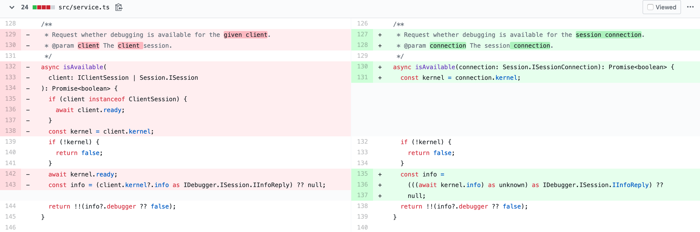

.. _extension_migration:

JupyterLab 1.x to 2.x Extension Migration Guide
------------------------------------------------

This is a migration guide for updating extensions that support JupyterLab 1.x
to work in JupyterLab 2.x. We will look at two examples of extensions that
cover most of the APIs that extension authors might be using:

- ``@jupyterlab/debugger`` migration pull request:
  https://github.com/jupyterlab/debugger/pull/337/files

- ``@jupyterlab/shortcutui`` migration pull request:
  https://github.com/jupyterlab/jupyterlab-shortcutui/pull/53/files

Upgrading library versions
~~~~~~~~~~~~~~~~~~~~~~~~~~

The ``@phosphor/*`` libraries that JupyterLab 1.x uses have been renamed to
``@lumino/*``. Updating your ``package.json`` is straightforward. The easiest
way to do this is to look in the
`JupyterLab core packages code base <https://github.com/jupyterlab/jupyterlab/tree/master/packages>`__
and to simply adopt the versions of the relevant libraries that are used
there.

.. figure:: extension_migration_dependencies_debugger.png
   :align: center
   :class: jp-screenshot
   :alt: Updating the debugger extension's libraries in package.json

   Updating the debugger extension's libraries in ``package.json``

.. figure:: extension_migration_dependencies_shortcuts.png
   :align: center
   :class: jp-screenshot
   :alt: Updating the shortcuts UI extension's libraries in package.json

   Updating the shortcuts UI extension's libraries in ``package.json``

.. tip::
  In these examples, note that we are using the ``2.0.0-beta.x`` version of
  many libraries. This was to test the extensions against the JupyterLab 2.0
  beta release before the final version. For the final release, your
  ``package.json`` should depend on version ``^2.0.0`` of these packages.

Migrating from ``@phosphor`` to ``@lumino``
~~~~~~~~~~~~~~~~~~~~~~~~~~~~~~~~~~~~~~~~~~~

The foundational packages used by JupyterLab are now all prefixed with the NPM
namespace ``@lumino`` instead of ``@phosphor``. The APIs for these packages
have not changed. The ``@phosphor`` namespaced imports need to be updated to
the new ``@lumino`` namespaced packages:

.. list-table:: Update from ``@phosphor/...`` to ``@lumino/...``

  * - ``@phosphor/application``
    - ``@lumino/application``
  * - ``@phosphor/collections``
    - ``@lumino/collections``
  * - ``@phosphor/commands``
    - ``@lumino/commands``
  * - ``@phosphor/coreutils``
    - ``@lumino/coreutils``
  * - ``@phosphor/datagrid``
    - ``@lumino/datagrid``
  * - ``@phosphor/datastore``
    - ``@lumino/datastore``
  * - ``@phosphor/default-theme``
    - ``@lumino/default-theme``
  * - ``@phosphor/disposable``
    - ``@lumino/disposable``
  * - ``@phosphor/domutils``
    - ``@lumino/domutils``
  * - ``@phosphor/dragdrop``
    - ``@lumino/dragdrop``
  * - ``@phosphor/keyboard``
    - ``@lumino/keyboard``
  * - ``@phosphor/messaging``
    - ``@lumino/messaging``
  * - ``@phosphor/properties``
    - ``@lumino/properties``
  * - ``@phosphor/signaling``
    - ``@lumino/signaling``
  * - ``@phosphor/virtualdom``
    - ``@lumino/virtualdom``
  * - ``@phosphor/widgets``
    - ``@lumino/widgets``

.. warning::
  ``p-`` prefixed CSS classes, ``data-p-`` attributes and ``p-`` DOM events
  are deprecated. They will continue to work until the next major release of
  Lumino.

  - ``.p-`` CSS classes such as ``.p-Widget`` should be updated to ``.lm-``,
    e.g. ``.lm-Widget``
  - ``data-p-`` attributes such as ``data-p-dragscroll`` should be updated to
    ``data-lm-``, e.g. ``data-lm-dragscroll``
  - ``p-`` DOM events such as ``p-dragenter`` should be updated to ``lm-``,
    e.g. ``lm-dragenter``

Updating former ``@jupyterlab/coreutils`` imports
~~~~~~~~~~~~~~~~~~~~~~~~~~~~~~~~~~~~~~~~~~~~~~~~~

JupyterLab 2.0 introduces several new packages with classes and tokens that
have been moved out of ``@jupyterlab/coreutils`` into their own packages. These
exports have been moved.

.. tip::
  It might be helpful to delete ``node_modules`` and ``yarn.lock`` when
  updating these libraries.

============================  =================================
 Export                        Package
============================  =================================
 ``DataConnector``             ``@jupyterlab/statedb``
 ``Debouncer``                 ``@lumino/polling``
 ``DefaultSchemaValidator``    ``@jupyterlab/settingregistry``
 ``IDataConnector``            ``@jupyterlab/statedb``
 ``IObjectPool``               ``@jupyterlab/statedb``
 ``IPoll``                     ``@lumino/polling``
 ``IRateLimiter``              ``@lumino/polling``
 ``IRestorable``               ``@jupyterlab/statedb``
 ``IRestorer``                 ``@jupyterlab/statedb``
 ``ISchemaValidator``          ``@jupyterlab/settingregistry``
 ``ISettingRegistry``          ``@jupyterlab/settingregistry``
 ``IStateDB``                  ``@jupyterlab/statedb``
 ``nbformat``                  ``@jupyterlab/nbformat``
 ``Poll``                      ``@lumino/polling``
 ``RateLimiter``               ``@lumino/polling``
 ``RestorablePool``            ``@jupyterlab/statedb``
 ``SettingRegistry``           ``@jupyterlab/settingregistry``
 ``Settings``                  ``@jupyterlab/settingregistry``
 ``StateDB``                   ``@jupyterlab/statedb``
 ``Throttler``                 ``@lumino/polling``
============================  =================================

Using ``Session`` and ``SessionContext`` to manage kernel sessions
~~~~~~~~~~~~~~~~~~~~~~~~~~~~~~~~~~~~~~~~~~~~~~~~~~~~~~~~~~~~~~~~~~
.. note::

  For full API documentation and examples of how to use
  ``@jupyterlab/services``,
  `consult the repository <https://github.com/jupyterlab/jupyterlab/tree/master/packages/services#readme>`__.

``ConsolePanel`` and ``NotebookPanel`` now expose a
``sessionContext: ISessionContext`` attribute that allows for a uniform way to
interact with kernel sessions.

Any widget that matches the ``interface IDocumentWidget`` has a
``context: DocumentRegistry.IContext`` attribute with a
``sessionContext: ISessionContext`` attribute.

For example, consider how the ``@jupyterlab/debugger`` extension's
``DebuggerService`` updated its ``isAvailable()`` method.

   From the `PR migrating the debugger extension to JupyterLab 2.0 <https://github.com/jupyterlab/debugger/pull/337/files#diff-22ccf3ebb0cb6b300ee90a38b88edff8>`__

.. note::

  ``await kernel.ready`` is no longer necessary before the kernel connection
  ``kernel`` can be used. Kernel messages will be buffered as needed while a
  kernel connection is coming online, so you should be able to use a kernel
  connection immediately. If you want to retrieve the kernel info (or if for
  some other reason you want to wait until at least one message has returned
  from a new kernel connection), you can do ``await kernel.info``.

Using the new icon system and ``LabIcon``
~~~~~~~~~~~~~~~~~~~~~~~~~~~~~~~~~~~~~~~~~~~~~~~~~~~~~~~~~~~~~~~~~~
.. note::

  For full API documentation and examples of how to use
  the new icon support based on ``LabIcon`` from ``@jupyterlab/ui-components``,
  `consult the repository <https://github.com/jupyterlab/jupyterlab/tree/master/packages/ui-components#readme>`__.
