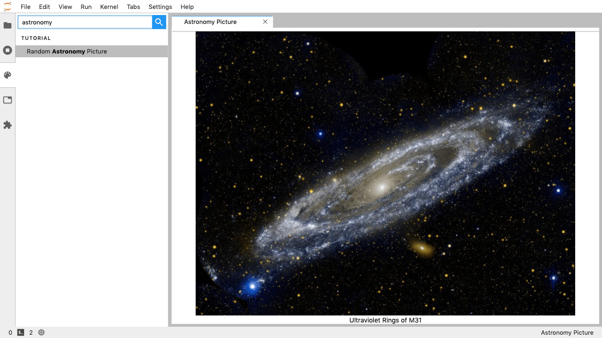
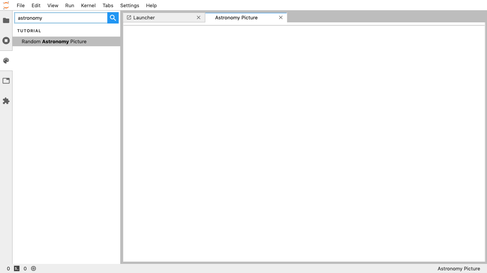
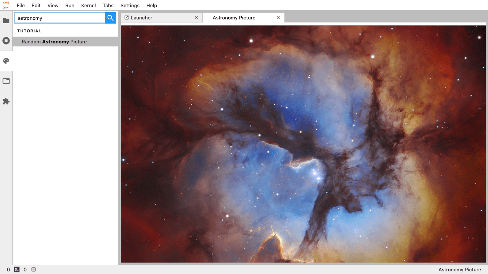

.. _extension_tutorial:

Let's Make an Astronomy Picture of the Day JupyterLab Extension
----------------------------------------------------------------

JupyterLab extensions add features to the user experience. This page
describes how to create one type of extension, an *application plugin*,
that:

-  Adds a "Random `Astronomy Picture <https://apod.nasa.gov/apod/astropix.html>`__" command to the
   *command palette* sidebar
-  Fetches the image and metadata when activated
-  Shows the image and metadata in a tab panel

By working through this tutorial, you'll learn:

-  How to set up an extension development environment from scratch on a
   Linux or OSX machine. (You'll need to modify the commands slightly if you are on Windows.)
-  How to start an extension project from
   `jupyterlab/extension-cookiecutter-ts <https://github.com/jupyterlab/extension-cookiecutter-ts>`__
-  How to iteratively code, build, and load your extension in JupyterLab
-  How to version control your work with git
-  How to release your extension for others to enjoy



   The completed extension, showing the `Astronomy Picture of the Day for 24 Jul 2015 <https://apod.nasa.gov/apod/ap150724.html>`__.

Sound like fun? Excellent. Here we go!

Set up a development environment
~~~~~~~~~~~~~~~~~~~~~~~~~~~~~~~~

Install conda using miniconda
^^^^^^^^^^^^^^^^^^^^^^^^^^^^^

Start by installing miniconda, following
`Conda's installation documentation <https://docs.conda.io/projects/conda/en/latest/user-guide/install/index.html>`__.

.. _install-nodejs-jupyterlab-etc-in-a-conda-environment:

Install NodeJS, JupyterLab, etc. in a conda environment
^^^^^^^^^^^^^^^^^^^^^^^^^^^^^^^^^^^^^^^^^^^^^^^^^^^^^^^

Next create a conda environment that includes:

1. the latest release of JupyterLab
2. `cookiecutter <https://github.com/audreyr/cookiecutter>`__, the tool
   you'll use to bootstrap your extension project structure (this is a Python tool
   which we'll install using conda below).
3. `NodeJS <https://nodejs.org>`__, the JavaScript runtime you'll use to
   compile the web assets (e.g., TypeScript, CSS) for your extension
4. `git <https://git-scm.com>`__, a version control system you'll use to
   take snapshots of your work as you progress through this tutorial

It's best practice to leave the root conda environment (i.e., the environment created
by the miniconda installer) untouched and install your project-specific
dependencies in a named conda environment. Run this command to create a
new environment named ``jupyterlab-ext``.

.. code:: bash

    conda create -n jupyterlab-ext --override-channels --strict-channel-priority -c conda-forge -c anaconda jupyterlab cookiecutter nodejs git

Now activate the new environment so that all further commands you run
work out of that environment.

.. code:: bash

    conda activate jupyterlab-ext

Note: You'll need to run the command above in each new terminal you open
before you can work with the tools you installed in the
``jupyterlab-ext`` environment.

Note: if you have an older version of JupyterLab previously installed, you may need to update
the version of JupyterLab manually.

.. code:: bash

    conda install -c conda-forge jupyterlab=2

Create a repository
~~~~~~~~~~~~~~~~~~~

Create a new repository for your extension (see, for example, the
`GitHub instructions <https://help.github.com/articles/create-a-repo/>`__. This is an
optional step, but highly recommended if you want to share your
extension.

Create an extension project
~~~~~~~~~~~~~~~~~~~~~~~~~~~

Initialize the project from a cookiecutter
^^^^^^^^^^^^^^^^^^^^^^^^^^^^^^^^^^^^^^^^^^

Next use cookiecutter to create a new project for your extension.
This will create a new folder for your extension in your current directory.

.. code:: bash

    cookiecutter https://github.com/jupyterlab/extension-cookiecutter-ts

When prompted, enter values like the following for all of the cookiecutter
prompts (``apod`` stands for Astronomy Picture of the Day, the NASA service we
are using to fetch pictures).

::

    author_name []: Your Name
    extension_name [myextension]: jupyterlab_apod
    project_short_description [A JupyterLab extension.]: Show a random NASA Astronomy Picture of the Day in a JupyterLab panel
    has_server_extension [n]: n
    repository [https://github.com/my_name/myextension]: https://github.com/my_name/jupyterlab_apod

Note: if not using a repository, leave the repository field blank. You can come
back and edit the repository field in the ``package.json`` file later.

Change to the directory the cookiecutter created and list the files.

.. code:: bash

    cd jupyterlab_apod
    ls

You should see a list like the following.

::

    LICENSE  README.md  package.json  src  style  tsconfig.json

Build and install the extension for development
^^^^^^^^^^^^^^^^^^^^^^^^^^^^^^^^^^^^^^^^^^^^^^^

Your new extension project has enough code in it to see it working in
your JupyterLab. Run the following commands to install the initial
project dependencies and install it in the JupyterLab environment. We
defer building since it will be built in the next step.

.. note::

   This tutorial uses ``jlpm`` to install Javascript packages and
   run build commands, which is JupyterLab's bundled
   version of ``yarn``. If you prefer, you can use another Javascript
   package manager like ``npm`` or ``yarn`` itself.


.. code:: bash

    jlpm install
    jupyter labextension install . --no-build

After the install completes, open a second terminal. Run these commands
to activate the ``jupyterlab-ext`` environment and to start a JupyterLab
instance in watch mode so that it will keep up with our changes as we
make them.

.. code:: bash

    conda activate jupyterlab-ext
    jupyter lab --watch

See the initial extension in action
^^^^^^^^^^^^^^^^^^^^^^^^^^^^^^^^^^^

After building with your extension, JupyterLab should open in your
default web browser.

In that browser window, open the JavaScript console
by following the instructions for your browser:

-  `Accessing the DevTools in Google
   Chrome <https://developer.chrome.com/devtools#access>`__
-  `Opening the Web Console in
   Firefox <https://developer.mozilla.org/en-US/docs/Tools/Web_Console/Opening_the_Web_Console>`__

After you reload the page with the console open, you should see a message that says
``JupyterLab extension jupyterlab_apod is activated!`` in the console.
If you do, congratulations, you're ready to start modifying the extension!
If not, go back make sure you didn't miss a step, and `reach
out <https://github.com/jupyterlab/jupyterlab/blob/master/README.md#getting-help>`__ if you're stuck.

Note: Leave the terminal running the ``jupyter lab --watch`` command
open.

Commit what you have to git
^^^^^^^^^^^^^^^^^^^^^^^^^^^

Run the following commands in your ``jupyterlab_apod`` folder to
initialize it as a git repository and commit the current code.

.. code:: bash

    git init
    git add .
    git commit -m 'Seed apod project from cookiecutter'

Note: This step is not technically necessary, but it is good practice to
track changes in version control system in case you need to rollback to
an earlier version or want to collaborate with others. For example, you
can compare your work throughout this tutorial with the commits in a
reference version of ``jupyterlab_apod`` on GitHub at
https://github.com/jupyterlab/jupyterlab_apod.

Add an Astronomy Picture of the Day widget
~~~~~~~~~~~~~~~~~~~~~~~~~~~~~~~~~~~~~~~~~~

Show an empty panel
^^^^^^^^^^^^^^^^^^^

The *command palette* is the primary view of all commands available to
you in JupyterLab. For your first addition, you're going to add a
*Random Astronomy Picture* command to the palette and get it to show an *Astronomy Picture*
tab panel when invoked.

Fire up your favorite text editor and open the ``src/index.ts`` file in
your extension project. Change the import at the top of the file to get
a reference to the command palette interface and the Jupyter front end.

.. code:: typescript

    import {
      JupyterFrontEnd, JupyterFrontEndPlugin
    } from '@jupyterlab/application';

    import {
      ICommandPalette
    } from '@jupyterlab/apputils';

Locate the ``extension`` object of type ``JupyterFrontEndPlugin``. Change the
definition so that it reads like so:

.. code:: typescript

    /**
     * Initialization data for the jupyterlab_apod extension.
     */
    const extension: JupyterFrontEndPlugin<void> = {
      id: 'jupyterlab_apod',
      autoStart: true,
      requires: [ICommandPalette],
      activate: (app: JupyterFrontEnd, palette: ICommandPalette) => {
        console.log('JupyterLab extension jupyterlab_apod is activated!');
        console.log('ICommandPalette:', palette);
      }
    };

The ``requires`` attribute states that your plugin needs an object that
implements the ``ICommandPalette`` interface when it starts. JupyterLab
will pass an instance of ``ICommandPalette`` as the second parameter of
``activate`` in order to satisfy this requirement. Defining
``palette: ICommandPalette`` makes this instance available to your code
in that function. The second ``console.log`` line exists only so that
you can immediately check that your changes work.

Now you will need to install these dependencies. Run the following commands in the
repository root folder to install the dependencies and save them to your
`package.json`:

.. code:: bash

    jlpm add @jupyterlab/apputils
    jlpm add @jupyterlab/application

Finally, run the following to rebuild your extension.

.. code:: bash

    jlpm run build

JupyterLab will rebuild after the extension does. You can
see it's progress in the ``jupyter lab --watch`` window. After that
finishes, return to the browser tab that opened when you
started JupyterLab. Refresh it and look in the console. You should see
the same activation message as before, plus the new message about the
ICommandPalette instance you just added. If you don't, check the output
of the build command for errors and correct your code.

::

    JupyterLab extension jupyterlab_apod is activated!
    ICommandPalette: Palette {_palette: CommandPalette}

Note that we had to run ``jlpm run build`` in order for the bundle to
update, because it is using the compiled JavaScript files in ``/lib``.
If you wish to avoid running ``jlpm run build`` after each change, you
can open a third terminal, and run the ``jlpm run watch`` command from
your extension directory, which will automatically compile the
TypeScript files as they change.

Now return to your editor. Modify the imports at the top of the file to add a few more imports:

.. code:: typescript

    import {
      ICommandPalette, MainAreaWidget
    } from '@jupyterlab/apputils';

    import {
      Widget
    } from '@lumino/widgets';

Install this new dependency as well:

.. code:: bash

    jlpm add @lumino/widgets


Then modify the ``activate`` function again so that it has the following
code:

.. code-block:: typescript

      activate: (app: JupyterFrontEnd, palette: ICommandPalette) => {
        console.log('JupyterLab extension jupyterlab_apod is activated!');

        // Create a blank content widget inside of a MainAreaWidget
        const content = new Widget();
        const widget = new MainAreaWidget({content});
        widget.id = 'apod-jupyterlab';
        widget.title.label = 'Astronomy Picture';
        widget.title.closable = true;

        // Add an application command
        const command: string = 'apod:open';
        app.commands.addCommand(command, {
          label: 'Random Astronomy Picture',
          execute: () => {
            if (!widget.isAttached) {
              // Attach the widget to the main work area if it's not there
              app.shell.add(widget, 'main');
            }
            // Activate the widget
            app.shell.activateById(widget.id);
          }
        });

        // Add the command to the palette.
        palette.addItem({command, category: 'Tutorial'});
      }

The first new block of code creates a ``MainAreaWidget`` instance with an empty
content ``Widget`` as its child. It also assigns the main area widget a unique
ID, gives it a label that will appear as its tab title, and makes the tab
closable by the user.
The second block of code adds a new command with id ``apod:open`` and label *Random Astronomy Picture*
to JupyterLab. When the command executes,
it attaches the widget to the main display area if it is not already
present and then makes it the active tab. The last new line of code uses the command id to add
the command to the command palette in a section called *Tutorial*.

Build your extension again using ``jlpm run build`` (unless you are using
``jlpm run watch`` already) and refresh the browser tab. Open the command
palette on the left side by clicking on *Commands* and type *Astronomy* in
the search box. Your *Random Astronomy Picture*
command should appear. Click it or select it with the keyboard and press
*Enter*. You should see a new, blank panel appear with the tab title
*Astronomy Picture*. Click the *x* on the tab to close it and activate the
command again. The tab should reappear. Finally, click one of the
launcher tabs so that the *Astronomy Picture* panel is still open but no longer
active. Now run the *Random Astronomy Picture* command one more time. The
single *Astronomy Picture* tab should come to the foreground.



   The in-progress extension, showing a blank panel.

If your widget is not behaving, compare your code with the reference
project state at the `01-show-a-panel
tag <https://github.com/jupyterlab/jupyterlab_apod/tree/2.0-01-show-a-panel>`__.
Once you've got everything working properly, git commit your changes and
carry on.

.. code-block:: bash

    git add .
    git commit -m 'Show Astronomy Picture command in palette'

Show a picture in the panel
^^^^^^^^^^^^^^^^^^^^^^^^^^^

You now have an empty panel. It's time to add a picture to it. Go back to
your code editor. Add the following code below the lines that create a
``MainAreaWidget`` instance and above the lines that define the command.

.. code-block:: typescript

        // Add an image element to the content
        let img = document.createElement('img');
        content.node.appendChild(img);

        // Get a random date string in YYYY-MM-DD format
        function randomDate() {
          const start = new Date(2010, 1, 1);
          const end = new Date();
          const randomDate = new Date(start.getTime() + Math.random()*(end.getTime() - start.getTime()));
          return randomDate.toISOString().slice(0, 10);
        }

        // Fetch info about a random picture
        const response = await fetch(`https://api.nasa.gov/planetary/apod?api_key=DEMO_KEY&date=${randomDate()}`);
        const data = await response.json() as APODResponse;

        if (data.media_type === 'image') {
          // Populate the image
          img.src = data.url;
          img.title = data.title;
        } else {
          console.log('Random APOD was not a picture.');
        }

The first two lines create a new HTML ```` element and add it to
the widget DOM node. The next lines define a function get a random date in the form ``YYYY-MM-DD`` format, and then the function is used to make a request using the HTML
`fetch <https://developer.mozilla.org/en-US/docs/Web/API/Fetch_API/Using_Fetch>`__
API that returns information about the Astronomy Picture of the Day for that date. Finally, we set the
image source and title attributes based on the response.

Now define the ``APODResponse`` type that was introduced in the code above. Put
this definition just under the imports at the top of the file.

.. code-block:: typescript

        interface APODResponse {
          copyright: string;
          date: string;
          explanation: string;
          media_type: 'video' | 'image';
          title: string;
          url: string;
        };

And update the ``activate`` method to be ``async`` since we are now using
``await`` in the method body.

.. code-block:: typescript

        activate: async (app: JupyterFrontEnd, palette: ICommandPalette) =>

Rebuild your extension if necessary (``jlpm run build``), refresh your browser
tab, and run the *Random Astronomy Picture* command again. You should now see a
picture in the panel when it opens (if that random date had a picture and not a
video).



   The in-progress extension, showing the `Astronomy Picture of the Day for 19 Jan 2014 <https://apod.nasa.gov/apod/ap140119.html>`__.

Note that the image is not centered in the panel nor does the panel
scroll if the image is larger than the panel area. Also note that the
image does not update no matter how many times you close and reopen the
panel. You'll address both of these problems in the upcoming sections.

If you don't see a image at all, compare your code with the
`02-show-an-image
tag <https://github.com/jupyterlab/jupyterlab_apod/tree/2.0-02-show-an-image>`__
in the reference project. When it's working, make another git commit.

.. code:: bash

    git add .
    git commit -m 'Show a picture in the panel'

Improve the widget behavior
~~~~~~~~~~~~~~~~~~~~~~~~~~~

Center the image, add attribution, and error messaging
^^^^^^^^^^^^^^^^^^^^^^^^^^^^^^^^^^^^^^^^^^^^^^^^^^^^^^

Open ``style/index.css`` in our extension project directory for editing.
Add the following lines to it.

.. code-block:: css

    .my-apodWidget {
      display: flex;
      flex-direction: column;
      align-items: center;
      overflow: auto;
    }

This CSS stacks content vertically within the widget panel and lets the panel
scroll when the content overflows. This CSS file is included on the page
automatically by JupyterLab because the ``package.json`` file has a ``style``
field pointing to it. In general, you should import all of your styles into a
single CSS file, such as this ``index.css`` file, and put the path to that CSS
file in the ``package.json`` file ``style`` field.

Return to the ``index.ts`` file. Modify the ``activate``
function to apply the CSS classes, the copyright information, and error handling
for the API response.
The beginning of the function should read like the following:

.. code-block:: typescript
      :emphasize-lines: 6,16-17,28-50

      activate: async (app: JupyterFrontEnd, palette: ICommandPalette) => {
        console.log('JupyterLab extension jupyterlab_apod is activated!');

        // Create a blank content widget inside of a MainAreaWidget
        const content = new Widget();
        content.addClass('my-apodWidget'); // new line
        const widget = new MainAreaWidget({content});
        widget.id = 'apod-jupyterlab';
        widget.title.label = 'Astronomy Picture';
        widget.title.closable = true;

        // Add an image element to the content
        let img = document.createElement('img');
        content.node.appendChild(img);

        let summary = document.createElement('p');
        content.node.appendChild(summary);

        // Get a random date string in YYYY-MM-DD format
        function randomDate() {
          const start = new Date(2010, 1, 1);
          const end = new Date();
          const randomDate = new Date(start.getTime() + Math.random()*(end.getTime() - start.getTime()));
          return randomDate.toISOString().slice(0, 10);
        }

        // Fetch info about a random picture
        const response = await fetch(`https://api.nasa.gov/planetary/apod?api_key=DEMO_KEY&date=${randomDate()}`);
        if (!response.ok) {
          const data = await response.json();
          if (data.error) {
            summary.innerText = data.error.message;
          } else {
            summary.innerText = response.statusText;
          }
        } else {
          const data = await response.json() as APODResponse;

          if (data.media_type === 'image') {
            // Populate the image
            img.src = data.url;
            img.title = data.title;
            summary.innerText = data.title;
            if (data.copyright) {
              summary.innerText += ` (Copyright ${data.copyright})`;
            }
          } else {
            summary.innerText = 'Random APOD fetched was not an image.';
          }
        }

      // Keep all the remaining command lines the same
      // as before from here down ...

Build your extension if necessary (``jlpm run build``) and refresh your
JupyterLab browser tab. Invoke the *Random Astronomy Picture* command and
confirm the image is centered with the copyright information below it. Resize
the browser window or the panel so that the image is larger than the
available area. Make sure you can scroll the panel over the entire area
of the image.

If anything is not working correctly, compare your code with the reference project
`03-style-and-attribute
tag <https://github.com/jupyterlab/jupyterlab_apod/tree/2.0-03-style-and-attribute>`__.
When everything is working as expected, make another commit.

.. code:: bash

    git add .
    git commit -m 'Add styling, attribution, error handling'

Show a new image on demand
^^^^^^^^^^^^^^^^^^^^^^^^^^

The ``activate`` function has grown quite long, and there's still more
functionality to add. Let's refactor the code into two separate
parts:

1. An ``APODWidget`` that encapsulates the Astronomy Picture panel elements,
   configuration, and soon-to-be-added update behavior
2. An ``activate`` function that adds the widget instance to the UI and
   decide when the picture should refresh

Start by refactoring the widget code into the new ``APODWidget`` class.
Add the following additional import to the top of the file.

.. code-block:: typescript

    import {
      Message
    } from '@lumino/messaging';

Install this dependency:

.. code:: bash

    jlpm add @lumino/messaging


Then add the class just below the definition of ``APODResponse`` in the ``index.ts``
file.

.. code-block:: typescript

    class APODWidget extends Widget {
      /**
      * Construct a new APOD widget.
      */
      constructor() {
        super();

        this.addClass('my-apodWidget');

        // Add an image element to the panel
        this.img = document.createElement('img');
        this.node.appendChild(this.img);

        // Add a summary element to the panel
        this.summary = document.createElement('p');
        this.node.appendChild(this.summary);
      }

      /**
      * The image element associated with the widget.
      */
      readonly img: HTMLImageElement;

      /**
      * The summary text element associated with the widget.
      */
      readonly summary: HTMLParagraphElement;

      /**
      * Handle update requests for the widget.
      */
      async onUpdateRequest(msg: Message): Promise<void> {

        const response = await fetch(`https://api.nasa.gov/planetary/apod?api_key=DEMO_KEY&date=${this.randomDate()}`);

        if (!response.ok) {
          const data = await response.json();
          if (data.error) {
            this.summary.innerText = data.error.message;
          } else {
            this.summary.innerText = response.statusText;
          }
          return;
        }

        const data = await response.json() as APODResponse;

        if (data.media_type === 'image') {
          // Populate the image
          this.img.src = data.url;
          this.img.title = data.title;
          this.summary.innerText = data.title;
          if (data.copyright) {
            this.summary.innerText += ` (Copyright ${data.copyright})`;
          }
        } else {
          this.summary.innerText = 'Random APOD fetched was not an image.';
        }
      }

      /**
      * Get a random date string in YYYY-MM-DD format.
      */
      randomDate(): string {
        const start = new Date(2010, 1, 1);
        const end = new Date();
        const randomDate = new Date(start.getTime() + Math.random()*(end.getTime() - start.getTime()));
        return randomDate.toISOString().slice(0, 10);
      }
    }

You've written all of the code before. All you've done is restructure it
to use instance variables and move the image request to its own
function.

Next move the remaining logic in ``activate`` to a new, top-level
function just below the ``APODWidget`` class definition. Modify the code
to create a widget when one does not exist in the main JupyterLab area
or to refresh the image in the exist widget when the command runs again.
The code for the ``activate`` function should read as follows after
these changes:

.. code-block:: typescript

    /**
    * Activate the APOD widget extension.
    */
    function activate(app: JupyterFrontEnd, palette: ICommandPalette) {
      console.log('JupyterLab extension jupyterlab_apod is activated!');

      // Create a single widget
      const content = new APODWidget();
      const widget = new MainAreaWidget({content});
      widget.id = 'apod-jupyterlab';
      widget.title.label = 'Astronomy Picture';
      widget.title.closable = true;

      // Add an application command
      const command: string = 'apod:open';
      app.commands.addCommand(command, {
        label: 'Random Astronomy Picture',
        execute: () => {
          if (!widget.isAttached) {
            // Attach the widget to the main work area if it's not there
            app.shell.add(widget, 'main');
          }
          // Refresh the picture in the widget
          content.update();
          // Activate the widget
          app.shell.activateById(widget.id);
        }
      });

      // Add the command to the palette.
      palette.addItem({ command, category: 'Tutorial' });
    }

Remove the ``activate`` function definition from the
``JupyterFrontEndPlugin`` object and refer instead to the top-level function
like this:

.. code-block:: typescript

    const extension: JupyterFrontEndPlugin<void> = {
      id: 'jupyterlab_apod',
      autoStart: true,
      requires: [ICommandPalette],
      activate: activate
    };

Make sure you retain the ``export default extension;`` line in the file.
Now build the extension again and refresh the JupyterLab browser tab.
Run the *Random Astronomy Picture* command more than once without closing the
panel. The picture should update each time you execute the command. Close
the panel, run the command, and it should both reappear and show a new
image.

If anything is not working correctly, compare your code with the
`04-refactor-and-refresh
tag <https://github.com/jupyterlab/jupyterlab_apod/tree/2.0-04-refactor-and-refresh>`__
to debug. Once it is working properly, commit it.

.. code:: bash

    git add .
    git commit -m 'Refactor, refresh image'

Restore panel state when the browser refreshes
^^^^^^^^^^^^^^^^^^^^^^^^^^^^^^^^^^^^^^^^^^^^^^

You may notice that every time you refresh your browser tab, the Astronomy Picture
panel disappears, even if it was open before you refreshed. Other open
panels, like notebooks, terminals, and text editors, all reappear and
return to where you left them in the panel layout. You can make your
extension behave this way too.

Update the imports at the top of your ``index.ts`` file so that the
entire list of import statements looks like the following:

.. code-block:: typescript
    :emphasize-lines: 2,6

    import {
      ILayoutRestorer, JupyterFrontEnd, JupyterFrontEndPlugin
    } from '@jupyterlab/application';

    import {
      ICommandPalette, MainAreaWidget, WidgetTracker
    } from '@jupyterlab/apputils';

    import {
      Message
    } from '@lumino/messaging';

    import {
      Widget
    } from '@lumino/widgets';

Then add the ``ILayoutRestorer`` interface to the ``JupyterFrontEndPlugin``
definition. This addition passes the global ``LayoutRestorer`` as the
third parameter of the ``activate`` function.

.. code-block:: typescript
    :emphasize-lines: 4

    const extension: JupyterFrontEndPlugin<void> = {
      id: 'jupyterlab_apod',
      autoStart: true,
      requires: [ICommandPalette, ILayoutRestorer],
      activate: activate
    };

Finally, rewrite the ``activate`` function so that it:

1. Declares a widget variable, but does not create an instance
   immediately.
2. Constructs a ``WidgetTracker`` and tells the ``ILayoutRestorer``
   to use it to save/restore panel state.
3. Creates, tracks, shows, and refreshes the widget panel appropriately.

.. code-block:: typescript

    function activate(app: JupyterFrontEnd, palette: ICommandPalette, restorer: ILayoutRestorer) {
      console.log('JupyterLab extension jupyterlab_apod is activated!');

      // Declare a widget variable
      let widget: MainAreaWidget<APODWidget>;

      // Add an application command
      const command: string = 'apod:open';
      app.commands.addCommand(command, {
        label: 'Random Astronomy Picture',
        execute: () => {
          if (!widget) {
            // Create a new widget if one does not exist
            const content = new APODWidget();
            widget = new MainAreaWidget({content});
            widget.id = 'apod-jupyterlab';
            widget.title.label = 'Astronomy Picture';
            widget.title.closable = true;
          }
          if (!tracker.has(widget)) {
            // Track the state of the widget for later restoration
            tracker.add(widget);
          }
          if (!widget.isAttached) {
            // Attach the widget to the main work area if it's not there
            app.shell.add(widget, 'main');
          }
          widget.content.update();

          // Activate the widget
          app.shell.activateById(widget.id);
        }
      });

      // Add the command to the palette.
      palette.addItem({ command, category: 'Tutorial' });

      // Track and restore the widget state
      let tracker = new WidgetTracker<MainAreaWidget<APODWidget>>({
        namespace: 'apod'
      });
      restorer.restore(tracker, {
        command,
        name: () => 'apod'
      });
    }

Rebuild your extension one last time and refresh your browser tab.
Execute the *Random Astronomy Picture* command and validate that the panel
appears with an image in it. Refresh the browser tab again. You should
see an Astronomy Picture panel reappear immediately without running the command. Close
the panel and refresh the browser tab. You should then not see an Astronomy Picture tab
after the refresh.


   The completed extension, showing the `Astronomy Picture of the Day for 24 Jul 2015 <https://apod.nasa.gov/apod/ap150724.html>`__.

Refer to the `05-restore-panel-state
tag <https://github.com/jupyterlab/jupyterlab_apod/tree/2.0-05-restore-panel-state>`__
if your extension is not working correctly. Make a commit when the state of your
extension persists properly.

.. code:: bash

    git add .
    git commit -m 'Restore panel state'

Congratulations! You've implemented all of the behaviors laid out at the start
of this tutorial. Now how about sharing it with the world?

.. _publish-your-extension-to-npmjsorg:

Publish your extension to npmjs.org
~~~~~~~~~~~~~~~~~~~~~~~~~~~~~~~~~~~

npm is both a JavaScript package manager and the de facto registry for
JavaScript software. You can `sign up for an account on the npmjs.com
site <https://www.npmjs.com/signup>`__ or create an account from the
command line by running ``npm adduser`` and entering values when
prompted. Create an account now if you do not already have one. If you
already have an account, login by running ``npm login`` and answering
the prompts.

Next, open the project ``package.json`` file in your text editor. Prefix
the ``name`` field value with ``@your-npm-username>/`` so that the
entire field reads ``"name": "@your-npm-username/jupyterlab_apod"`` where
you've replaced the string ``your-npm-username`` with your real
username. Review the homepage, repository, license, and `other supported
package.json <https://docs.npmjs.com/files/package.json>`__ fields while
you have the file open. Then open the ``README.md`` file and adjust the
command in the *Installation* section so that it includes the full,
username-prefixed package name you just included in the ``package.json``
file. For example:

.. code:: bash

    jupyter labextension install @your-npm-username/jupyterlab_apod

Return to your terminal window and make one more git commit:

.. code:: bash

    git add .
    git commit -m 'Prepare to publish package'

Now run the following command to publish your package:

.. code:: bash

    npm publish --access=public

Check that your package appears on the npm website. You can either
search for it from the homepage or visit
``https://www.npmjs.com/package/@your-username/jupyterlab_apod``
directly. If it doesn't appear, make sure you've updated the package
name properly in the ``package.json`` and run the npm command correctly.
Compare your work with the state of the reference project at the
`06-prepare-to-publish
tag <https://github.com/jupyterlab/jupyterlab_apod/tree/2.0-06-prepare-to-publish>`__
for further debugging.

You can now try installing your extension as a user would. Open a new
terminal and run the following commands, again substituting your npm
username where appropriate
(make sure to stop the existing ``jupyter lab --watch`` command first):

.. code:: bash

    conda create -n jupyterlab-apod jupyterlab nodejs
    conda activate jupyterlab-apod
    jupyter labextension install @your-npm-username/jupyterlab_apod
    jupyter lab

You should see a fresh JupyterLab browser tab appear. When it does,
execute the *Random Astronomy Picture* command to prove that your extension
works when installed from npm.

Learn more
~~~~~~~~~~

You've completed the tutorial. Nicely done! If you want to keep
learning, here are some suggestions about what to try next:

-  Add the image description that comes in the API response to the panel.
-  Assign a default hotkey to the *Random Astronomy Picture* command.
-  Make the image a link to the picture on the NASA website (URLs are of the form ``https://apod.nasa.gov/apod/apYYMMDD.html``).
-  Make the image title and description update after the image loads so that the picture and description are always synced.
-  Give users the ability to pin pictures in separate, permanent panels.
-  Add a setting for the user to put in their `API key <https://api.nasa.gov/#authentication>`__ so they can make many more requests per hour than the demo key allows.
-  Push your extension git repository to GitHub.
-  Learn how to write :ref:`other kinds of extensions <developer_extensions>`.
