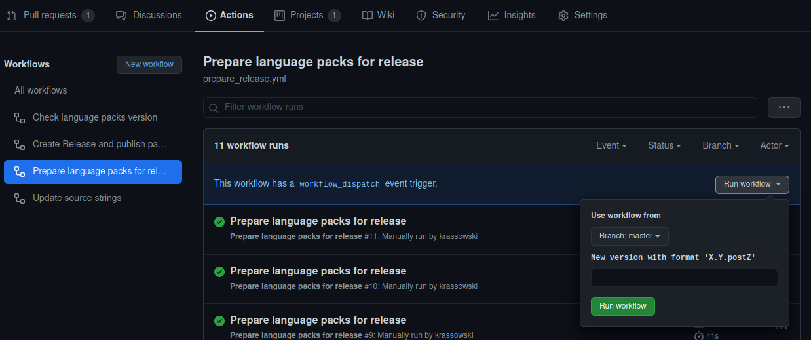

.. Copyright (c) Jupyter Development Team.
.. Distributed under the terms of the Modified BSD License.

Internationalization and Localization
=====================================

This section describes the various elements at play to create localized strings for
JupyterLab.

Four elements are used to handle the internationalization of JupyterLab:

- `language-packs <https://github.com/jupyterlab/language-packs>`_ repository: It contains
  the source strings, their translations, the language packs and the GitHub workflows to
  update and publish the translations.
- `Crowdin project <https://crowdin.com/project/jupyterlab>`_: Crowdin is the cloud-based solution
  that streamlines localization management for JupyterLab. This is the place where contributors
  can translate JupyterLab strings.
- `jupyterlab-translate <https://github.com/jupyterlab/jupyterlab-translate>`_ repository: Python
  library defining helpers to deal with internationalization (e.g. extracting the strings).
- `Package template <https://github.com/jupyterlab/language-pack-cookiecutter>`_ repository: It
  defines the Python package template of a language pack.

The *language-packs* repository is the main entry point. It interacts with Crowdin to publish
newer source strings and get the latest translation. It also creates and updates the language packs.
And finally it publishes them. All those actions are carried out using helpers defined in
``jupyterlab-translate`` and the package template.

Workflows
---------

The workflows at play will be described next, in the order they are usually called.

.. note::

    Automatic tasks are carried out through the *jupyterlab-bot*. To do that, that bot has
    access to the GitHub repository, the Crowdin project and all language packs projects on
    `PyPI <https://www.pypi.org>`_.

Source strings generation
^^^^^^^^^^^^^^^^^^^^^^^^^

Source strings are extracted for JupyterLab and a list of extensions at a given version defined
in `repository-map.yaml <https://github.com/jupyterlab/language-packs/blob/master/repository-map.yml>`_
file in *language-packs* repository. The workflow to trigger an update is as follow:

1. Edit ``repository-map.yaml`` by adding new repositories and/or updating the target version.
2. Push the change in a pull request.
3. Once the pull request is merged, the workflow `Update source strings <https://github.com/jupyterlab/language-packs/blob/master/.github/workflows/update_pot.yml>`_ will automatically be triggered.
4. That workflow will open a new pull request that will update the source strings and optionally the Crowdin configuration.
5. Once that pull request is merged, Crowdin will upload the new source strings automatically.
6. If the placement of strings in the user interface changed (or new interface components were added) consider preparing new screenshots for Crowdin (see note below) and either
   upload them directly to Crowdin (filename should include the version number), or open an issue in the `language-packs <https://github.com/jupyterlab/language-packs>`_ repository.

.. note::
   Translating on Crowdin can be difficult when no sufficient context information is present, especially for Jupyter-specific terms.
   While some technically skilled translators will navigate to the codebase to check the context of a string, it is not an efficient workflow
   and prevents other translators from contributing. To enable more translators to contribute, and achieve higher accuracy of translations
   we should provide translators with annotated screenshots of the relevant usage of specific translatable strings
   (see `Crowdin guide on screenshots <https://support.crowdin.com/adding-screenshots/>`_).

.. note::

    Crowdin is uploading automatically its source strings using `GitHub Integration <https://support.crowdin.com/github-integration/>`_ set up
    with the Crowdin account of *jupyterlab-bot*.

    The script used for this workflow is `02_update_catalogs.py <https://github.com/jupyterlab/language-packs/blob/master/scripts/02_update_catalogs.py>`_.

Translation update
^^^^^^^^^^^^^^^^^^

The new and/or updated translation are automatically pushed to the *language-packs* repository.
The workflow is as follow:

1. A contributor updates the translation on JupyterLab Crowdin project
2. A new commit with those changes is pushed to the *language-packs* repository on a branch named
   ``l10n_master``.
3. If there is no pull request associated with that branch, a new pull request will be opened.
4. A maintainer needs to merge that pull request.

.. note::

    Crowdin is automatically uploading the translation using `GitHub Integration <https://support.crowdin.com/github-integration/>`_ set up
    with the Crowdin account of *jupyterlab-bot*. Hence the commits and pull request is attributed
    to the bot.

    If the branch is deleted, it will be re-created.

.. warning::

    To avoid merge conflicts on those translation update pull requests, they should be merged before
    any ``repository-map.yaml`` pull requests as those will update the source strings. If not, the pull
    requests updating the source strings need to be closed in order for the Crowdin integration to
    re-open the PR.

.. _language-update:

Language packs update
^^^^^^^^^^^^^^^^^^^^^

Before a release of updated language packs with new translations from Crowdin the language packs need to be prepared by updating the version strings of all packages.
This is done by manually triggering the `Prepare language packs for release <https://github.com/jupyterlab/language-packs/blob/master/.github/workflows/prepare_release.yml>`_ workflow.

There is one optional setting:

- The new version in form *X.Y.postZ* or a [hatch segment](https://hatch.pypa.io/latest/version/#supported-segments) - the default is `rev` that will bump the post number.

The workflow is:

1. Trigger the manual *Prepare language packs for release* workflow
2. That workflow will open a new pull request with the changes to the language packs
3. The validation workflow `Check language packs version <https://github.com/jupyterlab/language-packs/blob/master/.github/workflows/check_version.yml>`_ should pass on that pull request
4. A maintainer needs to merge the pull request

.. note::

    The version policy for the language packs is to follow major and minor version numbers of
    JupyterLab and bumping the post number for any intermediate updates. The version
    of all language packs is identical to ease maintenance.

    The script used for this workflow is `03_prepare_release.py <https://github.com/jupyterlab/language-packs/blob/master/scripts/03_prepare_release.py>`_.

Language packs publication
^^^^^^^^^^^^^^^^^^^^^^^^^^

Each time package version is modified the `Create Release and publish packages <https://github.com/jupyterlab/language-packs/blob/master/.github/workflows/release_publish.yml>`_
will be automatically triggered. Its steps are:

1. Check that all language packs have identical versions
2. Start a matrix of job (one for each language pack)

   1. Build the source and wheel artifacts
   2. Create a GitHub release with tag *<locale>@v<version>*
   3. Publish the artifacts to PyPI

.. note::

    Publication is done using jupyterlab-bot credentials on all PyPI projects.

    `Conda recipe <https://github.com/conda-forge/jupyterlab-language-packs-feedstock>`_ should be updated by the auto-tick bot of conda-forge.

Adding a new language pack
^^^^^^^^^^^^^^^^^^^^^^^^^^

This requires the following manual actions to be executed (in that order):

1. Add the language on Crowdin
2. Execute the :ref:`language-update` workflow
3. Manually upload the package on PyPI
4. Update the owner on PyPI to add jupyterlab-bot as maintainer
5. Acknowledge the grant for the bot
6. Update the `github action list <https://github.com/jupyterlab/language-packs/blob/814ee5589fd83ceaeb6ecaefa8ad2db741f3a2df/.github/workflows/release_publish.yml#L42>`_
7. Update the `conda-forge variant list <https://github.com/conda-forge/jupyterlab-language-packs-feedstock/blob/master/recipe/conda_build_config.yaml>`_
