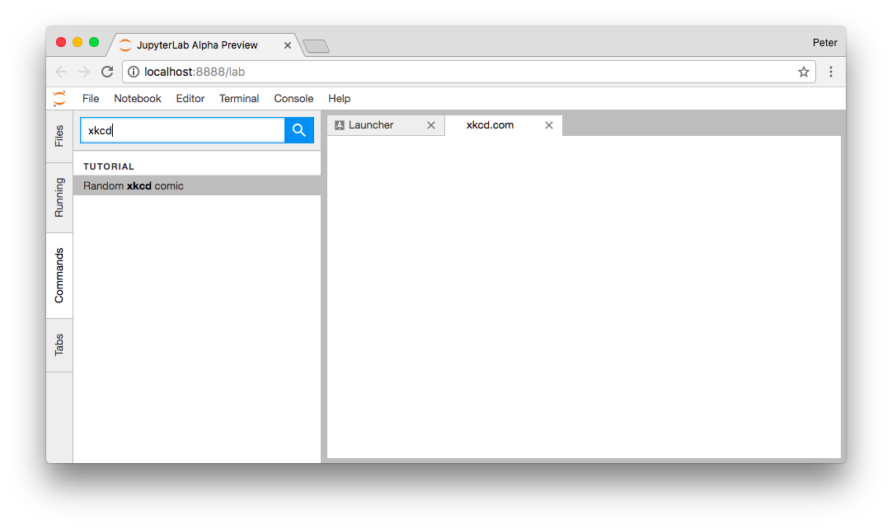
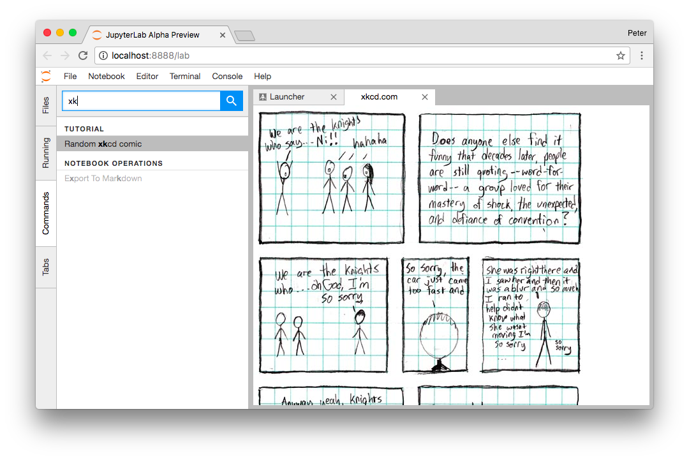
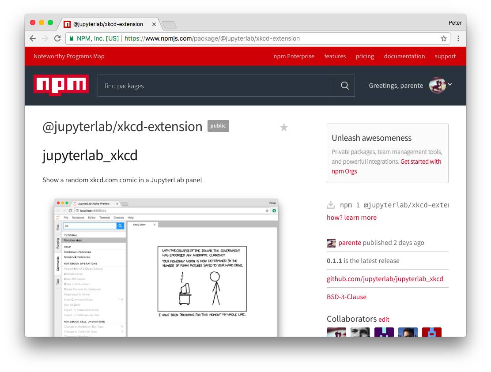

.. _xkcd_extension_tutorial:

Let's Make an xkcd JupyterLab Extension
---------------------------------------

.. warning::

   The extension developer API is not stable and will evolve in JupyterLab beta
   releases. The extension developer API will be stable in JupyterLab 1.0.

JupyterLab extensions add features to the user experience. This page
describes how to create one type of extension, an *application plugin*,
that:

-  Adds a "Random `xkcd <https://xkcd.com>`__ comic" command to the
   *command palette* sidebar
-  Fetches the comic image and metadata when activated
-  Shows the image and metadata in a tab panel

By working through this tutorial, you'll learn:

-  How to setup an extension development environment from scratch on a
   Linux or OSX machine.

   -  Windows users: You'll need to modify the commands slightly.

-  How to start an extension project from
   `jupyterlab/extension-cookiecutter-ts <https://github.com/jupyterlab/extension-cookiecutter-ts>`__
-  How to iteratively code, build, and load your extension in JupyterLab
-  How to version control your work with git
-  How to release your extension for others to enjoy

|Completed xkcd extension screenshot|

Sound like fun? Excellent. Here we go!

Setup a development environment
~~~~~~~~~~~~~~~~~~~~~~~~~~~~~~~

Install conda using miniconda
^^^^^^^^^^^^^^^^^^^^^^^^^^^^^

Start by opening your web browser and downloading the latest Python 3.x
`Miniconda installer <https://conda.io/miniconda.html>`__ to your home
directory. When the download completes, open a terminal and create a
root conda environment by running this command.

.. code:: bash

    bash Miniconda3*.sh -b -p ~/miniconda

Now activate the conda environment you just created so that you can run
the ``conda`` package manager.

.. code:: bash

    source ~/miniconda/bin/activate

.. _install-nodejs-jupyterlab-etc-in-a-conda-environment:

Install NodeJS, JupyterLab, etc. in a conda environment
^^^^^^^^^^^^^^^^^^^^^^^^^^^^^^^^^^^^^^^^^^^^^^^^^^^^^^^

Next create a conda environment that includes:

1. the latest release of JupyterLab
2. `cookiecutter <https://github.com/audreyr/cookiecutter>`__, the tool
   you'll use to bootstrap your extension project structure
3. `NodeJS <https://nodejs.org>`__, the JavaScript runtime you'll use to
   compile the web assets (e.g., TypeScript, CSS) for your extension
4. `git <https://git-scm.com>`__, a version control system you'll use to
   take snapshots of your work as you progress through this tutorial

It's best practice to leave the root conda environment, the one created
by the miniconda installer, untouched and install your project specific
dependencies in a named conda environment. Run this command to create a
new environment named ``jupyterlab-ext``.

.. code:: bash

    conda create -n jupyterlab-ext nodejs jupyterlab cookiecutter git -c conda-forge

Now activate the new environment so that all further commands you run
work out of that environment.

.. code:: bash

    source ~/miniconda/bin/activate jupyterlab-ext

Note: You'll need to run the command above in each new terminal you open
before you can work with the tools you installed in the
``jupyterlab-ext`` environment.

Create a repository
~~~~~~~~~~~~~~~~~~~

Create a new repository for your extension. For example, on
`GitHub <https://help.github.com/articles/create-a-repo/>`__. This is an
optional step but highly recommended if you want to share your
extension.

Create an extension project
~~~~~~~~~~~~~~~~~~~~~~~~~~~

Initialize the project from a cookiecutter
^^^^^^^^^^^^^^^^^^^^^^^^^^^^^^^^^^^^^^^^^^

Next use cookiecutter to create a new project for your extension.

.. code:: bash

    cookiecutter https://github.com/jupyterlab/extension-cookiecutter-ts

When prompted, enter values like the following for all of the
cookiecutter prompts.

::

    author_name []: Your Name
    extension_name [jupyterlab_myextension]: jupyterlab_xkcd
    project_short_description [A JupyterLab extension.]: Show a random xkcd.com comic in a JupyterLab panel
    repository [https://github.com/my_name/jupyterlab_myextension]: Your repository
    url

Note: if not using a repository, leave the field blank. You can come
back and edit the repository links in the ``package.json`` file later.

Change to the directory the cookiecutter created and list the files.

.. code:: bash

    cd jupyterlab_xkcd
    ls

You should see a list like the following.

::

    README.md     package.json  src           style         tsconfig.json

Build and install the extension for development
^^^^^^^^^^^^^^^^^^^^^^^^^^^^^^^^^^^^^^^^^^^^^^^

Your new extension project has enough code in it to see it working in
your JupyterLab. Run the following commands to install the initial
project dependencies and install it in the JupyterLab environment. We
defer building since it will be built in the next step.

.. code:: bash

    npm install
    npm run build
    jupyter labextension install . --no-build

After the install completes, open a second terminal. Run these commands
to activate the ``jupyterlab-ext`` environment and to start a JupyterLab
instance in watch mode so that it will keep up with our changes as we
make them.

.. code:: bash

    source ~/miniconda/bin/activate jupyterlab-ext
    jupyter lab --watch

See the initial extension in action
^^^^^^^^^^^^^^^^^^^^^^^^^^^^^^^^^^^

JupyterLab should appear momentarily in your default web browser. If all
goes well, the last bunch of messages you should see in your terminal
should look something like the following:

::

    Webpack is watching the files…

    Hash: 1c15fc765a97c45c075c
    Version: webpack 2.7.0
    Time: 6423ms
                                     Asset     Size  Chunks                    Chunk Names
      674f50d287a8c48dc19ba404d20fe713.eot   166 kB          [emitted]
    af7ae505a9eed503f8b8e6982036873e.woff2  77.2 kB          [emitted]
     fee66e712a8a08eef5805a46892932ad.woff    98 kB          [emitted]
      b06871f281fee6b241d60582ae9369b9.ttf   166 kB          [emitted]
      912ec66d7572ff821749319396470bde.svg   444 kB          [emitted]  [big]
                               0.bundle.js   890 kB       0  [emitted]  [big]
                            main.bundle.js  6.82 MB       1  [emitted]  [big]  main
                           0.bundle.js.map  1.08 MB       0  [emitted]
                        main.bundle.js.map  8.19 MB       1  [emitted]         main
      [27] ./~/@jupyterlab/application/lib/index.js 5.66 kB {1} [built]
     [427] ./~/@jupyterlab/application-extension/lib/index.js 6.14 kB {1} [optional] [built]
     [443] ./~/@jupyterlab/pdf-extension/lib/index.js 4.98 kB {1} [optional] [built]
     [445] ./~/@jupyterlab/settingeditor-extension/lib/index.js 2.67 kB {1} [optional] [built]
     [446] ./~/@jupyterlab/shortcuts-extension/lib/index.js 3.75 kB {1} [optional] [built]
     [447] ./~/@jupyterlab/tabmanager-extension/lib/index.js 1.8 kB {1} [optional] [built]
     [448] ./~/@jupyterlab/terminal-extension/lib/index.js 7.33 kB {1} [optional] [built]
     [449] ./~/@jupyterlab/theme-dark-extension/lib/index.js 800 bytes {1} [optional] [built]
     [450] ./~/@jupyterlab/theme-light-extension/lib/index.js 804 bytes {1} [optional] [built]
     [451] ./~/@jupyterlab/tooltip-extension/lib/index.js 5.61 kB {1} [optional] [built]
     [453] ./~/es6-promise/auto.js 179 bytes {1} [built]
     [454] /Users/foo/workspace/xkcd/lib/index.js 353 bytes {1} [optional] [built]
     [455] ./~/font-awesome/css/font-awesome.min.css 892 bytes {1} [built]
     [860] ./build/index.out.js 35.2 kB {1} [built]
        + 1114 hidden modules

Return to the browser. Open the JavaScript console in the JupyterLab tab
by following the instructions for your browser:

-  `Accessing the DevTools in Google
   Chrome <https://developer.chrome.com/devtools#access>`__
-  `Opening the Web Console in
   Firefox <https://developer.mozilla.org/en-US/docs/Tools/Web_Console/Opening_the_Web_Console>`__

You should see a message that says
``JupyterLab extension jupyterlab_xkcd is activated!`` in the console.
If you do, congrats, you're ready to start modifying the the extension!
If not, go back, make sure you didn't miss a step, and `reach
out <README.html#getting-help>`__ if you're stuck.

Note: Leave the terminal running the ``jupyter lab --watch`` command
open.

Commit what you have to git
^^^^^^^^^^^^^^^^^^^^^^^^^^^

Run the following commands in your ``jupyterlab_xkcd`` folder to
initialize it as a git repository and commit the current code.

.. code:: bash

    git init
    git add .
    git commit -m 'Seed xkcd project from cookiecutter'

Note: This step is not technically necessary, but it is good practice to
track changes in version control system in case you need to rollback to
an earlier version or want to collaborate with others. For example, you
can compare your work throughout this tutorial with the commits in a
reference version of ``jupyterlab_xkcd`` on GitHub at
https://github.com/jupyterlab/jupyterlab_xkcd.

Add an xkcd widget
~~~~~~~~~~~~~~~~~~

Show an empty panel
^^^^^^^^^^^^^^^^^^^

The *command palette* is the primary view of all commands available to
you in JupyterLab. For your first addition, you're going to add a
*Random xkcd comic* command to the palette and get it to show an *xkcd*
tab panel when invoked.

Fire up your favorite text editor and open the ``src/index.ts`` file in
your extension project. Add the following import at the top of the file
to get a reference to the command palette interface.

.. code:: typescript

    import {
      ICommandPalette
    } from '@jupyterlab/apputils';

You will also need to install this dependency. Run the following command in the
repository root folder install the dependency and save it to your
`package.json`:

.. code:: bash

    npm install --save @jupyterlab/apputils

Locate the ``extension`` object of type ``JupyterLabPlugin``. Change the
definition so that it reads like so:

.. code:: typescript

    /**
     * Initialization data for the jupyterlab_xkcd extension.
     */
    const extension: JupyterLabPlugin<void> = {
      id: 'jupyterlab_xkcd',
      autoStart: true,
      requires: [ICommandPalette],
      activate: (app: JupyterLab, palette: ICommandPalette) => {
        console.log('JupyterLab extension jupyterlab_xkcd is activated!');
        console.log('ICommandPalette:', palette);
      }
    };

The ``requires`` attribute states that your plugin needs an object that
implements the ``ICommandPalette`` interface when it starts. JupyterLab
will pass an instance of ``ICommandPalette`` as the second parameter of
``activate`` in order to satisfy this requirement. Defining
``palette: ICommandPalette`` makes this instance available to your code
in that function. The second ``console.log`` line exists only so that
you can immediately check that your changes work.

Run the following to rebuild your extension.

.. code:: bash

    npm run build

When the build completes, return to the browser tab that opened when you
started JupyterLab. Refresh it and look in the console. You should see
the same activation message as before, plus the new message about the
ICommandPalette instance you just added. If you don't, check the output
of the build command for errors and correct your code.

::

    JupyterLab extension jupyterlab_xkcd is activated!
    ICommandPalette: Palette {_palette: CommandPalette}

Note that we had to run ``npm run build`` in order for the bundle to
update, because it is using the compiled JavaScript files in ``/lib``.
If you wish to avoid running ``npm run build`` after each change, you
can open a third terminal, and run the ``npm run watch`` command from
your extension directory, which will automatically compile the
TypeScript files as they change.

Now return to your editor. Add the following additional import to the
top of the file.

.. code:: typescript

    import {
      Widget
    } from '@phosphor/widgets';

Install this dependency as well:

.. code:: bash

    npm install --save @phosphor/widgets


Then modify the ``activate`` function again so that it has the following
code:

.. code-block:: typescript

      activate: (app: JupyterLab, palette: ICommandPalette) => {
        console.log('JupyterLab extension jupyterlab_xkcd is activated!');

        // Create a single widget
        let widget: Widget = new Widget();
        widget.id = 'xkcd-jupyterlab';
        widget.title.label = 'xkcd.com';
        widget.title.closable = true;

        // Add an application command
        const command: string = 'xkcd:open';
        app.commands.addCommand(command, {
          label: 'Random xkcd comic',
          execute: () => {
            if (!widget.isAttached) {
              // Attach the widget to the main work area if it's not there
              app.shell.addToMainArea(widget);
            }
            // Activate the widget
            app.shell.activateById(widget.id);
          }
        });

        // Add the command to the palette.
        palette.addItem({command, category: 'Tutorial'});
      }

The first new block of code creates a ``Widget`` instance, assigns it a
unique ID, gives it a label that will appear as its tab title, and makes
the tab closable by the user. The second block of code add a new command
labeled *Random xkcd comic* to JupyterLab. When the command executes,
it attaches the widget to the main display area if it is not already
present and then makes it the active tab. The last new line of code adds
the command to the command palette in a section called *Tutorial*.

Build your extension again using ``npm run build`` (unless you are using
``npm run watch`` already) and refresh the browser tab. Open the command
palette on the left side and type *xkcd*. Your *Random xkcd comic*
command should appear. Click it or select it with the keyboard and press
*Enter*. You should see a new, blank panel appear with the tab title
*xkcd.com*. Click the *x* on the tab to close it and activate the
command again. The tab should reappear. Finally, click one of the
launcher tabs so that the *xkcd.com* panel is still open but no longer
active. Now run the *Random xkcd comic* command one more time. The
single *xkcd.com* tab should come to the foreground.

|Empty xkcd extension panel|

If your widget is not behaving, compare your code with the reference
project state at the `01-show-a-panel
tag <https://github.com/jupyterlab/jupyterlab_xkcd/tree/0.32-01-show-a-panel>`__.
Once you've got everything working properly, git commit your changes and
carry on.

.. code-block:: bash

    git add .
    git commit -m 'Show xkcd command on panel'

Show a comic in the panel
^^^^^^^^^^^^^^^^^^^^^^^^^

You've got an empty panel. It's time to add a comic to it. Go back to
your code editor. Add the following code below the lines that create a
``Widget`` instance and above the lines that define the command.

.. code-block:: typescript

        // Add an image element to the panel
        let img = document.createElement('img');
        widget.node.appendChild(img);

        // Fetch info about a random comic
        fetch('https:////egszlpbmle.execute-api.us-east-1.amazonaws.com/prod').then(response => {
          return response.json();
        }).then(data => {
          img.src = data.img;
          img.alt = data.title;
          img.title = data.alt;
        });

The first two lines create a new HTML ```` element and add it to
the widget DOM node. The next lines make a request using the HTML
`fetch <https://developer.mozilla.org/en-US/docs/Web/API/Fetch_API/Using_Fetch>`__
API that returns information about a random xkcd comic, and set the
image source, alternate text, and title attributes based on the
response.

Rebuild your extension if necessary (``npm run build``), refresh your
browser tab, and run the *Random xkcd comic* command again. You should
now see a comic in the xkcd.com panel when it opens.

|Single xkcd extension panel|

Note that the comic is not centered in the panel nor does the panel
scroll if the comic is larger than the panel area. Also note that the
comic does not update no matter how many times you close and reopen the
panel. You'll address both of these problems in the upcoming sections.

If you don't see a comic at all, compare your code with the
`02-show-a-comic
tag <https://github.com/jupyterlab/jupyterlab_xkcd/tree/0.32-02-show-a-comic>`__
in the reference project. When it's working, make another git commit.

.. code:: bash

    git add .
    git commit -m 'Show a comic in the panel'

Improve the widget behavior
~~~~~~~~~~~~~~~~~~~~~~~~~~~

Center the comic and add attribution
^^^^^^^^^^^^^^^^^^^^^^^^^^^^^^^^^^^^

Open ``style/index.css`` in our extension project directory for editing.
Add the following lines to it.

.. code-block:: css

    .jp-xkcdWidget {
        display: flex;
        flex-direction: column;
        overflow: auto;
    }

    .jp-xkcdCartoon {
        margin: auto;
    }

    .jp-xkcdAttribution {
        margin: 20px auto;
    }

The first rule stacks content vertically within the widget panel and
lets the panel scroll when the content overflows. The other rules center
the cartoon and attribution badge horizontally and space them out
vertically.

Return to the ``index.ts`` file. Note that there is already an import of
the CSS file in the ``index.ts`` file. Modify the the ``activate``
function to apply the CSS classes and add the attribution badge markup.
The beginning of the function should read like the following:

.. code-block:: typescript
      :emphasize-lines: 9,13,16-22

      activate: (app: JupyterLab, palette: ICommandPalette) => {
        console.log('JupyterLab extension jupyterlab_xkcd is activated!');

        // Create a single widget
        let widget: Widget = new Widget();
        widget.id = 'xkcd-jupyterlab';
        widget.title.label = 'xkcd.com';
        widget.title.closable = true;
        widget.addClass('jp-xkcdWidget'); // new line

        // Add an image element to the panel
        let img = document.createElement('img');
        img.className = 'jp-xkcdCartoon'; // new line
        widget.node.appendChild(img);

        // New: add an attribution badge
        img.insertAdjacentHTML('afterend',
          `<div class="jp-xkcdAttribution">
            <a href="https://creativecommons.org/licenses/by-nc/2.5/" class="jp-xkcdAttribution" target="_blank">
              
            </a>
          </div>`
        );

        // Keep all the remaining fetch and command lines the same
        // as before from here down ...

Build your extension if necessary (``npm run build``) and refresh your
JupyterLab browser tab. Invoke the *Random xkcd comic* command and
confirm the comic is centered with an attribution badge below it. Resize
the browser window or the panel so that the comic is larger than the
available area. Make sure you can scroll the panel over the entire area
of the comic.

|Styled xkcd panel with attribution|

If anything is misbehaving, compare your code with the reference project
`03-style-and-attribute
tag <https://github.com/jupyterlab/jupyterlab_xkcd/tree/0.32-03-style-and-attribute>`__.
When everything is working as expected, make another commit.

.. code:: bash

    git add .
    git commit -m 'Add styling, attribution'

Show a new comic on demand
^^^^^^^^^^^^^^^^^^^^^^^^^^

The ``activate`` function has grown quite long, and there's still more
functionality to add. You should refactor the code into two separate
parts:

1. An ``XkcdWidget`` that encapsulates the xkcd panel elements,
   configuration, and soon-to-be-added update behavior
2. An ``activate`` function that adds the widget instance to the UI and
   decide when the comic should refresh

Start by refactoring the widget code into the new ``XkcdWidget`` class.
Add the following additional import to the top of the file.

.. code-block:: typescript

    import {
      Message
    } from '@phosphor/messaging';

Install this dependency:

.. code:: bash

    npm install --save @phosphor/messaging


Then add the class just below the import statements in the ``index.ts``
file.

.. code-block:: typescript

    /**
     * An xckd comic viewer.
     */
    class XkcdWidget extends Widget {
      /**
       * Construct a new xkcd widget.
       */
      constructor() {
        super();

        this.id = 'xkcd-jupyterlab';
        this.title.label = 'xkcd.com';
        this.title.closable = true;
        this.addClass('jp-xkcdWidget');

        this.img = document.createElement('img');
        this.img.className = 'jp-xkcdCartoon';
        this.node.appendChild(this.img);

        this.img.insertAdjacentHTML('afterend',
          `<div class="jp-xkcdAttribution">
            <a href="https://creativecommons.org/licenses/by-nc/2.5/" class="jp-xkcdAttribution" target="_blank">
              
            </a>
          </div>`
        );
      }

      /**
       * The image element associated with the widget.
       */
      readonly img: HTMLImageElement;

      /**
       * Handle update requests for the widget.
       */
      onUpdateRequest(msg: Message): void {
        fetch('https://egszlpbmle.execute-api.us-east-1.amazonaws.com/prod').then(response => {
          return response.json();
        }).then(data => {
          this.img.src = data.img;
          this.img.alt = data.title;
          this.img.title = data.alt;
        });
      }
    };

You've written all of the code before. All you've done is restructure it
to use instance variables and move the comic request to its own
function.

Next move the remaining logic in ``activate`` to a new, top-level
function just below the ``XkcdWidget`` class definition. Modify the code
to create a widget when one does not exist in the main JupyterLab area
or to refresh the comic in the exist widget when the command runs again.
The code for the ``activate`` function should read as follows after
these changes:

.. code-block:: typescript

    /**
     * Activate the xckd widget extension.
     */
    function activate(app: JupyterLab, palette: ICommandPalette) {
      console.log('JupyterLab extension jupyterlab_xkcd is activated!');

      // Create a single widget
      let widget: XkcdWidget = new XkcdWidget();

      // Add an application command
      const command: string = 'xkcd:open';
      app.commands.addCommand(command, {
        label: 'Random xkcd comic',
        execute: () => {
          if (!widget.isAttached) {
            // Attach the widget to the main work area if it's not there
            app.shell.addToMainArea(widget);
          }
          // Refresh the comic in the widget
          widget.update();
          // Activate the widget
          app.shell.activateById(widget.id);
        }
      });

      // Add the command to the palette.
      palette.addItem({ command, category: 'Tutorial' });
    };

Remove the ``activate`` function definition from the
``JupyterLabPlugin`` object and refer instead to the top-level function
like so:

.. code-block:: typescript

    const extension: JupyterLabPlugin<void> = {
      id: 'jupyterlab_xkcd',
      autoStart: true,
      requires: [ICommandPalette],
      activate: activate
    };

Make sure you retain the ``export default extension;`` line in the file.
Now build the extension again and refresh the JupyterLab browser tab.
Run the *Random xkcd comic* command more than once without closing the
panel. The comic should update each time you execute the command. Close
the panel, run the command, and it should both reappear and show a new
comic.

If anything is amiss, compare your code with the
`04-refactor-and-refresh
tag <https://github.com/jupyterlab/jupyterlab_xkcd/tree/0.32-04-refactor-and-refresh>`__
to debug. Once it's working properly, commit it.

.. code:: bash

    git add .
    git commit -m 'Refactor, refresh comic'

Restore panel state when the browser refreshes
^^^^^^^^^^^^^^^^^^^^^^^^^^^^^^^^^^^^^^^^^^^^^^

You may notice that every time you refresh your browser tab, the xkcd
panel disappears, even if it was open before you refreshed. Other open
panels, like notebooks, terminals, and text editors, all reappear and
return to where you left them in the panel layout. You can make your
extension behave this way too.

Update the imports at the top of your ``index.ts`` file so that the
entire list of import statements looks like the following:

.. code-block:: typescript
    :emphasize-lines: 2,6,9-11

    import {
      JupyterLab, JupyterLabPlugin, ILayoutRestorer // new
    } from '@jupyterlab/application';

    import {
      ICommandPalette, InstanceTracker // new
    } from '@jupyterlab/apputils';

    import {
      JSONExt // new
    } from '@phosphor/coreutils';

    import {
      Message
    } from '@phosphor/messaging';

    import {
      Widget
    } from '@phosphor/widgets';

    import '../style/index.css';


Install this dependency:

.. code:: bash

    npm install --save @phosphor/coreutils

Then, add the ``ILayoutRestorer`` interface to the ``JupyterLabPlugin``
definition. This addition passes the global ``LayoutRestorer`` to the
third parameter of the ``activate``.

.. code:: typescript

    const extension: JupyterLabPlugin<void> = {
      id: 'jupyterlab_xkcd',
      autoStart: true,
      requires: [ICommandPalette, ILayoutRestorer],
      activate: activate
    };

Finally, rewrite the ``activate`` function so that it:

1. Declares a widget variable, but does not create an instance
   immediately
2. Constructs an ``InstanceTracker`` and tells the ``ILayoutRestorer``
   to use it to save/restore panel state
3. Creates, tracks, shows, and refreshes the widget panel appropriately

.. code-block:: typescript

    function activate(app: JupyterLab, palette: ICommandPalette, restorer: ILayoutRestorer) {
      console.log('JupyterLab extension jupyterlab_xkcd is activated!');

      // Declare a widget variable
      let widget: XkcdWidget;

      // Add an application command
      const command: string = 'xkcd:open';
      app.commands.addCommand(command, {
        label: 'Random xkcd comic',
        execute: () => {
          if (!widget) {
            // Create a new widget if one does not exist
            widget = new XkcdWidget();
            widget.update();
          }
          if (!tracker.has(widget)) {
            // Track the state of the widget for later restoration
            tracker.add(widget);
          }
          if (!widget.isAttached) {
            // Attach the widget to the main work area if it's not there
            app.shell.addToMainArea(widget);
          } else {
            // Refresh the comic in the widget
            widget.update();
          }
          // Activate the widget
          app.shell.activateById(widget.id);
        }
      });

      // Add the command to the palette.
      palette.addItem({ command, category: 'Tutorial' });

      // Track and restore the widget state
      let tracker = new InstanceTracker<Widget>({ namespace: 'xkcd' });
      restorer.restore(tracker, {
        command,
        args: () => JSONExt.emptyObject,
        name: () => 'xkcd'
      });
    };

Rebuild your extension one last time and refresh your browser tab.
Execute the *Random xkcd comic* command and validate that the panel
appears with a comic in it. Refresh the browser tab again. You should
see an xkcd panel appear immediately without running the command. Close
the panel and refresh the browser tab. You should not see an xkcd tab
after the refresh.

Refer to the `05-restore-panel-state
tag <https://github.com/jupyterlab/jupyterlab_xkcd/tree/0.32-05-restore-panel-state>`__
if your extension is misbehaving. Make a commit when the state of your
extension persists properly.

.. code:: bash

    git add .
    git commit -m 'Restore panel state'

Congrats! You've implemented all of the behaviors laid out at the start
of this tutorial. Now how about sharing it with the world?

.. _publish-your-extension-to-npmjsorg:

Publish your extension to npmjs.org
~~~~~~~~~~~~~~~~~~~~~~~~~~~~~~~~~~~

npm is both a JavaScript package manager and the de facto registry for
JavaScript software. You can `sign up for an account on the npmjs.com
site <https://www.npmjs.com/signup>`__ or create an account from the
command line by running ``npm adduser`` and entering values when
prompted. Create an account now if you do not already have one. If you
already have an account, login by running ``npm login`` and answering
the prompts.

Next, open the project ``package.json`` file in your text editor. Prefix
the ``name`` field value with ``@your-npm-username>/`` so that the
entire field reads ``"name": "@your-npm-username/xkcd-extension"`` where
you've replaced the string ``your-npm-username`` with your real
username. Review the homepage, repository, license, and `other supported
package.json <https://docs.npmjs.com/files/package.json>`__ fields while
you have the file open. Then open the ``README.md`` file and adjust the
command in the *Installation* section so that it includes the full,
username-prefixed package name you just included in the ``package.json``
file. For example:

.. code:: bash

    jupyter labextension install @your-npm-username/xkcd-extension

Return to your terminal window and make one more git commit:

.. code:: bash

    git add .
    git commit -m 'Prepare to publish package'

Now run the following command to publish your package:

.. code:: bash

    npm publish --access=public

Check that your package appears on the npm website. You can either
search for it from the homepage or visit
``https://www.npmjs.com/package/@your-username/jupyterlab_xkcd``
directly. If it doesn't appear, make sure you've updated the package
name properly in the ``package.json`` and run the npm command correctly.
Compare your work with the state of the reference project at the
`06-prepare-to-publish
tag <https://github.com/jupyterlab/jupyterlab_xkcd/tree/0.32-06-prepare-to-publish>`__
for further debugging.

|Extension page on npmjs.com|

You can now try installing your extension as a user would. Open a new
terminal and run the following commands, again substituting your npm
username where appropriate:

.. code:: bash

    conda create -n jupyterlab-xkcd jupyterlab nodejs
    source activate jupyterlab-xkcd
    jupyter labextension install @your-npm-username/xkcd-extension
    jupyter lab

You should see a fresh JupyterLab browser tab appear. When it does,
execute the *Random xkcd comic* command to prove that your extension
works when installed from npm.

Learn more
~~~~~~~~~~

You've completed the tutorial. Nicely done! If you want to keep
learning, here are some suggestions about what to try next:

-  Assign a hotkey to the *Random xkcd comic* command.
-  Make the image a link to the comic on https://xkcd.com.
-  Push your extension git repository to GitHub.
-  Give users the ability to pin comics in separate, permanent panels.
-  Learn how to write `other kinds of
   extensions <./extension_dev.html>`__.

.. |Completed xkcd extension screenshot| image:: xkcd_tutorial_complete.png


.. |Styled xkcd panel with attribution| image:: xkcd_tutorial_complete.png

