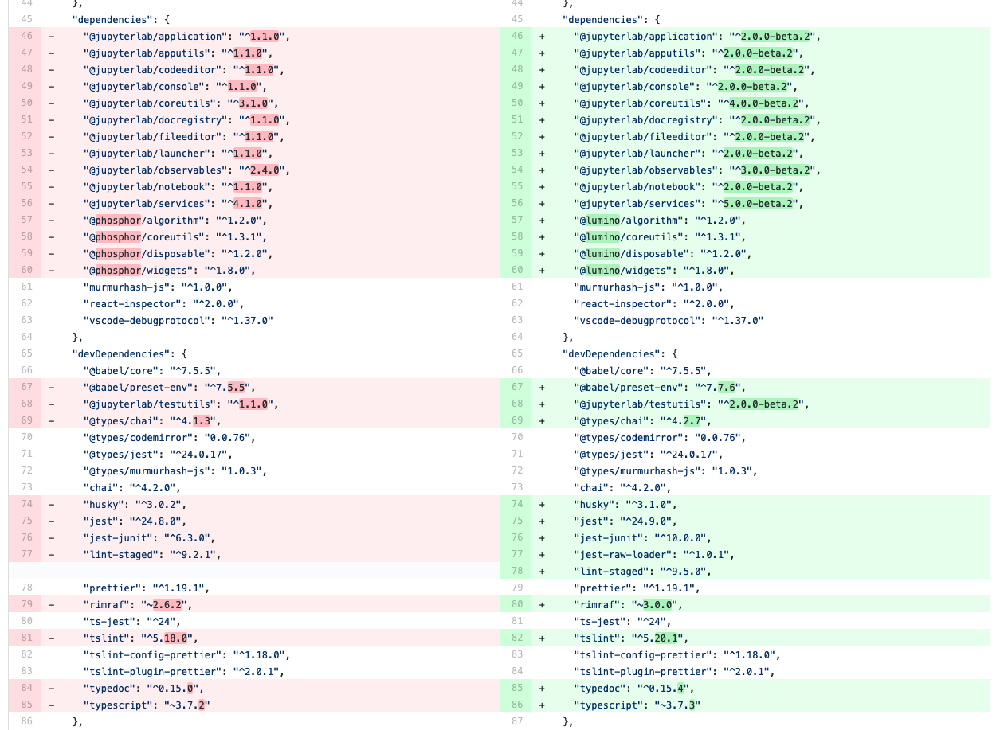

.. Copyright (c) Jupyter Development Team.
.. Distributed under the terms of the Modified BSD License.

.. _extension_migration:

Extension Migration Guide
================================================

JupyterLab 3.x to 4.x
---------------------

.. note::

   With JupyterLab 4.x, the npm package version policy changed to not bump major version with
   the Python package unless required to ease extension compatibility.

API breaking changes
^^^^^^^^^^^^^^^^^^^^

Here is a list of JupyterLab npm packages that encountered API changes and therefore have
bumped their major version (following semver convention). We want to point out particularly
``@jupyterlab/documentsearch`` and ``@jupyterlab/toc`` API that have been fully reworked.

- ``@jupyterlab/application`` from 3.x to 4.x
   Major version bump to allow alternate ``ServiceManager`` implementations in ``JupyterFrontEnd``.
   Specifically this allows the use of a mock manager.
   This also makes the ``JupyterLab.IOptions`` more permissive to not require a shell when options are
   given and allow a shell that meets the ``ILabShell`` interface.
   As a consequence, all other ``@jupyterlab/`` packages have their major version bumped too.
   See https://github.com/jupyterlab/jupyterlab/pull/11537 for more details.
- ``@jupyterlab/apputils`` from 3.x to 4.x
   Rename ``IToolbarWidgetRegistry.registerFactory`` to ``IToolbarWidgetRegistry.addFactory``
- ``@jupyterlab/attachments`` from 3.x to 4.x
   Removed ``modelDB`` from ``IAttachmentsModel.IOptions``.
- ``@jupyterlab/buildutils`` from 3.x to 4.x
   * The ``create-theme`` script has been removed. If you want to create a new theme extension, you
     should use the `Theme Cookiecutter <https://github.com/jupyterlab/theme-cookiecutter>`_ instead.
   * The ``add-sibling`` script has been removed. Check out :ref:`source_dev_workflow` instead.
   * The ``exitOnUuncaughtException`` util function has been renamed to ``exitOnUncaughtException`` (typo fix).
- ``@jupyterlab/cells`` from 3.x to 4.x
   * ``MarkdownCell.toggleCollapsedSignal`` renamed ``MarkdownCell.headingCollapsedChanged``
     To support notebook windowing, cell widget children (e.g. the editor or the output area) are not instantiated
     when the cell is attached to the notebook. You can test for ``isPlaceholder()`` to see if the cell has been
     fully instantiated or wait for the promise ``ready`` to be resolved. Additionally an attribute ``inViewport``
     and a signal ``inViewportChanged`` are available to test if the cell is attached to the DOM.
     If you instantiate standalone cells outside of a notebook, you will probably need to set the constructor option
     ``placeholder`` to ``false`` to ensure direct rendering of the cell.
   * ``InputArea.defaultContentFactory`` and ``Cell.defaultContentFactory`` have been removed. If you need it, you
     can request the token ``IEditorServices`` from ``@jupyterlab/codeeditor``. Then you can use
     ``new Cell.ContentFactory({ editorFactory: token.factoryService.newInlineEditor });``.
- ``@jupyterlab/codeeditor`` from 3.x to 4.0
   * ``CodeEditor.IEditor`` has changed:
      - ``resizeToFit()`` is removed
      - ``addKeydownHandler()`` is removed - you should add a CodeMirror extension ``EditorView.domEventHandlers`` with
         ``Prec.high`` (to ensure it is not captured by keyboard shortcuts).
      - ``injectExtension()`` added as experimental to inject a CodeMirror extension - you should prefer registering
         new extensions with ``IEditorExtensionRegistry``.
   * ``CodeEditor.IOptions`` has two new optional attributes:
      - ``extensions?: Extensions[]`` to provide custom extensions at editor instantiation
      - ``inline?: boolean`` whether the editor is a subpart of a document (like the notebook) or not.
   * ``CodeEditorWrapper.IOptions`` has changed to ``{ factory, model, editorOptions }``.
   * ``CodeViewerWidget.IOptions`` has changed to ``{ factory, model, editorOptions }``.
- ``@jupyterlab/codemirror`` from 3.x to 4.0
   * Configuration parameters changes:
      - ``fontFamily``, ``fontSize`` and ``lineHeight``: grouped in a subdictionnary ``customStyles``.
      - ``insertSpaces``: changed for ``indentUnit`` that can take a value within ['Tab', '1', '2', '4', '8']
      - ``lineWrap``: changed - it is now a boolean.
      - ``showTrailingSpace``: renamed ``highlightTrailingWhitespace``
      - ``coverGutterNextToScrollbar``: removed
      - ``electricChars``: removed
      - ``extraKeys``: removed - you should register new keymap using the CodeMirror extension ``keymap.of(KeyBinding[])``
      - ``handlePaste``: removed
      - ``keymap``: removed
      - ``lineSeparator``: removed - Line separator are normalized to ``\n``
      - ``lineWiseCopyCut``: removed - this is the default behavior
      - ``scrollbarStyle``: removed
      - ``styleSelectedText``: removed
      - ``selectionPointer``: removed
      - ``wordWrapColumn``: removed
   * ``Mode`` has been removed. You can instead request the token ``IEditorLanguageHandler``. That provides
     similar API:
     - ``Mode.registerModeInfo`` -> ``IEditorLanguageHandler.addLanguage``
     - ``Mode.ensure()`` -> ``IEditorLanguageHandler.getLanguage()``
     - ``Mode.modeList`` -> ``IEditorLanguageHandler.getLanguages()``
     - ``Mode.run()`` -> ``IEditorLanguageHandler.highlight()``
     - ``Mode.findBest()`` -> ``IEditorLanguageHandler.findBest()``
     - ``Mode.findByName()`` -> ``IEditorLanguageHandler.findByName()``
     - ``Mode.findByMIME()`` -> ``IEditorLanguageHandler.findByMIME()``
     - ``Mode.findByExtension()`` -> ``IEditorLanguageHandler.findByExtension()``
   * ``EditorSyntaxStatus`` moved to ``@jupyterlab/fileeditor``
- ``@jupyterlab/codemirror-extension`` from 3.x to 4.0
   * Moved commands:
     - ``codemirror:change-theme`` -> ``fileeditor:change-theme`` (moved to ``@juptyerlab/fileeditor-extension``)
     - ``codemirror:change-mode`` -> ``fileeditor:change-language`` (moved to ``@juptyerlab/fileeditor-extension``)
     - ``codemirror:find`` -> ``fileeditor:find`` (moved to ``@juptyerlab/fileeditor-extension``)
     - ``codemirror:go-to-line`` -> ``fileeditor:go-to-line`` (moved to ``@juptyerlab/fileeditor-extension``)
   * Removed command: ``codemirror:change-keymap``
   * Moved plugins:
     - ``@jupyterlab/codemirror-extension:commands`` integrated within ``@jupyterlab/fileeditor-extension:plugin``
     - ``@jupyterlab/codemirror-extension:editor-syntax-status`` -> ``@jupyterlab/fileeditor-extension:editor-syntax-status``
     - ``@jupyterlab/codemirror-extension:editor-syntax-status`` -> ``@jupyterlab/fileeditor-extension:editor-syntax-status``
- ``@jupyterlab/completer`` from 3.x to 4.x
   Major version was bumped following major refactor aimed at performance improvements and enabling easier third-party integration.

   * Adding custom completion suggestions (items):
      - In 3.x and earlier adding custom completion items required re-registering the completer connector for each file/cell
        using ``register`` method of old manager provided by ``ICompletionManager`` token; in 4.x this token and associated
        ``ICompletableAttributes`` interface was removed and a proper method of registering a custom source of completions
        (a provider of completions) was added. To create a completer provider  for JupyterLab, users need to implement the
        ``ICompletionProvider`` interface and then register this provider with ``ICompletionProviderManager`` token.
      - In 3.x merging completions from different sources had to be performed by creating a connector internally merging
        results from other connectors. in 4.x ``IProviderReconciliator`` is used to merge completions from multiple providers,
        and can be customised in constructor for custom completion handlers (``CompletionHandler``); customizing reconciliator
        in JupyterLab-managed completers is not yet possible.
   * Rendering with ``Completer.IRenderer``:
      - In 3.x it was not possible to easily swap the renderer of JupyterLab-managed completers.
        In 4.x the renderer from the completion provider with highest rank is now used for all
        JupyterLab-managed completers. This behaviour is subject to revision in the future (please leave feedback).
      - Completer box is now using delayed rendering for off-screen content to improve time to first paint
        for top suggestions. To position the completer without rendering all items we search for the widest
        item using heuristic which can be adjusted in custom renderers (``itemWidthHeuristic``).
      - The documentation panel now implements a loading indicator (a progress bar) customizable via
        optional ``createLoadingDocsIndicator`` renderer method.
      - ``createItemNode`` was removed in favour of ``createCompletionItemNode`` which is now required.
      - ``createCompletionItemNode`` is no longer responsible for sanitization of labels which is now a
        responsibility of the model (see below).
   * Model:
      - In 3.x it was not possible to easily swap the model of JupyterLab-managed completers.
        In 4.x the model factory from the completion provider with highest rank is now used for
        JupyterLab-managed completers. This behaviour is subject to revision in the future (please leave feedback).
      - Old methods for updating and accessing the completion items: ``setOptions``, ``options``, and ``items`` were removed
        in favour of ``completionItems`` and ``setCompletionItems`` which are now required members of ``Completer.IModel``.
      - New signal ``queryChanged`` was added and has to be emitted by models.
      - Model is now responsible for sanitization of labels and preserving original label on ``insertText`` attribute
        (if not already defined); this change was required to properly handle escaping of HTML tags.
- ``@jupyterlab/codeeditor`` from 3.x to 4.x
   * Remove ``ISelectionStyle`` (and therefore ``defaultSelectionStyle`` and ``IEditor.selectionStyle``). This was envisaged
     for real-time collaboration. But this is not used in the final implementation.
- ``@jupyterlab/console`` from 3.x to 4.x
   The type of ``IConsoleHistory.sessionContext`` has been updated to ``ISessionContext | null`` instead of ``ISessionContext``.
   This might break the compilation of plugins accessing the ``sessionContext`` from a ``ConsoleHistory``,
   in particular those with the strict null checks enabled.
- ``@jupyterlab/coreutils`` from 3.x to 4.x
   The ``Time`` namespace does not use the ``moment`` library anymore for managing dates. Instead it switched to using
   the ``Intl`` API now available in modern web browsers. The ``Time.format`` function is still available but does not accept the
   ``timeFormat`` argument anymore.
- ``@jupyterlab/debugger`` from 3.x to 4.x
   * The command ``debugger:pause`` command ID has been renamed ``debugger:pause-on-exceptions`` to avoid ambiguity with
     pausing the current running thread.
- ``@jupyterlab/docmanager`` from 3.x to 4.x
   * The ``renameDialog`` now receives the ``DocumentRegistry.Context`` instead of a path.
   * The interface ``DocumentManager.IWidgetOpener`` is now ``IDocumentWidgetOpener`` and is provided
     by a new plugin ``@jupyterlab/docmanager-extension:opener``.
     The ``IDocumentWidgetOpener`` interface also now defines an ```opened``` signal that is emitted when a widget is opened.
   * Removed the property ``docProviderFactory`` from the interface ``DocumentManager.IOptions``.
- ``@jupyterlab/docregister`` from 3.x to 4.x
   * ``TextModelFactory.preferredLanguage(path: string)`` will always return ``''``. The editor languages is not available globally to provided it.
     You can recover the feature if needed, by requesting the token ``IEditorLanguageHandler`` from ``@jupyterlab/codemirror``. Then you can use
     ``token.findByFileName(widget.context.path)?.name ?? ''``.
- ``@jupyterlab/docprovider`` from 3.x to 4.x
   This package is no longer present in JupyterLab. For documentation related to Real-Time Collaboration, please check out
   `RTC's documentation <https://jupyterlab.readthedocs.io/en/latest/user/rtc.html>`_
- ``@jupyterlab/documentsearch`` from 3.x to 4.x
   * ``@jupyterlab/documentsearch:plugin`` has been renamed to ``@jupyterlab/documentsearch-extension:plugin``
   * ``@jupyterlab/documentsearch:labShellWidgetListener`` has been renamed to ``@jupyterlab/documentsearch-extension:labShellWidgetListener``

   This may impact application configuration (for instance if the plugin was disabled).
   The search provider API has been fully reworked. But the logic is similar, for new type of documents
   you will need to register a ``ISearchProviderFactory`` to the ``ISearchProviderRegistry``. The
   factory will build a ``ISearchProvider`` for the document widget.
- ``@jupyterlab/extensionmanager`` from 3.x to 4.x
   The frontend API has been drastically reduced to fetch all information from the backend. It is now advised
   that you implement a custom ``ExtensionManager`` class for your needs rather than overriding the frontend plugins.
   See ``jupyterlab/extensions/pypi.py`` for an example using PyPI.org and pip. You can then register your manager
   by defining an entry point in the Python package; see ``pyproject.toml::project.entry-points."jupyterlab.extension_manager_v1"``.
- ``@jupyterlab/fileeditor`` from 3.x to 4.x
   Remove the class ``FileEditorCodeWrapper``, instead, you can use ``CodeEditorWrapper`` from ``@jupyterlab/codeeditor``.
- ``@jupyterlab/filebrowser`` from 3.x to 4.x
   * Remove the property ``defaultBrowser`` from the interface  ``IFileBrowserFactory``. The default browser is now provided by it own
     plugin by requiring the token ``IDefaultFileBrowser``.
   * Remove the ``useFuzzyFilter`` setter from the ``FileBrowser`` class.
- ``@jupyterlab/filebrowser-extension`` from 3.x to 4.x
   Remove command ``filebrowser:create-main-launcher``. You can replace by ``launcher:create`` (same behavior)
   All launcher creation actions are moved to ``@jupyterlab/launcher-extension``.
- ``@jupyterlab/docregistry`` from 3.x to 4.x
   * Removed the property ``docProviderFactory`` from the interface ``Context.IOptions``.
   * The constructor of the class ``DocumentModel`` receives a parameter ``DocumentModel.IOptions``.
   * The method ``IModelFactory.createNew`` receives a parameter ``DocumentRegistry.IModelOptions``.
   * The method ``TextModelFactory.createNew`` receives a parameter ``DocumentModel.IOptions``.
- ``@jupyterlab/notebook`` from 3.x to 4.x
   * The ``NotebookPanel._onSave`` method is now ``private``.
   * ``NotebookActions.collapseAll`` method renamed to ``NotebookActions.collapseAllHeadings``.
   * Command ``Collapsible_Headings:Toggle_Collapse`` renamed to ``notebook:toggle-heading-collapse``.
   * Command ``Collapsible_Headings:Collapse_All`` renamed to ``notebook:collapse-all-headings``.
   * Command ``Collapsible_Headings:Expand_All`` renamed to ``notebook:expand-all-headings``.
   * To support windowing, a new method ``scrollToItem(index, behavior)`` is available to scroll to any
     cell that may or may not be in the DOM. And new ``cellInViewportChanged`` signal is available to listen
     for cells entering or leaving the viewport (in windowing mode). And ``scrollToCell(cell)`` is now returning
     a ``Promise<void>`` calling internally ``scrollToItem``.
   * ``fullyRendered``, ``placeholderCellRendered`` and ``remainingCellToRenderCount`` have been removed.
     The defer rendering mode still exists. It will render some cells during spare CPU Idle time.
   * Settings ``numberCellsToRenderDirectly``, ``remainingTimeBeforeRescheduling``, ``renderCellOnIdle``,
     ``observedTopMargin`` and ``observedBottomMargin`` have been removed. Instead a ``windowingMode``
     with value of *defer*, *full* or *none* and ``overscanCount`` have been added to manage the rendering
     mode.
   * Added the property ``sharedModel`` to the interface ``NotebookModel.IOptions``.
   * The method ``NotebookModelFactory.createNew`` receives a parameter ``NotebookModelFactory.IModelOptions``.
   * The default Notebook toolbar's ``restart-and-run`` button now refers to the command
     ``notebook:restart-run-all`` instead of ``runmenu:restart-and-run-all``.
   * ``StaticNotebook.defaultContentFactory`` has been removed. If you need it, you can request the token
     ``IEditorServices`` from ``@jupyterlab/codeeditor``. You can obtain it by requested
     ``new NotebookPanel.ContentFactory({ editorFactory: token.factoryService.newInlineEditor });``
- ``@jupyterlab/mainmenu`` from 3.x to 4.x
   - ``IMainMenu.addMenu`` signature changed from ``addMenu(menu: Menu, options?: IMainMenu.IAddOptions): void``
     to ``addMenu(menu: Menu, update?: boolean, options?: IMainMenu.IAddOptions): void``
- ``@jupyterlab/rendermime`` from 3.x to 4.x
  The markdown parser has been extracted to its own plugin ``@jupyterlab/markedparser-extension:plugin``
  that provides a new token ``IMarkdownParser`` (defined in ``@jupyterlab/rendermime``).
  Consequently the ``IRendererFactory.createRenderer`` has a new option ``markdownParser``.
- ``@jupyterlab/rendermime-interfaces`` from 3.x to 4.x
  Remove ``IRenderMime.IRenderer.translator?`` attribute; the translator object is still passed to
  the constructor if needed by the renderer factory.
- ``@jupyterlab/services`` from 6.x to 7.x
   * Remove ``Contents.IDrive.modelDBFactory`` and ``Contents.IManager.getModelDBFactory``.
   * Added ``Contents.IDrive.sharedModelFactory`` and ``Contents.IManager.getsharedModelFactory``.
- ``@jupyterlab/shared-models`` from 3.x to 4.x
   This package is no longer present in JupyterLab. For documentation related to the shared models,
   please check out `@jupyter/ydoc documentation <https://jupyter-ydoc.readthedocs.io/en/latest>`_.
- ``@jupyterlab/statusbar`` from 3.x to 4.x
  Setting ``@jupyterlab/statusbar-extension:plugin . startMode`` moved to ``@jupyterlab/application-extension:shell . startMode``
  Plugin ``@jupyterlab/statusbar-extension:mode-switch`` renamed to ``@jupyterlab/application-extension:mode-switch``
  Plugin ``@jupyterlab/statusbar-extension:kernel-status`` renamed to ``@jupyterlab/apputils-extension:kernel-status``
  Plugin ``@jupyterlab/statusbar-extension:running-sessions-status`` renamed to ``@jupyterlab/apputils-extension:running-sessions-status``
  Plugin ``@jupyterlab/statusbar-extension:line-col-status`` renamed to ``@jupyterlab/codemirror-extension:line-col-status``
  ``HoverBox`` component moved from ``@jupyterlab/apputils`` to ``@jupyterlab/ui-components``.
- ``@jupyterlab/terminal`` from 3.x to 4.x
  Xterm.js upgraded from 4.x to 5.x
  ``IThemeObject.selection`` renamed to ``selectionBackground``
- ``@jupyterlab/toc`` from 3.x to 4.x
   ``@jupyterlab/toc:plugin`` renamed ``@jupyterlab/toc-extension:registry``
   This may impact application configuration (for instance if the plugin was disabled).
   The namespace ``TableOfContentsRegistry`` has been renamed ``TableOfContents``.
   The API has been fully reworked. The new table of content providers must implement a factory
   ``TableOfContents.IFactory`` that will create a model ``TableOfContents.IModel<TableOfContents.IHeading>``
   for supported widget. The model provides a list of headings described by a ``text`` and
   a ``level`` and optionally a ``prefix``, a ``collapsed`` state and a ``dataset`` (data
   DOM attributes dictionary).
- ``@jupyterlab/ui-components`` from 3.x to 4.x
   * Major version bumped following removal of Blueprint JS dependency. Extensions using proxied
     components like ``Checkbox``, ``Select`` or ``Intent`` will need to import them explicitly
     from Blueprint JS library. Extensions using ``Button``, ``Collapse`` or ``InputGroup`` may
     need to switch to the Blueprint components as the interfaces of those components in JupyterLab
     do not match those of Blueprint JS.
   * Remove ``Collapse`` React component.
   * Form component registry changes:
      - Rename the plugin ``'@jupyterlab/ui-components-extension:form-component-registry'`` to ``'@jupyterlab/ui-components-extension:form-renderer-registry'``
      - Rename the ``IFormComponentRegistry`` token to ``IFormRendererRegistry``, from ``@jupyterlab/ui-components:ISettingEditorRegistry``
        to ``@jupyterlab/ui-components:IFormRendererRegistry``.
      - The ``FormRendererRegistry`` registers ``IFormRenderer`` instead of ``Field`` renderers.
        A ``IFormRenderer`` defines a ``fieldRenderer`` (this is the renderer to set for backward compatibility)
        or a ``widgetRenderer``.
        The renderer id must follow the convention ``<ISettingRegistry.IPlugin.id>.<propertyName>``. This is to
        ensure a custom renderer is not used for property with the same name but different schema.
- ``@jupyterlab/translation`` from 3.x to 4.x
   Renamed the method ``locale`` into the property ``languageCode`` in the ``NullTranslator``
- ``@jupyterlab/vdom`` and ``@jupyterlab/vdom-extension`` have been removed.
   The underlying [vdom](https://github.com/nteract/vdom) Python package is unmaintained.
   So it was decided to drop it from core packages.
- ``jupyter.extensions.hub-extension`` from 3.x to 4.x
   * Renamed ``jupyter.extensions.hub-extension`` to ``@jupyterlab/hub-extension:plugin``.
   * Renamed ``jupyter.extensions.hub-extension:plugin`` to ``@jupyterlab/hub-extension:menu``.
- TypeScript 4.7 update
   As a result of the update to TypeScript 4.7, a couple of interfaces have had their definitions changed.
   The ``anchor`` parameter of ``HoverBox.IOptions`` is now a ``DOMRect`` instead of ``ClientRect``.
   The ``CodeEditor.ICoordinate`` interface now extends ``DOMRectReadOnly`` instead of ``JSONObject, ClientRect``.
- React 18.2.0 update
  The update to React 18.2.0 (from 17.0.1) should be propagated to extensions as well.
  Here is the documentation about the `migration to react 18 <https://reactjs.org/blog/2022/03/08/react-18-upgrade-guide.html>`_.

Testing with Jest
^^^^^^^^^^^^^^^^^

Jest has been updated to 29.2.0 (and *ts-jest* to 29.0.0). And therefore the jest configuration provided by
``@jupyterlab/testutils`` is compatible for that version. In particular:

- The unmaintained reporter ``jest-summary-reporter`` has been replaced by the new default ``github-actions`` reporter.
- The helper ``flakyIt`` has been removed. You can use the new `jest.retryTimes <https://jestjs.io/docs/jest-object#jestretrytimesnumretries-options>`_ instead.

With JupyterLab 4, we fixed circular dependencies due to the ``testutils`` package. So it is now only a facade to export
helpers from various core packages. The exported helpers are the same as before expect for:

- ``NBTestUtils.DEFAULT_CONTENT``: Removed - you could imported from ``@jupyterlab/notebook/lib/testutils`` but we strongly advice not to and to use your own test data.
- ``NBTestUtils.DEFAULT_CONTENT_45``: Removed

Testing with Galata
^^^^^^^^^^^^^^^^^^^

The in-page helpers are now in an JupyterLab extension to live in the common Webpack shared scoped. That new extension
is contained in the JupyterLab python package at ``jupyterlab.galata``. It requires to update your Jupyter server
configuration by adding the following line:

.. code-block:: python

    import jupyterlab
    c.LabApp.extra_labextensions_path = str(Path(jupyterlab.__file__).parent / "galata")

.. note::

    To ease configuration, we have introduce a new helper function ``jupyterlab.galata.configure_jupyter_server``. So you can
    simplify the server configuration to be ``jupyterlab.galata.configure_jupyter_server(c)``.

Here are the changes in the Javascript package ``@jupyterlab/galata`` from 4.x to 5.x:
   * ``ContentsHelper`` and ``galata.newContentsHelper`` have new constructor arguments to use Playwright API request object:
     ``new ContentsHelper(baseURL, page?, request?)`` -> ``new ContentsHelper(request?, page?)``
     ``galata.newContentsHelper(baseURL, page?, request?)`` -> ``galata.newContentsHelper(request?, page?)``
     you need to provide ``request`` or ``page``; they both are fixtures provided by Playwright.
   * ``galata.Mock.clearRunners(baseURL, runners, type)`` -> ``galata.Mock.clearRunners(request, runners, type)``
   * In-pages helpers are now in an extension define in ``jupyterlab/galata/extension`` and
     store in ``@jupyterlab/galata/lib/extension``. And the global object has been renamed ``window.galata`` instead
     of ``window.galataip`` (it still exists but it is deprecated).

Extension Development Changes
^^^^^^^^^^^^^^^^^^^^^^^^^^^^^

- The ``externalExtensions`` field in the ``dev_mode/package.json`` file corresponding to the ``@jupyterlab/application-top``
  ``private`` package has now been removed in ``4.0``. If you were using this field to develop source extensions against
  a development build of JupyterLab, you should instead switch to the federated extensions system (via the ``--extensions-in-dev-mode`` flag)
  or to using the ``--splice-source`` option. See :ref:`prebuilt_dev_workflow` and :ref:`source_dev_workflow` for more information.
- The ``webpack`` dependency in ``@jupyterlab/builder`` has been updated to ``5.72`` (or newer). Base rules have been updated to use the
  `Asset Modules <https://webpack.js.org/guides/asset-modules>`_ instead of the previous ``file-loader``, ``raw-loader`` and ``url-loader``.
  This might affect third-party extensions if they were relying on specific behaviors from these loaders.
- In JupyterLab 3.x, the CSS for a _disabled_ prebuilt extensions would still be loaded on the page.
  This is no longer the case in JupyterLab 4.0.
- ``window.jupyterlab`` is not exposed anymore when starting JupyterLab with the ``--expose-app-in-browser`` flag.
  Use ``window.jupyterapp`` instead.

.. _extension_migration_3.5_3.6:

JupyterLab 3.5 to 3.6
---------------------

Real-Time Collaboration
^^^^^^^^^^^^^^^^^^^^^^^
In JupyterLab v3.6, it is necessary to install Jupyter Server v2.0 to use real-time collaboration.
This requirement was introduced to take advantage of the new identity API in Jupyter Server v2.0.

On the other side, we also changed how JupyterLab loads documents (only in collaborative mode).
Instead of using the content API, now the provider opens a WebSocket connection to the
`YDocWebSocketHandler`, which is implemented in an external
`jupyter server extension <https://github.com/jupyter-server/jupyter_server_ydoc>`__.

In addition, the shared models' package was moved to an external package called `@jupyter/ydoc
<https://github.com/jupyter-server/jupyter_ydoc>`__. All the extensions that depend on
``@jupyterlab/shared-models`` will need to update to depend in ``@jupyter/ydoc@~0.2.2``; the API should
be the same.

**API Changes:**
To be able to fix RTC and make it stable. It was necessary to change the API and make a few breaking changes.
These changes should not affect the vast majority of extensions. They will only affect a couple
of extensions focused on RTC.

It was necessary to change the paradigm of how JupyterLab loads documents and replace the locking mechanism
in the back-end. Instead of identifying the first client to open the document, it now centralizes
the process by instantiating a YDoc client in the back-end. This client is the only one that loads
the content of the document into memory and shares it with every other client connected.

The involved packages are:

- ``@jupyterlab/docprovider``:
   * The interface ``IDocumentProvider``, now extends from ``IDisposable``.
     Removed: ``acquireLock``, ``releaseLock``, ``setPath``, ``destroy``, ``requestInitialContent`` and ``putInitializedState``.
     Added: ``ready`` and ``isDisposed``.

   * ``IDocumentProviderFactory.IOptions`` is now templated with ``T extends ISharedDocument = ISharedDocument``.
     And the ``ymodel`` attribute has been renamed ``model`` typed ``T`` (relaxing typing from ``YDocument`` to ``ISharedDocument``).

   * ``WebSocketProviderWithLocks`` has been renamed to ``WebSocketProvider``.
     It does not extend ``WebSocketProvider`` from ``y-websocket`` anymore.

   * ``WebSocketProvider.IOptions`` has a new optional attribute, ``user``.

- ``@jupyterlab/services``:
   * The interface ``IManager`` has a new optional property, ``user`` that implement `User.IManager <../api/interfaces/services.User.IManager.html>`_.

   * The ``ServiceManager`` class implements the optional property ``user`` from the ``IManager``.


.. _extension_migration_3.0_3.1:

JupyterLab 3.0 to 3.1
---------------------

New main and context menus customization
^^^^^^^^^^^^^^^^^^^^^^^^^^^^^^^^^^^^^^^^

JupyterLab 3.1 introduces a new way to hook commands into :ref:`mainmenu` and :ref:`context_menu`.
It allows the final user to customize those menus through settings as it is already possible for
the shortcuts.
Using the API is not recommended any longer except to create dynamic menus.


Jest configuration update
^^^^^^^^^^^^^^^^^^^^^^^^^

If you are using jest to test your extension, some new ES6 packages dependencies are added to JupyterLab.
They need to be ignore when transforming the code with Jest. You will need to update the
``transformIgnorePatterns`` to match:

.. code::

   const esModules = [
     '@jupyterlab/',
     'lib0',
     'y\\-protocols',
     'y\\-websocket',
     'yjs'
   ].join('|');

   // ...

   transformIgnorePatterns: [`/node_modules/(?!${esModules}).+`]

For more information, have a look at :ref:`testing_with_jest`.

.. note::

   Here is an example of pull request to update to JupyterLab 3.1 in ``@jupyterlab/git`` extension:
   https://github.com/jupyterlab/jupyterlab-git/pull/979/files


.. _extension_migration_2_3:

JupyterLab 2.x to 3.x
---------------------

Here are some helpful tips for migrating an extension from JupyterLab 2.x to JupyterLab 3.x.

Upgrading library versions manually
^^^^^^^^^^^^^^^^^^^^^^^^^^^^^^^^^^^

To update the extensions so it is compatible with the 3.0 release, update the compatibility
range of the ``@jupyterlab`` dependencies in the ``package.json``. The diff should be similar to:

.. code:: diff

   index 6f1562f..3fcdf37 100644
   ^^^ a/package.json
   +++ b/package.json
      "dependencies": {
   -    "@jupyterlab/application": "^2.0.0",
   +    "@jupyterlab/application": "^3.0.0",

Upgrading library versions using the upgrade script
^^^^^^^^^^^^^^^^^^^^^^^^^^^^^^^^^^^^^^^^^^^^^^^^^^^

JupyterLab 3.0 provides a script to upgrade an existing extension to use the new extension system and packaging.

First, make sure to update to JupyterLab 3.0 and install ``jupyter-packaging`` and ``cookiecutter``. With ``pip``:

.. code:: bash

   pip install jupyterlab -U
   pip install jupyter-packaging cookiecutter


Or with ``conda``:

.. code:: bash

   conda install -c conda-forge jupyterlab=3 jupyter-packaging cookiecutter


Then at the root folder of the extension, run:

.. code:: bash

   python -m jupyterlab.upgrade_extension .

The upgrade script creates the necessary files for packaging the JupyterLab extension as a Python package, such as
``setup.py`` and ``pyproject.toml``.

The upgrade script also updates the dependencies in ``package.json`` to the ``^3.0.0`` packages. Here is an example diff:

.. code:: diff

   index 6f1562f..3fcdf37 100644
   ^^^ a/package.json
   +++ b/package.json
   @@ -29,9 +29,13 @@
      "scripts": {
   -    "build": "tsc",
   -    "build:labextension": "npm run clean:labextension && mkdirp myextension/labextension && cd myextension/labextension && npm pack ../..",
   -    "clean": "rimraf lib tsconfig.tsbuildinfo",
   +    "build": "jlpm run build:lib && jlpm run build:labextension:dev",
   +    "build:prod": "jlpm run build:lib && jlpm run build:labextension",
   +    "build:lib": "tsc",
   +    "build:labextension": "jupyter labextension build .",
   +    "build:labextension:dev": "jupyter labextension build --development True .",
   +    "clean": "rimraf lib tsconfig.tsbuildinfo myextension/labextension",
   +    "clean:all": "jlpm run clean:lib && jlpm run clean:labextension",
      "clean:labextension": "rimraf myextension/labextension",
      "eslint": "eslint . --ext .ts,.tsx --fix",
      "eslint:check": "eslint . --ext .ts,.tsx",
   @@ -59,12 +63,12 @@
      ]
      },
      "dependencies": {
   -    "@jupyterlab/application": "^2.0.0",
   -    "@jupyterlab/apputils": "^2.0.0",
   -    "@jupyterlab/observables": "^3.0.0",
   +    "@jupyterlab/builder": "^3.0.0",
   +    "@jupyterlab/application": "^3.0.0",
   +    "@jupyterlab/apputils": "^3.0.0",
   +    "@jupyterlab/observables": "^3.0.0",
      "@lumino/algorithm": "^1.2.3",
      "@lumino/commands": "^1.10.1",
      "@lumino/disposable": "^1.3.5",
   @@ -99,6 +103,13 @@
   -    "typescript": "~3.8.3"
   +    "typescript": "~4.0.1"
      },
      "jupyterlab": {
   -    "extension": "lib/plugin"
   +    "extension": "lib/plugin",
   +    "outputDir": "myextension/labextension/"
      }
   }


On the diff above, we see that additional development scripts are also added, as they are used by the new extension system workflow.

The diff also shows the new ``@jupyterlab/builder`` as a ``devDependency``.
``@jupyterlab/builder`` is a package required to build the extension as a federated (prebuilt) extension.
It hides away internal dependencies such as ``webpack``, and produces the assets that can then be distributed as part of a Python package.

Extension developers do not need to interact with ``@jupyterlab/builder`` directly, but instead can use the
``jupyter labextension build`` command. This command is run automatically as part of the ``build`` script
(``jlpm run build``).

For more details about the new file structure and packaging of the extension, check out the extension tutorial: :ref:`extension_tutorial`

Publishing the extension to PyPI and conda-forge
^^^^^^^^^^^^^^^^^^^^^^^^^^^^^^^^^^^^^^^^^^^^^^^^

Starting from JupyterLab 3.0, extensions can be distributed as a Python package.

The extension tutorial provides explanations to package the extension so it can be
published on PyPI and conda forge: :ref:`extension_tutorial_publish`.

.. note::

   While publishing to PyPI is the new recommended way for distributing extensions to users,
   it is still useful to continue publishing extensions to ``npm`` as well,
   so other developers can extend them in their own extensions.


.. _extension_migration_1_2:

JupyterLab 1.x to 2.x
---------------------

Here are some helpful tips for migrating an extension from JupyterLab 1.x to
JupyterLab 2.x. We will look at two examples of extensions that cover most of
the APIs that extension authors might be using:

- ``@jupyterlab/debugger`` migration pull request:
  https://github.com/jupyterlab/debugger/pull/337/files

- ``@jupyterlab/shortcutui`` migration pull request:
  https://github.com/jupyterlab/jupyterlab-shortcutui/pull/53/files

Upgrading library versions
^^^^^^^^^^^^^^^^^^^^^^^^^^

The ``@phosphor/*`` libraries that JupyterLab 1.x uses have been renamed to
``@lumino/*``. Updating your ``package.json`` is straightforward. The easiest
way to do this is to look in the
`JupyterLab core packages code base <https://github.com/jupyterlab/jupyterlab/tree/master/packages>`__
and to simply adopt the versions of the relevant libraries that are used
there.



   Updating the debugger extension's libraries in ``package.json``

.. figure:: images/extension_migration_dependencies_shortcuts.png
   :align: center
   :class: jp-screenshot
   :alt: Updating the shortcuts UI extension's libraries in package.json

   Updating the shortcuts UI extension's libraries in ``package.json``

.. tip::
  In these examples, note that we are using the ``2.0.0-beta.x`` version of
  many libraries. This was to test the extensions against the JupyterLab 2.0
  beta release before the final version. For the final release, your
  ``package.json`` should depend on version ``^2.0.0`` of these packages.

Migrating from ``@phosphor`` to ``@lumino``
^^^^^^^^^^^^^^^^^^^^^^^^^^^^^^^^^^^^^^^^^^-

The foundational packages used by JupyterLab are now all prefixed with the NPM
namespace ``@lumino`` instead of ``@phosphor``. The APIs for these packages
have not changed. The ``@phosphor`` namespaced imports need to be updated to
the new ``@lumino`` namespaced packages:

.. list-table:: Update from ``@phosphor/...`` to ``@lumino/...``

  * - ``@phosphor/application``
    - ``@lumino/application``
  * - ``@phosphor/collections``
    - ``@lumino/collections``
  * - ``@phosphor/commands``
    - ``@lumino/commands``
  * - ``@phosphor/coreutils``
    - ``@lumino/coreutils``
  * - ``@phosphor/datagrid``
    - ``@lumino/datagrid``
  * - ``@phosphor/datastore``
    - ``@lumino/datastore``
  * - ``@phosphor/default-theme``
    - ``@lumino/default-theme``
  * - ``@phosphor/disposable``
    - ``@lumino/disposable``
  * - ``@phosphor/domutils``
    - ``@lumino/domutils``
  * - ``@phosphor/dragdrop``
    - ``@lumino/dragdrop``
  * - ``@phosphor/keyboard``
    - ``@lumino/keyboard``
  * - ``@phosphor/messaging``
    - ``@lumino/messaging``
  * - ``@phosphor/properties``
    - ``@lumino/properties``
  * - ``@phosphor/signaling``
    - ``@lumino/signaling``
  * - ``@phosphor/virtualdom``
    - ``@lumino/virtualdom``
  * - ``@phosphor/widgets``
    - ``@lumino/widgets``

.. warning::
  ``p-`` prefixed CSS classes, ``data-p-`` attributes and ``p-`` DOM events
  are deprecated. They will continue to work until the next major release of
  Lumino.

  - ``.p-`` CSS classes such as ``.p-Widget`` should be updated to ``.lm-``,
    e.g. ``.lm-Widget``
  - ``data-p-`` attributes such as ``data-p-dragscroll`` should be updated to
    ``data-lm-``, e.g. ``data-lm-dragscroll``
  - ``p-`` DOM events such as ``p-dragenter`` should be updated to ``lm-``,
    e.g. ``lm-dragenter``

Updating former ``@jupyterlab/coreutils`` imports
^^^^^^^^^^^^^^^^^^^^^^^^^^^^^^^^^^^^^^^^^^^^^^^^-

JupyterLab 2.0 introduces several new packages with classes and tokens that
have been moved out of ``@jupyterlab/coreutils`` into their own packages. These
exports have been moved.

.. tip::
  It might be helpful to delete ``node_modules`` and ``yarn.lock`` when
  updating these libraries.

============================  =================================
 Export                        Package
============================  =================================
 ``DataConnector``             ``@jupyterlab/statedb``
 ``Debouncer``                 ``@lumino/polling``
 ``DefaultSchemaValidator``    ``@jupyterlab/settingregistry``
 ``IDataConnector``            ``@jupyterlab/statedb``
 ``IObjectPool``               ``@jupyterlab/statedb``
 ``IPoll``                     ``@lumino/polling``
 ``IRateLimiter``              ``@lumino/polling``
 ``IRestorable``               ``@jupyterlab/statedb``
 ``IRestorer``                 ``@jupyterlab/statedb``
 ``ISchemaValidator``          ``@jupyterlab/settingregistry``
 ``ISettingRegistry``          ``@jupyterlab/settingregistry``
 ``IStateDB``                  ``@jupyterlab/statedb``
 ``nbformat``                  ``@jupyterlab/nbformat``
 ``Poll``                      ``@lumino/polling``
 ``RateLimiter``               ``@lumino/polling``
 ``RestorablePool``            ``@jupyterlab/statedb``
 ``SettingRegistry``           ``@jupyterlab/settingregistry``
 ``Settings``                  ``@jupyterlab/settingregistry``
 ``StateDB``                   ``@jupyterlab/statedb``
 ``Throttler``                 ``@lumino/polling``
============================  =================================

Using ``Session`` and ``SessionContext`` to manage kernel sessions
^^^^^^^^^^^^^^^^^^^^^^^^^^^^^^^^^^^^^^^^^^^^^^^^^^^^^^^^^^^^^^^^^^
.. note::

  For full API documentation and examples of how to use
  ``@jupyterlab/services``,
  `consult the repository <https://github.com/jupyterlab/jupyterlab/tree/master/packages/services#readme>`__.

``ConsolePanel`` and ``NotebookPanel`` now expose a
``sessionContext: ISessionContext`` attribute that allows for a uniform way to
interact with kernel sessions.

Any widget that matches the ``interface IDocumentWidget`` has a
``context: DocumentRegistry.IContext`` attribute with a
``sessionContext: ISessionContext`` attribute.

For example, consider how the ``@jupyterlab/debugger`` extension's
``DebuggerService`` updated its ``isAvailable()`` method.

.. figure:: images/extension_migration_session.png
   :align: center
   :class: jp-screenshot
   :alt: Updating the isAvailable method of the debugger service

   From the `PR migrating the debugger extension to JupyterLab 2.0 <https://github.com/jupyterlab/debugger/pull/337/files#diff-22ccf3ebb0cb6b300ee90a38b88edff8>`__

.. note::

  ``await kernel.ready`` is no longer necessary before the kernel connection
  ``kernel`` can be used. Kernel messages will be buffered as needed while a
  kernel connection is coming online, so you should be able to use a kernel
  connection immediately. If you want to retrieve the kernel info (or if for
  some other reason you want to wait until at least one message has returned
  from a new kernel connection), you can do ``await kernel.info``.

Using the new icon system and ``LabIcon``
^^^^^^^^^^^^^^^^^^^^^^^^^^^^^^^^^^^^^^^^^
.. note::

  For full API documentation and examples of how to use
  the new icon support based on ``LabIcon`` from ``@jupyterlab/ui-components``,
  `consult the repository <https://github.com/jupyterlab/jupyterlab/tree/master/packages/ui-components#readme>`__.
