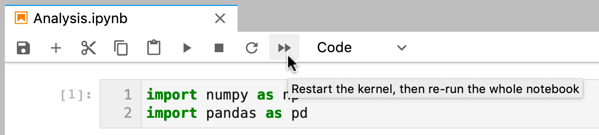
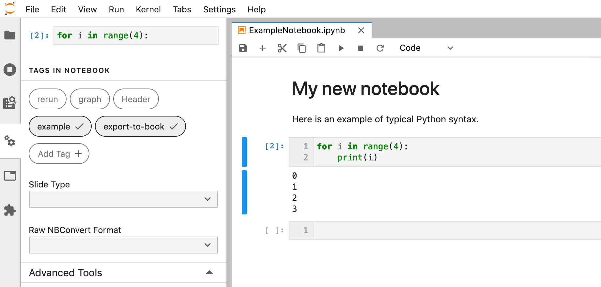
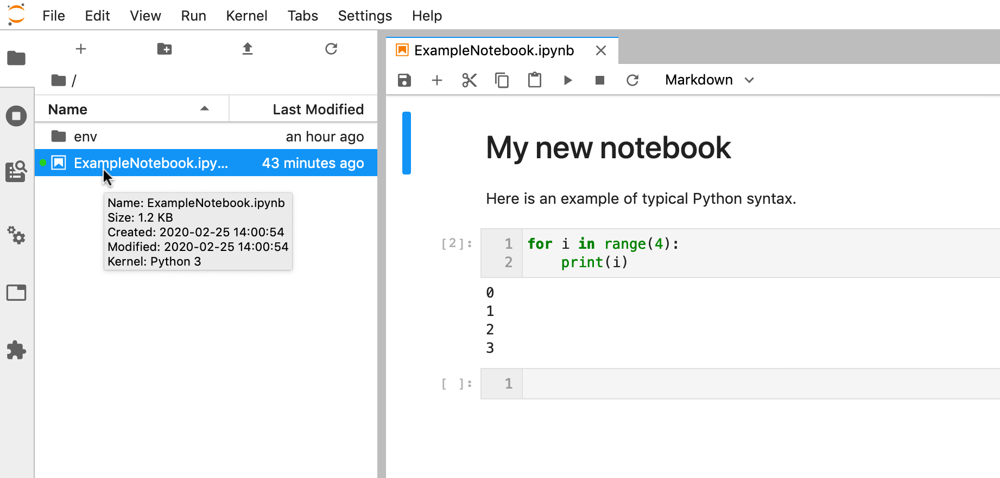
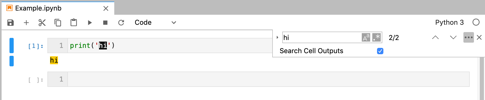
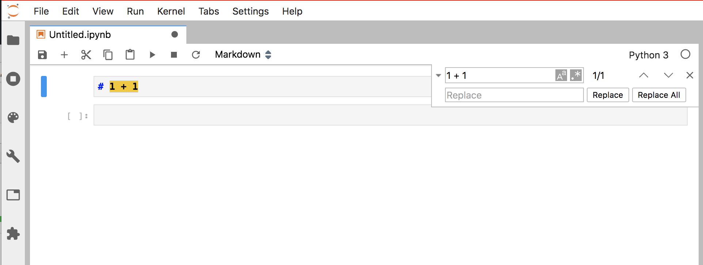
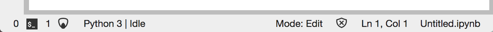

.. _changelog:

JupyterLab Changelog
====================

`v2.3.x <https://github.com/jupyterlab/jupyterlab/milestone/59>`__
------------------------------------------------------------------

v2.3.0
^^^^^^
* Better performance with Virtual Notebook  (`#8972 <https://github.com/jupyterlab/jupyterlab/pull/8972>`__), read more on `the doc <https://jupyterlab.readthedocs.io/en/stable/developer/notebook.html#virtual-notebook>`__
* Update the use of CSS Display for better performance  (`#8968 <https://github.com/jupyterlab/jupyterlab/pull/8968>`__)

`v2.2.x <https://github.com/jupyterlab/jupyterlab/milestone/53>`__
------------------------------------------------------------------

v2.2.8
^^^^^^
* Do not show Dialog If It Has Been Disposed  (`#9003 <https://github.com/jupyterlab/jupyterlab/pull/9003>`__)

v2.2.7
^^^^^^
* Update mimetype for dragging files  (`#8966 <https://github.com/jupyterlab/jupyterlab/pull/8966>`__)

v2.2.5
^^^^^^
* Header 'Content-Type' should not be overwritten  (`#8892 <https://github.com/jupyterlab/jupyterlab/pull/8892>`__)

v2.2.4
^^^^^^
* Do not use token parameters in websocket urls (`#8836 <https://github.com/jupyterlab/jupyterlab/pull/8836>`__)

v2.2.3
^^^^^^
* Restore ``labhubapp``  (`#8780 <https://github.com/jupyterlab/jupyterlab/pull/8780>`__ )

v2.2.2
^^^^^^
* Fix JavaScript error when switching kernels (`#8730 <https://github.com/jupyterlab/jupyterlab/pull/8730>`__)

v2.2.1
^^^^^^
* Properly handle errors in async browser_check  (`#8721 <https://github.com/jupyterlab/jupyterlab/pull/8721>`__)

`v2.2.0 <https://github.com/jupyterlab/jupyterlab/releases/tag/v2.2.0>`__
---------------------------------------------------------------------------

See the `JupyterLab
2.2 <https://github.com/jupyterlab/jupyterlab/milestone/53?closed=1>`__
milestone on GitHub for the full list of pull requests and issues closed.

July 2020
^^^^^^^^^^

We are very excited to add Eric Charles to the core team this month! (`#8513 <https://github.com/jupyterlab/jupyterlab/pull/8513>`__)

User-facing changes
^^^^^^^^^^^^^^^^^^^

* Cells can no longer be executed while kernels are terminating or restarting. There is a new status for these events on the Kernel Indicator (`#8562 <https://github.com/jupyterlab/jupyterlab/pull/8562>`__, `#8477 <https://github.com/jupyterlab/jupyterlab/issues/8477>`__)

.. image:: https://user-images.githubusercontent.com/226720/84566070-966daf80-ad6e-11ea-815b-5f48136b524b.gif
   :align: center
   :class: jp-screenshot

* Adds a visual clue for distinguishing hidden files and folders in the file browser window (`#8393 <https://github.com/jupyterlab/jupyterlab/pull/8393>`__)

.. image:: https://user-images.githubusercontent.com/13181907/81358007-3b77d700-90a3-11ea-885c-31628c55744b.png
   :align: center
   :class: jp-screenshot

* Enable horizontal scrolling for toolbars to improve mobile experience (`#8417 <https://github.com/jupyterlab/jupyterlab/pull/8417>`__)

.. image:: https://user-images.githubusercontent.com/591645/81733090-bb31e700-9491-11ea-96ab-a4b1695b8e3c.gif
   :align: center
   :class: jp-screenshot

* Improves the right-click context menu for the file editor (`#8425 <https://github.com/jupyterlab/jupyterlab/pull/8425>`__)

.. image:: https://user-images.githubusercontent.com/25207344/84947222-d8bd2680-b0b7-11ea-98da-e4907f9131ba.png
   :align: center
   :class: jp-screenshot

* Merge cell attachments when merging cells (`#8427 <https://github.com/jupyterlab/jupyterlab/pull/8427>`__, `#8414 <https://github.com/jupyterlab/jupyterlab/issues/8414>`__)

.. image:: https://user-images.githubusercontent.com/591645/82072833-97acad80-96d8-11ea-957c-ce006731219b.gif
   :align: center
   :class: jp-screenshot

* Add styling for high memory usage warning in status bar with nbresuse (`#8437 <https://github.com/jupyterlab/jupyterlab/pull/8437>`__)

.. image:: https://user-images.githubusercontent.com/7725109/82213619-1b150b80-9932-11ea-9a53-570bd82d3d2a.png
   :align: center
   :class: jp-screenshot

* Adds support for Python version 3.10 (`#8445 <https://github.com/jupyterlab/jupyterlab/pull/8445>`__)
* Support live editing of SVG with updating rendering (`#8495 <https://github.com/jupyterlab/jupyterlab/pull/8495>`__, `#8494 <https://github.com/jupyterlab/jupyterlab/issues/8494>`__)

.. image:: https://user-images.githubusercontent.com/45380/83218329-c8123400-a13b-11ea-9137-6b91a29dbc08.png
   :align: center
   :class: jp-screenshot

For developers
^^^^^^^^^^^^^^
* Specify that we recommend typescript over javascript for extensions (`#8411 <https://github.com/jupyterlab/jupyterlab/pull/8411>`__)
* Lazy load codemirror theme stylesheets. (`#8506 <https://github.com/jupyterlab/jupyterlab/pull/8506>`__)
* Increase the link expiry to one week (`#8402 <https://github.com/jupyterlab/jupyterlab/pull/8402>`__)
* Add documentation on private npm registry usage (`#8455 <https://github.com/jupyterlab/jupyterlab/pull/8455>`__, `#7827 <https://github.com/jupyterlab/jupyterlab/issues/7827>`__, `#7660 <https://github.com/jupyterlab/jupyterlab/issues/7660>`__)
* Add feature request template + slight reorg in readme (`#8467 <https://github.com/jupyterlab/jupyterlab/pull/8467>`__)
* Add link to react example in extension-examples repo (`#8474 <https://github.com/jupyterlab/jupyterlab/pull/8474>`__)
* Update documentation of whitelist/blacklist (`#8540 <https://github.com/jupyterlab/jupyterlab/pull/8540>`__)
* Improve whitelist figure description in documentation (`#8517 <https://github.com/jupyterlab/jupyterlab/pull/8517>`__)

Bugfixes
^^^^^^^^
* Typo: fix extensino to extension (`#8512 <https://github.com/jupyterlab/jupyterlab/pull/8512>`__)
* Close correct tab with close tab (`#8529 <https://github.com/jupyterlab/jupyterlab/pull/8529>`__)
* Remove unused css rules (`#8547 <https://github.com/jupyterlab/jupyterlab/pull/8547>`__, `#8537 <https://github.com/jupyterlab/jupyterlab/issues/8537>`__)
* Fix small typo in getting started docs, proxy (`#8549 <https://github.com/jupyterlab/jupyterlab/pull/8549>`__)
* Fix link on CI badges (`#8603 <https://github.com/jupyterlab/jupyterlab/pull/8603>`__)
* Simplified multicursor backspace code (`#8523 <https://github.com/jupyterlab/jupyterlab/pull/8523>`__)
* Fix recent breaking changes to normalizepath in filebrowser (`#8383 <https://github.com/jupyterlab/jupyterlab/pull/8383>`__, `#8382 <https://github.com/jupyterlab/jupyterlab/issues/8382>`__)
* Fix watch mode and add ci test (`#8394 <https://github.com/jupyterlab/jupyterlab/pull/8394>`__)
* Address CI failures (`#8433 <https://github.com/jupyterlab/jupyterlab/pull/8433>`__)
* Fix lint errors in dependency graph script (`#8451 <https://github.com/jupyterlab/jupyterlab/pull/8451>`__)
* Fix lint complaints coming up from github actions (`#8452 <https://github.com/jupyterlab/jupyterlab/pull/8452>`__)
* Address CI usage test timeout (`#8464 <https://github.com/jupyterlab/jupyterlab/pull/8464>`__)
* Add chokidar to dev_mode/package.json (`#8481 <https://github.com/jupyterlab/jupyterlab/pull/8481>`__)
* Fix autolink (`#8496 <https://github.com/jupyterlab/jupyterlab/pull/8496>`__)
* Update phosphor aliases (`#8498 <https://github.com/jupyterlab/jupyterlab/pull/8498>`__)
* Fix default return in Python when extension has no version metadata (`#8430 <https://github.com/jupyterlab/jupyterlab/pull/8430>`__)
* Updated the installation documentation on read the docs to match the readme file on the repo (`#8386 <https://github.com/jupyterlab/jupyterlab/pull/8386>`__)
* Handle quit_button when launched as an extension (`#8486 <https://github.com/jupyterlab/jupyterlab/pull/8486>`__, `#8483 <https://github.com/jupyterlab/jupyterlab/issues/8483>`__)
* Add worker-loader (`#8593 <https://github.com/jupyterlab/jupyterlab/pull/8593>`__, `#8587 <https://github.com/jupyterlab/jupyterlab/issues/8587>`__)

`v2.1.x <https://github.com/jupyterlab/jupyterlab/milestone/55>`__
------------------------------------------------------------------

v2.1.2
^^^^^^
* Fix icon sidebar height for third party extensions (`#8333 <https://github.com/jupyterlab/jupyterlab/pull/8333>`__)
* Pin JupyterLab server requirement more tightly (`#8330 <https://github.com/jupyterlab/jupyterlab/pull/8330>`__)
* Scrolls cells into view after deletion (`#8287 <https://github.com/jupyterlab/jupyterlab/pull/8287>`__)
* Sets data attribute on file type in filebrowser (`#8275 <https://github.com/jupyterlab/jupyterlab/pull/8275>`__)

v2.1.1
^^^^^^
* Pin puppeteer to fix ci (`#8260 <https://github.com/jupyterlab/jupyterlab/pull/8260>`__)
* Fix Save As for files without sessions (`#8248 <https://github.com/jupyterlab/jupyterlab/pull/8248>`__)

`v2.1.0 <https://github.com/jupyterlab/jupyterlab/releases/tag/v2.1.0>`__
---------------------------------------------------------------------------

April 2020
^^^^^^^^^^

See the `JupyterLab
2.1 <https://github.com/jupyterlab/jupyterlab/milestone/49?closed=1>`__
milestone on GitHub for the full list of pull requests and issues closed.

User-facing changes
^^^^^^^^^^^^^^^^^^^

* Display the extension manager in the left sidebar by default. Users will need to acknowledge the disclaimer in the extension manager before using it. (`#8050 <https://github.com/jupyterlab/jupyterlab/pull/8050>`__, `#8145 <https://github.com/jupyterlab/jupyterlab/pull/8145>`__)
* Added :ref:`blacklist and whitelist support <extension_listings>` for the extension manager (`#7989 <https://github.com/jupyterlab/jupyterlab/pull/7989>`__)

* Automatically link URLs in notebook output text (`#8075 <https://github.com/jupyterlab/jupyterlab/pull/8075>`__, `#7393 <https://github.com/jupyterlab/jupyterlab/issues/7393>`__)
* Added a "Restart Kernel and Run All Cells…" button to the notebook toolbar (`#8024 <https://github.com/jupyterlab/jupyterlab/pull/8024>`__)

* Added a context menu item for opening a Markdown editor from the Markdown preview (`#7942 <https://github.com/jupyterlab/jupyterlab/pull/7942>`__)
* Support Node.js 10+ (`#8112 <https://github.com/jupyterlab/jupyterlab/pull/8112>`__, `#8083 <https://github.com/jupyterlab/jupyterlab/issues/8083>`__)
* Added a command to replace the selection in an editor with text (inserting if there is no selection). This can be assigned a keyboard shortcut, as shown below. We also added a command to go through a series of commands and run the first enabled command. (`#7908 <https://github.com/jupyterlab/jupyterlab/pull/7908>`__)
  Here is a keyboard shortcut to insert text in a currently-active notebook editor:

  .. code:: js

   {
     command: "notebook:replace-selection",
     selector: ".jp-Notebook",
     keys: ["Ctrl L"],
     args: {text: "lambda x: x"}
   }

  Here is a keyboard shortcut to insert text into an editor of the currently active console, file editor, or notebook:

  .. code:: js

   {
     command: "apputils:run-first-enabled",
     selector: "body",
     keys: ["Ctrl L"],
     args: {
       commands: [
         "console:replace-selection",
         "fileeditor:replace-selection",
         "notebook:replace-selection",
       ],
       args: {text: "lambda x: x"}
     }
   }

For developers
^^^^^^^^^^^^^^

* ``NotebookWidgetFactory`` is now a plugin so it can be overridden (`#8066 <https://github.com/jupyterlab/jupyterlab/pull/8066>`__, `#7996 <https://github.com/jupyterlab/jupyterlab/issues/7996>`__)
* Many improvements to ``LabIcon``: work with all SVG loaders, improve performance, fix issue with menus from extensions (`#8125 <https://github.com/jupyterlab/jupyterlab/pull/8125>`__)
* Change the header application area to a box panel, which means the header area will display if its children set their minimum height (`#8059 <https://github.com/jupyterlab/jupyterlab/pull/8059>`__, `#7279 <https://github.com/jupyterlab/jupyterlab/issues/7279>`__)
* JupyterLab's custom context menu is now disabled on all descendants of a DOM element with a ``data-jp-suppress-context-menu`` attribute (`#7877 <https://github.com/jupyterlab/jupyterlab/pull/7877>`__, `#7670 <https://github.com/jupyterlab/jupyterlab/issues/7670>`__)

Bugfixes
^^^^^^^^

* Fix property inspector restoration on reload (`#8114 <https://github.com/jupyterlab/jupyterlab/pull/8114>`__)
* Increase the timeout for yarn (`#8104 <https://github.com/jupyterlab/jupyterlab/pull/8104>`__, `#8102 <https://github.com/jupyterlab/jupyterlab/issues/8102>`__)
* Fix find and replace with empty strings (`#8100 <https://github.com/jupyterlab/jupyterlab/pull/8100>`__, `#8098 <https://github.com/jupyterlab/jupyterlab/issues/8098>`__)
* Select search text when focusing the search overlay (`#8073 <https://github.com/jupyterlab/jupyterlab/pull/8073>`__, `#7932 <https://github.com/jupyterlab/jupyterlab/pull/7932>`__)
* Fix attaching images with spaces in their names to Markdown cells (`#8095 <https://github.com/jupyterlab/jupyterlab/pull/8095>`__)
* Fix build errors by distributing the ``.yarnrc`` configuration with the Python package (`#8045 <https://github.com/jupyterlab/jupyterlab/pull/8045>`__)
* Throttle fetch requests in the setting registry's data connector (`#7927 <https://github.com/jupyterlab/jupyterlab/pull/7927>`__)
* Close the gap between lines in notebook output (`#7832 <https://github.com/jupyterlab/jupyterlab/pull/7832>`__, `#7760 <https://github.com/jupyterlab/jupyterlab/pull/7760>`__)

`v2.0.2 <https://github.com/jupyterlab/jupyterlab/releases/tag/v2.0.2>`__
---------------------------------------------------------------------------

April 2020
^^^^^^^^^^

See the `JupyterLab
2.0.2 <https://github.com/jupyterlab/jupyterlab/milestone/50?closed=1>`__
milestone on GitHub for the full list of pull requests and issues closed.

* Fix cell execution when recording timing (`#8057 <https://github.com/jupyterlab/jupyterlab/pull/8057>`__, `#8056 <https://github.com/jupyterlab/jupyterlab/issues/8056>`__)
* Fix font settings for the editor (`#8004 <https://github.com/jupyterlab/jupyterlab/pull/8004>`__, `#7910 <https://github.com/jupyterlab/jupyterlab/issues/7910>`__)
* Avoid redundant checkpoint calls on loading a notebook (`#7926 <https://github.com/jupyterlab/jupyterlab/pull/7926>`__, `#7889 <https://github.com/jupyterlab/jupyterlab/issues/7889>`__)
* For developers: make kernel ``IFuture.done`` typings more correct by not including ``undefined`` (`#8032 <https://github.com/jupyterlab/jupyterlab/pull/8032>`__)

`v2.0.0 <https://github.com/jupyterlab/jupyterlab/releases>`__
--------------------------------------------------------------

February 2020
^^^^^^^^^^^^^

Here are some highlights for this release. See the `JupyterLab 2.0 <https://github.com/jupyterlab/jupyterlab/milestone/36?closed=1>`__
milestone on GitHub for the full list of pull requests and issues closed.

User-facing changes
^^^^^^^^^^^^^^^^^^^
* New user interface for notebook cell tags (`#7407 <https://github.com/jupyterlab/jupyterlab/pull/7407>`__, `#7786 <https://github.com/jupyterlab/jupyterlab/pull/7786>`__)

* File info display when hovering on a file in the file browser (`#7485 <https://github.com/jupyterlab/jupyterlab/pull/7485>`__, `#7352 <https://github.com/jupyterlab/jupyterlab/issues/7352>`__)

* Support for searching outputs in notebooks (`#7258 <https://github.com/jupyterlab/jupyterlab/pull/7258>`__)

* ``Ctrl Shift .`` and ``Ctrl Shift ,`` shortcuts move focus to the next and previous tab bar in the main area, respectively (`#7673 <https://github.com/jupyterlab/jupyterlab/pull/7673>`__)
* ``Shift Home`` and ``Shift End`` shortcuts in a notebook select all cells from the current cell to the top or bottom of a notebook, respectively (`#7177 <https://github.com/jupyterlab/jupyterlab/pull/7177>`__)
* Explicit "No Kernel" button in the kernel selection dialog for new notebooks (`#7647 <https://github.com/jupyterlab/jupyterlab/pull/7647>`__)
* Notebook ``recordTiming`` advanced setting to control whether execution timing information is stored in notebook files (`#7578 <https://github.com/jupyterlab/jupyterlab/pull/7578>`__)
* "Select current running or last run cell" command added (requires notebook ``recordTiming`` advanced setting to be set to true) (`#7551 <https://github.com/jupyterlab/jupyterlab/pull/7551>`__)
* Codemirror ``lineWiseCopyCut`` advanced setting to control the behavior of the copy/cut keyboard shortcuts when there is no selection (`#7842 <https://github.com/jupyterlab/jupyterlab/pull/7842>`__)
* Refreshed the command palette and property inspector sidebar icons and user interfaces (`#7577 <https://github.com/jupyterlab/jupyterlab/pull/7577>`__, `#7038 <https://github.com/jupyterlab/jupyterlab/issues/7038>`__, `#7733 <https://github.com/jupyterlab/jupyterlab/pull/7733>`__, `#7732 <https://github.com/jupyterlab/jupyterlab/issues/7732>`__, `#7718 <https://github.com/jupyterlab/jupyterlab/pull/7718>`__, `#7686 <https://github.com/jupyterlab/jupyterlab/issues/7686>`__)
* "New File" and "New Markdown File" items in file browser context menu (`#7483 <https://github.com/jupyterlab/jupyterlab/pull/7483>`__, `#4280 <https://github.com/jupyterlab/jupyterlab/issues/4280>`__)
* "Download" item in File menu (`#7480 <https://github.com/jupyterlab/jupyterlab/pull/7480>`__)
* "Restart Kernel and Run up to Selected Cell" item in notebook Kernel menu (`#7789 <https://github.com/jupyterlab/jupyterlab/pull/7789>`__, `#6746 <https://github.com/jupyterlab/jupyterlab/issues/6746>`__)
* In extension manager, the "enable" button is now only shown for installed extensions (`#7482 <https://github.com/jupyterlab/jupyterlab/pull/7482>`__)
* Dialogs can now be closed by clicking outside of them (`#7885 <https://github.com/jupyterlab/jupyterlab/pull/7885>`__, `#3784 <https://github.com/jupyterlab/jupyterlab/issues/3784>`__)
* ``documentsearch:startWithReplace`` command to open the document find overlay with replace. There is not currently a default keyboard shortcut for this, but one can be assigned as a custom keyboard shortcut in Advanced Settings. (`#7725 <https://github.com/jupyterlab/jupyterlab/pull/7725>`__)
* ``#`` added to the CSV Viewer delimiter options (`#7367 <https://github.com/jupyterlab/jupyterlab/pull/7367>`__, `#6324 <https://github.com/jupyterlab/jupyterlab/issues/6324>`__)
* The JSON viewer now only displays structure hints for arrays and empty objects for a more streamlined feel (`#7227 <https://github.com/jupyterlab/jupyterlab/pull/7227>`__)
* Optional platform-aware keyboard shortcut fields ``linuxKeys``, ``macKeys``, and ``winKeys`` in keyboard shortcut definitions (`#7589 <https://github.com/jupyterlab/jupyterlab/pull/7589>`__)

  .. code:: js

   {
     command: "application:toggle-mode",
     selector: "body",
     linuxKeys: ["Ctrl Shift M"], // only linux
     macKeys: ["Cmd Shift Z"], // only mac
     winKeys: ["Ctrl Shift B"], // only windows
     keys: ["Accel Shift U"] // default shortcut
   }

* Added options for ``jupyter lab clean`` to clean specific parts of the build, such as ``--extensions``, ``--settings``, ``--static``, and ``--all`` (`#7583 <https://github.com/jupyterlab/jupyterlab/pull/7583>`__, `#6734 <https://github.com/jupyterlab/jupyterlab/pull/6734>`__)
* Removed the vega 4 and vega-lite 2 renderers (vega 5 and vega-lite 4 is included in JupyterLab by default). These legacy renderers may be available via custom extensions (`#7650 <https://github.com/jupyterlab/jupyterlab/pull/7650>`__, `#7523 <https://github.com/jupyterlab/jupyterlab/issues/7523>`__, `#7658 <https://github.com/jupyterlab/jupyterlab/pull/7658>`__)
* JupyterHub users should use the ``c.Spawner.default_url = '/lab'`` setting instead of the deprecated and now removed ``labhubapp`` (`#7724 <https://github.com/jupyterlab/jupyterlab/pull/7724>`__)

For developers
^^^^^^^^^^^^^^
See :ref:`extension_migration` for help in migrating extensions to JupyterLab 2.0.

Backward incompatible changes
~~~~~~~~~~~~~~~~~~~~~~~~~~~~~

* Switch from ``@phosphor`` to ``@lumino`` dependencies. (`#7582 <https://github.com/jupyterlab/jupyterlab/pull/7582>`__, `#7534 <https://github.com/jupyterlab/jupyterlab/issues/7534>`__, `#7763 <https://github.com/jupyterlab/jupyterlab/pull/7763>`__, `#7762 <https://github.com/jupyterlab/jupyterlab/issues/7762>`__, `#7595 <https://github.com/jupyterlab/jupyterlab/pull/7595>`__)
* Factor out the ``settingsregistry`` and ``statedb`` packages from coreutils (`#7681 <https://github.com/jupyterlab/jupyterlab/pull/7681>`__, `#7615 <https://github.com/jupyterlab/jupyterlab/issues/7615>`__)
* Rework services architecture (sessions, kernels, terminals). Among these changes, ``ClientSession`` is renamed to ``SessionContext`` and the ``IKernelConnection.connectToComm`` method is replaced with ``IKernelConnection.createComm`` and ``IKernelConnection.hasComm`` methods. (`#7252 <https://github.com/jupyterlab/jupyterlab/pull/7252>`__, `#7674 <https://github.com/jupyterlab/jupyterlab/pull/7674>`__, `#7820 <https://github.com/jupyterlab/jupyterlab/pull/7820>`__, `#7694 <https://github.com/jupyterlab/jupyterlab/pull/7694>`__, `#7690 <https://github.com/jupyterlab/jupyterlab/issues/7690>`__, `#7682 <https://github.com/jupyterlab/jupyterlab/pull/7682>`__)
* Upgrade to TypeScript 3.7 (`#7522 <https://github.com/jupyterlab/jupyterlab/pull/7522>`__)
* Remove ``polling`` from coreutils in favor for ``@lumino/polling`` (`#7617 <https://github.com/jupyterlab/jupyterlab/pull/7617>`__)
* TypeScript strict null checking in core packages (`#7657 <https://github.com/jupyterlab/jupyterlab/pull/7657>`__, `#7607 <https://github.com/jupyterlab/jupyterlab/pull/7607>`__)
* Update state database list method to query based on namespace match. (`#7742 <https://github.com/jupyterlab/jupyterlab/pull/7742>`__, `#7257 <https://github.com/jupyterlab/jupyterlab/issues/7257>`__)
* Address code todo items and deprecations for 2.0 (`#7720 <https://github.com/jupyterlab/jupyterlab/pull/7720>`__, `#7724 <https://github.com/jupyterlab/jupyterlab/pull/7724>`__)
* Update Console panel tracker widgets (`#7705 <https://github.com/jupyterlab/jupyterlab/pull/7705>`__, `#7726 <https://github.com/jupyterlab/jupyterlab/issues/7726>`__, `#7648 <https://github.com/jupyterlab/jupyterlab/issues/7648>`__, `#7645 <https://github.com/jupyterlab/jupyterlab/pull/7645>`__)
* Update contribution guide to require node v12+ (`#7479 <https://github.com/jupyterlab/jupyterlab/pull/7479>`__)
* New API for the ``Running`` sidebar extension (`#6895 <https://github.com/jupyterlab/jupyterlab/pull/6895>`__, `#6876 <https://github.com/jupyterlab/jupyterlab/issues/6876>`__)
* Clean up handling of icons under unified LabIcon ( `#7192 <https://github.com/jupyterlab/jupyterlab/pull/7192>`__ `#7700 <https://github.com/jupyterlab/jupyterlab/pull/7700>`__, `#7765 <https://github.com/jupyterlab/jupyterlab/issues/7765>`__, `#7767 <https://github.com/jupyterlab/jupyterlab/pull/7767>`__, `#7800 <https://github.com/jupyterlab/jupyterlab/pull/7800>`__, `#7846 <https://github.com/jupyterlab/jupyterlab/pull/7846>`__, `#7859 <https://github.com/jupyterlab/jupyterlab/issues/7859>`__, `#7864 <https://github.com/jupyterlab/jupyterlab/pull/7864>`__, `#7886 <https://github.com/jupyterlab/jupyterlab/pull/7886>`__)

Other changes
~~~~~~~~~~~~~
* New property inspector used to display the properties of the currently selected main area widget (`#7665 <https://github.com/jupyterlab/jupyterlab/pull/7665>`__, `#7664 <https://github.com/jupyterlab/jupyterlab/issues/7664>`__, `#7718 <https://github.com/jupyterlab/jupyterlab/pull/7718>`__, `#7686 <https://github.com/jupyterlab/jupyterlab/issues/7686>`__)
* Allow metadata for launcher items (`#7654 <https://github.com/jupyterlab/jupyterlab/pull/7654>`__, `#7652 <https://github.com/jupyterlab/jupyterlab/issues/7652>`__)
* Allow default file browser to restore manually. (`#7695 <https://github.com/jupyterlab/jupyterlab/pull/7695>`__, `#4009 <https://github.com/jupyterlab/jupyterlab/issues/4009>`__)
* Upgrade bundled yarn to 1.21.1 (`#7691 <https://github.com/jupyterlab/jupyterlab/pull/7691>`__, `#7692 <https://github.com/jupyterlab/jupyterlab/issues/7692>`__)
* Make session dialogs configurable (`#7618 <https://github.com/jupyterlab/jupyterlab/pull/7618>`__, `#7616 <https://github.com/jupyterlab/jupyterlab/issues/7616>`__)
* Support transient editor configs (`#7611 <https://github.com/jupyterlab/jupyterlab/pull/7611>`__, `#7295 <https://github.com/jupyterlab/jupyterlab/issues/7295>`__)
* Optionally force new browser tab (`#7603 <https://github.com/jupyterlab/jupyterlab/pull/7603>`__, `#7602 <https://github.com/jupyterlab/jupyterlab/issues/7602>`__)
* Update core dependencies (e.g., ``codemirror``, ``xterm.js``, ``markdown``, ``fontawesome``, etc.) (`#7590 <https://github.com/jupyterlab/jupyterlab/pull/7590>`__, `#7194 <https://github.com/jupyterlab/jupyterlab/issues/7194>`__, `#7326 <https://github.com/jupyterlab/jupyterlab/pull/7326>`__, `#6479 <https://github.com/jupyterlab/jupyterlab/issues/6479>`__, `#7769 <https://github.com/jupyterlab/jupyterlab/pull/7769>`__)
* Add storybook to ``ui-components`` (`#7588 <https://github.com/jupyterlab/jupyterlab/pull/7588>`__, `#6799 <https://github.com/jupyterlab/jupyterlab/issues/6799>`__)
* Add explicit documentation encouraging people to re-use lab components (`#7543 <https://github.com/jupyterlab/jupyterlab/pull/7543>`__)
* Enable TypeScript sourcemaps for debugging locally installed labextensions (`#7541 <https://github.com/jupyterlab/jupyterlab/pull/7541>`__)
* Add ``UseSignal`` example to the docs (`#7519 <https://github.com/jupyterlab/jupyterlab/pull/7519>`__)
* Add ``env`` prop to kernel options (`#7499 <https://github.com/jupyterlab/jupyterlab/pull/7499>`__)
* Add kernelspec metadata (`#7229 <https://github.com/jupyterlab/jupyterlab/pull/7229>`__, `#7228 <https://github.com/jupyterlab/jupyterlab/issues/7228>`__)
* Allow different mimetypes for the clipboard data (`#7202 <https://github.com/jupyterlab/jupyterlab/pull/7202>`__)
* Add password dialog to apputils (`#7855 <https://github.com/jupyterlab/jupyterlab/pull/7855>`__)
* Alias phosphor packages to lumino to allow a deprecation period for phosphor (`#7893 <https://github.com/jupyterlab/jupyterlab/pull/7893>`__)
* Match react version in ui-components peerdependencies (`#7794 <https://github.com/jupyterlab/jupyterlab/pull/7794>`__)
* Fix lint-staged for both win and mac (`#7784 <https://github.com/jupyterlab/jupyterlab/pull/7784>`__)
* Update websocket workaround for node environments (`#7780 <https://github.com/jupyterlab/jupyterlab/pull/7780>`__, `#6934 <https://github.com/jupyterlab/jupyterlab/pull/6934>`__)
* Fix handling of linked extensions (`#7728 <https://github.com/jupyterlab/jupyterlab/pull/7728>`__, `#6738 <https://github.com/jupyterlab/jupyterlab/issues/6738>`__)
* Fix extension compatibility checks for prereleases and extensions supporting multiple major versions of JupyterLab (`#7723 <https://github.com/jupyterlab/jupyterlab/pull/7723>`__, `#7241 <https://github.com/jupyterlab/jupyterlab/issues/7241>`__, `#7919 <https://github.com/jupyterlab/jupyterlab/pull/7919>`__)
* Teach update-dependency about more range specifiers and make it adopt the current range for any tag (`#7709 <https://github.com/jupyterlab/jupyterlab/pull/7709>`__)
* Add support for giving a rank to items in the top area (`#7278 <https://github.com/jupyterlab/jupyterlab/pull/7278>`__)
* Apply all options to the initial JupyterLab application instance (`#7251 <https://github.com/jupyterlab/jupyterlab/pull/7251>`__)

Bugfixes
^^^^^^^^
* "Copy Shareable Link" in the file browser context menu now properly works in JupyterHub  (`#7906 <https://github.com/jupyterlab/jupyterlab/pull/7906>`__)
* Update Mathjax CDN in the cell and console examples (`#7680 <https://github.com/jupyterlab/jupyterlab/pull/7680>`__)
* Revert ensure-max-old-space now that Node 12+ has better default memory ceilings (`#7677 <https://github.com/jupyterlab/jupyterlab/pull/7677>`__, `#7675 <https://github.com/jupyterlab/jupyterlab/issues/7675>`__)
* Resolve race condition between default file browser and tree urls. (`#7676 <https://github.com/jupyterlab/jupyterlab/pull/7676>`__, `#4009 <https://github.com/jupyterlab/jupyterlab/issues/4009>`__)
* Fix handling of code editor refresh (`#7672 <https://github.com/jupyterlab/jupyterlab/pull/7672>`__, `#7671 <https://github.com/jupyterlab/jupyterlab/issues/7671>`__)
* Start new notebooks in edit mode (`#7666 <https://github.com/jupyterlab/jupyterlab/pull/7666>`__, `#6731 <https://github.com/jupyterlab/jupyterlab/issues/6731>`__)
* Use consistent versions of React (`#7661 <https://github.com/jupyterlab/jupyterlab/pull/7661>`__, `#7655 <https://github.com/jupyterlab/jupyterlab/issues/7655>`__)
* Add scrollbar styles to nbconvert-css (`#7653 <https://github.com/jupyterlab/jupyterlab/pull/7653>`__)
* Close output views when corresponding notebooks are closed (`#7633 <https://github.com/jupyterlab/jupyterlab/pull/7633>`__, `#7301 <https://github.com/jupyterlab/jupyterlab/issues/7301>`__)
* Fixed incorrect white background for new command palette icon (`#7609 <https://github.com/jupyterlab/jupyterlab/pull/7609>`__, `#7577 <https://github.com/jupyterlab/jupyterlab/issues/7577>`__)
* Block fetching the settings for a plugin that is disabled (`#7147 <https://github.com/jupyterlab/jupyterlab/pull/7147>`__)
* When timing metadata changes, ensure signal fires (`#7576 <https://github.com/jupyterlab/jupyterlab/pull/7576>`__)
* Prevent memory leaks in Vega renderer (`#7564 <https://github.com/jupyterlab/jupyterlab/pull/7564>`__)
* Handle cell execution cancellation when cell is disposed (`#7555 <https://github.com/jupyterlab/jupyterlab/pull/7555>`__, `#7554 <https://github.com/jupyterlab/jupyterlab/issues/7554>`__)
* Fix dropdown option style issue on Windows (`#7513 <https://github.com/jupyterlab/jupyterlab/pull/7513>`__)
* Make sure label is linked to a control when checking for element type (`#7458 <https://github.com/jupyterlab/jupyterlab/pull/7458>`__)
* Refine log console message UX (`#7448 <https://github.com/jupyterlab/jupyterlab/pull/7448>`__, `#7444 <https://github.com/jupyterlab/jupyterlab/issues/7444>`__, `#7443 <https://github.com/jupyterlab/jupyterlab/issues/7443>`__)
* Fix multicursor backspacing (`#7401 <https://github.com/jupyterlab/jupyterlab/pull/7401>`__, `#7205 <https://github.com/jupyterlab/jupyterlab/issues/7205>`__)
* Reset log display and count when non-notebook tab gets activated (`#7334 <https://github.com/jupyterlab/jupyterlab/pull/7334>`__, `#7325 <https://github.com/jupyterlab/jupyterlab/issues/7325>`__)
* Fix Safari multiple tabs by working around a Safari bug. (`#7316 <https://github.com/jupyterlab/jupyterlab/pull/7316>`__, `#6921 <https://github.com/jupyterlab/jupyterlab/issues/6921>`__)
* Skip custom click behavior on links when the download attribute is set (`#7311 <https://github.com/jupyterlab/jupyterlab/pull/7311>`__, `#5443 <https://github.com/jupyterlab/jupyterlab/issues/5443>`__)
* Fix context menu hit test to deal with SVG nodes. (`#7242 <https://github.com/jupyterlab/jupyterlab/pull/7242>`__, `#7224 <https://github.com/jupyterlab/jupyterlab/issues/7224>`__)
* Fix overwriting of target attribute of anchors rendered by ``IPython.display`` (`#7215 <https://github.com/jupyterlab/jupyterlab/pull/7215>`__, `#6827 <https://github.com/jupyterlab/jupyterlab/issues/6827>`__)
* Fix file browser location in tree view (`#7155 <https://github.com/jupyterlab/jupyterlab/pull/7155>`__)
* Stop too many fetch calls in docmanager-extension (`#7879 <https://github.com/jupyterlab/jupyterlab/pull/7879>`__, `#7874 <https://github.com/jupyterlab/jupyterlab/pull/7874>`__)
* Ensures that ``Shift Tab`` dedent shortcut works correctly in the file editor (`#7865 <https://github.com/jupyterlab/jupyterlab/pull/7865>`__)
* Fix unexpected jump to last search result when using documentsearch (`#7835 <https://github.com/jupyterlab/jupyterlab/pull/7835>`__)
* Fixed refresh issue for html viewer (`#7824 <https://github.com/jupyterlab/jupyterlab/pull/7824>`__, `#7552 <https://github.com/jupyterlab/jupyterlab/pull/7552>`__)
* Fix for center-aligned images with IPython.display.image (`#7798 <https://github.com/jupyterlab/jupyterlab/pull/7798>`__)
* Changes to setting editor should trigger application dirty state (`#7774 <https://github.com/jupyterlab/jupyterlab/pull/7774>`__, `#7757 <https://github.com/jupyterlab/jupyterlab/issues/7757>`__)
* Move vega from "devdependencies" to "dependencies" (`#7699 <https://github.com/jupyterlab/jupyterlab/pull/7699>`__, `#7689 <https://github.com/jupyterlab/jupyterlab/issues/7689>`__)
* Restore default file browser manually. (`#7695 <https://github.com/jupyterlab/jupyterlab/pull/7695>`__, `#4009 <https://github.com/jupyterlab/jupyterlab/issues/4009>`__)
* Use default ``app_dir`` when ``app_dir`` is ``''`` (`#7268 <https://github.com/jupyterlab/jupyterlab/pull/7268>`__, `#7264 <https://github.com/jupyterlab/jupyterlab/issues/7264>`__)

`v1.2.0 <https://github.com/jupyterlab/jupyterlab/releases/tag/v1.2.0>`__
---------------------------------------------------------------------------

October 29, 2019
^^^^^^^^^^^^^^^^

Here are some highlights for this release. See the `JupyterLab
1.2.0 <https://github.com/jupyterlab/jupyterlab/milestone/38?closed=1>`__
milestone on GitHub for the full list of pull requests and issues closed.

User-facing changes
^^^^^^^^^^^^^^^^^^^

* Select cells from the current cell to the top of the notebook with ``Shift Home``, to the bottom of the notebook with ``Shift End`` (`#7336 <https://github.com/jupyterlab/jupyterlab/pull/7336>`__, `#6783 <https://github.com/jupyterlab/jupyterlab/pull/6783>`__)
* Add a log console extension to display unhandled messages and other activity (`#7318 <https://github.com/jupyterlab/jupyterlab/pull/7318>`__, `#7319 <https://github.com/jupyterlab/jupyterlab/pull/7319>`__,  `#7379 <https://github.com/jupyterlab/jupyterlab/pull/7379>`__, `#7399 <https://github.com/jupyterlab/jupyterlab/pull/7399>`__,  `#7406 <https://github.com/jupyterlab/jupyterlab/pull/7406>`__, `#7421 <https://github.com/jupyterlab/jupyterlab/pull/7421>`__)
* Allow the npm ``max-old-space`` option to be specified outside of JupyterLab (`#7317 <https://github.com/jupyterlab/jupyterlab/pull/7317>`__)
* Only display node structure in a JSON tree view for arrays and empty objects (`#7261 <https://github.com/jupyterlab/jupyterlab/pull/7261>`__)
* Make much smaller distribution packages by not building JavaScript source maps for releases. (`#7150 <https://github.com/jupyterlab/jupyterlab/pull/7150>`__)
* Add support for pasting cell attachments and dragging attachments from the file browser (`#5913 <https://github.com/jupyterlab/jupyterlab/pull/5913>`__, `#5744 <https://github.com/jupyterlab/jupyterlab/issues/5744>`__)
* Add a new ``registry`` configuration parameter to override the default yarn repository when building (`#7363 <https://github.com/jupyterlab/jupyterlab/pull/7363>`__, `#7109 <https://github.com/jupyterlab/jupyterlab/pull/7109>`__, `#7249 <https://github.com/jupyterlab/jupyterlab/pull/7249>`__, `#7248 <https://github.com/jupyterlab/jupyterlab/issues/7248>`__)

For developers
^^^^^^^^^^^^^^

* Update the Markdown renderer (``marked``) to 0.7.0 (`#7328 <https://github.com/jupyterlab/jupyterlab/pull/7328>`__)
* Remove datagrid as a singleton, allowing extensions to use newer versions (`#7312 <https://github.com/jupyterlab/jupyterlab/pull/7312>`__)
* Add metadata to the kernelspec information (`#7234 <https://github.com/jupyterlab/jupyterlab/pull/7234>`__)
* Allow different mimetypes for the clipboard data (`#7233 <https://github.com/jupyterlab/jupyterlab/pull/7233>`__)
* Add inline svg icon support to toolbar buttons (`#7232 <https://github.com/jupyterlab/jupyterlab/pull/7232>`__)
* Add PageConfig functions to query if a plugin is deferred or disabled (`#7216 <https://github.com/jupyterlab/jupyterlab/pull/7216>`__)
* Allow for renderers for nbformat.ierror to be created (`#7203 <https://github.com/jupyterlab/jupyterlab/pull/7203>`__, `#7193 <https://github.com/jupyterlab/jupyterlab/issues/7193>`__)
* Refactor ``fileeditor-extension`` for modularization (`#6904 <https://github.com/jupyterlab/jupyterlab/pull/6904>`__)
* Add execution timing to cells (`#6864 <https://github.com/jupyterlab/jupyterlab/pull/6864>`__, `#3320 <https://github.com/jupyterlab/jupyterlab/issues/3320>`__)

Bugfixes
^^^^^^^^
* Fix the ``file-browser-path`` query parameter (`#7313 <https://github.com/jupyterlab/jupyterlab/pull/7313>`__)
* Skip custom click behavior on links when the download attribute is set (`#7323 <https://github.com/jupyterlab/jupyterlab/pull/7323>`__)
* Fix opening multiple browser tabs in Safari (`#7322 <https://github.com/jupyterlab/jupyterlab/pull/7322>`__)
* Fix context menus on SVG icons (`#7263 <https://github.com/jupyterlab/jupyterlab/pull/7263>`__)
* Fix overwriting of target attribute of anchors rendered by ``IPython.display`` (`#7231 <https://github.com/jupyterlab/jupyterlab/pull/7231>`__)
* Fix multi-cursor backspacing (`#7205 <https://github.com/jupyterlab/jupyterlab/pull/7205>`__,  `#7401 <https://github.com/jupyterlab/jupyterlab/pull/7401>`__,  `#7413 <https://github.com/jupyterlab/jupyterlab/pull/7413>`__)
* Fix mult-cursor cell splitting (`#7207 <https://github.com/jupyterlab/jupyterlab/pull/7207>`__, `#7417 <https://github.com/jupyterlab/jupyterlab/pull/7417>`__, `#7419 <https://github.com/jupyterlab/jupyterlab/pull/7419>`__)

`v1.1.0 <https://github.com/jupyterlab/jupyterlab/releases/tag/v1.1.0>`__
---------------------------------------------------------------------------

August 28, 2019
^^^^^^^^^^^^^^^

Here are some highlights of what is in this release. See the `JupyterLab
1.1.0 <https://github.com/jupyterlab/jupyterlab/milestone/31?closed=1>`__
milestone on GitHub for the full list of pull requests and issues closed.

User-facing changes
^^^^^^^^^^^^^^^^^^^

* ``jupyter lab build`` now has a ``--minimize=False`` option to build without minimization to conserve memory and time (`#6907 <https://github.com/jupyterlab/jupyterlab/pull/6907>`__)
* Fix workspace reset functionality (`#7106 <https://github.com/jupyterlab/jupyterlab/pull/7106>`__, `#7105 <https://github.com/jupyterlab/jupyterlab/issues/7105>`__)
* Restore behavior of the "raises-exception" cell tag (`#7020 <https://github.com/jupyterlab/jupyterlab/pull/7020>`__, `#7015 <https://github.com/jupyterlab/jupyterlab/issues/7015>`__)
* Add settings to override theme font sizes (`#6926 <https://github.com/jupyterlab/jupyterlab/pull/6926>`__)
* Accept query parameter to optionally change file browser location (`#6875 <https://github.com/jupyterlab/jupyterlab/pull/6875>`__)
* Pressing escape in the console should switch out of edit mode (`#6822 <https://github.com/jupyterlab/jupyterlab/pull/6822>`__)
* Fix file browser downloads in Google Chrome (`#6686 <https://github.com/jupyterlab/jupyterlab/pull/6686>`__)
* Make it possible to override the default widgets to view a file (`#6813 <https://github.com/jupyterlab/jupyterlab/pull/6813>`__, `#4048 <https://github.com/jupyterlab/jupyterlab/issues/4048>`__)
* Support installing multiple versions of the same extension (`#6857 <https://github.com/jupyterlab/jupyterlab/pull/6857>`__)
* Support JupyterHub server name for JupyterHub 1.0 (`#6931 <https://github.com/jupyterlab/jupyterlab/pull/6931>`__)
* Add docs to help users diagnose issues before creating them (`#6971 <https://github.com/jupyterlab/jupyterlab/pull/6971>`__)
* The JupyterLab conda-forge package is now a `noarch` package. If you are using JupyterLab with `notebook` version 5.2 or earlier, you may need to manually enable the JupyterLab server extension. See the issue for more details (`#7042 <https://github.com/jupyterlab/jupyterlab/issues/7042>`__)

For developers
^^^^^^^^^^^^^^

* Expose install_kernel for tests so that outside projects can better use the testing framework (`#7089 <https://github.com/jupyterlab/jupyterlab/pull/7089>`__)
* Fix ``comm_info_request`` content to conform to the Jupyter message specification in a backwards-compatible way (`#6949 <https://github.com/jupyterlab/jupyterlab/pull/6949>`__, `#6947 <https://github.com/jupyterlab/jupyterlab/issues/6947>`__)
* Add yarn package resolution to build to constrain core package versions to patch semver ranges (`#6938 <https://github.com/jupyterlab/jupyterlab/pull/6938>`__)
* Make handling comm messages optional in a kernel connection. (`#6929 <https://github.com/jupyterlab/jupyterlab/pull/6929>`__)
* Expose icon svg to theme css (`#6034 <https://github.com/jupyterlab/jupyterlab/pull/6034>`__, `#7027 <https://github.com/jupyterlab/jupyterlab/pull/7027>`__)
* Expose convenience functions for open dialogs (`#6366 <https://github.com/jupyterlab/jupyterlab/pull/6366>`__, `#6365 <https://github.com/jupyterlab/jupyterlab/issues/6365>`__)
* Add debug messages to possible kernel messages (`#6704 <https://github.com/jupyterlab/jupyterlab/pull/6704>`__)
* Add server side coreconfig object (`#6991 <https://github.com/jupyterlab/jupyterlab/pull/6991>`__)

Bug fixes
^^^^^^^^^

* Handle errors that occur during kernel selection (`#7094 <https://github.com/jupyterlab/jupyterlab/pull/7094>`__)
* Fix escaping issues for page config and other template variables (`#7016 <https://github.com/jupyterlab/jupyterlab/pull/7016>`__, `#7024 <https://github.com/jupyterlab/jupyterlab/issues/7024>`__, `#7061 <https://github.com/jupyterlab/jupyterlab/pull/7061>`__, `#7058 <https://github.com/jupyterlab/jupyterlab/issues/7058>`__, `#6858 <https://github.com/jupyterlab/jupyterlab/issues/6858>`__)
* Require jinja2 2.10+ to fix escaping issues (`#7055 <https://github.com/jupyterlab/jupyterlab/pull/7055>`__, `#7053 <https://github.com/jupyterlab/jupyterlab/issues/7053>`__)
* Increase the search debounce from 100ms to 500ms to increase incremental search responsiveness in large documents (`#7034 <https://github.com/jupyterlab/jupyterlab/pull/7034>`__)
* Fix vega downloads and download urls in general (`#7022 <https://github.com/jupyterlab/jupyterlab/pull/7022>`__, `#7017 <https://github.com/jupyterlab/jupyterlab/issues/7017>`__, `#7098 <https://github.com/jupyterlab/jupyterlab/pull/7098>`__, `#7047 <https://github.com/jupyterlab/jupyterlab/issues/7047>`__)
* Do not complain in the build about duplicate or optional packages (`#7013 <https://github.com/jupyterlab/jupyterlab/pull/7013>`__)
* Fix contextual help layout for R help (`#6933 <https://github.com/jupyterlab/jupyterlab/pull/6933>`__, `#6935 <https://github.com/jupyterlab/jupyterlab/pull/6935>`__)

`v1.0.0 <https://github.com/jupyterlab/jupyterlab/releases/tag/v1.0.0>`__
---------------------------------------------------------------------------

June 28, 2019
^^^^^^^^^^^^^^^

See the `JupyterLab 1.0.0 <https://github.com/jupyterlab/jupyterlab/milestone/2?closed=1>`__
milestone on GitHub for the full list of pull requests and issues closed in 1.0.0, and other 1.0.x milestones for bugs fixed in patch releases.

Find and Replace
^^^^^^^^^^^^^^^^

We have added first class support for find and replace across JupyterLab. It is currently supported in notebooks and text files and is extensible for other widgets who wish to support it. (`#6350 <https://github.com/jupyterlab/jupyterlab/pull/6350>`__, `#6322 <https://github.com/jupyterlab/jupyterlab/issues/6322>`__, `#6301 <https://github.com/jupyterlab/jupyterlab/pull/6301>`__, `#6282 <https://github.com/jupyterlab/jupyterlab/pull/6282>`__, `#6256 <https://github.com/jupyterlab/jupyterlab/pull/6256>`__, `#6241 <https://github.com/jupyterlab/jupyterlab/pull/6241>`__, `#6237 <https://github.com/jupyterlab/jupyterlab/pull/6237>`__, `#6159 <https://github.com/jupyterlab/jupyterlab/pull/6159>`__, `#6081 <https://github.com/jupyterlab/jupyterlab/issues/6081>`__, `#6155 <https://github.com/jupyterlab/jupyterlab/pull/6155>`__, `#6094 <https://github.com/jupyterlab/jupyterlab/pull/6094>`__, `#6024 <https://github.com/jupyterlab/jupyterlab/pull/6024>`__, `#5937 <https://github.com/jupyterlab/jupyterlab/pull/5937>`__, `#5795 <https://github.com/jupyterlab/jupyterlab/pull/5795>`__, `#1074 <https://github.com/jupyterlab/jupyterlab/issues/1074>`__)

Status Bar
^^^^^^^^^^

We have integrated the `JupyterLab Status Bar package <https://github.com/jupyterlab/jupyterlab-statusbar>`__ package into the core distribution. Extensions can add their own status to it as well (`#5577 <https://github.com/jupyterlab/jupyterlab/pull/5577>`__, `#5525 <https://github.com/jupyterlab/jupyterlab/pull/5525>`__ `#5990 <https://github.com/jupyterlab/jupyterlab/pull/5990>`__, `#5982 <https://github.com/jupyterlab/jupyterlab/issues/5982>`__, `#5514 <https://github.com/jupyterlab/jupyterlab/pull/5514>`__, `#5508 <https://github.com/jupyterlab/jupyterlab/pull/5508>`__, `#5352 <https://github.com/jupyterlab/jupyterlab/issues/5352>`__).

JupyterHub Integration
^^^^^^^^^^^^^^^^^^^^^^

* We now include the JupyterHub extension in core JupyterLab, so you no longer need to install ``@jupyterlab/hub-extension``. (`#6451 <https://github.com/jupyterlab/jupyterlab/pull/6451>`__, `#6428 <https://github.com/jupyterlab/jupyterlab/issues/6428>`__)
* JupyterLab now has a File > Logout menu entry when running with JupyterHub (`#6087 <https://github.com/jupyterlab/jupyterlab/pull/6087>`__, `#5966 <https://github.com/jupyterlab/jupyterlab/issues/5966>`__)

Printing
^^^^^^^^
We now have a printing system that allows extensions to customize how documents and activities are printed. (`#5850 <https://github.com/jupyterlab/jupyterlab/pull/5850>`__, `#1314 <https://github.com/jupyterlab/jupyterlab/issues/1314>`__)

Other User Facing Changes
^^^^^^^^^^^^^^^^^^^^^^^^^
* The launcher displays longer kernel names and supports keyboard navigation (`#6587 <https://github.com/jupyterlab/jupyterlab/pull/6587>`__)
* Notebook outputs without any valid MimeType renderers will not be displayed, instead of displaying an error (`#6559 <https://github.com/jupyterlab/jupyterlab/pull/6559>`__, `#6216 <https://github.com/jupyterlab/jupyterlab/issues/6216>`__)
* Add tooltip to file browser root breadcrumb icon showing the server root, if it is available (`#6552 <https://github.com/jupyterlab/jupyterlab/pull/6552>`__)
* Downloading a file will no longer open a new browser window (`#6546 <https://github.com/jupyterlab/jupyterlab/pull/6546>`__)
* Rename the help "Inspector" to "Contextual Help" and move it to the "Help" menu (`#6493 <https://github.com/jupyterlab/jupyterlab/pull/6493>`__, `#6488 <https://github.com/jupyterlab/jupyterlab/issues/6488>`__, `#6678 <https://github.com/jupyterlab/jupyterlab/pull/6678>`__, `#6671 <https://github.com/jupyterlab/jupyterlab/pull/6671>`__)
* Update many of the icons to make them more consistent (`#6672 <https://github.com/jupyterlab/jupyterlab/pull/6672>`__, `#6618 <https://github.com/jupyterlab/jupyterlab/issues/6618>`__, `#6664 <https://github.com/jupyterlab/jupyterlab/pull/6664>`__, `#6621 <https://github.com/jupyterlab/jupyterlab/issues/6621>`__)
* Update the settings UI to remove the table view (`#6654 <https://github.com/jupyterlab/jupyterlab/pull/6654>`__, `#6622 <https://github.com/jupyterlab/jupyterlab/issues/6622>`__, `#6653 <https://github.com/jupyterlab/jupyterlab/pull/6653>`__, `#6623 <https://github.com/jupyterlab/jupyterlab/issues/6623>`__, `#6646 <https://github.com/jupyterlab/jupyterlab/pull/6646>`__, `#6642 <https://github.com/jupyterlab/jupyterlab/issues/6642>`__)
* Replace FAQ Extension with link to JupyterLab documentation (`#6628 <https://github.com/jupyterlab/jupyterlab/pull/6628>`__, `#6608 <https://github.com/jupyterlab/jupyterlab/issues/6608>`__, `#6625 <https://github.com/jupyterlab/jupyterlab/pull/6625>`__, `#6610 <https://github.com/jupyterlab/jupyterlab/issues/6610>`__)
* Change the default keyboard shortcut for closing a tab to be ``Alt+w`` instead of ``Cmd/Ctrl+w`` to avoid conflicts with operating systems. (`#6486 <https://github.com/jupyterlab/jupyterlab/pull/6486>`__, `#6357 <https://github.com/jupyterlab/jupyterlab/issues/6357>`__)
* Show help text in Inspector window to describe you should select a function (`#6476 <https://github.com/jupyterlab/jupyterlab/pull/6476>`__)
* Fixes SVG rendering (`#6469 <https://github.com/jupyterlab/jupyterlab/pull/6469>`__, `#6295 <https://github.com/jupyterlab/jupyterlab/issues/6295>`__)
* Add support for dropping a tab in the tab bar area. (`#6454 <https://github.com/jupyterlab/jupyterlab/pull/6454>`__, `#5406 <https://github.com/jupyterlab/jupyterlab/issues/5406>`__)
* Switch some default shortcuts to use ``Accel`` instead of ``Ctrl`` so they are more natural for Mac users  (`#6447 <https://github.com/jupyterlab/jupyterlab/pull/6447>`__, `#5023 <https://github.com/jupyterlab/jupyterlab/issues/5023>`__)
* Add ability to tell between hover and selected command palette items (`#6407 <https://github.com/jupyterlab/jupyterlab/pull/6407>`__, `#279 <https://github.com/jupyterlab/jupyterlab/issues/279>`__)
* Hide the "Last Modified" column when the file browser is narrow (`#6406 <https://github.com/jupyterlab/jupyterlab/pull/6406>`__, `#6093 <https://github.com/jupyterlab/jupyterlab/issues/6093>`__)
* Support copy/paste in terminal and Mac OS using ``Ctrl+C`` and ``Ctrl+V`` (`#6391 <https://github.com/jupyterlab/jupyterlab/pull/6391>`__, `#6385 <https://github.com/jupyterlab/jupyterlab/issues/6385>`__, `#1146 <https://github.com/jupyterlab/jupyterlab/issues/1146>`__)
* Support scrolling in running kernels panel (`#6383 <https://github.com/jupyterlab/jupyterlab/pull/6383>`__, `#6371 <https://github.com/jupyterlab/jupyterlab/issues/6371>`__)
* Adds ability to "Merge Selected Cells" in the context menu in the notebook (`#6375 <https://github.com/jupyterlab/jupyterlab/pull/6375>`__, `#6318 <https://github.com/jupyterlab/jupyterlab/issues/6318>`__)
* Turn On Accessibility In Xterm.js to make it more compatible for screen readers (`#6359 <https://github.com/jupyterlab/jupyterlab/pull/6359>`__)
* When selecting cells using the keyboard shortcuts, we now skip collapsed cells (`#6356 <https://github.com/jupyterlab/jupyterlab/pull/6356>`__, `#3233 <https://github.com/jupyterlab/jupyterlab/issues/3233>`__)
* Supporting opening ``.geojson`` files in JSON viewer (`#6349 <https://github.com/jupyterlab/jupyterlab/pull/6349>`__)
* Performance fixes for text-based progress bars (`#6304 <https://github.com/jupyterlab/jupyterlab/pull/6304>`__, `#4202 <https://github.com/jupyterlab/jupyterlab/issues/4202>`__)
* Add support for rendering Vega 5 and Vega Lite 3 while keeping the existing Vega 4 and Vega Lite 2 renderers (`#6294 <https://github.com/jupyterlab/jupyterlab/pull/6294>`__, `#6133 <https://github.com/jupyterlab/jupyterlab/pull/6133>`__, `#6128 <https://github.com/jupyterlab/jupyterlab/issues/6128>`__, `#6689 <https://github.com/jupyterlab/jupyterlab/pull/6689>`__, `#6685 <https://github.com/jupyterlab/jupyterlab/pull/6685>`__, `#6684 <https://github.com/jupyterlab/jupyterlab/issues/6684>`__, `#6675 <https://github.com/jupyterlab/jupyterlab/issues/6675>`__, `#6591 <https://github.com/jupyterlab/jupyterlab/pull/6591>`__, `#6572 <https://github.com/jupyterlab/jupyterlab/issues/6572>`__)
* Drag and drop console cells into a notebook or text editor (`#5585 <https://github.com/jupyterlab/jupyterlab/pull/5585>`__, `#4847 <https://github.com/jupyterlab/jupyterlab/issues/4847>`__)
* Drag and drop notebook cells into a console or text editor (`#5571 <https://github.com/jupyterlab/jupyterlab/pull/5571>`__, `#3732 <https://github.com/jupyterlab/jupyterlab/issues/3732>`__)
* The extension manager search now sorts extensions by the score assigned to them by NPM instead of alphabetically (`#5649 <https://github.com/jupyterlab/jupyterlab/pull/5649>`__)
* Notify the user when a kernel is automatically restarted, for example, if crashes from an out of memory error (`#6246 <https://github.com/jupyterlab/jupyterlab/pull/6246>`__, `#4273 <https://github.com/jupyterlab/jupyterlab/issues/4273>`__)
* Expose the extension manager in a command and menu item (`#6200 <https://github.com/jupyterlab/jupyterlab/pull/6200>`__)
* Add command to render all Markdown cells (`#6029 <https://github.com/jupyterlab/jupyterlab/pull/6029>`__, `#6017 <https://github.com/jupyterlab/jupyterlab/issues/6017>`__)
* Supports using shift to select text in output area (`#6015 <https://github.com/jupyterlab/jupyterlab/pull/6015>`__, `#4800 <https://github.com/jupyterlab/jupyterlab/issues/4800>`__)
* Output areas that opened in new views are restored properly now on reload (`#5981 <https://github.com/jupyterlab/jupyterlab/pull/5981>`__, `#5976 <https://github.com/jupyterlab/jupyterlab/issues/5976>`__)
* Add support for managing notebook metadata under a new "Advanced Tools" section in the cell tools area. The cell and notebook metadata now always reflect the current state of the notebook (`#5968 <https://github.com/jupyterlab/jupyterlab/pull/5968>`__, `#5200 <https://github.com/jupyterlab/jupyterlab/issues/5200>`__)
* Inherit terminal theme from core theme (`#5964 <https://github.com/jupyterlab/jupyterlab/pull/5964>`__)
* Adds a built-in HTML viewer so that you can view HTML files (`#5962 <https://github.com/jupyterlab/jupyterlab/pull/5962>`__, `#5855 <https://github.com/jupyterlab/jupyterlab/pull/5855>`__, `#2369 <https://github.com/jupyterlab/jupyterlab/issues/2369>`__)
* New workspaces are now automatically generated when you create a new window with the same workspace name. (`#5950 <https://github.com/jupyterlab/jupyterlab/pull/5950>`__, `#5854 <https://github.com/jupyterlab/jupyterlab/issues/5854>`__, `#5830 <https://github.com/jupyterlab/jupyterlab/pull/5830>`__, `#5214 <https://github.com/jupyterlab/jupyterlab/issues/5214>`__)
* We now add a hint to the context menu to describe how you can access the native browser menu (`#5940 <https://github.com/jupyterlab/jupyterlab/pull/5940>`__, `#4023 <https://github.com/jupyterlab/jupyterlab/issues/4023>`__)
* The tabs on the left panel have changed to make them more understandable (`#5920 <https://github.com/jupyterlab/jupyterlab/pull/5920>`__, `#5269 <https://github.com/jupyterlab/jupyterlab/issues/5269>`__)
* Start a new terminal when the page is refreshed and the old terminal has died (`#5917 <https://github.com/jupyterlab/jupyterlab/pull/5917>`__)
* Add a command to open the main menus, which can be assigned to a keyboard shortcut to open and navigate menus without a mouse (`#5910 <https://github.com/jupyterlab/jupyterlab/pull/5910>`__, `#3074 <https://github.com/jupyterlab/jupyterlab/issues/3074>`__)
* The contextual help now updates based on changes in the cursor from the mouse instead of just from the keyboard (`#5906 <https://github.com/jupyterlab/jupyterlab/pull/5906>`__, `#5899 <https://github.com/jupyterlab/jupyterlab/issues/5899>`__)
* The launcher now updates when the kernels change on the server (`#5904 <https://github.com/jupyterlab/jupyterlab/pull/5904>`__, `#5676 <https://github.com/jupyterlab/jupyterlab/issues/5676>`__)
* Retain cell auto scroll behavior even when a cell output is cleared (`#5817 <https://github.com/jupyterlab/jupyterlab/pull/5817>`__, `#4028 <https://github.com/jupyterlab/jupyterlab/issues/4028>`__)
* If you link to a relative path that is not a file in a markdown cell, this will now be preserved instead of changing it to a file URL (`#5814 <https://github.com/jupyterlab/jupyterlab/pull/5814>`__)
* Adds the ability to link to a certain row in a CSV file and have the viewer open to that row (`#5727 <https://github.com/jupyterlab/jupyterlab/pull/5727>`__, `#5720 <https://github.com/jupyterlab/jupyterlab/issues/5720>`__)
* We have improved the performance of switching to a large notebook (`#5700 <https://github.com/jupyterlab/jupyterlab/pull/5700>`__, `#4292 <https://github.com/jupyterlab/jupyterlab/issues/4292>`__, `#2639 <https://github.com/jupyterlab/jupyterlab/issues/2639>`__)
* The vdom extension now supports event handling, so that you can have kernel code run in response to user interaction with the UI (`#5670 <https://github.com/jupyterlab/jupyterlab/pull/5670>`__)
* Adds the ability to run "Run All Code" and "Restart Kernel and Run All Code" in code and markdown files (`#5641 <https://github.com/jupyterlab/jupyterlab/pull/5641>`__, `#5579 <https://github.com/jupyterlab/jupyterlab/issues/5579>`__)
* We now remember what line ending a text file has when loading it, so that files with ``CRLF`` line endings will properly be saved with the same endings (`#5622 <https://github.com/jupyterlab/jupyterlab/pull/5622>`__, `#4464 <https://github.com/jupyterlab/jupyterlab/issues/4464>`__, `#3901 <https://github.com/jupyterlab/jupyterlab/issues/3901>`__, `#3706 <https://github.com/jupyterlab/jupyterlab/issues/3706>`__)
* Fixes rendering of SVG elements in HTML MimeType output (`#5610 <https://github.com/jupyterlab/jupyterlab/pull/5610>`__, `#5610 <https://github.com/jupyterlab/jupyterlab/issues/5610>`__, `#5589 <https://github.com/jupyterlab/jupyterlab/issues/5589>`__)
* Allow copying files by holding down ``Ctrl`` when dragging them in the file browser (`#5584 <https://github.com/jupyterlab/jupyterlab/pull/5584>`__, `#3235 <https://github.com/jupyterlab/jupyterlab/issues/3235>`__)
* Switch the hover modified time in the file browser to use the local format (`#5567 <https://github.com/jupyterlab/jupyterlab/pull/5567>`__)
* We have added a default keyboard shortcut of ``Ctrl Shift Q`` for closing and cleaning up a file (`#5534 <https://github.com/jupyterlab/jupyterlab/pull/5534>`__, `#4390 <https://github.com/jupyterlab/jupyterlab/issues/4390>`__)
* Adds the ability to find and go to a certain line in the CSV viewer (`#5523 <https://github.com/jupyterlab/jupyterlab/pull/5523>`__)
* Add the ability to create new text and markdown files from the launcher and command palette (`#5512 <https://github.com/jupyterlab/jupyterlab/pull/5512>`__, `#5511 <https://github.com/jupyterlab/jupyterlab/pull/5511>`__)
* A "New Folder" option has been added to the file browser context menu (`#5447 <https://github.com/jupyterlab/jupyterlab/pull/5447>`__)
* The ANSI colors are now the same as those in the classic notebook (`#5336 <https://github.com/jupyterlab/jupyterlab/pull/5336>`__, `#3773 <https://github.com/jupyterlab/jupyterlab/issues/3773>`__)
* Send complete statements instead of current lines when stepping through code in a cell (`#6515 <https://github.com/jupyterlab/jupyterlab/pull/6515>`__, `#6063 <https://github.com/jupyterlab/jupyterlab/pull/6063>`__)
* Description list styles (``dl``, ``dt``, ``dd``) are improved to be consistent with the nteract project (`#5682 <https://github.com/jupyterlab/jupyterlab/pull/5682>`__, `#2399 <https://github.com/jupyterlab/jupyterlab/issues/2399>`__)

Settings
^^^^^^^^
* The settings system has been rewritten (`#5470 <https://github.com/jupyterlab/jupyterlab/pull/5470>`__, `#5298 <https://github.com/jupyterlab/jupyterlab/issues/5298>`__) and now uses json5 as the syntax, which supports comments and other features for better human readability (`#6343 <https://github.com/jupyterlab/jupyterlab/pull/6343>`__, `#6199 <https://github.com/jupyterlab/jupyterlab/issues/6199>`__).
* The keyboard shortcut system has been rewritten and now displays a list of system commands in the settings comments (`#5812 <https://github.com/jupyterlab/jupyterlab/pull/5812>`__, `#5562 <https://github.com/jupyterlab/jupyterlab/issues/5562>`__).

There are new settings for many following items, including:

* Adds an option to shut down terminals and notebook kernels when they are closed (`#6285 <https://github.com/jupyterlab/jupyterlab/pull/6285>`__, `#6275 <https://github.com/jupyterlab/jupyterlab/pull/6275>`__)
* Scrolling past the end of a notebooks and text editor document (`#5542 <https://github.com/jupyterlab/jupyterlab/pull/5542>`__, `#5271 <https://github.com/jupyterlab/jupyterlab/issues/5271>`__, `#5652 <https://github.com/jupyterlab/jupyterlab/pull/5652>`__, `#4429 <https://github.com/jupyterlab/jupyterlab/issues/4429>`__)
* Text editor code folding, rulers, and active line highlighting (`#5761 <https://github.com/jupyterlab/jupyterlab/pull/5761>`__, `#4083 <https://github.com/jupyterlab/jupyterlab/issues/4083>`__, `#5750 <https://github.com/jupyterlab/jupyterlab/pull/5750>`__, `#4179 <https://github.com/jupyterlab/jupyterlab/issues/4179>`__, `#5529 <https://github.com/jupyterlab/jupyterlab/pull/5529>`__, `#5528 <https://github.com/jupyterlab/jupyterlab/issues/5528>`__)
* Markdown viewer options (`#5901 <https://github.com/jupyterlab/jupyterlab/pull/5901>`__, `#3940 <https://github.com/jupyterlab/jupyterlab/issues/3940>`__)
* Terminal scrollback and other settings (`#5609 <https://github.com/jupyterlab/jupyterlab/pull/5609>`__, `#3985 <https://github.com/jupyterlab/jupyterlab/issues/3985>`__)
* The autosave interval (`#5645 <https://github.com/jupyterlab/jupyterlab/pull/5645>`__, `#5619 <https://github.com/jupyterlab/jupyterlab/issues/5619>`__)
* The file browser showing the current active file (`#5698 <https://github.com/jupyterlab/jupyterlab/pull/5698>`__, `#4258 <https://github.com/jupyterlab/jupyterlab/issues/4258>`__)
* Custom scrollbar styling for dark themes (`#6026 <https://github.com/jupyterlab/jupyterlab/pull/6026>`__, `#4867 <https://github.com/jupyterlab/jupyterlab/issues/4867>`__)

Command Line Changes
^^^^^^^^^^^^^^^^^^^^
* Installing extensions will be quieter and adds a ``--debug`` to extension installing (`#6567 <https://github.com/jupyterlab/jupyterlab/pull/6567>`__, `#6499 <https://github.com/jupyterlab/jupyterlab/issues/6499>`__, `#5986 <https://github.com/jupyterlab/jupyterlab/issues/5986>`__)
* We now support running JupyterLab when its application directory is a symlink (`#6240 <https://github.com/jupyterlab/jupyterlab/pull/6240>`__, `#6166 <https://github.com/jupyterlab/jupyterlab/issues/6166>`__)
* Add ``--all`` flag to ``labextension uninstall`` to remove all extensions (`#6058 <https://github.com/jupyterlab/jupyterlab/pull/6058>`__, `#6006 <https://github.com/jupyterlab/jupyterlab/issues/6006>`__)
* Adds the ability to override the base URLs from the config (`#5518 <https://github.com/jupyterlab/jupyterlab/pull/5518>`__, `#5503 <https://github.com/jupyterlab/jupyterlab/pull/5503>`__)
* Updates to workspaces CLI command (`#6473 <https://github.com/jupyterlab/jupyterlab/pull/6473>`__, `#5977 <https://github.com/jupyterlab/jupyterlab/issues/5977>`__, `#6276 <https://github.com/jupyterlab/jupyterlab/pull/6276>`__, `#6234 <https://github.com/jupyterlab/jupyterlab/pull/6234>`__, `#6210 <https://github.com/jupyterlab/jupyterlab/issues/6210>`__, `#5975 <https://github.com/jupyterlab/jupyterlab/pull/5975>`__, `#5695 <https://github.com/jupyterlab/jupyterlab/pull/5695>`__, `#5694 <https://github.com/jupyterlab/jupyterlab/issues/5694>`__)

Extension Development Changes
^^^^^^^^^^^^^^^^^^^^^^^^^^^^^
* We have rewritten how extensions provide keyboard shortcuts and interact with the settings system. If you previously defined keyboard shortcuts or used the settings mechanism, you will need to update your extension (`#5470 <https://github.com/jupyterlab/jupyterlab/pull/5470>`__, `#5298 <https://github.com/jupyterlab/jupyterlab/issues/5298>`__)
* We have renamed the plugin type from ``JupyterLabPlugin`` to ``JupyterFrontEndPlugin``. The application arg is also renamed from ``JupyterLab`` to  ``JupyterFrontEnd`` and some its functionality has been moved to a separate ``ILabShell`` plugin (`#5845 <https://github.com/jupyterlab/jupyterlab/pull/5845>`__, `#5919 <https://github.com/jupyterlab/jupyterlab/pull/5919>`__)
* The lab shell ``addToMainArea``, ``addToLeftArea``, ``addToTopArea``, ``addToRightArea``, and ``addToBottomArea`` functions have been replaced with a single ``add()`` function that takes the area as an argument. Replace ``addToMainArea(widget, options)`` with ``add(widget, 'main', options)``, etc. (`#5845 <https://github.com/jupyterlab/jupyterlab/pull/5845>`__)
* Rename ``pageUrl`` to ``appUrl`` in the server connection (`#6509 <https://github.com/jupyterlab/jupyterlab/pull/6509>`__, `#6508 <https://github.com/jupyterlab/jupyterlab/issues/6508>`__, `#6585 <https://github.com/jupyterlab/jupyterlab/pull/6585>`__, `#6584 <https://github.com/jupyterlab/jupyterlab/issues/6584>`__)
* ``MainAreaWidget`` instances now forward update requests to their ``content`` (`#6586 <https://github.com/jupyterlab/jupyterlab/pull/6586>`__, `#6571 <https://github.com/jupyterlab/jupyterlab/issues/6571>`__)
* The theme data attributes are renamed and moved to the document body element. If you are relying on these attributes in CSS to conditionally style based on the theme, you should update their names. For example ``data-theme-light`` is now ``data-jp-theme-light``.  (`#6566 <https://github.com/jupyterlab/jupyterlab/pull/6566>`__, `#6554 <https://github.com/jupyterlab/jupyterlab/issues/6554>`__)
* Extensions which require CSS should no longer import their CSS files into their Javascript files. Instead, they should specify a root CSS file in the ``style`` attribute in their ``package.json``, and JupyterLab will automatically import that CSS file. (`#6533 <https://github.com/jupyterlab/jupyterlab/pull/6533>`__, `#6530 <https://github.com/jupyterlab/jupyterlab/issues/6530>`__, `#6395 <https://github.com/jupyterlab/jupyterlab/pull/6395>`__, `#6390 <https://github.com/jupyterlab/jupyterlab/issues/6390>`__)
* ``Dialog.prompt`` has been replaced by a number of type-specific dialogs such as ``InputDialog.getString``, ``InputDialog.getBoolean``, etc.  (`#6522 <https://github.com/jupyterlab/jupyterlab/pull/6522>`__, `#6378 <https://github.com/jupyterlab/jupyterlab/issues/6378>`__, `#6327 <https://github.com/jupyterlab/jupyterlab/pull/6327>`__, `#6326 <https://github.com/jupyterlab/jupyterlab/issues/6326>`__)
* When a ``RenderMime`` widget is re-rendered, the default behavior is to remove any existing content in the DOM. This can be overridden if needed. (`#6513 <https://github.com/jupyterlab/jupyterlab/pull/6513>`__, `#6505 <https://github.com/jupyterlab/jupyterlab/issues/6505>`__, `#6497 <https://github.com/jupyterlab/jupyterlab/issues/6497>`__)
* We have updated our internal TypeScript version to 3.5.1 and our compile target to ``ES2017``. Extensions may need to upgrade their TypeScript version and target as well. (`#6440 <https://github.com/jupyterlab/jupyterlab/pull/6440>`__, `#6224 <https://github.com/jupyterlab/jupyterlab/pull/6224>`__)
* We have updated the typings for some of the Kernel messages so that they better match the spec. (`#6433 <https://github.com/jupyterlab/jupyterlab/pull/6433>`__)
* A ``connectionFailure`` signal has been added to some of the manager classes, which can be used to detect when a connection to the server is lost (`#6399 <https://github.com/jupyterlab/jupyterlab/pull/6399>`__, `#6176 <https://github.com/jupyterlab/jupyterlab/issues/6176>`__, `#3324 <https://github.com/jupyterlab/jupyterlab/issues/3324>`__)
* Add rate limiting and polling utilities to ``coreutils``  to use for throttling and debouncing of API requests (`#6345 <https://github.com/jupyterlab/jupyterlab/pull/6345>`__, `#6346 <https://github.com/jupyterlab/jupyterlab/issues/6346>`__, `#6401 <https://github.com/jupyterlab/jupyterlab/pull/6401>`__, `#6305 <https://github.com/jupyterlab/jupyterlab/pull/6305>`__, `#6157 <https://github.com/jupyterlab/jupyterlab/issues/6157>`__, `#6192 <https://github.com/jupyterlab/jupyterlab/pull/6192>`__, `#6186 <https://github.com/jupyterlab/jupyterlab/pull/6186>`__, `#6141 <https://github.com/jupyterlab/jupyterlab/pull/6141>`__, `#3929 <https://github.com/jupyterlab/jupyterlab/issues/3929>`__, `#6141 <https://github.com/jupyterlab/jupyterlab/pull/6141>`__, `#3929 <https://github.com/jupyterlab/jupyterlab/issues/3929>`__, `#6186 <https://github.com/jupyterlab/jupyterlab/pull/6186>`__, `#6192 <https://github.com/jupyterlab/jupyterlab/pull/6192>`__, `#6401 <https://github.com/jupyterlab/jupyterlab/pull/6401>`__ ,`#6305 <https://github.com/jupyterlab/jupyterlab/pull/6305>`__, `#6157 <https://github.com/jupyterlab/jupyterlab/issues/6157>`__)
* Require session when instantiating terminal widget (`#6339 <https://github.com/jupyterlab/jupyterlab/pull/6339>`__, `#5061 <https://github.com/jupyterlab/jupyterlab/issues/5061>`__)
* Provides a signal to see what items are opened in a directory listing  (`#6270 <https://github.com/jupyterlab/jupyterlab/pull/6270>`__, `#6269 <https://github.com/jupyterlab/jupyterlab/issues/6269>`__)
* Ads the ability to add widget above the main work area to a top header area (`#5936 <https://github.com/jupyterlab/jupyterlab/pull/5936>`__)
* Renames ``contextMenuFirst`` to  ``contextMenuHitTest`` in the ``JupyterFrontEnd`` (`#5932 <https://github.com/jupyterlab/jupyterlab/pull/5932>`__)
* Removes the ``initialCommand`` arg from the terminal creation command. (`#5916 <https://github.com/jupyterlab/jupyterlab/pull/5916>`__)
* Adds ``--jp-code-cursor-width0``, ``--jp-code-cursor-width1``, and ``--jp-code-cursor-width2`` variables to the themes to support changing the cursor width if you change the font size  (`#5898 <https://github.com/jupyterlab/jupyterlab/pull/5898>`__)
* Adds the ability to insert a new item to the toolbar before or after another item (`#5896 <https://github.com/jupyterlab/jupyterlab/pull/5896>`__, `#5894 <https://github.com/jupyterlab/jupyterlab/issues/5894>`__)
* Adds the ability for extensions to register new CodeMirror modes (`#5829 <https://github.com/jupyterlab/jupyterlab/pull/5829>`__)
* We have removed the ``JUPYTERLAB_xxx_LOADER`` Webpack loaders, instead you should use the loader directly in the URL as Webpack supports it (`#5709 <https://github.com/jupyterlab/jupyterlab/pull/5709>`__, `#4406 <https://github.com/jupyterlab/jupyterlab/issues/4406>`__)
* Adds the ability to handle fragments for document widgets (`#5630 <https://github.com/jupyterlab/jupyterlab/pull/5630>`__, `#5599 <https://github.com/jupyterlab/jupyterlab/issues/5599>`__)
* We have added a  ``@jupyterlab/ui-components`` package that contains reusable React components to be used internally and in extensions. Feel free to use this to create extension UIs with consistent styles (`#5538 <https://github.com/jupyterlab/jupyterlab/pull/5538>`__)
* The ``showErrorMessage`` function now lets you customize the buttons it uses (`#5513 <https://github.com/jupyterlab/jupyterlab/pull/5513>`__)
* We now provide helpers for using React components within JupyterLab. If you were previously using ``ReactElementWidget`` you should switch to using ``ReactWidget``. (`#5479 <https://github.com/jupyterlab/jupyterlab/pull/5479>`__, `#5766 <https://github.com/jupyterlab/jupyterlab/issues/5766>`__, `#6595 <https://github.com/jupyterlab/jupyterlab/pull/6595>`__, `#6595 <https://github.com/jupyterlab/jupyterlab/pull/6595>`__)
* The share link command has been moved to its own extension so that it can be overridden (`#5460 <https://github.com/jupyterlab/jupyterlab/pull/5460>`__, `#5388 <https://github.com/jupyterlab/jupyterlab/issues/5388>`__)
* Creating a new services session now requires passing a kernel model instead of a kernel instance (`#6503 <https://github.com/jupyterlab/jupyterlab/pull/6503>`__, `#6142 <https://github.com/jupyterlab/jupyterlab/issues/6142>`__)
* We upgraded the Webpack raw file loader. The new version of the raw loader exports ES2015 modules, so this may require changes in extensions that import files using the raw loader. For example, if you did ``require('myfile.md')`` to get the content of `myfile.md` as a string, you now should import it using ES2015 `import` syntax, or use `require('myfile.md').default`.
* Widget factories now can support custom cloning behavior from an optional source widget  (`#6060 <https://github.com/jupyterlab/jupyterlab/pull/6060>`__, `#6044 <https://github.com/jupyterlab/jupyterlab/issues/6044>`__)
* We have renamed the type ``InstanceTracker`` to ``WidgetTracker`` (`#6569 <https://github.com/jupyterlab/jupyterlab/commit/da8e7bda5eebd22319f59e5abbaaa9917872a7e8>`__).
* In order to add widgets to the main area (e.g. as in the old XKCD extension tutorial), the correct syntax is now ``app.shell.add(widget)`` or ``app.shell.add(widget, 'main')``, see `here <https://github.com/jupyterlab/jupyterlab/blob/da8e7bda5eebd22319f59e5abbaaa9917872a7e8/packages/application/src/shell.ts#L500>`__.

`v0.35.0 <https://github.com/jupyterlab/jupyterlab/releases/tag/v0.35.0>`__
---------------------------------------------------------------------------

October 3, 2018
^^^^^^^^^^^^^^^

See the `JupyterLab
0.35.0 <https://github.com/jupyterlab/jupyterlab/milestone/18?closed=1>`__
milestone on GitHub for the full list of pull requests and issues closed.

Features
^^^^^^^^
* A notebook cell can now be readonly, reflecting its ``enabled`` metadata. (`#5401 <https://github.com/jupyterlab/jupyterlab/pull/5401>`__, `#1312 <https://github.com/jupyterlab/jupyterlab/issues/1312>`__)
* Add "Go To Line" in the Edit menu for text editors. (`#5377 <https://github.com/jupyterlab/jupyterlab/pull/5377>`__)
* Sidebar panels can now be switched between left and right sidebars. Right-click on a sidebar tab to move it to the other sidebar. (`#5347 <https://github.com/jupyterlab/jupyterlab/pull/5347>`__, `#5054 <https://github.com/jupyterlab/jupyterlab/issues/5054>`__, `#3707 <https://github.com/jupyterlab/jupyterlab/issues/3707>`__)
* Make the sidebar a bit narrower, and make the minimum width adjustable from a theme. (`#5245 <https://github.com/jupyterlab/jupyterlab/pull/5245>`__)
* Populate the File, Export Notebook As... submenu from the server nbconvert capabilities. (`#5217 <https://github.com/jupyterlab/jupyterlab/pull/5217>`__)
* Server contents managers can now tell JupyterLab to open files as notebooks. For example, several custom contents managers save and open notebooks as Markdown files. (`#5247 <https://github.com/jupyterlab/jupyterlab/pull/5247>`__, `#4924 <https://github.com/jupyterlab/jupyterlab/issues/4924>`__)
* Add a command-line interface for managing workspaces. (`#5166 <https://github.com/jupyterlab/jupyterlab/pull/5166>`__)
* Allow safe inline CSS styles in Markdown. (`#5012 <https://github.com/jupyterlab/jupyterlab/pull/5012>`__, `#1812 <https://github.com/jupyterlab/jupyterlab/issues/1812>`__)
* Add Quit to File menu when appropriate. (`#5226 <https://github.com/jupyterlab/jupyterlab/pull/5226>`__, `#5252 <https://github.com/jupyterlab/jupyterlab/pull/5252>`__, `#5246 <https://github.com/jupyterlab/jupyterlab/issues/5246>`__, `#5280 <https://github.com/jupyterlab/jupyterlab/pull/5280>`__)
* Rework extension manager user experience. (`#5147 <https://github.com/jupyterlab/jupyterlab/pull/5147>`__, `#5042 <https://github.com/jupyterlab/jupyterlab/issues/5042>`__)

Dark theme
^^^^^^^^^^
* Show a dark splash screen when using a dark theme. (`#5339 <https://github.com/jupyterlab/jupyterlab/pull/5339>`__, `#5338 <https://github.com/jupyterlab/jupyterlab/issues/5338>`__, `#5403 <https://github.com/jupyterlab/jupyterlab/pull/5403>`__)
* Fix code completion menu for a dark theme. (`#5364 <https://github.com/jupyterlab/jupyterlab/pull/5364>`__, `#5349 <https://github.com/jupyterlab/jupyterlab/issues/5349>`__)
* Style CSV viewer for a dark theme. (`#5304 <https://github.com/jupyterlab/jupyterlab/pull/5304>`__, `#3456 <https://github.com/jupyterlab/jupyterlab/issues/3456>`__)
* Make Matplotlib figures legible in a dark theme. (`#5232 <https://github.com/jupyterlab/jupyterlab/pull/5232>`__)
* Fix notebook cell dropdown legibility in a dark theme. (`#5168 <https://github.com/jupyterlab/jupyterlab/issues/5168>`__)

Bug fixes
^^^^^^^^^
* Various save options in the file menu and toolbar are now disabled when a file is not writable. (`#5376 <https://github.com/jupyterlab/jupyterlab/pull/5376>`__, `#5391 <https://github.com/jupyterlab/jupyterlab/pull/5391>`__)
* Kernel selector dialog no longer cuts off kernel names. (`#5260 <https://github.com/jupyterlab/jupyterlab/pull/5260>`__, `#5181 <https://github.com/jupyterlab/jupyterlab/issues/5181>`__)
* Fix focus issues with the toolbar. (`#5344 <https://github.com/jupyterlab/jupyterlab/pull/5344>`__, `#5324 <https://github.com/jupyterlab/jupyterlab/pull/5324>`__, `#2995 <https://github.com/jupyterlab/jupyterlab/issues/2995>`__, `#5328 <https://github.com/jupyterlab/jupyterlab/pull/5328>`__)
* Fix toolbar button enabled/disabled status. (`#5278 <https://github.com/jupyterlab/jupyterlab/pull/5278>`__)
* Table alignment is now respected in Markdown. (`#5301 <https://github.com/jupyterlab/jupyterlab/pull/5301>`__, `#3180 <https://github.com/jupyterlab/jupyterlab/issues/3180>`__)
* Fix syntax highlighting for Markdown lists. (`#5297 <https://github.com/jupyterlab/jupyterlab/pull/5297>`__, `#2741 <https://github.com/jupyterlab/jupyterlab/issues/2741>`__)
* Use the current filebrowser instead of the default one for various commands. (`#5390 <https://github.com/jupyterlab/jupyterlab/pull/5390>`__)
* Fix escaping in link handling to conform to Markdown syntax. This means that spaces in link references now need to be encoded as ``%20``. (`#5383 <https://github.com/jupyterlab/jupyterlab/pull/5383>`__, `#5340 <https://github.com/jupyterlab/jupyterlab/pull/5340>`__, `#5153 <https://github.com/jupyterlab/jupyterlab/issues/5153>`__)

Build system
^^^^^^^^^^^^
* Use Typescript 3.1. (`#5360 <https://github.com/jupyterlab/jupyterlab/pull/5360>`__)
* Use Lerna 3.2.1. (`#5262 <https://github.com/jupyterlab/jupyterlab/pull/5262>`__)
* Node >=6.11.5 is now required. (`#5227 <https://github.com/jupyterlab/jupyterlab/pull/5227>`__)
* Pin vega-embed version to 3.18.2. (`#5342 <https://github.com/jupyterlab/jupyterlab/pull/5342>`__)
* Use Jest for services tests. (`#5251 <https://github.com/jupyterlab/jupyterlab/pull/5251>`__, `#5282 <https://github.com/jupyterlab/jupyterlab/pull/5282>`__)
* Make it easier for third party extensions to use the JupyterLab test app and testing utilities. (`#5415 <https://github.com/jupyterlab/jupyterlab/pull/5415>`__)
* Fix ``jupyter lab clean`` on Windows. (`#5400 <https://github.com/jupyterlab/jupyterlab/pull/5400>`__, `#5397 <https://github.com/jupyterlab/jupyterlab/issues/5397>`__)
* Fix ``jupyter lab build`` on NFS. (`#5237 <https://github.com/jupyterlab/jupyterlab/pull/5237>`__, `#5233 <https://github.com/jupyterlab/jupyterlab/issues/5233>`__)
* Build wheels for Python 3 only. (`#5287 <https://github.com/jupyterlab/jupyterlab/pull/5287>`__)
* Migrate to using ``jupyterlab_server`` instead of ``jupyterlab_launcher`` and fix the app example. (`#5316 <https://github.com/jupyterlab/jupyterlab/pull/5316>`__)
* Move Mathjax 2 typesetter to a library package. (`#5259 <https://github.com/jupyterlab/jupyterlab/pull/5259>`__, `#5257 <https://github.com/jupyterlab/jupyterlab/issues/5257>`__)

For Developers
^^^^^^^^^^^^^^
* Default toolbar buttons can be overridden, and mime renderers can now specify toolbar buttons. (`#5398 <https://github.com/jupyterlab/jupyterlab/pull/5398>`__, `#5370 <https://github.com/jupyterlab/jupyterlab/pull/5370>`__, `#5363 <https://github.com/jupyterlab/jupyterlab/issues/5363>`__)
* A JupyterLab application instance can now be given a document registry, service manager, and command linker. (`#5291 <https://github.com/jupyterlab/jupyterlab/pull/5291>`__)

`v0.34.0 <https://github.com/jupyterlab/jupyterlab/releases/tag/v0.34.0>`__
---------------------------------------------------------------------------

August 18, 2018
^^^^^^^^^^^^^^^

See the `JupyterLab
0.34.0 <https://github.com/jupyterlab/jupyterlab/milestone/16?closed=1>`__
milestone on GitHub for the full list of pull requests and issues closed.

Key Features
^^^^^^^^^^^^
* Notebooks, consoles, and text files now have access to completions for local
  tokens.
* Python 3.5+ is now required to use JupyterLab. Python 2 kernels can still be
  run within JupyterLab.
* Added the pipe (``|``) character as a CSV delimiter option.
* Added "Open From Path..."" to top level ``File`` menu.
* Added "Copy Download Link" to context menu for files.

Changes for Developers
^^^^^^^^^^^^^^^^^^^^^^
* Notebooks, consoles, and text files now have access to completions for local
  tokens. If a text file has a running kernel associated with its path (as
  happens with an attached console), it also gets completions and tooltips from
  that kernel. (`#5049 <https://github.com/jupyterlab/jupyterlab/pull/5049>`__)
* The ``FileBrowser`` widget has a new constructor option ``refreshInterval``,
  allowing the creator to customize how often the widget polls the storage
  backend. This can be useful to prevent rate-limiting in certain contexts.
  (`#5048 <https://github.com/jupyterlab/jupyterlab/pull/5048>`__)
* The application shell now gets a pair of CSS data attributes indicating the
  current theme, and whether it is light or dark. Extension authors can write
  CSS rules targeting these to have their extension UI elements respond to the
  application theme. For instance, to write a rule targeting whether the theme
  is overall light or dark, you can use

  .. code:: css

     [data-theme-light="true"] your-ui-class {
       background-color: white;
     }
     [data-theme-light="false"] your-ui-class {
       background-color: black;
     }

  The theme name can also be targeted by writing CSS rules for
  ``data-theme-name``. (`#5078
  <https://github.com/jupyterlab/jupyterlab/pull/5078>`__)
* The ``IThemeManager`` interface now exposes a signal for ``themeChanged``,
  allowing extension authors to react to changes in the theme. Theme extensions
  must also provide a new boolean property ``isLight``, declaring whether they are
  broadly light colored. This data allows third-party extensions to react better
  to the active application theme. (`#5078
  <https://github.com/jupyterlab/jupyterlab/pull/5078>`__)
* Added a patch to update the ``uploads`` for each ``FileBrowserModel`` instantly
  whenever a file upload errors. Previously, the upload that erred was only
  being removed from uploads upon an update. This would allow the status bar
  component and other extensions that use the ``FileBrowserModel`` to be more
  precise. (`#5077 <https://github.com/jupyterlab/jupyterlab/pull/5077>`__)
* Cell IDs are now passed in the shell message as part of the cell metadata when
  a cell is executed. This helps in developing reactive kernels. (`#5033
  <https://github.com/jupyterlab/jupyterlab/pull/5033>`__)
* The IDs of all deleted cells since the last run cell are now passed as part of
  the cell metadata on execution. The IDs of deleted cells since the last run
  cell are stored as ``deletedCells`` in ``NotebookModel``. This helps in
  developing reactive kernels. (`#5037
  <https://github.com/jupyterlab/jupyterlab/pull/5037>`__)
* The ``ToolbarButton`` in ``apputils`` has been refactored with an API change
  and now uses a React component ``ToolbarButtonComponent``  to render its
  children. It is now a ``div`` with a single ``button`` child, which in turn as
  two ``span`` elements for an icon and text label. Extensions that were using
  the ``className`` options should rename it as ``iconClassName``. The
  ``className`` options still exists, but it used as the CSS class on the
  ``button`` element itself. The API changes were done to accommodate styling
  changes to the button. (`#5117
  <https://github.com/jupyterlab/jupyterlab/pull/5117>`__)
* The ``Toolbar.createFromCommand`` function has been replaced by a dedicated
  ``ToolbarButton`` subclass called ``CommandToolbarButton``, that wraps a similarly
  named React component. (`#5117
  <https://github.com/jupyterlab/jupyterlab/pull/5117>`__)
* The design and styling of the right and left sidebars tabs has been improved
  to address `#5054 <https://github.com/jupyterlab/jupyterlab/issues/50>`__.
  We are now using icons to render tabs for the extensions we ship with
  JupyterLab and extension authors are encouraged to do the same (text labels
  still work). Icon based tabs can be used by removing ``widget.caption`` and
  adding ``widget.iconClass = '<youriconclass> jp-SideBar-tabIcon';``. (`#5117
  <https://github.com/jupyterlab/jupyterlab/pull/5117>`__)
* The style of buttons in JupyterLab has been updated to a borderless design.
  (`#5117 <https://github.com/jupyterlab/jupyterlab/pull/5117>`__)
* A new series of helper CSS classes for stying SVG-based icons at different
  sizes has been added: ``jp-Icon``, ``jp-Icon-16``, ``jp-Icon-18``, ``jp-Icon-20``.
* The rank of the default sidebar widget has been updated. The main change is
  giving the extension manager a rank of ``1000`` so that it appears at the end of
  the default items.
* Python 3.5+ is now required to use JupyterLab.  Python 2 kernels can still be
  run within JupyterLab.  (`#5119
  <https://github.com/jupyterlab/jupyterlab/pull/5119>`__)
* JupyterLab now uses ``yarn 1.9.4`` (aliased as ``jlpm``), which now allows uses to
  use Node 10+.  (`#5121
  <https://github.com/jupyterlab/jupyterlab/pull/5121>`__)
* Clean up handling of ``baseUrl`` and ``wsURL`` for ``PageConfig`` and
  ``ServerConnection``.  (`#5111
  <https://github.com/jupyterlab/jupyterlab/pull/5111>`__)

Other Changes
^^^^^^^^^^^^^
* Added the pipe (``|``) character as a CSV delimiter option. (`#5112
  <https://github.com/jupyterlab/jupyterlab/pull/5112>`__)
* Added ``Open From Path...`` to top level ``File`` menu. (`#5108
  <https://github.com/jupyterlab/jupyterlab/pull/5108>`__)
* Added a ``saveState`` signal to the document context object. (`#5096
  <https://github.com/jupyterlab/jupyterlab/pull/5096>`__)
* Added "Copy Download Link" to context menu for files.  (`#5089
  <https://github.com/jupyterlab/jupyterlab/pull/5089>`__)
* Extensions marked as ``deprecated`` are no longer shown in the extension
  manager.  (`#5058 <https://github.com/jupyterlab/jupyterlab/pull/5058>`__)
* Remove ``In`` and ``Out`` text from cell prompts. Shrunk the prompt width from
  90px to 64px. In the light theme, set the prompt colors of executed console
  cells to active prompt colors and reduced their opacity to 0.5. In the dark
  theme, set the prompt colors of executed console cells to active prompt colors
  and set their opacity to 1. (`#5097
  <https://github.com/jupyterlab/jupyterlab/pull/5097>`__ and `#5130
  <https://github.com/jupyterlab/jupyterlab/pull/5130>`__)

Bug Fixes
^^^^^^^^^
* Fixed a bug in the rendering of the "New Notebook" item of the command
  palette. (`#5079 <https://github.com/jupyterlab/jupyterlab/pull/5079>`__)
* We only create the extension manager widget if it is enabled. This prevents
  unnecessary network requests to ``npmjs.com``.
  (`#5075 <https://github.com/jupyterlab/jupyterlab/pull/5075>`__)
* The ``running`` panel now shows the running sessions at startup.  (`#5118
  <https://github.com/jupyterlab/jupyterlab/pull/5118>`__)
* Double clicking a file in the file browser always opens it rather than
  sometimes selecting it for a rename.  (`#5101
  <https://github.com/jupyterlab/jupyterlab/pull/5101>`__)

`v0.33.0 <https://github.com/jupyterlab/jupyterlab/releases/tag/v0.33.0>`__
---------------------------------------------------------------------------

July 26, 2018
^^^^^^^^^^^^^

See the `JupyterLab
0.33.0 <https://github.com/jupyterlab/jupyterlab/milestone/12?closed=1>`__
milestone on GitHub for the full list of pull requests and issues
closed.

Key Features:
^^^^^^^^^^^^^

-  `No longer in beta <#no-longer-in-beta>`__
-  `Workspaces <#workspaces>`__
-  `Menu items <#menu-items>`__
-  `Keyboard shortcuts <#keyboard-shorcuts>`__
-  `Command palette items <#command-palette-items>`__
-  `Settings <#settings>`__
-  `Larger file uploads <#larger-size-uploads>`__
-  `Extension management and installation <#extension-manager>`__
-  `Interface changes <#interface-changes>`__
-  `Renderers <#renderers>`__
-  `Changes for developers <#changes-for-developers>`__
-  `Other fixes <#other-fixes>`__

No longer in beta
^^^^^^^^^^^^^^^^^

In JupyterLab 0.33, we removed the “Beta” label to better signal that
JupyterLab is ready for users to use on a daily basis. The extension
developer API is still being stabilized. See the release blog post for
details.
(`#4898 <https://github.com/jupyterlab/jupyterlab/issues/4898>`__,
`#4920 <https://github.com/jupyterlab/jupyterlab/pull/4920>`__)

Workspaces
^^^^^^^^^^

We added new workspace support, which enables you to have multiple saved
layouts, including in different browser windows. See the
:ref:`workspace documentation <url-workspaces-ui>`
for more details.
(`#4502 <https://github.com/jupyterlab/jupyterlab/issues/4502>`__,
`#4708 <https://github.com/jupyterlab/jupyterlab/pull/4708>`__,
`#4088 <https://github.com/jupyterlab/jupyterlab/issues/4088>`__,
`#4041 <https://github.com/jupyterlab/jupyterlab/pull/4041>`__
`#3673 <https://github.com/jupyterlab/jupyterlab/issues/3673>`__,
`#4780 <https://github.com/jupyterlab/jupyterlab/pull/4780>`__)

Menu items
^^^^^^^^^^

-  “Activate Previously Used Tab” added to the Tab menu
   (``Ctrl/Cmd Shift '``) to toggle between the previously active tabs
   in the main area.
   (`#4296 <https://github.com/jupyterlab/jupyterlab/pull/4296>`__)
-  “Reload From Disk” added to the File menu to reload an open file from
   the state saved on disk.
   (`#4615 <https://github.com/jupyterlab/jupyterlab/pull/4615>`__)
-  “Save Notebook with View State” added to the File menu to persist the
   notebook collapsed and scrolled cell state. We now read the
   ``collapsed``, ``scrolled``, ``jupyter.source_hidden`` and
   ``jupyter.outputs_hidden`` notebook cell metadata when opening.
   ``collapsed`` and ``jupyter.outputs_hidden`` are redundant and the
   initial collapsed state is the union of both of them. When the state
   is persisted, if an output is collapsed, both will be written with
   the value ``true``, and if it is not, both will not be written.
   (`#3981 <https://github.com/jupyterlab/jupyterlab/pull/3981>`__)
-  “Increase/Decrease Font Size” added to the text editor settings menu.
   (`#4811 <https://github.com/jupyterlab/jupyterlab/pull/4811>`__)
-  “Show in File Browser” added to a document tab’s context menu.
   (`#4500 <https://github.com/jupyterlab/jupyterlab/pull/4500>`__)
-  “Open in New Browser Tab” added to the file browser context menu.
   (`#4315 <https://github.com/jupyterlab/jupyterlab/pull/4315>`__)
-  “Copy Path” added to file browser context menu to copy the document’s
   path to the clipboard.
   (`#4582 <https://github.com/jupyterlab/jupyterlab/pull/4582>`__)
-  “Show Left Area” has been renamed to “Show Left Sidebar” for
   consistency (same for right sidebar).
   (`#3818 <https://github.com/jupyterlab/jupyterlab/pull/3818>`__)

Keyboard shortcuts
^^^^^^^^^^^^^^^^^^

-  “Save As…” given the keyboard shortcut ``Ctrl/Cmd Shift S``.
   (`#4560 <https://github.com/jupyterlab/jupyterlab/pull/4560>`__)
-  “Run All Cells” given the keyboard shortcut ``Ctrl/Cmd Shift Enter``.
   (`#4558 <https://github.com/jupyterlab/jupyterlab/pull/4558>`__)
-  “notebook:change-to-cell-heading-X” keyboard shortcuts (and commands)
   renamed to “notebook:change-cell-to-heading-X” for X=1…6. This fixes
   the notebook command-mode keyboard shortcuts for changing headings.
   (`#4430 <https://github.com/jupyterlab/jupyterlab/pull/4430>`__)
-  The console execute shortcut can now be set to either ``Enter`` or
   ``Shift Enter`` as a Console setting.
   (`#4054 <https://github.com/jupyterlab/jupyterlab/pull/4054>`__)

Command palette items
^^^^^^^^^^^^^^^^^^^^^

-  “Notebook” added to the command palette to open a new notebook.
   (`#4812 <https://github.com/jupyterlab/jupyterlab/pull/4812>`__)
-  “Run Selected Text or Current Line in Console” added to the command
   palette to run the selected text or current line from a notebook in a
   console. A default keyboard shortcut for this command is not yet
   provided, but can be added by users with the
   ``notebook:run-in-console`` command. To add a keyboard shortcut
   ``Ctrl G`` for this command, use the “Settings” \| “Advanced Settings
   Editor” menu item to open the “Keyboard Shortcuts” advanced settings,
   and add the following JSON in the shortcut JSON object in the User
   Overrides pane (adjust the actual keyboard shortcut if you wish).
   (`#3453 <https://github.com/jupyterlab/jupyterlab/issues/3453>`__,
   `#4206 <https://github.com/jupyterlab/jupyterlab/issues/4206>`__,
   `#4330 <https://github.com/jupyterlab/jupyterlab/pull/4330>`__)

   .. code:: json

      {
        "command": "notebook:run-in-console",
        "keys": ["Ctrl G"],
        "selector": ".jp-Notebook.jp-mod-editMode"
      }

-  The command palette now renders labels, toggled state, and keyboard
   shortcuts in a more consistent and correct way.
   (`#4533 <https://github.com/jupyterlab/jupyterlab/pull/4533>`__,
   `#4510 <https://github.com/jupyterlab/jupyterlab/pull/4510>`__)

Settings
^^^^^^^^

-  “fontFamily”, “fontSize”, and “lineHeight” settings added to the text
   editor advanced settings.
   (`#4673 <https://github.com/jupyterlab/jupyterlab/pull/4673>`__)
-  Solarized dark and light text editor themes from CodeMirror.
   (`#4445 <https://github.com/jupyterlab/jupyterlab/pull/4445>`__)

Larger file uploads
^^^^^^^^^^^^^^^^^^^

-  Support for larger file uploads (>15MB) when using Jupyter notebook
   server version >= 5.1.
   (`#4224 <https://github.com/jupyterlab/jupyterlab/pull/4224>`__)

Extension management and installation
^^^^^^^^^^^^^^^^^^^^^^^^^^^^^^^^^^^^^

-  New extension manager for installing JupyterLab extensions from npm
   within the JupyterLab UI. You can enable this from the Advanced
   Settings interface.
   (`#4682 <https://github.com/jupyterlab/jupyterlab/pull/4682>`__,
   `#4925 <https://github.com/jupyterlab/jupyterlab/pull/4925>`__)
-  Please note that to install extensions in JupyterLab, you must use
   NodeJS version 9 or earlier (i.e., not NodeJS version 10). We will
   upgrade yarn, with NodeJS version 10 support, when a `bug in
   yarn <https://github.com/yarnpkg/yarn/issues/5935>`__ is fixed.
   (`#4804 <https://github.com/jupyterlab/jupyterlab/pull/4804>`__)

Interface changes
^^^^^^^^^^^^^^^^^

-  Wider tabs in the main working area to show longer filenames.
   (`#4801 <https://github.com/jupyterlab/jupyterlab/pull/4801>`__)
-  Initial kernel selection for a notebook or console can no longer be
   canceled: the user must select a kernel.
   (`#4596 <https://github.com/jupyterlab/jupyterlab/pull/4596>`__)
-  Consoles now do not display output from other clients by default. A
   new “Show All Kernel Activity” console context menu item has been
   added to show all activity from a kernel in the console.
   (`#4503 <https://github.com/jupyterlab/jupyterlab/pull/4503>`__)
-  The favicon now shows the busy status of the kernels in JupyterLab.
   (`#4361 <https://github.com/jupyterlab/jupyterlab/pull/4361>`__,
   `#3957 <https://github.com/jupyterlab/jupyterlab/issues/3957>`__,
   `#4966 <https://github.com/jupyterlab/jupyterlab/pull/4966>`__)

Renderers
^^^^^^^^^

-  JupyterLab now ships with a Vega4 renderer by default (upgraded from
   Vega3).
   (`#4806 <https://github.com/jupyterlab/jupyterlab/pull/4806>`__)
-  The HTML sanitizer now allows some extra tags in rendered HTML,
   including ``kbd``, ``sup``, and ``sub``.
   (`#4618 <https://github.com/jupyterlab/jupyterlab/pull/4618>`__)
-  JupyterLab now recognizes the ``.tsv`` file extension as
   tab-separated files.
   (`#4684 <https://github.com/jupyterlab/jupyterlab/pull/4684>`__)
-  Javascript execution in notebook cells has been re-enabled.
   (`#4515 <https://github.com/jupyterlab/jupyterlab/pull/4682>`__)

Changes for developers
^^^^^^^^^^^^^^^^^^^^^^

-  A new signal for observing application dirty status state changes.
   (`#4840 <https://github.com/jupyterlab/jupyterlab/issues/4840>`__)
-  A new signal for observing notebook cell execution.
   (`#4740 <https://github.com/jupyterlab/jupyterlab/issues/4740>`__,
   `#4744 <https://github.com/jupyterlab/jupyterlab/pull/4744>`__)
-  A new ``anyMessage`` signal for observing any message a kernel sends
   or receives.
   (`#4437 <https://github.com/jupyterlab/jupyterlab/pull/4437>`__)
-  A generic way for different widgets to register a “Save with extras”
   command that appears in the File menu under save.
   (`#3981 <https://github.com/jupyterlab/jupyterlab/pull/3981>`__)
-  A new API for removing groups from a JupyterLab menu. ``addGroup``
   now returns an ``IDisposable`` which can be used to remove the group.
   ``removeGroup`` has been removed.
   (`#4890 <https://github.com/jupyterlab/jupyterlab/pull/4890>`__)
-  The ``Launcher`` now uses commands from the application
   ``CommandRegistry`` to launch new activities. Extension authors that
   add items to the launcher will need to update them to use commands.
   (`#4757 <https://github.com/jupyterlab/jupyterlab/pull/4757>`__)
-  There is now a top-level ``addToBottomArea`` function in the
   application, allowing extension authors to add bottom panel items
   like status bars.
   (`#4752 <https://github.com/jupyterlab/jupyterlab/pull/4752>`__)
-  Rendermime extensions can now indicate that they are the default
   rendered widget factory for a file-type. For instance, the default
   widget for a markdown file is a text editor, but the default rendered
   widget is the markdown viewer.
   (`#4692 <https://github.com/jupyterlab/jupyterlab/pull/4692>`__)
-  Add new workspace REST endpoints to ``jupyterlab_server`` and make
   them available in ``@jupyterlab/services``.
   (`#4841 <https://github.com/jupyterlab/jupyterlab/pull/4841>`__)
-  Documents created with a mimerenderer extension can now be accessed
   using an ``IInstanceTracker`` which tracks them. Include the token
   ``IMimeDocumentTracker`` in your plugin to access this. The
   ``IInstanceTracker`` interface has also gained convenience functions
   ``find`` and ``filter`` to simplify iterating over instances.
   (`#4762 <https://github.com/jupyterlab/jupyterlab/pull/4762>`__)
-  RenderMime render errors are now displayed to the user.
   (`#4465 <https://github.com/jupyterlab/jupyterlab/pull/4465>`__)
-  ``getNotebookVersion`` is added to the ``PageConfig`` object.
   (`#4224 <https://github.com/jupyterlab/jupyterlab/pull/4224>`__)
-  The session ``kernelChanged`` signal now contains both the old kernel
   and the new kernel to make it easy to unregister things from the old
   kernel.
   (`#4834 <https://github.com/jupyterlab/jupyterlab/pull/4834>`__)
-  The ``connectTo`` functions for connecting to kernels and sessions
   are now synchronous (returning a connection immediately rather than a
   promise). The DefaultSession ``clone`` and ``update`` methods are
   also synchronous now.
   (`#4725 <https://github.com/jupyterlab/jupyterlab/pull/4725>`__)
-  Kernel message processing is now asynchronous, which guarantees the
   order of processing even if a handler is asynchronous. If a kernel
   message handler returns a promise, kernel message processing is
   paused until the promise resolves. The kernel’s ``anyMessage`` signal
   is emitted synchronously when a message is received before
   asynchronous message handling, and the ``iopubMessage`` and
   ``unhandledMessage`` signals are emitted during asynchronous message
   handling. These changes mean that the comm ``onMsg`` and ``onClose``
   handlers and the kernel future ``onReply``, ``onIOPub``, and
   ``onStdin`` handlers, as well as the comm target and message hook
   handlers, may be asynchronous and return promises.
   (`#4697 <https://github.com/jupyterlab/jupyterlab/pull/4697>`__)
-  Kernel comm targets and message hooks now are unregistered with
   ``removeCommTarget`` and ``removeMessageHook``, instead of using
   disposables. The corresponding ``registerCommTarget`` and
   ``registerMessageHook`` functions now return nothing.
   (`#4697 <https://github.com/jupyterlab/jupyterlab/pull/4697>`__)
-  The kernel ``connectToComm`` function is synchronous, and now returns
   the comm rather than a promise to the comm.
   (`#4697 <https://github.com/jupyterlab/jupyterlab/pull/4697>`__)
-  The ``KernelFutureHandler`` class ``expectShell`` constructor
   argument is renamed to ``expectReply``.
   (`#4697 <https://github.com/jupyterlab/jupyterlab/pull/4697>`__)
-  The kernel future ``done`` returned promise now resolves to undefined
   if there is no reply message.
   (`#4697 <https://github.com/jupyterlab/jupyterlab/pull/4697>`__)
-  The ``IDisplayDataMsg`` is updated to have the optional ``transient``
   key, and a new ``IUpdateDisplayDataMsg`` type was added for update
   display messages.
   (`#4697 <https://github.com/jupyterlab/jupyterlab/pull/4697>`__)
-  The ``uuid`` function from ``@jupyterlab/coreutils`` is removed.
   Instead import ``UUID`` from ``@phosphor/coreutils`` and use
   ``UUID.uuid4()`` .
   (`#4604 <https://github.com/jupyterlab/jupyterlab/pull/4604>`__)
-  Main area widgets like the launcher and console inherit from a common
   ``MainAreaWidget`` class which provides a content area (``.content``)
   and a toolbar (``.toolbar``), consistent focus handling and
   activation behavior, and a spinner displayed until the given
   ``reveal`` promise is resolved. Document widgets, like the notebook
   and text editor and other documents opened from the document manager,
   implement the ``IDocumentWidget`` interface (instead of
   ``DocumentRegistry.IReadyWidget``), which builds on
   ``MainAreaWidget`` and adds a ``.context`` attribute for the document
   context and makes dirty handling consistent. Extension authors may
   consider inheriting from the ``MainAreaWidget`` or ``DocumentWidget``
   class for consistency. Several effects from these changes are noted
   below.
   (`#3499 <https://github.com/jupyterlab/jupyterlab/pull/3499>`__,
   `#4453 <https://github.com/jupyterlab/jupyterlab/pull/4453>`__)

   -  The notebook panel ``.notebook`` attribute is renamed to
      ``.content``.
   -  The text editor is now the ``.content`` of a ``DocumentWidget``,
      so the top-level editor widget has a toolbar and the editor itself
      is ``widget.content.editor`` rather than just ``widget.editor``.
   -  Mime documents use a ``MimeContent`` widget embedded inside of a
      ``DocumentWidget`` now.
   -  Main area widgets and document widgets now have a ``revealed``
      promise which resolves when the widget has been revealed (i.e.,
      the spinner has been removed). This should be used instead of the
      ``ready`` promise.

Changes in the JupyterLab code infrastructure include:

-  The JupyterLab TypeScript codebase is now compiled to ES2015 (ES6)
   using TypeScript 2.9. We also turned on the TypeScript
   ``esModuleInterop`` flag to enable more natural imports from
   non-es2015 JavaScript modules. With the update to ES2015 output, code
   generated from async/await syntax became much more manageable, so we
   have started to use async/await liberally throughout the codebase,
   especially in tests. Because we use Typedoc for API documentation, we
   still use syntax compatible with TypeScript 2.7 where Typedoc is
   used. Extension authors may have some minor compatibility updates to
   make. If you are writing an extension in TypeScript, we recommend
   updating to TypeScript 2.9 and targeting ES2015 output as well.
   (`#4462 <https://github.com/jupyterlab/jupyterlab/pull/4462>`__,
   `#4675 <https://github.com/jupyterlab/jupyterlab/pull/4675>`__,
   `#4714 <https://github.com/jupyterlab/jupyterlab/pull/4714>`__,
   `#4797 <https://github.com/jupyterlab/jupyterlab/pull/4797>`__)
-  The JupyterLab codebase is now formatted using
   `Prettier <https://github.com/prettier/prettier>`__. By default the
   development environment installs a pre-commit hook that formats your
   staged changes.
   (`#4090 <https://github.com/jupyterlab/jupyterlab/pull/4090>`__)
-  Updated build infrastructure using webpack 4 and better typing.
   (`#4702 <https://github.com/jupyterlab/jupyterlab/pull/4702>`__,
   `#4698 <https://github.com/jupyterlab/jupyterlab/pull/4698>`__)
-  Upgraded yarn to version 1.6. Please note that you must use NodeJS
   version 9 or earlier with JupyterLab (i.e., not NodeJS version 10).
   We will upgrade yarn, with NodeJS version 10 support, when a `bug in
   yarn <https://github.com/yarnpkg/yarn/issues/5935>`__ is fixed.
   (`#4804 <https://github.com/jupyterlab/jupyterlab/pull/4804>`__)
-  Various process utilities were moved to ``jupyterlab_server``.
   (`#4696 <https://github.com/jupyterlab/jupyterlab/pull/4696>`__)

Other fixes
^^^^^^^^^^^

-  Fixed a rendering bug with the Launcher in single-document mode.
   (`#4805 <https://github.com/jupyterlab/jupyterlab/pull/4805>`__)
-  Fixed a bug where the native context menu could not be triggered in a
   notebook cell in Chrome.
   (`#4720 <https://github.com/jupyterlab/jupyterlab/pull/4720>`__)
-  Fixed a bug where the cursor would not show up in the dark theme.
   (`#4699 <https://github.com/jupyterlab/jupyterlab/pull/4699>`__)
-  Fixed a bug preventing relative links from working correctly in
   alternate ``IDrive``\ s.
   (`#4613 <https://github.com/jupyterlab/jupyterlab/pull/4613>`__)
-  Fixed a bug breaking the image viewer upon saving the image.
   (`#4602 <https://github.com/jupyterlab/jupyterlab/pull/4602>`__)
-  Fixed the font size for code blocks in notebook Markdown headers.
   (`#4617 <https://github.com/jupyterlab/jupyterlab/pull/4617>`__)
-  Prevented a memory leak when repeatedly rendering a Vega chart.
   (`#4904 <https://github.com/jupyterlab/jupyterlab/pull/4904>`__)
-  Support dropped terminal connection re-connecting.
   (`#4763 <https://github.com/jupyterlab/jupyterlab/issues/4763>`__,
   `#4802 <https://github.com/jupyterlab/jupyterlab/pull/4802>`__)
-  Use ``require.ensure`` in ``vega4-extension`` to lazily load
   ``vega-embed`` and its dependencies on first render.
   (`#4706 <https://github.com/jupyterlab/jupyterlab/pull/4706>`__)
-  Relative links to documents that include anchor tags will now
   correctly scroll the document to the right place.
   (`#4692 <https://github.com/jupyterlab/jupyterlab/pull/4692>`__)
-  Fix default settings JSON in setting editor.
   (`#4591 <https://github.com/jupyterlab/jupyterlab/issues/4591>`__,
   `#4595 <https://github.com/jupyterlab/jupyterlab/pull/4595>`__)
-  Fix setting editor pane layout’s stretch factor.
   (`#2971 <https://github.com/jupyterlab/jupyterlab/issues/2971>`__,
   `#4772 <https://github.com/jupyterlab/jupyterlab/pull/4772>`__)
-  Programmatically set settings are now output with nicer formatting.
   (`#4870 <https://github.com/jupyterlab/jupyterlab/pull/4870>`__)
-  Fixed a bug in displaying one-line CSV files.
   (`#4795 <https://github.com/jupyterlab/jupyterlab/issues/4795>`__,
   `#4796 <https://github.com/jupyterlab/jupyterlab/pull/4796>`__)
-  Fixed a bug where JSON arrays in rich outputs were collapsed into
   strings.
   (`#4480 <https://github.com/jupyterlab/jupyterlab/pull/4480>`__)

`Beta 2 (v0.32.0) <https://github.com/jupyterlab/jupyterlab/releases/tag/v0.32.0>`__
------------------------------------------------------------------------------------

Apr 16, 2018
^^^^^^^^^^^^

This is the second in the JupyterLab Beta series of releases. It
contains many enhancements, bugfixes, and refinements, including:

-  Better handling of a corrupted or invalid state database.
   (`#3619 <https://github.com/jupyterlab/jupyterlab/issues/3619>`__,
   `#3622 <https://github.com/jupyterlab/jupyterlab/issues/3622>`__,
   `#3687 <https://github.com/jupyterlab/jupyterlab/issues/3687>`__,
   `#4114 <https://github.com/jupyterlab/jupyterlab/issues/4114>`__).
-  Fixing file dirty status indicator.
   (`#3652 <https://github.com/jupyterlab/jupyterlab/issues/3652>`__).
-  New option for whether to autosave documents.
   (`#3734 <https://github.com/jupyterlab/jupyterlab/issues/3734>`__).
-  More commands in the notebook context menu.
   (`#3770 <https://github.com/jupyterlab/jupyterlab/issues/3770>`__,
   `#3909 <https://github.com/jupyterlab/jupyterlab/issues/3909>`__)
-  Defensively checking for completion metadata from kernels.
   (`#3888 <https://github.com/jupyterlab/jupyterlab/issues/3888>`__)
-  New “Shutdown all” button in the Running panel.
   (`#3764 <https://github.com/jupyterlab/jupyterlab/issues/3764>`__)
-  Performance improvements wherein non-focused documents poll the
   server less.
   (`#3931 <https://github.com/jupyterlab/jupyterlab/issues/3931>`__)
-  Changing the keyboard shortcut for singled-document-mode to something
   less easy to trigger.
   (`#3889 <https://github.com/jupyterlab/jupyterlab/issues/3889>`__)
-  Performance improvements for rendering text streams, especially
   around progress bars.
   (`#4045 <https://github.com/jupyterlab/jupyterlab/issues/4045>`__).
-  Canceling a “Restart Kernel” now functions correctly.
   (`#3703 <https://github.com/jupyterlab/jupyterlab/issues/3703>`__).
-  Defer loading file contents until after the application has been
   restored.
   (`#4087 <https://github.com/jupyterlab/jupyterlab/issues/4087>`__).
-  Ability to rotate, flip, and invert images in the image viewer.
   (`#4000 <https://github.com/jupyterlab/jupyterlab/issues/4000>`__)
-  Major performance improvements for large CSV viewing.
   (`#3997 <https://github.com/jupyterlab/jupyterlab/issues/3997>`__).
-  Always show the context menu in the file browser, even for an empty
   directory.
   (`#4264 <https://github.com/jupyterlab/jupyterlab/issues/4264>`__).
-  Handle asynchronous comm messages in the services library more
   correctly (Note: this means ``@jupyterlab/services`` is now at
   version 2.0!)
   (`[#4115](https://github.com/jupyterlab/jupyterlab/issues/4115) <https://github.com/jupyterlab/jupyterlab/pull/4115>`__).
-  Display the kernel banner in the console when a kernel is restarted
   to mark the restart
   (`[#3663](https://github.com/jupyterlab/jupyterlab/issues/3663) <https://github.com/jupyterlab/jupyterlab/pull/3663>`__).
-  Many tweaks to the UI, as well as better error handling.

`Beta 1 (v0.31.0) <https://github.com/jupyterlab/jupyterlab/releases/tag/v0.31.0>`__
------------------------------------------------------------------------------------

Jan 11, 2018
^^^^^^^^^^^^

-  Add a ``/tree`` handler and ``Copy Shareable Link`` to file listing
   right click menu: https://github.com/jupyterlab/jupyterlab/pull/3396
-  Experimental support for saved workspaces:
   `#3490 <https://github.com/jupyterlab/jupyterlab/issues/3490>`__,
   `#3586 <https://github.com/jupyterlab/jupyterlab/issues/3586>`__
-  Added types information to the completer:
   `#3508 <https://github.com/jupyterlab/jupyterlab/issues/3508>`__
-  More improvements to the top level menus:
   https://github.com/jupyterlab/jupyterlab/pull/3344
-  Editor settings for notebook cells:
   https://github.com/jupyterlab/jupyterlab/pull/3441
-  Simplification of theme extensions:
   https://github.com/jupyterlab/jupyterlab/pull/3423
-  New CSS variable naming scheme:
   https://github.com/jupyterlab/jupyterlab/pull/3403
-  Improvements to cell selection and dragging:
   https://github.com/jupyterlab/jupyterlab/pull/3414
-  Style and typography improvements:
   https://github.com/jupyterlab/jupyterlab/pull/3468
   https://github.com/jupyterlab/jupyterlab/pull/3457
   https://github.com/jupyterlab/jupyterlab/pull/3445
   https://github.com/jupyterlab/jupyterlab/pull/3431
   https://github.com/jupyterlab/jupyterlab/pull/3428
   https://github.com/jupyterlab/jupyterlab/pull/3408
   https://github.com/jupyterlab/jupyterlab/pull/3418

`v0.30.0 <https://github.com/jupyterlab/jupyterlab/releases/tag/v0.30.0>`__
---------------------------------------------------------------------------

Dec 05, 2017
^^^^^^^^^^^^

-  Semantic menus: https://github.com/jupyterlab/jupyterlab/pull/3182
-  Settings editor now allows comments and provides setting validation:
   https://github.com/jupyterlab/jupyterlab/pull/3167
-  Switch to Yarn as the package manager:
   https://github.com/jupyterlab/jupyterlab/pull/3182
-  Support for carriage return in outputs:
   `#2761 <https://github.com/jupyterlab/jupyterlab/issues/2761>`__
-  Upgrade to TypeScript 2.6:
   https://github.com/jupyterlab/jupyterlab/pull/3288
-  Cleanup of the build, packaging, and extension systems.
   ``jupyter labextension install`` is now the recommended way to
   install a local directory. Local directories are considered linked to
   the application. cf
   https://github.com/jupyterlab/jupyterlab/pull/3182
-  ``--core-mode`` and ``--dev-mode`` are now semantically different.
   ``--core-mode`` is a version of JupyterLab using released JavaScript
   packages and is what we ship in the Python package. ``--dev-mode`` is
   for unreleased JavaScript and shows the red banner at the top of the
   page. https://github.com/jupyterlab/jupyterlab/pull/3270

`v0.29.2 <https://github.com/jupyterlab/jupyterlab/releases/tag/v0.29.2>`__
---------------------------------------------------------------------------

Nov 17, 2017
^^^^^^^^^^^^

Bug fix for file browser right click handling.
https://github.com/jupyterlab/jupyterlab/issues/3019

`v0.29.0 <https://github.com/jupyterlab/jupyterlab/releases/tag/v0.29.0>`__
---------------------------------------------------------------------------

Nov 09, 2017
^^^^^^^^^^^^

-  Create new view of cell in cell context menu.
   `#3159 <https://github.com/jupyterlab/jupyterlab/issues/3159>`__
-  New Renderers for VDOM and JSON mime types and files.
   `#3157 <https://github.com/jupyterlab/jupyterlab/issues/3157>`__
-  Switch to React for our VDOM implementation. Affects the
   ``VDomRenderer`` class.
   `#3133 <https://github.com/jupyterlab/jupyterlab/issues/3133>`__
-  Standalone Cell Example.
   `#3155 <https://github.com/jupyterlab/jupyterlab/issues/3155>`__

`v0.28.0 <https://github.com/jupyterlab/jupyterlab/releases/tag/v0.28.0>`__
---------------------------------------------------------------------------

Oct 16, 2017
^^^^^^^^^^^^

This release generally focuses on developer and extension author
enhancements and general bug fixes.

-  Plugin id and schema file conventions change.
   https://github.com/jupyterlab/jupyterlab/pull/2936.
-  Theme authoring conventions change.
   `#3061 <https://github.com/jupyterlab/jupyterlab/issues/3061>`__
-  Enhancements to enabling and disabling of extensions.
   `#3078 <https://github.com/jupyterlab/jupyterlab/issues/3078>`__
-  Mime extensions API change (``name`` -> ``id`` and new naming
   convention).
   `#3078 <https://github.com/jupyterlab/jupyterlab/issues/3078>`__
-  Added a ``jupyter lab --watch`` mode for extension authors.
   `#3077 <https://github.com/jupyterlab/jupyterlab/issues/3077>`__
-  New comprehensive extension authoring tutorial.
   `#2921 <https://github.com/jupyterlab/jupyterlab/issues/2921>`__
-  Added the ability to use an alternate LaTeX renderer.
   `#2974 <https://github.com/jupyterlab/jupyterlab/issues/2974>`__
-  Numerous bug fixes and style enhancements.

`v0.27.0 <https://github.com/jupyterlab/jupyterlab/releases/tag/v0.27.0>`__
---------------------------------------------------------------------------

Aug 23, 2017
^^^^^^^^^^^^

-  Added support for dynamic theme loading.
   https://github.com/jupyterlab/jupyterlab/pull/2759
-  Added an application splash screen.
   https://github.com/jupyterlab/jupyterlab/pull/2899
-  Enhancements to the settings editor.
   https://github.com/jupyterlab/jupyterlab/pull/2784
-  Added a PDF viewer.
   `#2867 <https://github.com/jupyterlab/jupyterlab/issues/2867>`__
-  Numerous bug fixes and style improvements.

`v0.26.0 <https://github.com/jupyterlab/jupyterlab/releases/tag/v0.26.0>`__
---------------------------------------------------------------------------

Jul 21, 2017
^^^^^^^^^^^^

-  Implemented server side handling of users settings:
   https://github.com/jupyterlab/jupyterlab/pull/2585
-  Revamped the handling of file types in the application - affects
   document and mime renderers:
   https://github.com/jupyterlab/jupyterlab/pull/2701
-  Updated dialog API - uses virtual DOM instead of raw DOM nodes and
   better use of the widget lifecycle:
   https://github.com/jupyterlab/jupyterlab/pull/2661

`v0.25.0 <https://github.com/jupyterlab/jupyterlab/releases/tag/v0.25.0>`__
---------------------------------------------------------------------------

Jul 07, 2017
^^^^^^^^^^^^

-  Added a new extension type for mime renderers, with the
   ``vega2-extension`` as a built-in example. Also overhauled the
   rendermime interfaces.
   https://github.com/jupyterlab/jupyterlab/pull/2488
   https://github.com/jupyterlab/jupyterlab/pull/2555
   https://github.com/jupyterlab/jupyterlab/pull/2595
-  Finished JSON-schema based settings system, using client-side storage
   for now. https://github.com/jupyterlab/jupyterlab/pull/2411
-  Overhauled the launcher design.
   https://github.com/jupyterlab/jupyterlab/pull/2506
   https://github.com/jupyterlab/jupyterlab/pull/2580
-  Numerous bug fixes and style updates.

`v0.24.0 <https://github.com/jupyterlab/jupyterlab/releases/tag/v0.24.0>`__
---------------------------------------------------------------------------

Jun 16, 2017
^^^^^^^^^^^^

-  Overhaul of the launcher.
   `#2380 <https://github.com/jupyterlab/jupyterlab/issues/2380>`__
-  Initial implementation of client-side settings system.
   `#2157 <https://github.com/jupyterlab/jupyterlab/issues/2157>`__
-  Updatable outputs.
   `#2439 <https://github.com/jupyterlab/jupyterlab/issues/2439>`__
-  Use new Phosphor Datagrid for CSV viewer.
   `#2433 <https://github.com/jupyterlab/jupyterlab/issues/2433>`__
-  Added ability to enable/disable extensions without rebuilding.
   `#2409 <https://github.com/jupyterlab/jupyterlab/issues/2409>`__
-  Added language and tab settings for the file viewer.
   `#2406 <https://github.com/jupyterlab/jupyterlab/issues/2406>`__
-  Improvements to real time collaboration experience.
   `#2387 <https://github.com/jupyterlab/jupyterlab/issues/2387>`__
   `#2333 <https://github.com/jupyterlab/jupyterlab/issues/2333>`__
-  Compatibility checking for extensions.
   `#2410 <https://github.com/jupyterlab/jupyterlab/issues/2410>`__
-  Numerous bug fixes and style improvements.

`v0.23.0 <https://github.com/jupyterlab/jupyterlab/releases/tag/v0.23.0>`__
---------------------------------------------------------------------------

Jun 02, 2017
^^^^^^^^^^^^

-  Chat box feature. https://github.com/jupyterlab/jupyterlab/pull/2118
-  Collaborative cursors.
   https://github.com/jupyterlab/jupyterlab/pull/2139
-  Added concept of Drive to ContentsManager.
   https://github.com/jupyterlab/jupyterlab/pull/2248
-  Refactored to enable switching the theme.
   https://github.com/jupyterlab/jupyterlab/pull/2283
-  Clean up the APIs around kernel execution.
   https://github.com/jupyterlab/jupyterlab/pull/2266
-  Various bug fixes and style improvements.

`v0.22.0 <https://github.com/jupyterlab/jupyterlab/releases/tag/v0.22.0>`__
------------------------------------------------------------------------------------

May 18, 2017
^^^^^^^^^^^^

-  Export To… for notebooks.
   https://github.com/jupyterlab/jupyterlab/pull/2200
-  Change kernel by clicking on the kernel name in the notebook.
   https://github.com/jupyterlab/jupyterlab/pull/2195
-  Improved handling of running code in text editors.
   https://github.com/jupyterlab/jupyterlab/pull/2191
-  Can select file in file browser by typing:
   https://github.com/jupyterlab/jupyterlab/pull/2190
-  Ability to open a console for a notebook.
   https://github.com/jupyterlab/jupyterlab/pull/2189
-  Upgrade to Phosphor 1.2 with Command Palette fuzzy matching
   improvements.
   `#1182 <https://github.com/jupyterlab/jupyterlab/issues/1182>`__
-  Rename of widgets that had ``Widget`` in the name and associated
   package names. https://github.com/jupyterlab/jupyterlab/pull/2177
-  New ``jupyter labhub`` command to launch JupyterLab on JupyterHub:
   https://github.com/jupyterlab/jupyterlab/pull/2222
-  Removed the ``utils`` from ``@jupyterlab/services`` in favor of
   ``PageConfig`` and ``ServerConnection``.
   https://github.com/jupyterlab/jupyterlab/pull/2173
   https://github.com/jupyterlab/jupyterlab/pull/2185
-  Cleanup, bug fixes, and style updates.

`v0.20.0 <https://github.com/jupyterlab/jupyterlab/releases/tag/v0.20.0>`__
------------------------------------------------------------------------------------

Apr 21, 2017
^^^^^^^^^^^^

Release Notes:

-  Overhaul of extension handling, see updated docs for
   `users <https://github.com/jupyterlab/jupyterlab/blob/dd83a2e4be8bf23c610c163afe4b480215514764/tutorial/extensions_user.md>`__
   and
   `developers <https://github.com/jupyterlab/jupyterlab/blob/dd83a2e4be8bf23c610c163afe4b480215514764/tutorial/extensions_dev.md>`__.
   https://github.com/jupyterlab/jupyterlab/pull/2023
-  Added single document mode and a ``Tabs`` sidebar.
   https://github.com/jupyterlab/jupyterlab/pull/2037
-  More work toward real time collaboration - implemented a model
   database interface that can be in-memory by real time backends.
   https://github.com/jupyterlab/jupyterlab/pull/2039

Numerous bug fixes and improvements.

`v0.19.0 <https://github.com/jupyterlab/jupyterlab/releases/tag/v0.19.0>`__
------------------------------------------------------------------------------------------

Apr 04, 2017
^^^^^^^^^^^^

Mainly backend-focused release with compatibility with Phosphor 1.0 and
a big refactor of session handling (the ClientSession class) that
provides a simpler object for classes like notebooks, consoles,
inspectors, etc. to use to communicate with the API. Also includes
improvements to the development workflow of JupyterLab itself after the
big split.

https://github.com/jupyterlab/jupyterlab/pull/1984
https://github.com/jupyterlab/jupyterlab/pull/1927

`v0.18.0 <https://github.com/jupyterlab/jupyterlab/releases/tag/v0.18.0>`__
------------------------------------------------------------------------------------------

Mar 21, 2017
^^^^^^^^^^^^

-  Split the repository into multiple packages that are managed using
   the lerna build tool.
   https://github.com/jupyterlab/jupyterlab/issues/1773
-  Added restoration of main area layout on refresh.
   https://github.com/jupyterlab/jupyterlab/pull/1880
-  Numerous bug fixes and style updates.

`v0.17.0 <https://github.com/jupyterlab/jupyterlab/releases/tag/v0.17.0>`__
------------------------------------------------------------------------------------

Mar 01, 2017
^^^^^^^^^^^^

-  Upgrade to new ``@phosphor`` packages - brings a new Command Palette
   interaction that should be more intuitive, and restores the ability
   to drag to dock panel edges
   https://github.com/jupyterlab/jupyterlab/pull/1762.
-  Refactor of ``RenderMime`` and associated renders to use live models.
   See https://github.com/jupyterlab/jupyterlab/pull/1709 and
   https://github.com/jupyterlab/jupyterlab/issues/1763.
-  Improvements and bug fixes for the completer widget:
   https://github.com/jupyterlab/jupyterlab/pull/1778
-  Upgrade CodeMirror to 5.23:
   https://github.com/jupyterlab/jupyterlab/pull/1764
-  Numerous style updates and bug fixes.

`v0.16.0 <https://github.com/jupyterlab/jupyterlab/releases/tag/v0.16.0>`__
----------------------------------------------------------------------------------------

Feb 09, 2017
^^^^^^^^^^^^

-  Adds a Cell Tools sidebar that allows you to edit notebook cell
   metadata.
   `#1586 <https://github.com/jupyterlab/jupyterlab/issues/1586>`__.
-  Adds keyboard shortcuts to switch between tabs (Cmd/Ctrl LeftArrow
   and Cmd/Ctrl RightArrow).
   `#1647 <https://github.com/jupyterlab/jupyterlab/issues/1647>`__
-  Upgrades to xterm.js 2.3.
   `#1664 <https://github.com/jupyterlab/jupyterlab/issues/1664>`__
-  Fixes a bug in application config, but lab extensions will need to be
   re-enabled.
   `#1607 <https://github.com/jupyterlab/jupyterlab/issues/1607>`__
-  Numerous other bug fixes and style improvements.
