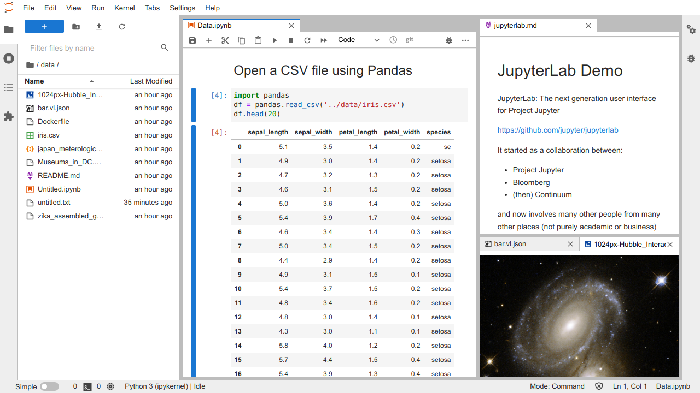

.. _overview:

Overview
--------

JupyterLab is the next-generation web-based user interface for Project Jupyter.

JupyterLab enables you to work with documents and activities such as
:ref:`Jupyter notebooks <notebook>`, text editors, terminals, and custom
components in a flexible, integrated, and extensible manner. You can
:ref:`arrange <interface>` multiple documents and activities side by side in the
work area using tabs and splitters. Documents and activities integrate with each
other, enabling new workflows for interactive computing, for example:

-  :ref:`code-console` provide transient scratchpads for running code
   interactively, with full support for rich output. A code console can be
   linked to a notebook kernel as a computation log from the notebook, for
   example.
-  :ref:`Kernel-backed documents <kernel-backed-documents>` enable code in any
   text file (Markdown, Python, R, LaTeX, etc.) to be run interactively in any
   Jupyter kernel.
-  Notebook cell outputs can be :ref:`mirrored into their own tab <cell-output-mirror>`,
   side by side with the notebook, enabling simple dashboards with interactive controls
   backed by a kernel.
-  Multiple views of documents with different editors or viewers enable live
   editing of documents reflected in other viewers. For example, it is easy to
   have live preview of :ref:`markdown`, :ref:`csv`, or :ref:`vega-lite` documents.

JupyterLab also offers a unified model for viewing and handling data formats.
JupyterLab understands many file formats (images, CSV, JSON, Markdown, PDF,
Vega, Vega-Lite, etc.) and can also display rich kernel output in these formats.
See :ref:`file-and-output-formats` for more information.

To navigate the user interface, JupyterLab offers :ref:`customizable keyboard
shortcuts <shortcuts>` and the ability to use :ref:`key maps <editor-keymaps>`
from vim, emacs, and Sublime Text in the text editor.

JupyterLab :ref:`extensions <user_extensions>` can customize or enhance any part
of JupyterLab, including new themes, file editors, and custom components.

JupyterLab is served from the same `server
<https://jupyter-notebook.readthedocs.io/en/stable/>`__ and uses the same
`notebook document format <http://nbformat.readthedocs.io/en/latest/>`__ as the
classic Jupyter Notebook.

.. _stability:

Stability of JupyterLab
~~~~~~~~~~~~~~~~~~~~~~~

The current beta release of JupyterLab is stable for daily use.  
Likewise, all future releases in the beta series will be stable for daily use.

.. _classic:

Classic Jupyter Notebook
~~~~~~~~~~~~~~~~~~~~~~~~

JupyterLab 1.0 will eventually replace the classic Jupyter Notebook.
Throughout this transition, the same notebook document format will be supported by both the classic Notebook and JupyterLab.

.. _beta:

Beta Series and Beyond
~~~~~~~~~~~~~~~~~~~~~~
The developer API will evolve in beta releases and will stabilize in JupyterLab 1.0.
We appreciate feedback on our `GitHub issues page <https://github.com/jupyterlab/jupyterlab/issues>`__
as we evolve towards a stable extension development API for JupyterLab 1.0.

We plan to release JupyterLab 1.0 later in 2018.
The beta releases leading up to 1.0 will focus on
stabilizing the extension development API, UI/UX improvements,
and additional core features.