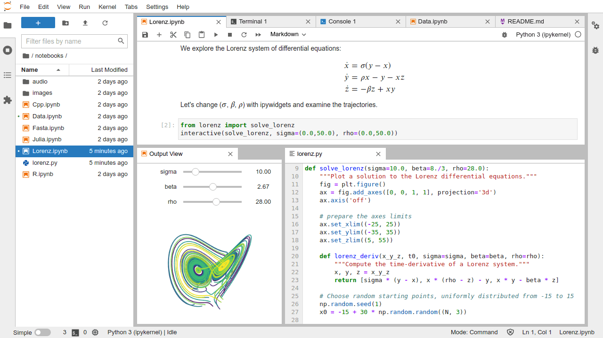

.. JupyterLab Tutorial documentation master file, created by
   sphinx-quickstart on Tue Jun 21 16:30:09 2016.
   You can adapt this file completely to your liking, but it should at least
   contain the root `toctree` directive.

########################
JupyterLab Documentation
########################

JupyterLab is the next-generation web-based user interface for Project Jupyter. `Try it on Binder <https://mybinder.org/v2/gh/jupyterlab/jupyterlab-demo/3818244?urlpath=lab/tree/demo>`__.  JupyterLab follows the Jupyter `Community Guides <https://jupyter.readthedocs.io/en/latest/community/content-community.html>`__.

.. toctree::
   :maxdepth: 1
   :caption: Getting Started

   getting_started/overview
   getting_started/installation
   getting_started/starting
   getting_started/issue
   getting_started/faq
   getting_started/changelog

.. toctree::
   :maxdepth: 1
   :caption: User Guide

   user/interface
   user/urls
   user/files
   user/file_editor
   user/notebook
   user/code_console
   user/terminal
   user/running
   user/commands
   user/documents_kernels
   user/file_formats
   user/debugger
   user/extensions
   user/jupyterhub
   user/export
   user/language
   user/directories

.. toctree::
   :maxdepth: 1
   :caption: Extension Developer Guide

   extension/extension_dev
   extension/extension_points
   extension/ui_components
   extension/documents
   extension/notebook
   extension/virtualdom
   extension/ui_helpers
   extension/extension_tutorial
   extension/extension_migration

.. toctree::
   :maxdepth: 1
   :caption: JupyterLab Developer Guide

   developer/contributing
   developer/repo
   developer/components
   developer/patterns
   developer/css
   developer/api

