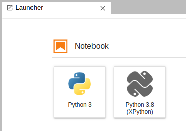
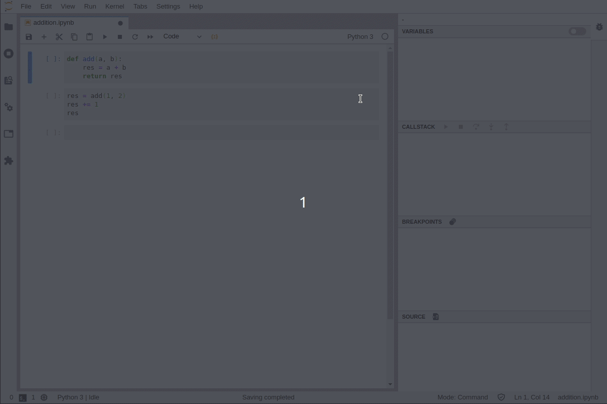
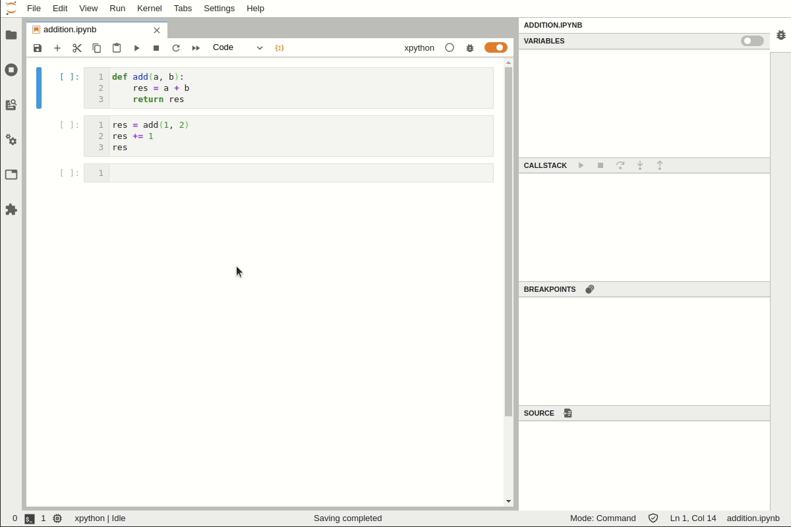
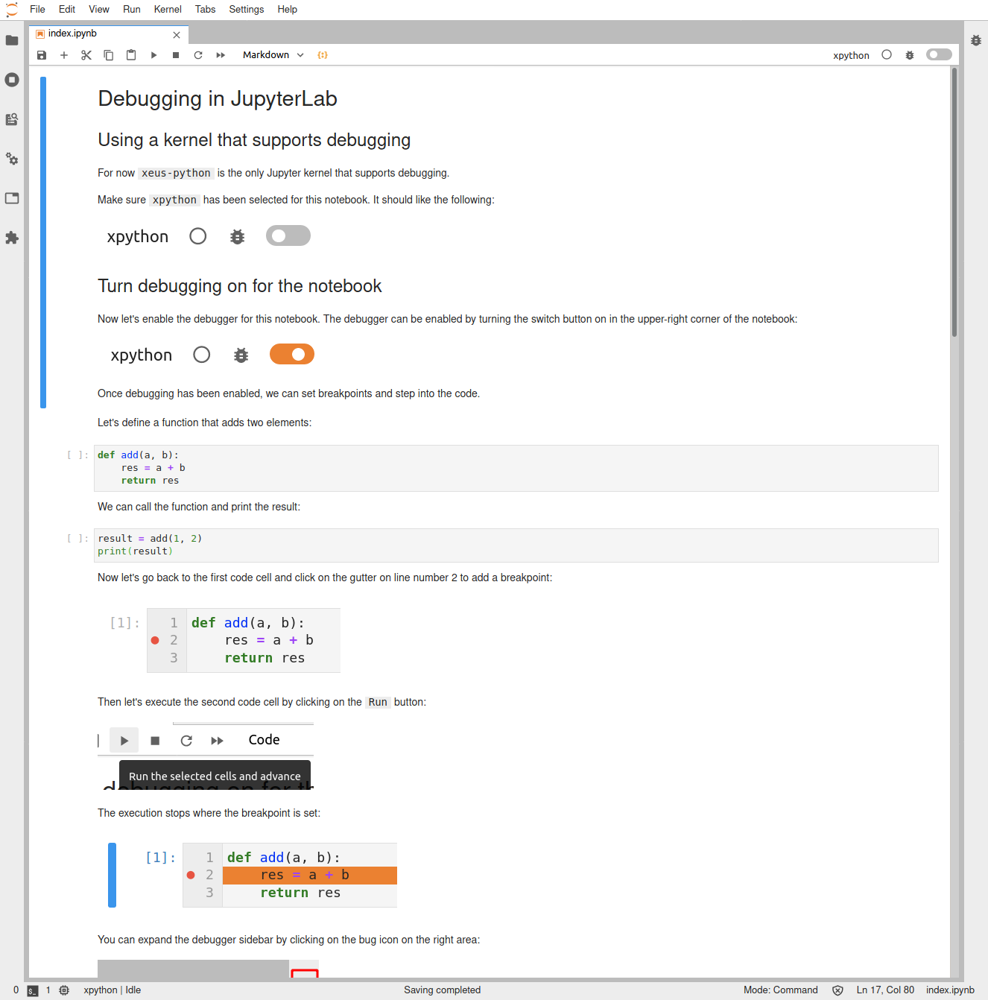

.. _debugger:

Debugger
========

JupyterLab 3.0 now ships with a Debugger front-end by default.

This means that notebooks, code consoles and files can now be debugged from JupyterLab directly!

Requirements
------------

For the debugger to be enabled and visible, a kernel with support for debugging is required.

Here is a list of kernels that are known to be supporting the Jupyter Debug Protocol:

- `xeus-python <https://github.com/jupyter-xeus/xeus-python>`_: Jupyter kernel for the Python programming language
- `xeus-robot <https://github.com/jupyter-xeus/xeus-robot>`_: Jupyter kernel for Robot Framework

Other Jupyter Kernels can also support debugging and be compatible with the JupyterLab debugger
by implementing the `Jupyter Debugger Protocol <https://jupyter-client.readthedocs.io/en/latest/messaging.html#debug-request>`_.

If you know of other kernels with support for debugging, please open a PR to add them to this list.

Here is an example of how to install ``xeus-python`` in a new ``conda`` environment:

.. code:: bash

   conda create -n jupyterlab-debugger -c conda-forge jupyterlab=3 xeus-python
   conda activate jupyterlab-debugger

Usage
-----

``xeus-python`` can be selected from the JupyterLab launcher:

Alternatively, it is also possible to switch to the `xpython` kernel using the kernel selection dialog:

Enable the debugger, set breakpoints and step into the code:

Tutorial Notebook
-----------------

There is also a tutorial notebook to try the debugger that is available on the `jupyter-ide-demo repo <https://github.com/blink1073/jupyter-ide-demo>`_.
and can be run on Binder `here <https://mybinder.org/v2/gh/blink1073/jupyter-ide-demo/stable?urlpath=/lab/tree/index.ipynb>`_.

