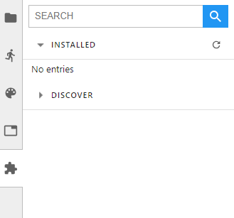
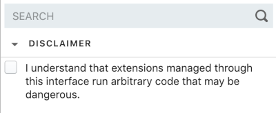
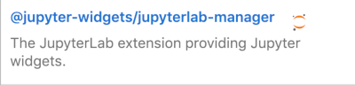
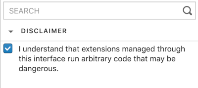
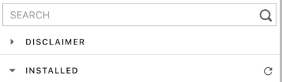
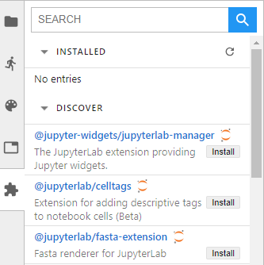
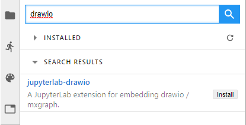
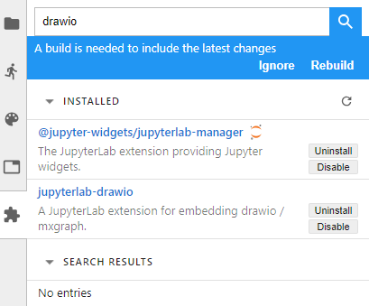
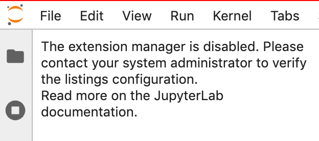
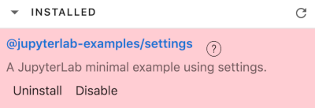

.. _user_extensions:

Extensions
==========

Fundamentally, JupyterLab is designed as an extensible environment. JupyterLab
extensions can customize or enhance any part of JupyterLab. They can provide
new themes, file viewers and editors, or renderers for rich outputs in
notebooks. Extensions can add items to the menu or command palette, keyboard
shortcuts, or settings in the settings system. Extensions can provide an API
for other extensions to use and can depend on other extensions. In fact, the
whole of JupyterLab itself is simply a collection of extensions that are no
more powerful or privileged than any custom extension.

For information about developing extensions, see the :ref:`developer
documentation <developer_extensions>`.

.. contents:: Table of contents
    :local:
    :depth: 1

Installing Extensions
---------------------

A JupyterLab extension contains JavaScript that is installed into Jupyterlab and run in the browser. An extension contains one or more plugins that extend JupyterLab. There are two types of JupyterLab extensions: a *source extension* (which requires a rebuild of JupyterLab when installed), and a *prebuilt extension* (which does not require a rebuild of JupyterLab). Rebuilding JupyterLab requires Node.js to be :ref:`installed <installing_nodejs>`.

JupyterLab extensions can be installed in a number of ways, including:

- Python ``pip`` or ``conda`` packages can include either a source extension or a prebuilt extension. These packages may also include a server-side component necessary for the extension to function.
- The Extension Manager in JupyterLab and the ``jupyter labextension install`` command can install source extension packages from `npm <https://www.npmjs.com/search?q=keywords:jupyterlab-extension>`__. Installing a source extension requires Node.js and a JupyterLab rebuild to activate. See :ref:`installing_nodejs` and :ref:`install_command`.

.. _installing_nodejs:

Installing Node.js
^^^^^^^^^^^^^^^^^^

Source extensions require `Node.js <https://nodejs.org/>`__ to rebuild
JupyterLab and activate the extension. If you use ``conda`` with
``conda-forge`` packages, you can get Node.js with:

.. code:: bash

    conda install -c conda-forge nodejs
    
If you use ``conda`` with default Anaconda packages (i.e., you don't normally
use ``conda-forge``), you should install Node.js from the Anaconda default
channel with ``conda install nodejs`` instead.

You may also be able to get Node.js from your system package manager, or you
can download Node.js from the `Node.js website <https://nodejs.org/>`__
and install it directly.

.. _install_command:

Managing Extensions with ``jupyter labextension``
-------------------------------------------------

The ``jupyter labextension`` command enables you to install or uninstall
source extensions from `npm <https://www.npmjs.com/search?q=keywords:jupyterlab-extension>`__, list all installed extensions, or disable any extension. See the help with ``jupyter labextension --help``. 

Installing and Uninstalling Source Extensions
^^^^^^^^^^^^^^^^^^^^^^^^^^^^^^^^^^^^^^^^^^^^^

You can install source extensions from `npm
<https://www.npmjs.com/search?q=keywords:jupyterlab-extension>`__ with:

.. code:: bash

    jupyter labextension install my-extension my-other-extension

Use the ``my-extension@version`` syntax to install a specific version
of an extension, for example:

.. code:: bash

    jupyter labextension install my-extension@1.2.3

You can also install a source extension that is not uploaded to npm, i.e.,
``my-extension`` can be a local directory containing the extension, a
gzipped tarball, or a URL to a gzipped tarball.

.. note::
    Installing a source extension will require :ref:`installing
    Node.js <installing_nodejs>` and require a rebuild of JupyterLab.

Uninstall source extensions using the command:

.. code:: bash

    jupyter labextension uninstall my-extension my-other-extension

If you are installing/uninstalling several extensions in several stages,
you may want to defer rebuilding JupyterLab by including the flag
``--no-build`` in the install/uninstall step. Once you are ready to
rebuild, you can run the command:

.. code:: bash

    jupyter lab build

.. note::
   If you are rebuilding JupyterLab on Windows, you may encounter a
   ``FileNotFoundError`` due to the default path length on Windows.  Node
   modules are stored in a deeply nested directory structure, so paths can get
   quite long. If you have administrative access and are on Windows 8 or 10,
   you can update the registry setting using these instructions:
   https://stackoverflow.com/a/37528731.

Listing installed extensions
^^^^^^^^^^^^^^^^^^^^^^^^^^^^

List all installed extensions, including those installed with ``pip`` or
``conda``, with:

.. code:: bash

    jupyter labextension list

.. note::
   ``jupyter labextension`` identifies an extension by its JavaScript package
   name, which may be different from the name of the ``pip`` or ``conda``
   package used to distribute the extension.

.. _enable_disable_config:

Enabling and Disabling Extensions
^^^^^^^^^^^^^^^^^^^^^^^^^^^^^^^^^

Disabling an extension prevents the all plugins in the extension from running in JupyterLab
(though the code is still loaded). You can disable specific JupyterLab
extensions (including core extensions) without rebuilding JupyterLab with:

.. code:: bash

    jupyter labextension disable my-extension

You can enable a disabled extension with:

.. code:: bash

    jupyter labextension enable my-extension

Installed extensions are enabled by default unless there is configuration explicity disabling them.
Extensions can be disabled or enabled using the command line.
Extensions or individual plugins within an extension can be disabled by another extension.

The priority order for determining whether an extension is enabled or disabled is as follows:

- Presence of ``<jupyter_config_path>/labconfig/pageconfig.json`` file(s) with a ``disabledExtensions`` key that is a object with package names as keys and boolean values. 
- (deprecated) Presence of ``disabledExensions`` key in ``<lab_app_dir>/settings/pageconfig.json``.   This value is a list of extensions to disable, but is deprecated in favor of the layered configuration approach in the `labconfig` location(s).
- Presence of ``disabledExtensions`` key in another JupyterLab extension's metadata that disables a given extension.  The key is ignored if that extension itself is disabled.

When using the command line, you can target the ``--level`` of the config: ``user``, ``system``, or ``sys-prefix`` (default).
      
An example ``<jupyter_config_path>/labconfig/pageconfig.json`` could look as follows:

.. code:: json

   {
      "disabledExtensions": {
            "@jupyterlab/notebook-extension": true
      }
   }

See :ref:`documentation on LabConfig directories <labconfig_directories>` for more information.

Managing Extensions Using the Extension Manager
-----------------------------------------------

You can use the Extension Manager in JupyterLab to manage extensions that are
distributed as single JavaScript packages on npm.

The Extension Manager is in the :ref:`left sidebar <left-sidebar>`.

   **Figure:** The default view has three components: a search bar, an "Installed"
   section, and a "Discover" section.

Disclaimer
^^^^^^^^^^

.. danger::

    Installing an extension allows it to execute arbitrary code on the server,
    kernel, and the browser. Therefore, we ask you to explicitly acknowledge
    this.

By default, the disclaimer is not acknowledged.

   **Figure:** User has not acknowledged the disclaimer

As the disclaimer is not acknowledged, you can search for an extension,
but can not install it (no install button is available).

   **Figure:** With Disclaimer unchecked, you can not install an extension

To install an extension, you first have to explicitly acknowledge the disclaimer.
Once done, this will remain across sessions and the user does not have to 
check it again.

   **Figure:** Disclaimer checked

For ease of use, you can hide the disclaimer so it takes less space on
your screen.

   **Figure:** Disclaimer is hidden

Finding Extensions
^^^^^^^^^^^^^^^^^^

You can use the extension manager to find extensions for JupyterLab. To discovery
freely among the currently available extensions, expand the "Discovery" section.
This triggers a search for all JupyterLab extensions on the NPM registry, and
the results are listed according to the `registry's sort order
<https://docs.npmjs.com/searching-for-and-choosing-packages-to-download#package-search-rank-criteria>`__.
An exception to this sort order is that extensions released by the Jupyter
organization are always placed first. These extensions are distinguished by
a small Jupyter icon next to their name.

Alternatively, you can limit your discovery by using the search bar. This
performs a free-text search of JupyterLab extensions on the NPM registry.

Installing an Extension
^^^^^^^^^^^^^^^^^^^^^^^

Once you have found a source extension that you think is interesting, install
it by clicking the "Install" button of the extension list entry.

.. danger::

    Installing an extension allows it to execute arbitrary code on the
    server, kernel, and in the client's browser. You should therefore
    avoid installing extensions you do not trust, and watch out for
    any extensions trying to masquerade as a trusted extension.

A short while after starting the install of an extension, a drop-down should
appear under the search bar indicating that the extension has been
downloaded, but that a rebuild is needed to complete the installation.

If you want to install/uninstall other extensions as well, you can ignore
the rebuild notice until you have made all the changes you want. Once satisfied,
click the 'Rebuild' button to start a rebuild in the background.
Once the rebuild completes, a dialog will pop up, indicating that a reload of
the page is needed in order to load the latest build into the browser.

If you ignore the rebuild notice by mistake, simply refresh your browser
window to trigger a new rebuild check.

Managing Installed Extensions
^^^^^^^^^^^^^^^^^^^^^^^^^^^^^

When there are some installed extensions, they will be shown in the "Installed"
section. These can then be uninstalled (if they are source extensions) or disabled. Disabling an extension will
prevent it from being activated, but without rebuilding the application.

Companion packages
^^^^^^^^^^^^^^^^^^

During installation of an extension, JupyterLab will inspect the package
metadata for any
:ref:`instructions on companion packages <ext-author-companion-packages>`.
Companion packages can be:

   - Notebook server extensions (or any other packages that need to be
     installed on the Notebook server).
   - Kernel packages. An example of companion packages for the
     kernel are Jupyter Widget packages, like the `ipywidgets <https://ipywidgets.readthedocs.io/en/stable>`__
     Python package for the
     `@jupyter-widgets/jupyterlab-manager package <https://www.npmjs.com/package/@jupyter-widgets/jupyterlab-manager>`__.

If JupyterLab finds instructions for companion packages, it will present
a dialog to notify you about these. These are informational only, and it
will be up to you to take these into account or not.

.. _extension_listings:

Listings
^^^^^^^^

When searching source extensions in the Extension Manager, JupyterLab displays the complete search result and 
the user is free to install any source extension. This is the :ref:`default_mode`.

To bring more security, you or your administrator can enable ``blocklists`` or ``allowlists``
mode. JupyterLab will check the extensions against the defined listings.

.. warning::

    Only one mode at a time is allowed. If you or your server administrator configures
    both block and allow listings, the JupyterLab server will not start.

   **Figure:** Simultaneous block and allow listings

The following details the behavior for the :ref:`blocklist_mode` and the :ref:`allowlist_mode`.
The details to enable configure the listings can be read :ref:`listings_conf`. 

.. _default_mode:

Default mode
""""""""""""

In the ``default`` mode, no listing is enabled and the search behavior is unchanged and
is the one described previously.

.. _blocklist_mode:

Blocklist mode
""""""""""""""

Extensions can be freely downloaded without going through a vetting process.
However, users can add malicious extensions to a blocklist. The extension manager 
will show all extensions except for those that have 
been explicitly added to the blocklist. Therfore, the extension manager 
does not allow you to install blocklisted extensions.

If you, or your administrator, has enabled the blocklist mode,
JupyterLab will use the blocklist and remove all blocklisted
extensions from your search result.

If you have installed an extension before it has been blocklisted,
the extension entry in the installed list will be highlighted
in red. It is recommended that you uninstall it. You can move
your mouse on the question mark icon to read the instructions.

   **Figure:** Blocklisted installed extension which should be removed

.. _allowlist_mode:

Allowlist mode
""""""""""""""

An allowlist maintains a set of approved extensions that users can freely 
search and install. Extensions need to go through some sort of vetting process 
before they are added to the allowlist. When using an allowlist, the extension manager 
will only show extensions that have been explicitly added to the allowlist.

If you, or your administrator, has enabled the allowlist mode
JupyterLab will use the allowlist and only show extensions present
in the withelist. The other extensions will not be show in the search result.

If you have installed an allowlisted extension and at some point
in time that extension is removed from the allowlist, the extension entry 
in the installed list will be highlighted in red. It is recommended that 
you uninstall it. You can move your mouse on the question mark icon to
read the instructions.

.. figure:: images/listings/installed_allowlisted.png
   :align: center
   :class: jp-screenshot

   **Figure:** The second of the installed extensions was removed from the allowlist and should be removed

.. _listings_conf:

Listing Configuration
"""""""""""""""""""""

You or your administrator can use the following traits to define the listings loading.

- ``blocklist_uris``: A list of comma-separated URIs to fetch a blocklist file from
- ``allowlist_uris``: A list of comma-separated URIs to fetch an allowlist file from
- ``listings_refresh_seconds``: The interval delay in seconds to refresh the lists
- ``listings_request_options``: The optional kwargs to use for the listings HTTP requests

For example, to enable blocklist, launch the server with ``--LabServerApp.blocklist_uris=http://example.com/blocklist.json`` where ``http://example.com/blocklist.json`` is a blocklist JSON file as described below.

The details for the listings_request_options are listed
on `this page <https://2.python-requests.org/en/v2.7.0/api/#requests.request>`__  
(for example, you could pass ``{'timeout': 10}`` to change the HTTP request timeout value).

The listings are json files hosted on the URIs you have given.

For each entry, you have to define the `name` of the extension as published in the NPM registry.
The ``name`` attribute supports regular expressions.

Optionally, you can also add some more fields for your records (``type``, ``reason``, ``creation_date``,
``last_update_date``). These optional fields are not used in the user interface.

This is an example of a blocklist file.

.. code:: json

   {
   "blocklist": [
      {
         "name": "@jupyterlab-examples/launcher",
         "type": "jupyterlab",
         "reason": "@jupyterlab-examples/launcher is blocklisted for test purpose - Do NOT take this for granted!!!",
         "creation_date": "2020-03-11T03:28:56.782Z",
         "last_update_date":  "2020-03-11T03:28:56.782Z"
      }
   ]
   }

In the following allowlist example a ``@jupyterlab/*`` will allowlist 
all jupyterlab organization extensions.

.. code:: json

   {
   "allowlist": [
      {
         "name": "@jupyterlab/*",
         "type": "jupyterlab",
         "reason": "All @jupyterlab org extensions are allowlisted, of course...",
         "creation_date": "2020-03-11T03:28:56.782Z",
         "last_update_date":  "2020-03-11T03:28:56.782Z"
      }
   ]
   }

