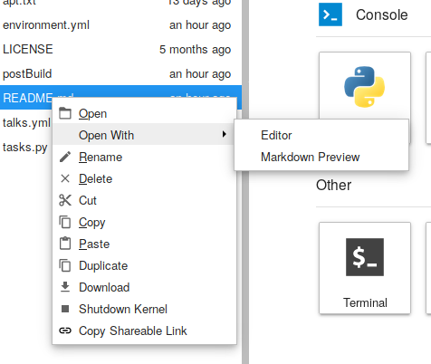
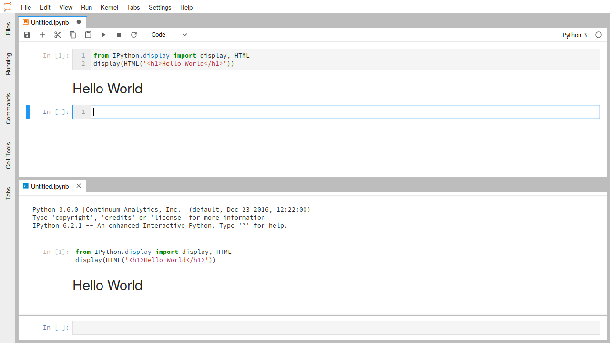
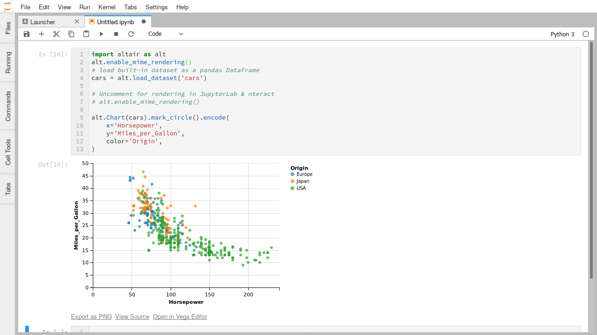
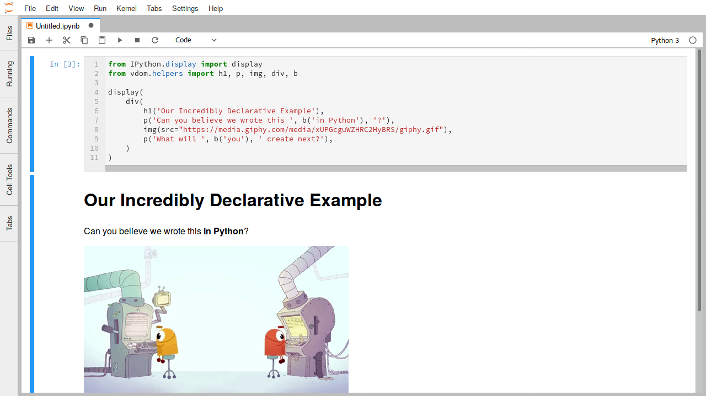

.. _file-and-output-formats:

File and Output Formats
=======================

JupyterLab provides a unified architecture for viewing and editing data
in a wide variety of formats. This model applies whether the data is in
a file or is provided by a kernel as rich cell output in a notebook or
code console.

For files, the data format is detected by the extension of the file (or
the whole filename if there is no extension). A single file extension
may have multiple editors or viewers registered. For example, a Markdown
file (``.md``) can be edited in the file editor or rendered and
displayed as HTML. You can open different editors and viewers for a file
by right-clicking on the filename in the file browser and using the
“Open With” submenu:

To use these different data formats as output in a notebook or code
console, you can use the relevant display API for the kernel you are
using. For example, the IPython kernel provides a variety of convenience
classes for displaying rich output:

.. code:: python

    from IPython.display import display, HTML
    display(HTML('<h1>Hello World</h1>'))

Running this code will display the HTML in the output of a notebook or
code console cell:

The IPython display function can also construct a raw rich output
message from a dictionary of keys (MIME types) and values (MIME data):

.. code:: python

    from IPython.display import display
    display({'text/html': '<h1>Hello World</h1>', 'text/plain': 'Hello World'}, raw=True)

Other Jupyter kernels offer similar APIs.

The rest of this section highlights some of the common data formats that
JupyterLab supports by default. JupyterLab extensions can also add support for
other file formats.

.. _markdown:

Markdown
--------

-  File extension: ``.md``
-  MIME type: ``text/markdown``

Markdown is a simple and popular markup language used for text cells in
the Jupyter Notebook.

.. _edit-markdown:

Markdown documents can be edited as text files or rendered inline:

.. raw:: html

  

    <iframe src="https://www.youtube-nocookie.com/embed/eQsRlqK-z1c?rel=0&amp;showinfo=0" frameborder="0" allow="autoplay; encrypted-media" allowfullscreen></iframe>
  

The Markdown syntax supported in this mode is the same syntax used in
the Jupyter Notebook (for example, LaTeX equations work). As seen in the
animation, edits to the Markdown source are immediately reflected in the
rendered version.

Images
------

-  File extensions: ``.bmp``, ``.gif``, ``.jpeg``, ``.jpg``, ``.png``,
   ``.svg``
-  MIME types: ``image/bmp``, ``image/gif``, ``image/jpeg``,
   ``image/png``, ``image/svg+xml``

JupyterLab supports image data in cell output and as files in the above
formats. In the image file viewer, you can use keyboard shortcuts such
as ``+`` and ``-`` to zoom the image, ``[`` and ``]`` to rotate the image,
and ``H`` and ``V`` to flip the image horizontally and vertically. Use
``I`` to invert the colors, and use ``0`` to reset the image.

.. _edit-svg:

To edit an SVG image as a text file, right-click on the SVG filename in
the file browser and select the “Editor” item in the “Open With”
submenu:

.. raw:: html

  

    <iframe src="https://www.youtube-nocookie.com/embed/y_ydmAmVdCA?rel=0&amp;showinfo=0" frameborder="0" allow="autoplay; encrypted-media" allowfullscreen></iframe>
  

.. _csv:

Delimiter-separated Values
--------------------------

-  File extension: ``.csv``
-  MIME type: None

.. _view-csv:

Files with rows of delimiter-separated values, such as CSV files, are a common format for
tabular data. The default viewer for these files in JupyterLab is a
high-performance data grid viewer which can display comma-separated, tab-separated, and
semicolon-separated values:

.. raw:: html

  

    <iframe src="https://www.youtube-nocookie.com/embed/z6xuZ9H3Imo?rel=0&amp;showinfo=0" frameborder="0" allow="autoplay; encrypted-media" allowfullscreen></iframe>
  

While tab-separated value files can be read by the grid viewer, it currently does not automatically recognize ``.tsv`` files.
To view, you must change the extension to ``.csv`` and set the delimiter to tabs.

.. _edit-csv:

To edit a CSV file as a text file, right-click on the file in the file
browser and select the “Editor” item in the “Open With” submenu:

.. raw:: html

  

    <iframe src="https://www.youtube-nocookie.com/embed/b5oAoVB3Wd4?rel=0&amp;showinfo=0" frameborder="0" allow="autoplay; encrypted-media" allowfullscreen></iframe>
  

JupyterLab's grid viewer can open large files, up to the maximum string size of the particular browser.
Below is a table that shows the sizes of the largest test files we successfully opened in each browser we support:

+---------+----------+
| Browser | Max Size |
+=========+==========+
| Firefox |  1.04GB  |
+---------+----------+
| Chrome  |  730MB   |
+---------+----------+
| Safari  |  1.8GB   |
+---------+----------+

The actual maximum size of files that can be successfully loaded will vary depending on the browser version and file content.

JSON
----

-  File extension: ``.json``
-  MIME type: ``application/json``

.. _view-json:

JavaScript Object Notation (JSON) files are common in data science.
JupyterLab supports displaying JSON data in cell output or viewing a
JSON file using a searchable tree view:

.. raw:: html

  

    <iframe src="https://www.youtube-nocookie.com/embed/FRj1r7-7kiQ?rel=0&amp;showinfo=0" frameborder="0" allow="autoplay; encrypted-media" allowfullscreen></iframe>
  

.. _edit-json:

To edit the JSON as a text file, right-click on the filename in the file
browser and select the “Editor” item in the “Open With” submenu:

.. raw:: html

  

    <iframe src="https://www.youtube-nocookie.com/embed/HKcJAGZngzw?rel=0&amp;showinfo=0" frameborder="0" allow="autoplay; encrypted-media" allowfullscreen></iframe>
  

HTML
----

-  File extension: ``.html``
-  MIME type: ``text/html``

JupyterLab supports rendering HTML in cell output and editing HTML files
as text in the file editor.

LaTeX
-----

-  File extension: ``.tex``
-  MIME type: ``text/latex``

JupyterLab supports rendering LaTeX equations in cell output and editing
LaTeX files as text in the file editor.

PDF
---

-  File extension: ``.pdf``
-  MIME type: ``application/pdf``

.. _view-pdf:

PDF is a common standard file format for documents. To view a PDF file
in JupyterLab, double-click on the file in the file browser:

.. raw:: html

  

    <iframe src="https://www.youtube-nocookie.com/embed/vLAEzD5dxQw?rel=0&amp;showinfo=0" frameborder="0" allow="autoplay; encrypted-media" allowfullscreen></iframe>
  

.. _vega-lite:

Vega/Vega-Lite
--------------

Vega:

-  File extensions: ``.vg``, ``.vg.json``
-  MIME type: ``application/vnd.vega.v5+json``

Vega-Lite:

-  File extensions: ``.vl``, ``.vl.json``
-  MIME type: ``application/vnd.vegalite.v3+json``

Vega and Vega-Lite are declarative visualization grammars that enable
visualizations to be encoded as JSON data. For more information, see the
documentation of Vega or Vega-Lite. JupyterLab supports rendering Vega
5.x and Vega-Lite 3.x data in files and cell output.

.. _open-vega:

Vega-Lite 1.x files, with a ``.vl`` or ``.vl.json`` file extension, can
be opened by double-clicking the file in the file browser:

.. raw:: html

  

    <iframe src="https://www.youtube-nocookie.com/embed/Dddtyz5fWkU?rel=0&amp;showinfo=0" frameborder="0" allow="autoplay; encrypted-media" allowfullscreen></iframe>
  

.. _open-vega-with:

The files can also be opened in the JSON viewer or file editor through
the “Open With…” submenu in the file browser content menu:

.. raw:: html

  

    <iframe src="https://www.youtube-nocookie.com/embed/qaiGRXh4jxc?rel=0&amp;showinfo=0" frameborder="0" allow="autoplay; encrypted-media" allowfullscreen></iframe>
  

.. _vega-multiple-views:

As with other files in JupyterLab, multiple views of a single file
remain synchronized, enabling you to interactively edit and render
Vega/Vega-Lite visualizations:

.. raw:: html

  

    <iframe src="https://www.youtube-nocookie.com/embed/4Me4rCeS8To?rel=0&amp;showinfo=0" frameborder="0" allow="autoplay; encrypted-media" allowfullscreen></iframe>
  

The same workflow also works for Vega 2.x files, with a ``.vg`` or
``.vg.json`` file extension.

Output support for Vega/Vega-Lite in a notebook or code console is
provided through third-party libraries such as Altair (Python), the
vegalite R package, or Vegas (Scala/Spark).

A JupyterLab extension that supports Vega 3.x and Vega-Lite 2.x can be
found `here <https://github.com/jupyterlab/jupyter-renderers>`__.

Virtual DOM
-----------

-  File extensions: ``.vdom``, ``.json``
-  MIME type: ``application/vdom.v1+json``

Virtual DOM libraries such as `react.js <https://reactjs.org/>`__ have
greatly improved the experience of rendering interactive content in
HTML. The nteract project, which collaborates closely with Project
Jupyter, has created a `declarative JSON
format <https://github.com/nteract/vdom>`__ for virtual DOM data.
JupyterLab can render this data using react.js. This works for both VDOM
files with the ``.vdom`` extension, or within notebook output.

.. _edit-vdom:

Here is an example of a ``.vdom`` file being edited and rendered
interactively:

.. raw:: html

  

    <iframe src="https://www.youtube-nocookie.com/embed/fObR8xeKCJU?rel=0&amp;showinfo=0" frameborder="0" allow="autoplay; encrypted-media" allowfullscreen></iframe>
  

The `nteract/vdom <https://github.com/nteract/vdom>`__ library provides
a Python API for creating VDOM output that is rendered in nteract and
JupyterLab:

