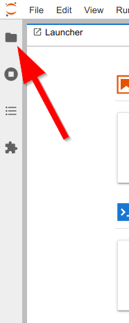
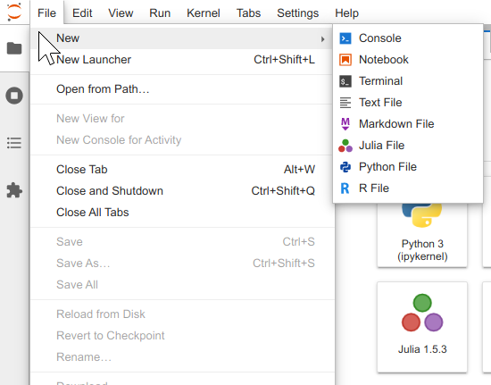
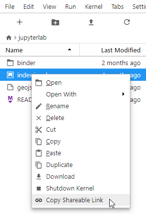
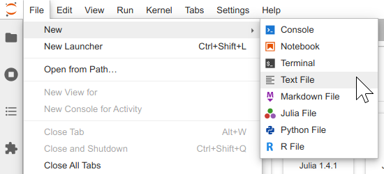

.. _working-with-files:

Working with Files
------------------

Opening Files
~~~~~~~~~~~~~

The file browser and File menu enable you to work with files and
directories on your system. This includes opening, creating, deleting,
renaming, downloading, copying, and sharing files and directories.

The file browser is in the left sidebar Files tab:

Many actions on files can also be carried out in the File menu:

.. _open-file:

To open any file, double-click on its name in the file browser:

.. raw:: html

  

     <iframe src="https://www.youtube-nocookie.com/embed/Rh-vwjTwBTI?rel=0&amp;showinfo=0" frameborder="0" allow="autoplay; encrypted-media" allowfullscreen></iframe>
  

.. _newtab:

You can also drag a file into the main work area to create a new tab:

.. raw:: html

  

     <iframe src="https://www.youtube-nocookie.com/embed/uwMmHeDmRxk?rel=0&amp;showinfo=0" frameborder="0" allow="autoplay; encrypted-media" allowfullscreen></iframe>
  

.. _multiple-viewers:

Many files types have :ref:`multiple viewers/editors <file-and-output-formats>`.
For example, you can open a Markdown file in a :ref:`text editor <file-editor>` or as rendered HTML.
A JupyterLab extension can also add new viewers/editors for files.
To open a file in a non-default viewer/editor, right-click on its name in the
file browser and use the "Open With..." submenu to select the viewer/editor:

.. raw:: html

  

     <iframe src="https://www.youtube-nocookie.com/embed/1kEgUqAeYo0?rel=0&amp;showinfo=0" frameborder="0" allow="autoplay; encrypted-media" allowfullscreen></iframe>
  

.. _single-doc-sync:

A single file can be open simultaneously in multiple viewer/editors and
they will remain in sync:

.. raw:: html

  

     <iframe src="https://www.youtube-nocookie.com/embed/87ALbxm1Y3I?rel=0&amp;showinfo=0" frameborder="0" allow="autoplay; encrypted-media" allowfullscreen></iframe>
  

.. _file-navigation:

The file system can be navigated by double-clicking on folders in the
listing or clicking on the folders at the top of the directory listing:

.. raw:: html

  

     <iframe src="https://www.youtube-nocookie.com/embed/2OHwJzjG-l4?rel=0&amp;showinfo=0" frameborder="0" allow="autoplay; encrypted-media" allowfullscreen></iframe>
  

.. _file-share:

Right-click on a file or directory and select "Copy Shareable Link" to
copy a URL that can be used to open JupyterLab with that file or
directory open.

.. _file-copy-path:

Right-click on a file or directory and select "Copy Path" to copy the
filesystem relative path. This can be used for passing arguments to open
files in functions called in various kernels.

Creating Files and Activities
~~~~~~~~~~~~~~~~~~~~~~~~~~~~~

.. _file-create-plus:

Create new files or activities by clicking the ``+`` button at the top
of the file browser. This will open a new Launcher tab in the main work area,
which enables you to pick an activity and kernel:

.. raw:: html

  

     <iframe src="https://www.youtube-nocookie.com/embed/QL0IxDAOEc0?rel=0&amp;showinfo=0" frameborder="0" allow="autoplay; encrypted-media" allowfullscreen></iframe>
  

.. _file-create-menu:

You can also create new documents or activities using the File menu:

.. _current-directory:

The current working directory of a new activity or document will be the
directory listed in the file browser (except for a terminal, which
always starts in the root directory of the file browser):

.. raw:: html

  

     <iframe src="https://www.youtube-nocookie.com/embed/OfISSOTiGTY?rel=0&amp;showinfo=0" frameborder="0" allow="autoplay; encrypted-media" allowfullscreen></iframe>
  

.. _file-rename:

A new file is created with a default name. Rename a file by
right-clicking on its name in the file browser and selecting “Rename”
from the context menu:

.. raw:: html

  

     <iframe src="https://www.youtube-nocookie.com/embed/y3xzXelypjs?rel=0&amp;showinfo=0" frameborder="0" allow="autoplay; encrypted-media" allowfullscreen></iframe>
  

Uploading and Downloading
~~~~~~~~~~~~~~~~~~~~~~~~~

.. _file-upload:

Files can be uploaded to the current directory of the file browser by
dragging and dropping files onto the file browser, or by clicking the
"Upload Files" button at the top of the file browser:

.. raw:: html

  

     <iframe src="https://www.youtube-nocookie.com/embed/1bd2QHqQSH4?rel=0&amp;showinfo=0" frameborder="0" allow="autoplay; encrypted-media" allowfullscreen></iframe>
  

.. _file-download:

Any file in JupyterLab can be downloaded by right-clicking its name in
the file browser and selecting “Download” from the context menu:

.. raw:: html

  

     <iframe src="https://www.youtube-nocookie.com/embed/Wl7Ozl6rMcc?rel=0&amp;showinfo=0" frameborder="0" allow="autoplay; encrypted-media" allowfullscreen></iframe>
  

