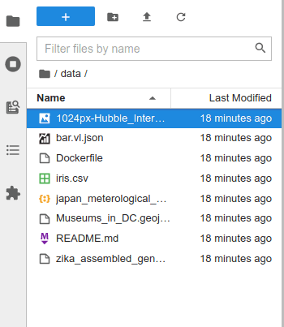
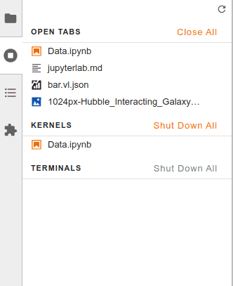
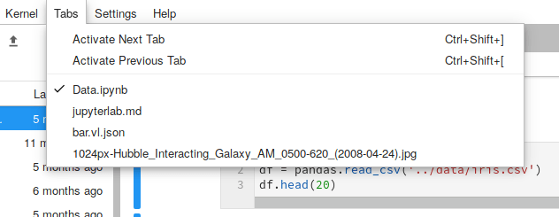

.. _interface:

The JupyterLab Interface
------------------------

JupyterLab provides flexible building blocks for interactive,
exploratory computing. While JupyterLab has many features found in
traditional integrated development environments (IDEs), it remains
focused on interactive, exploratory computing.

The JupyterLab interface consists of a :ref:`main work area <main_area>` containing tabs of
documents and activities, a collapsible :ref:`left sidebar <left_sidebar>`, and a :ref:`menu bar <menu_bar>`.
The left sidebar contains a :ref:`file browser <working_with_files>`, the :ref:`list of running kernels
and terminals <running>`, the :ref:`command palette <commands>`, the :ref:`notebook cell tools inspector <notebook>`,
and the :ref:`tabs list <tabs>`.

.. image:: images/interface_jupyterlab.png

.. _menu_bar:

Menu Bar
~~~~~~~~

The menu bar at the top of JupyterLab has top-level menus that expose
actions available in JupyterLab with their keyboard shortcuts. The
default menus are:

-  File: actions related to files and directories
-  Edit: actions related to editing documents and other activities
-  View: actions that alter the appearance of JupyterLab
-  Run: actions for running code in different activities such as
   Notebooks and Code Consoles
-  Kernel: actions for managing kernels, which are separate processes
   for running code
-  Tabs: a list of the open documents and activities in the dock panel
-  Settings: common settings and an advanced settings editor
-  Help: a list of JupyterLab and kernel help links

:ref:`JupyterLab extensions <user_extensions>` can also create new top-level menus in the menu
bar.

.. _left_sidebar:

Left Sidebar
~~~~~~~~~~~~

The left sidebar contains a number of commonly-used tabs, such as a file
browser, a list of running kernels and terminals, the command palette,
and a list of tabs in the main area:

The left sidebar can be collapsed or expanded by clicking on the active
sidebar tab:

[animation]

JupyterLab extensions can add additional panels to the left sidebar.

.. _main_area:

Main area
~~~~~~~~~

The main work area in JupyterLab allows you to arrange documents
(notebooks, text files, etc.) and other activities (terminals, code
consoles, etc.) into panels of tabs that can be resized or subdivided:

[animation]

The main area has a single current activity. The tab for this activity
is marked with a colored top border (blue by default).

.. _tabs:

Tabs and Single Document Mode
~~~~~~~~~~~~~~~~~~~~~~~~~~~~~

The Tabs panel in the left sidebar lists the open documents or
activities in the main area:

The same information is also available in the Tabs Menu:

It is often useful to focus on a single document or activity without
closing other tabs in the main area. Single Document Mode toggles the
view of the main area to show only a single tab at a time:

[animation]

When you leave Single Document Mode, the original layout of the main
area is restored.

Context Menus
~~~~~~~~~~~~~

Many parts of JupyterLab, such as notebooks, text files, code consoles,
and tabs have context menus that can be accessed by right-clicking on
the element:

[animation]

The browser’s native context menu can be accessed by holding down
``Shift`` and right-clicking:

[animation]
