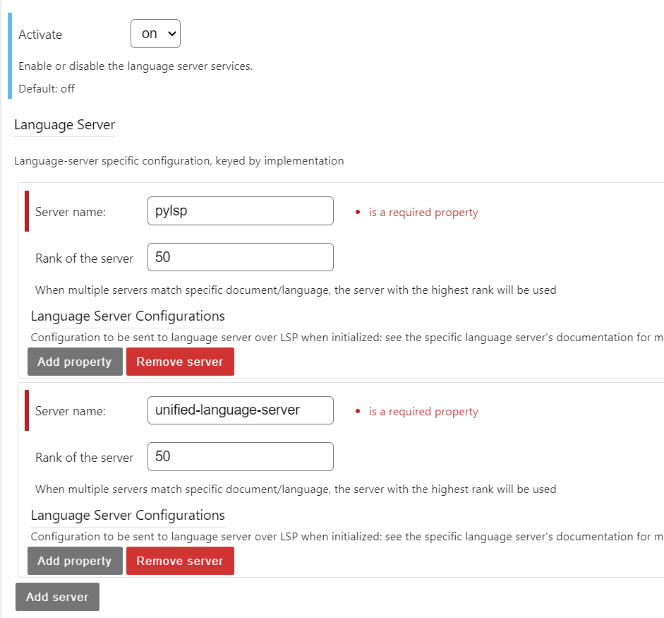

.. Copyright (c) Jupyter Development Team.
.. Distributed under the terms of the Modified BSD License.

.. _lsp:

Language Server Protocol support
=====================================

.. warning::

    Language Server Protocol (LSP) support for JupyrterLab is an experimental feature. It is based on the  `jupyterlab-lsp <https://jupyterlab-lsp.readthedocs.io/>`_ extension. More detailed documentation can be found on their page.

JupyterLab 4.0 ships with components on both backend and frontend to lay the infrastructure for handling and communicating with language servers.

This means that other extensions can be built on top of JupyterLab's services to provide LSP features for notebooks and files.

The LSP service is disabled by default, it can be enabled by togging the *Activate* option in the *Language Servers* section of the setting page.

Requirements
------------

By default JupyterLab does not come with any language servers preinstalled, you need to install the servers by yourself. Supported language servers and the suggested package managers to install them are listed in the tables below:

.. role:: raw-html(raw)
    :format: html

.. list-table:: Notebook-optimized Language Servers
   :widths: auto
   :header-rows: 1

   * - Languages
     - Implementation
     - Installation
   * - python
     - `jedi-language-server <https://github.com/pappasam/jedi-language-server>`_
     - pip: ``pip install -U jedi-language-server`` :raw-html:` ` conda: ``conda install -c conda-forge jedi-language-server``
   * - python
     - `pylsp <https://github.com/python-lsp/python-lsp-server>`_
     - pip: ``pip install 'python-lsp-server[all]'`` :raw-html:` ` conda: ``conda install -c conda-forge python-lsp-server``
   * - julia
     - `julia-language-server <https://github.com/julia-vscode/LanguageServer.jl>`_
     - julia: ``using Pkg; Pkg.add("LanguageServer")``
   * - r
     - `r-languageserver <https://github.com/REditorSupport/languageserver>`_
     - cran: ``install.packages("languageserver")`` :raw-html:` ` conda: ``conda install -c conda-forge r-languageserver``
   * - robotframework
     - `robotframework_ls <https://github.com/robocorp/robotframework-lsp>`_
     - pip: ``pip install robotframework-lsp`` :raw-html:` ` conda: ``conda install -c conda-forge robotframework-lsp``

.. list-table:: NodeJS-based Language Servers
   :widths: auto
   :header-rows: 1

   * - Languages
     - Implementation
     - Installation
   * - bash :raw-html:` ` sh
     - `bash-language-server <https://github.com/mads-hartmann/bash-language-server>`_
     - npm: ``npm install --save-dev bash-language-server`` :raw-html:` ` yarn: ``yarn add --dev bash-language-server``
   * - dockerfile
     - `dockerfile-language-server-nodejs <https://github.com/rcjsuen/dockerfile-language-server-nodejs>`_
     - npm: ``npm install --save-dev dockerfile-language-server-node`` :raw-html:` ` yarn: ``yarn add --dev dockerfile-language-server-node``
   * - python
     - `pyright <https://github.com/microsoft/pyright>`_
     - npm: ``npm install --save-dev pyright`` :raw-html:` ` yarn: ``yarn add --dev pyright``
   * - sql
     - `sql-language-server <https://github.com/joe-re/sql-language-server>`_
     - npm: ``npm install --save-dev sql-language-server`` :raw-html:` ` yarn: ``yarn add --dev sql-language-server``
   * - javascript :raw-html:` ` typescript
     - `typescript-language-server <https://github.com/typescript-language-server/typescript-language-server>`_
     - npm: ``npm install --save-dev typescript-language-server`` :raw-html:` ` yarn: ``yarn add --dev typescript-language-server``
   * - markdown :raw-html:` ` ipythongfm :raw-html:` ` gfm
     - `unified-language-server <https://github.com/unifiedjs/unified-language-server>`_
     - npm: ``npm install --save-dev unified-language-server`` :raw-html:` ` yarn: ``yarn add --dev unified-language-server``
   * - css :raw-html:` ` less :raw-html:` ` scss
     - `vscode-css-languageserver-bin <https://github.com/vscode-langservers/vscode-css-languageserver-bin>`_
     - npm: ``npm install --save-dev vscode-css-languageserver-bin`` :raw-html:` ` yarn: ``yarn add --dev vscode-css-languageserver-bin``
   * - html
     - `vscode-html-languageserver-bin <https://github.com/vscode-langservers/vscode-html-languageserver-bin>`_
     - npm: ``npm install --save-dev vscode-html-languageserver-bin`` :raw-html:` ` yarn: ``yarn add --dev vscode-html-languageserver-bin``
   * - json
     - `vscode-json-languageserver-bin <https://github.com/vscode-langservers/vscode-json-languageserver-bin>`_
     - npm: ``npm install --save-dev vscode-json-languageserver-bin`` :raw-html:` ` yarn: ``yarn add --dev vscode-json-languageserver-bin``
   * - yaml
     - `yaml-language-server <https://github.com/redhat-developer/yaml-language-server>`_
     - npm: ``npm install --save-dev yaml-language-server`` :raw-html:` ` yarn: ``yarn add --dev yaml-language-server``

For other community-supported language servers, see `the extension documentation <https://jupyterlab-lsp.readthedocs.io/en/latest/Language%20Servers.html>`_.

Settings
------------

The settings for language servers can be found on the settings page of JupyterLab (*Settings > Settings Editor > Language Servers*).

- **Activate**: this option allows users to enable or disable the LSP services.
- **Language Server**: this section allows users to configure the installed language servers.

   Language servers setting page.
