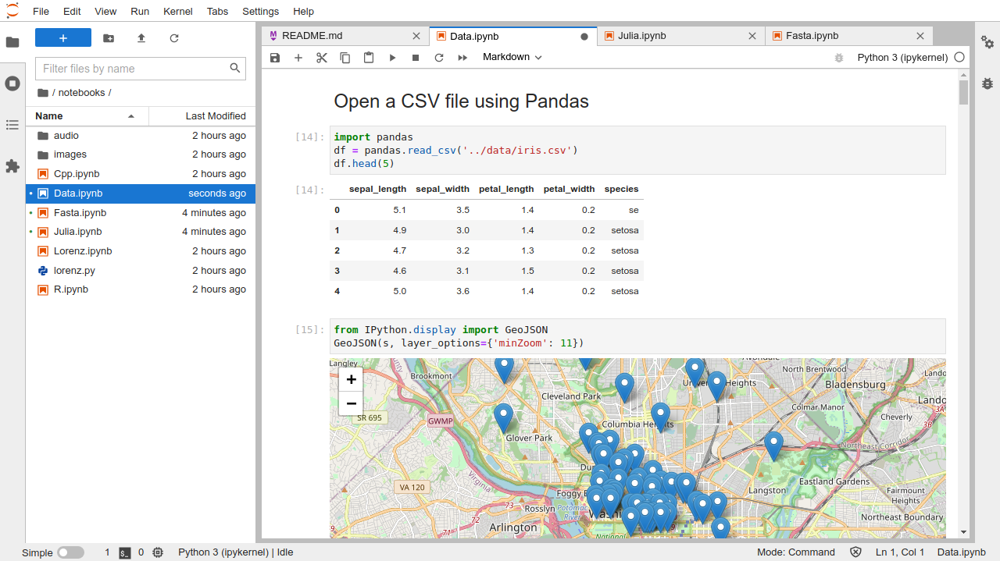

.. _notebook:

Notebooks
=========

Jupyter notebooks are documents that combine live runnable code with
narrative text (Markdown), equations (LaTeX), images, interactive
visualizations and other rich output:

**Jupyter notebooks (.ipynb files) are fully supported in JupyterLab.** The
`notebook document format <https://nbformat.readthedocs.io/en/latest/>`__ used in
JupyterLab is the same as in the classic Jupyter Notebook. Your existing notebooks
should open correctly in JupyterLab. If they don’t, please open an issue on our
`GitHub issues <https://github.com/jupyterlab/jupyterlab/issues>`__ page.

.. _create-notebook:

Create a notebook by clicking the ``+`` button in the file browser and
then selecting a kernel in the new Launcher tab:

.. raw:: html

  

     <iframe src="https://www.youtube-nocookie.com/embed/QL0IxDAOEc0?rel=0&amp;showinfo=0" frameborder="0" allow="autoplay; encrypted-media" allowfullscreen></iframe>
  

.. _rename-file:

A new file is created with a default name. Rename a file by
right-clicking on its name in the file browser and selecting “Rename”
from the context menu:

.. raw:: html

  

     <iframe src="https://www.youtube-nocookie.com/embed/y3xzXelypjs?rel=0&amp;showinfo=0" frameborder="0" allow="autoplay; encrypted-media" allowfullscreen></iframe>
  

The user interface for notebooks in JupyterLab closely follows that of
the classic Jupyter Notebook. The keyboard shortcuts of the classic
Notebook continue to work (with command and edit mode). However, a
number of new things are possible with notebooks in JupyterLab.

.. _drag-drop:

Drag and drop cells to rearrange your notebook:

.. raw:: html

  

     <iframe src="https://www.youtube-nocookie.com/embed/J9xoTGdqWIo?rel=0&amp;showinfo=0" frameborder="0" allow="autoplay; encrypted-media" allowfullscreen></iframe>
  

.. _drag-copy:

Drag cells between notebooks to quickly copy content:

.. raw:: html

  

     <iframe src="https://www.youtube-nocookie.com/embed/YTNZ5TS2LfU?rel=0&amp;showinfo=0" frameborder="0" allow="autoplay; encrypted-media" allowfullscreen></iframe>
  

.. _multiple-views:

Create multiple synchronized views of a single notebook:

.. raw:: html

  

     <iframe src="https://www.youtube-nocookie.com/embed/SQn9aRc050w?rel=0&amp;showinfo=0" frameborder="0" allow="autoplay; encrypted-media" allowfullscreen></iframe>
  

.. _collapse-code:

Collapse and expand code and output using the View menu or the blue
collapser button on left of each cell:

.. raw:: html

  

     <iframe src="https://www.youtube-nocookie.com/embed/WgiX3ZRaTiY?rel=0&amp;showinfo=0" frameborder="0" allow="autoplay; encrypted-media" allowfullscreen></iframe>
  

.. _enable-scrolling:

Enable scrolling for long outputs by right-clicking on a cell and
selecting “Enable Scrolling for Outputs”:

.. raw:: html

  

     <iframe src="https://www.youtube-nocookie.com/embed/U4usAUZCv_c?rel=0&amp;showinfo=0" frameborder="0" allow="autoplay; encrypted-media" allowfullscreen></iframe>
  

.. _cell-output-mirror:

Create a new synchronized view of a cell’s output:

.. raw:: html

  

     <iframe src="https://www.youtube-nocookie.com/embed/Asa_ML45HP8?rel=0&amp;showinfo=0" frameborder="0" allow="autoplay; encrypted-media" allowfullscreen></iframe>
  

.. _tab-completion:

Tab completion (activated with the ``Tab`` key) can now include additional
information about the types of the matched items:

.. raw:: html

  

     <iframe src="https://www.youtube-nocookie.com/embed/MuNr0i8LgpM?rel=0&amp;showinfo=0" frameborder="0" allow="autoplay; encrypted-media" allowfullscreen></iframe>
  

Note: IPython 6.3.1 has temporarily disabled type annotations.
To re-enable them, add ``c.Completer.use_jedi = True`` to an
`ipython_config.py <https://ipython.readthedocs.io/en/stable/development/config.html>`__ file. 

.. _tooltip:

The tooltip (activated with ``Shift Tab``) contains additional
information about objects:

.. raw:: html

  

     <iframe src="https://www.youtube-nocookie.com/embed/TgqMK1SG7XI?rel=0&amp;showinfo=0" frameborder="0" allow="autoplay; encrypted-media" allowfullscreen></iframe>
  

.. _create-console:

You can connect a :ref:`code console <code-console>` to a notebook kernel to have a log of
computations done in the kernel, in the order in which they were done.
The attached code console also provides a place to interactively inspect
kernel state without changing the notebook. Right-click on a notebook
and select “New Console for Notebook”:

.. raw:: html

  

     <iframe src="https://www.youtube-nocookie.com/embed/eq1l7DBngQQ?rel=0&amp;showinfo=0" frameborder="0" allow="autoplay; encrypted-media" allowfullscreen></iframe>
  

