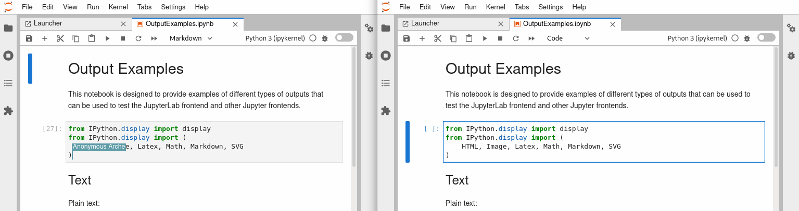

.. _rtc:

Real Time Collaboration
=======================

From JupyterLab v3.1, file documents and notebooks have collaborative
editing using the `Yjs shared editing framework <https://github.com/yjs/yjs>`_.
Editors are not collaborative by default; to activate it, start JupyterLab
with the ``--collaborative`` flag.

The new collaborative editing feature enables collaboration in real-time
between multiple clients without user roles, when sharing the URL of a
document to other users, they will have access to the same environment you
are working on (they can write and execute the cells).

Moreover, you can see the cursors from other users with an anonymous
username, a username that will disappear in a few seconds to make room
for what is essential, the document's content.

Something you need to be aware of is that not all editors are in sync.
For example, on JupyterLab, you can open a Notebook using the Notebook
editor or a plain text editor, the so-called Editor. Under the hood, those
editors use a different model to represent the document's content, what
we call ``DocumentModel``. For more information, you can read the section
of `Documents <https://jupyterlab.readthedocs.io/en/stable/extension/documents.html#documents>`_.

.. image:: images/sync_editors.png
   :align: center
   :class: jp-screenshot
