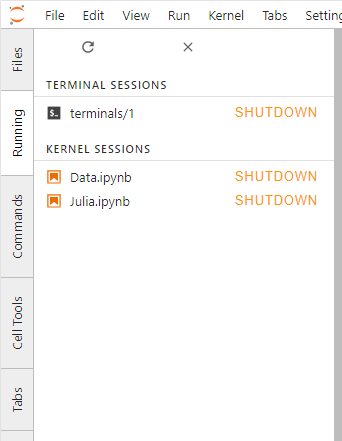

.. _running:

Managing Kernels and Terminals
------------------------------

The Running panel in the left sidebar shows a list of all the kernels and
terminals currently running across all notebooks, code consoles, and
directories:

.. _reopen-document:

As with the classic Jupyter Notebook, when you close a notebook
document, code console, or terminal, the underlying kernel or terminal
running on the server continues to run. This enables you to perform
long-running actions and return later. The Running panel enables you to
re-open or focus the document linked to a given kernel or terminal:

.. raw:: html

  

     <iframe src="https://www.youtube-nocookie.com/embed/gDM5lwU6Dmo?rel=0&amp;showinfo=0" frameborder="0" allow="autoplay; encrypted-media" allowfullscreen></iframe>
  

.. _shutdown-kernel:

Kernels or terminals can be shut down from the Running panel:

.. raw:: html

  

     <iframe src="https://www.youtube-nocookie.com/embed/PBDN9AJWBlw?rel=0&amp;showinfo=0" frameborder="0" allow="autoplay; encrypted-media" allowfullscreen></iframe>
  

.. _shutdown-all-kernels:

You can shut down all kernels and terminals by clicking the ``X``
button:

.. raw:: html

  

     <iframe src="https://www.youtube-nocookie.com/embed/tOjequ-46Qc?rel=0&amp;showinfo=0" frameborder="0" allow="autoplay; encrypted-media" allowfullscreen></iframe>
  

