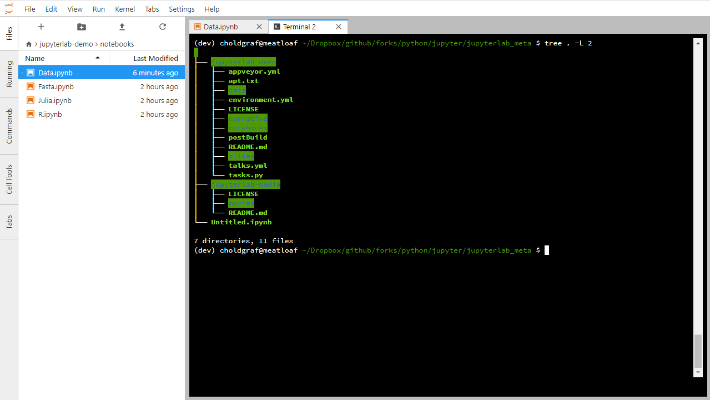

.. _terminal:

Terminals
==========

JupyterLab terminals provide full support for system shells (bash, tsch,
etc.) on Mac/Linux and PowerShell on Windows. You can run anything in
your system shell with a terminal, including programs such as vim or
emacs. The terminals run on the system where the Jupyter server is
running, with the privileges of your user. Thus, if JupyterLab is
installed on your local machine, the JupyterLab terminals will run
there.

.. _open-terminal:

To open a new terminal, click the ``+`` button in the file browser and
select the terminal in the new Launcher tab:

.. raw:: html

  

     <iframe src="https://www.youtube-nocookie.com/embed/ynMjz1tiq9o?rel=0&amp;showinfo=0" frameborder="0" allow="autoplay; encrypted-media" allowfullscreen></iframe>
  

.. _close-terminal:

Closing a terminal tab will leave it running on the server, but you can
re-open it using the Running tab in the left sidebar:

.. raw:: html

  

     <iframe src="https://www.youtube-nocookie.com/embed/gDM5lwU6Dmo?rel=0&amp;showinfo=0" frameborder="0" allow="autoplay; encrypted-media" allowfullscreen></iframe>
  

.. _Copy/Paste:

Copy/Paste
----------

For macOS users,  ``Cmd+C`` and ``Cmd+V`` work as usual.

For Windows users using ``PowerShell``, ``Ctrl+Insert`` and ``Shift+Insert`` work as usual.

To use the native browser Copy/Paste menu, hold ``Shift`` and right click to bring up the
context menu (note: this may not work in all browsers).

For non-macOS users, JupyterLab will interpret ``Ctrl+C`` as a copy if there is text selected.
In addition, ``Ctrl+V`` will be interpreted as a paste command unless the ``pasteWithCtrlV``
setting is disabled.  One may want to disable ``pasteWithCtrlV`` if the shortcut is needed
for something else such as the vi editor.

For anyone using a \*nix shell, the default ``Ctrl+Shift+C`` conflicts with the default
shortcut for toggling the command palette (``apputils:activate-command-palette``).
If desired, that shortcut can be changed by editing the keyboard shortcuts in setttings.
Using ``Ctrl+Shift+V`` for paste works as usual.
