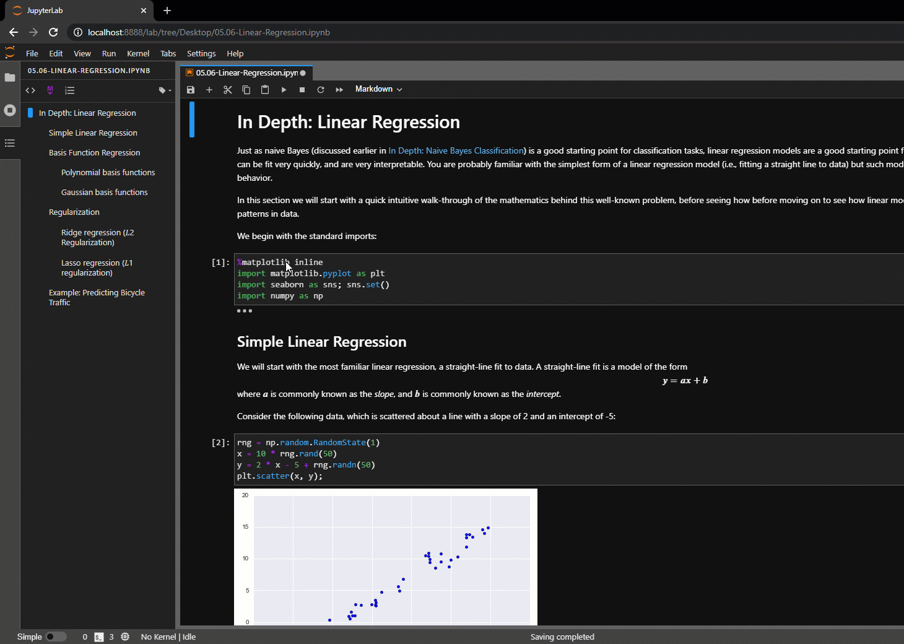
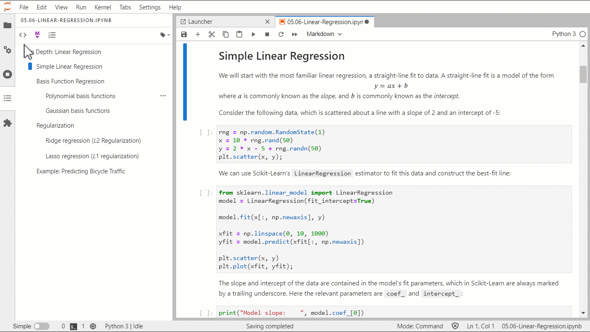
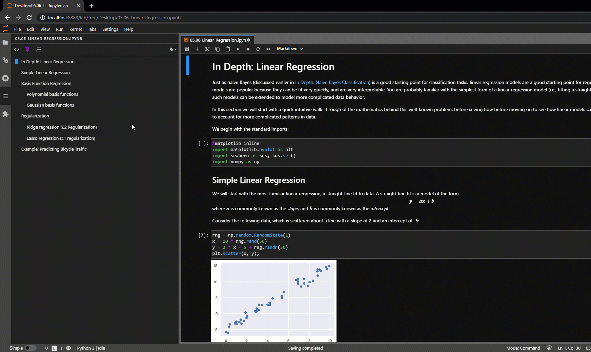
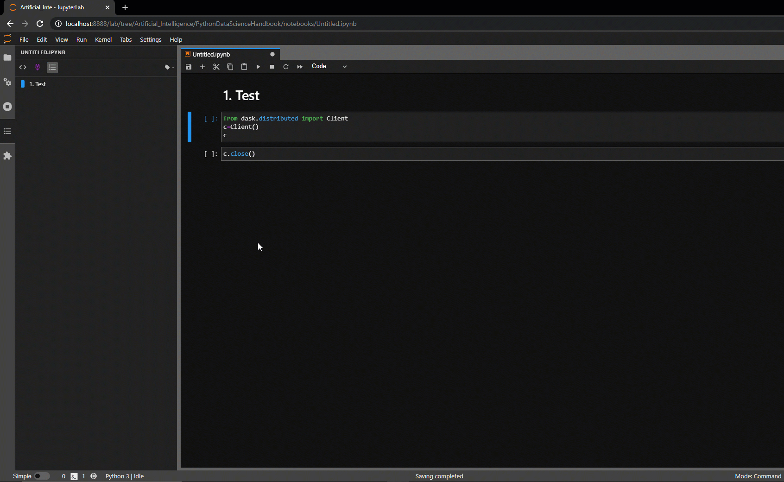

.. Copyright (c) Jupyter Development Team.
.. Distributed under the terms of the Modified BSD License.

.. _toc:

Table Of Contents
=================

The table of contents makes it easy to see and navigate the structure of a document.

A table of contents is auto-generated in the :ref:`left sidebar
<left-sidebar>` when you have a notebook, markdown, latex or python files opened.
The entries are clickable, and scroll the document to the heading in question.

In the sidebar panel, you can number headings, collapse sections, and navigate into the file.

Here is an animation showing the table of content use with a notebook:

The table of contents will be automatically generated for your notebook by taking all the
headings from your markdown cells. Each listed section will be linked to the actual section
within your document.

.. note::

    Markdown headings with a HTML tag that contains the class ``jp-toc-ignore`` will be ignored;
    e.g. ``# Title ``.

Automatic section numbering will go through your Notebook and number your sections and
subsection as designated by your headings. This means that if you've moved one or more big
sections around several times, you won't have to go through your document and renumber it,
as well as all its subsections, yourself.

------------------------------------------------------------------------------------------------------------

Automatic section numbering can be skipped for first-level headings (``h1``). You can toggle that
option via the *More actions* button in the table of contents toolbar. Here is an animation
showing its use:

.. image:: ./images/toc/numberingH1.gif
    :alt: A GIF showing how to toggle Automatic section numbering for headings within a notebook. Clicking the button instantly applies multilevel numbering to each heading.

------------------------------------------------------------------------------------------------------------

Context menus are added to those table of contents headings having notebook sections
containing runnable code cells, and clicking the *Select and Run Cell(s) for this Heading*
option will make the cells run in notebook. Here is an animation showing its use:

------------------------------------------------------------------------------------------------------------

 Cell heading collapse state will be synchronized between the table of contents and notebook if the ``syncCollapseState`` attribute
 is set to ``true`` in the settings. If a heading is collapsed in the table of contents the notebook will also gets collapsed and
 similarly expanding cells in notebook will expand the table of contents. To activate that feature go to settings and click on Settings
 Editor and then go to Table of Contents section and in User Preferences check the ``syncCollapseState`` box. Here is an animation showing its use:

------------------------------------------------------------------------------------------------------------

The headings in the cell outputs get numbered by default in the table of contents and the notebook.
This can be tuned by changing the settings ``includeOutput`` to ``false``. To perform that go to settings and click on Settings
Editor and then go to Table of Contents section and in User Preferences add unchecked ``includeOutput`` box. Here is an animation showing its use

.. _Settings:

Settings
--------

The table of contents behavior can be modified via settings which can be set in JupyterLab's settings editor.

* **includeOutput** : Whether to list headings from the cell outputs or not.
* **maximalDepth** : Maximal headings depth (default: 4).
* **numberingH1** : Whether to number the first-level headings (``h1``) or not.
* **numberHeaders** : Whether to number the headings or not.
* **syncCollapseState** : Whether to synchronize the cell and the table of contents collapse state or not.

.. note::

    Settings effects depend on the type of document.
