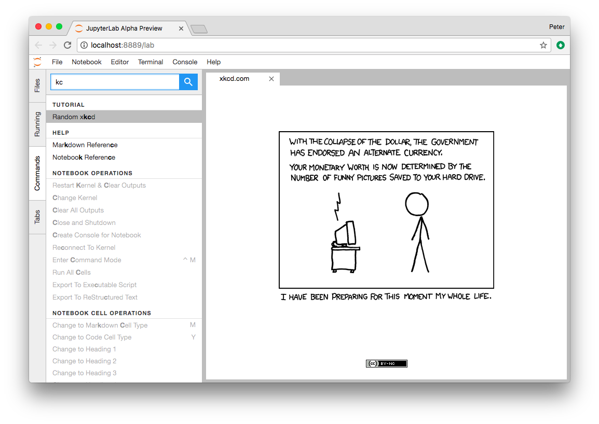

# Let's Make an xkcd JupyterLab Extension

JupyterLab extensions add features to the user experience. This page describes how to create one type of extension, an *application plugin*, that:

* Adds a "Random [xkcd](https://xkcd.com) comic" command to the *command palette* sidebar
* Fetches the comic image and metadata when activated
* Shows the image and metadata in a tab panel

By working through this tutorial, you'll learn:

* How to setup an extension development environment from scratch on a Linux or OSX machine.
    * Windows users: You'll need to modify the commands slightly.
* How to start an extension project from [jupyterlab/extension-cookiecutter-ts](https://github.com/jupyterlab/extension-cookiecutter-ts)
* How to iteratively code, build, and load your extension in JupyterLab
* How to version control your work with git
* How to release your extension for others to enjoy



Sound like fun? Excellent. Here we go!

## Install conda using miniconda

Start by opening your web browser and downloading the latest Python 3.x [Miniconda installer](https://conda.io/miniconda.html) to your home directory. When the download completes, open a terminal and create a root conda environment by running this command.

```bash
bash Miniconda3*.sh -b -p ~/miniconda
```

Now activate the conda environment you just created so that you can run the `conda` package manager.

```bash
source ~/miniconda/bin/activate
```

## Install NodeJS, JupyterLab, etc. in a conda environment

Next create a conda environment that includes:

1. the latest release of JupyterLab
2. [cookiecutter](https://github.com/audreyr/cookiecutter), the tool you'll use to bootstrap your extension project structure
3. [NodeJS](https://nodejs.org), the JavaScript runtime you'll use to compile the web assets (e.g., TypeScript, CSS) for your extension
4. [git](https://git-scm.com), a version control system you'll use to take snapshots of your work as you progress through this tutorial

It's best practice to leave the root conda environment, the one created by the miniconda installer, untouched and install your project specific dependencies in a named conda environment. Run this command to create a new environment named `jupyterlab-ext`.

```bash
conda create -n jupyterlab-ext nodejs jupyterlab cookiecutter git -c conda-forge
```

Now activate the new environment so that all further commands you run work out of that environment.

```bash
source ~/miniconda/bin/activate jupyterlab-ext
```

Note: You'll need to run the command above in each new terminal you open before you can work with the tools you installed in the `jupyterlab-ext` environment.

## Create an extension from the cookiecutter

Next use cookiecutter to create a new project for your extension.

```bash
cookiecutter https://github.com/jupyterlab/extension-cookiecutter-ts
```

When prompted, enter values like the following for all of the cookiecutter prompts.

```
author_name []: Your Name
author_email []: your-email@somewhere.org
extension_name [jupyterlab_myextension]: jupyterlab_xkcd
project_short_description [A JupyterLab extension.]: Show a random xkcd.com comic in a JupyterLab panel
```

Change to the directory the cookiecutter created and list the files.

```bash
cd jupyterlab_xkcd
ls
```

You should see a list like the following.

```
README.md     package.json  src           tsconfig.json
```

## Build and link the extension for development

Your new extension project has enough code in it to see it working in your JupyterLab. Run the following commands to install the initial project dependencies and link it to the JupyterLab environment.

```bash
npm install
jupyter labextension link .
```

Now rebuild your JupyterLab web frontend with the extension included.

```bash
jupyter lab build
```

Note: The build steps may show errors about `node-gyp` and `canvas` that look scary but are harmless.

If all goes well, the last bunch of messages you should see in your terminal should look something like the following:

```
Hash: e0afd73fc39f497d12b6
Version: webpack 2.7.0
Time: 13000ms
                                 Asset     Size  Chunks                    Chunk Names
  674f50d287a8c48dc19ba404d20fe713.eot   166 kB          [emitted]
af7ae505a9eed503f8b8e6982036873e.woff2  77.2 kB          [emitted]
 fee66e712a8a08eef5805a46892932ad.woff    98 kB          [emitted]
  b06871f281fee6b241d60582ae9369b9.ttf   166 kB          [emitted]
  912ec66d7572ff821749319396470bde.svg   444 kB          [emitted]  [big]
                           0.bundle.js   893 kB       0  [emitted]  [big]
                        main.bundle.js  6.88 MB       1  [emitted]  [big]  main
                       0.bundle.js.map  1.08 MB       0  [emitted]
                    main.bundle.js.map  8.26 MB       1  [emitted]         main
  [27] ./~/@jupyterlab/application/lib/index.js 5.48 kB {1} [built]
 [434] ./~/@jupyterlab/application-extension/lib/index.js 6.12 kB {1} [optional] [built]
 [450] ./~/@jupyterlab/pdf-extension/lib/index.js 4.92 kB {1} [optional] [built]
 [452] ./~/@jupyterlab/settingeditor-extension/lib/index.js 2.63 kB {1} [optional] [built]
 [453] ./~/@jupyterlab/shortcuts-extension/lib/index.js 3.7 kB {1} [optional] [built]
 [454] ./~/@jupyterlab/tabmanager-extension/lib/index.js 1.76 kB {1} [optional] [built]
 [455] ./~/@jupyterlab/terminal-extension/lib/index.js 7.29 kB {1} [optional] [built]
 [456] ./~/@jupyterlab/theme-dark-extension/lib/index.js 766 bytes {1} [optional] [built]
 [457] ./~/@jupyterlab/theme-light-extension/lib/index.js 770 bytes {1} [optional] [built]
 [458] ./~/@jupyterlab/tooltip-extension/lib/index.js 5.57 kB {1} [optional] [built]
 [459] ./~/@jupyterlab/vega2-extension/lib/index.js 6.13 kB {1} [optional] [built]
 [460] ./~/es6-promise/auto.js 179 bytes {1} [built]
 [461] ./~/jupyterlab_xkcd/lib/index.js 353 bytes {1} [optional] [built]
 [462] ./~/font-awesome/css/font-awesome.min.css 892 bytes {1} [built]
 [476] ./build/index.out.js 8.35 kB {1} [built]
    + 1125 hidden modules
```

## See the initial extension in action

The initial extension code logs a message to JavaScript console in your browser when JupyterLab loads. You should check that the extension is working properly before modifying it.

Open a second terminal. Run these commands to activate the `jupyterlab-ext` environment and to start a JupyterLab instance.

```bash
source ~/miniconda/bin/activate jupyterlab-ext
jupyter lab
```

JupyterLab should appear momentarily in your default web browser. Open the JavaScript console in the JupyterLab tab by following the instructions for your browser:

* [Accessing the DevTools in Google Chrome](https://developer.chrome.com/devtools#access)
* [Opening the Web Console in Firefox](https://developer.mozilla.org/en-US/docs/Tools/Web_Console/Opening_the_Web_Console)

You should see a message that says `JupyterLab extension jupyterlab_xkcd is activated!` in the console. If you do, congrats, you're ready to start modifying the the extension! If not, go back, make sure you didn't miss a step, and [reach out](https://github.com/jupyterlab/jupyterlab#getting-help) if you're stuck.

Note: Leave the terminal running the `jupyter lab` command open. You don't need to restart the JupyterLab server in order to test your extension code changes as you work through this tutorial.

## Commit what you have to git

Run the following commands in your `jupyterlab_xkcd` folder to initialize it as a git repository and commit the current code.

```bash
git init
git add .
git commit -m 'Seed xckd project from cookiecutter'
```

Note: This step is not technically necessary, but it is good practice to track changes in version control system in case you need to rollback to an earlier version or want to collaborate with others. For example, you can compare your work throughout this tutorial with the commits in a reference version of `jupyterlab_xkcd` on GitHub at https://github.com/parente/jupyterlab_xkcd.

## Add a command to show the xckd panel

The *command palette* is the primary view of all commands available to you in JupyterLab. For your first addition,yYou're going to add a *Random xkcd* command to the palette and get it to show an *xkcd* tab panel when invoked.

Fire up your favorite text editor and open the `src/index.ts` file in your extension project. Add the following import at the top of the file to get a reference to the command palette interface.

```typescript
import {
  ICommandPalette
} from '@jupyterlab/apputils';
```

Locate the `extension` object of type `JupyterLabPlugin`. Change the definition so that it reads like so:

```typescript
/**
 * Initialization data for the jupyterlab_xkcd extension.
 */
const extension: JupyterLabPlugin<void> = {
  id: 'jupyterlab_xkcd',
  autoStart: true,
  requires: [ICommandPalette],
  activate: (app, palette: ICommandPalette) => {
    console.log('JupyterLab extension jupyterlab_xkcd is activated!');
    console.log('ICommandPalette:', palette);
  }
};
```

The `requires` attribute states that your plugin needs an object that implements the `ICommandPalette` interface when it starts. JupyterLab will bind pass an instance of `ICommandPalette` as the second parameter of `activate` in order to satisfy this requirement. Defining `palette: ICommandPalette` makes this instance available to your code in that function. The second `console.log` line exists only so that you can immediately check that your changes work.

Run the following to rebuild your extension.

```bash
jupyter lab build
```

When the build completes, return to the browser tab that opened when you started JupyterLab. Refresh it and look in the console. You should see the same activation message as before, plus the new message about the ICommandPalette instance you just added. If you don't, check the output of the build command for errors and correct your code.

```
JupyterLab extension jupyterlab_xkcd is activated!
ICommandPalette: Palette {_palette: CommandPalette}
```

Now return to your editor. Add the following additional import to the top of the file.

```typescript
import {
  Widget
} from '@phosphor/widgets';
```

Then modify the `activate` function again so that it has the following code:

```typescript
  activate: (app, palette: ICommandPalette) => {
    console.log('JupyterLab extension jupyterlab_xkcd is activated!');

    // Create a single widget
    let widget: Widget = new Widget();
    widget.id = 'xkcd-jupyterlab';
    widget.title.label = 'xkcd.com';
    widget.title.closable = true;

    // Add an application command
    const command: string = 'xkcd:open';
    app.commands.addCommand(command, {
      label: 'Random xkcd comic',
      execute: () => {
        if(!widget.isAttached) {
          // Attach the widget to the main area if it's not there
          app.shell.addToMainArea(widget);
        }
        // Activate the widget
        app.shell.activateById(widget.id);
      }
    });

    // Add the command to the palette.
    palette.addItem({command, category: 'Tutorial'});
  }
```

The first new block of code creates a `Widget` instance, assigns it a unique ID, gives it a label that will appear as its tab title, and makes the tab closable by the user. The second block of code add a new command labeled *Random xkcd comic* to JupyterLab. When the comm and executes, it attaches the widget to the main display area if it is not already present and then makes it the active tab. The last new line of code adds the command to the command palette in a section called *Tutorial*.

Build your extension again (i.e., `jupyter lab build`) and refresh the browser tab. Open the command palette on the left side and type *xkcd*. Your *Random xkcd comic* command should appear. Click it or select it with the keyboard and press *Enter*. You should see a new, blank panel appear with the tab title *xkcd.com*. Click the *x* on the tab to close it and activate the command again. The tab should reappear. Finally, click one of the launcher tabs so that the *xkcd.com* panel is still open but no longer active. Now run the *Random xkcd comic* command one more time. The single *xkcd.com* tab should come to the foreground.


If your widget is not behaving, compare your code with https://github.com/parente/jupyterlab_xkcd/blob/964f63d8017709ad08a3cb96161a0371f860dc45/src/index.ts. Once you've got everything working properly, git commit your changes and carry on.

```bash
git add .
git commit -m 'Show xkcd panel on command'
```

## Show a single comic in the panel

You've got an empty panel. It's time to add a comic to it. Go back to your code editor. Add the following new import near the top of the file:

```typescript
import {
  ServerConnection
} from '@jupyterlab/services';
```

Now return to the `activate` function. Add the following code below the lines that create a `Widget` instance and above the lines that define the command.

```typescript
    // Add an image element to the panel
    let img = document.createElement('img');
    widget.node.appendChild(img);

    // Fetch info about a random comic
    let settings = ServerConnection.makeSettings();
    ServerConnection.makeRequest({url: 'http://xkcd-imgs.herokuapp.com/'}, settings).then(response => {
      img.src = response.data.url;
      img.alt = response.data.title;
      img.title = response.data.title;
    });
```

The first two lines create a new HTML `` element and add it to the widget DOM node. The next lines make a request to http://xkcd-imgs.herokuapp.com/, a hosted version of https://github.com/hemanth/xkcd-imgs-heroku, and set the source, alternate text, and title attributes of the image based on the response.

Rebuild your extension (`jupyter lab build`), refresh your browser tab, and run the *Random xkcd comic* command again. You should now see a comic in the xkcd.com panel when it opens.


Note that the comic is not centered in the panel nor does the panel scroll if the comic is larger than the panel area. Also note that the comic does not update no matter how many times you close and reopen the panel. You'll address both of these problems in the upcoming sections.

If you don't see a comic at all, compare your code with https://github.com/parente/jupyterlab_xkcd/blob/aa21b88b5efa635639658eb7387d332759781f45/src/index.ts. When it's working, make another git commit.

```bash
git add .
git commit -m 'Show a comic in the panel'
```

## Center the comic and add attribution

Create a `style` subfolder in the root of your extension project directory. Then create and open a `style/index.css` file for editing. Add the following lines to it.

```css
.jp-xkcdWidget {
    display: flex;
    flex-direction: column;
    overflow: auto;
}

.jp-xkcdCartoon {
    margin: auto;
}

.jp-xkcdAttribution {
    margin: 20px auto;
}
```

The first rule stacks content vertically within the widget panel and lets the panel scroll when the content overflows. The other rules center the cartoon and attribution badge horizontally and space them out vertically.

Return to the `index.ts` file. Add the following import to the top of the file.

```typescript
import '../style/index.css';
```

Now modify the the `activate` function to apply the CSS classes and add the attribution badge markup. The beginning of the function should read like the following:

```typescript
  activate: (app, palette: ICommandPalette) => {
    console.log('JupyterLab extension jupyterlab_xkcd is activated!');

    // Create a single widget
    let widget: Widget = new Widget();
    widget.id = 'xkcd-jupyterlab';
    widget.title.label = 'xkcd.com';
    widget.title.closable = true;
    widget.addClass('jp-xkcdWidget'); // new line

    // Add an image element to the panel
    let img = document.createElement('img');
    img.className = 'jp-xkcdCartoon'; // new line
    widget.node.appendChild(img);

    // New: add an attribution badge
    img.insertAdjacentHTML('afterend',
      `<div class="jp-xkcdAttribution">
        <a href="https://creativecommons.org/licenses/by-nc/2.5/" class="jp-xkcdAttribution" target="_blank">
          
        </a>
      </div>`
    );

    // Keep all the remaining ServerConnection and command lines the same
    // as before from here down ...
```

Finally, open the `package.json` file in the root of your project. Locate the `files` attribute and add a `"style/*"` entry to it:

```json
  "files": [
    "lib/**/*.{d.ts,eot,gif,html,jpg,js,js.map,json,png,svg,woff2,ttf}",
    "style/*"
  ],
```

This addition tells [webpack](https://webpack.js.org/) to include your stylesheet in its build of the frontend web assets, making it available for the `import` statement in you added to `index.ts`.

Build your extension (`jupyter lab build`) and refresh your JupyterLab browser tab. Invoke the *Random xkcd comic* command and confirm the comic is centered with an attribution badge below it. Resize the browser window or the panel so that the comic is larger than the available area. Make sure you can scroll the panel over the entire area of the comic.

If anything is misbehaving, compare your code with the reference project at this commit: https://github.com/parente/jupyterlab_xkcd/tree/b52d0457de350c054f35653af3a324d1057ffe5d When everything is working as expected, make another commit.

```bash
git add .
git commit -m 'Add styling, attribution'
```

## Show a new comic each time the command runs

The `activate` function has grown quite long, and there's still more functionality to add. You should refactor the code into two separate parts:

1. An `XkcdWidget` that encapsulate the xkcd panel elements, configuration, and soon-to-be-added update behavior
2. An `activate` function that adds the widget instance to the UI and decide when the comic should refresh

Start by refactoring the widget code into the new `XkcdWidget` class. Add the class just below the import statements in the `index.ts` file.

```typescript
class XkcdWidget extends Widget {
  settings: ServerConnection.ISettings;
  img: HTMLImageElement;

  constructor() {
    super();
    this.settings = ServerConnection.makeSettings();

    this.id = 'xkcd-jupyterlab';
    this.title.label = 'xkcd.com';
    this.title.closable = true;
    this.addClass('jp-xkcdWidget');

    this.img = document.createElement('img');
    this.img.className = 'jp-xkcdCartoon';
    this.node.appendChild(this.img);

    this.img.insertAdjacentHTML('afterend',
      `<div class="jp-xkcdAttribution">
        <a href="https://creativecommons.org/licenses/by-nc/2.5/" class="jp-xkcdAttribution" target="_blank">
          
        </a>
      </div>`
    );
  }

  showImage(): void {
    ServerConnection.makeRequest({url: 'http://xkcd-imgs.herokuapp.com/'}, this.settings).then(response => {
      this.img.src = response.data.url;
      this.img.alt = response.data.title;
      this.img.title = response.data.title;
    });
  }
};
```

You've written all of the code before. All you've done is restructure it to use instance variables and move the comic request to its own function.

Next move the remaining logic in `activate` to a new, top-level function just below the `XkcdWidget` class definition. Modify the code to create a widget when one does not exist in the main JupyterLab area or to refresh the comic in the exist widget when the command runs again. The code for the `activate` function should read as follows after these changes:

```typescript
function activate(app: JupyterLab, palette: ICommandPalette) {
  console.log('JupyterLab extension jupyterlab_xkcd is activated!');

  // Create a single widget
  let widget: XkcdWidget = new XkcdWidget();

  // Add an application command
  const command: string = 'xkcd:open';
  app.commands.addCommand(command, {
    label: 'Random xkcd comic',
    execute: () => {
      if(!widget.isAttached) {
        // Attach the widget to the main area if it's not there
        app.shell.addToMainArea(widget);
      }
      // Refresh the comic in the widget
      widget.showImage();
      // Activate the widget
      app.shell.activateById(widget.id);
    }
  });

  // Add the command to the palette.
  palette.addItem({ command, category: 'Tutorial' });
};
```

Modify the import statement for `@jupyterlab/application` at the top of the file so that the `JupyterLab` type is known for the `app` parameter to the function.

```typescript
import {
  JupyterLab, JupyterLabPlugin
} from '@jupyterlab/application';
```

Remove the `activate` function definition from the `JupyterLabPlugin` object and refer instead to the top-level function like so:

```typescript
const extension: JupyterLabPlugin<void> = {
  id: 'jupyterlab_xkcd',
  autoStart: true,
  requires: [ICommandPalette],
  activate: activate
};
```

Make sure you retain the `export default extension;` line in the file. Now build the extension again and refresh the JupyterLab browser tab. Run the *Random xkcd comic* command more than once without closing the panel. The comic should update each time you execute the command. Close the panel, run the command, and it should both reappear and show a new comic.

If anything is amiss, compare your code with https://github.com/parente/jupyterlab_xkcd/blob/d7a7207efc526a096bd307d9fbafc686b763cbd9/src/index.ts to debug. Once it's working properly, commit it.

```bash
git add .
git commit -m 'Refactor, refresh comic'
```

## Restore panel state when the browser refreshes

## Publish the extension to npmjs.org

## Ideas for further learning