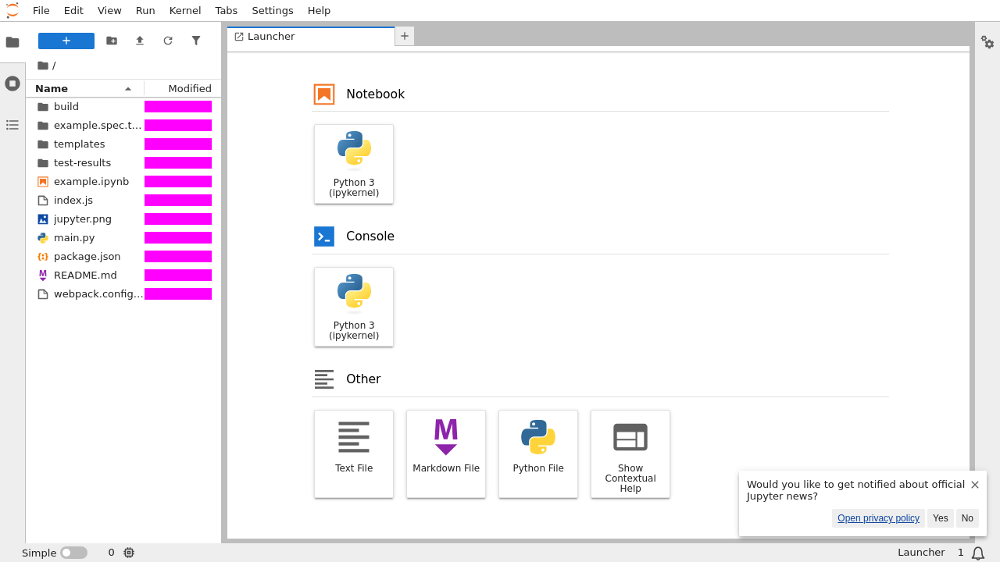

# JupyterLab application remix example

This example demonstrates how to create a JupyterLab application remix by
combining existing core packages.

<figcaption>Pink rectangles mask transient data.</figcaption>
