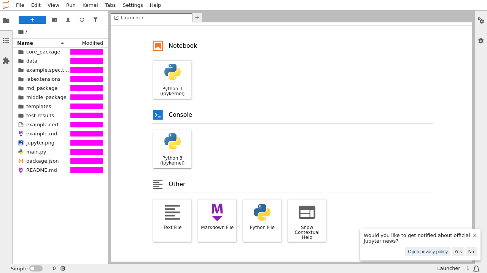

# JupyterLab federated application example

This example demonstrates how to create a JupyterLab application remix by
combining existing core packages with custom packages combined through Webpack
module federation mechanism.

<figcaption>Pink rectangles mask transient data.</figcaption>
