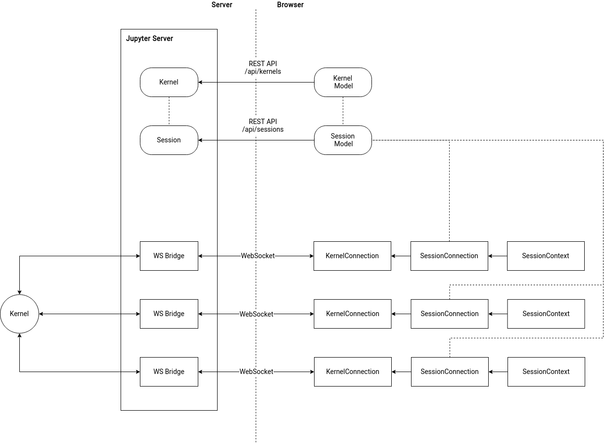

# JupyterLab Services

Javascript client for the Jupyter services REST APIs

[API Docs](http://jupyterlab.github.io/jupyterlab/)

[REST API Docs](http://petstore.swagger.io/?url=https://raw.githubusercontent.com/jupyter/notebook/master/notebook/services/api/api.yaml)

Note: All functions and classes using the REST API allow a `serverSettings`
parameter to configure requests.
Requests are made using the `fetch` API, which is available in modern browsers
or via `npm install fetch` for node users. The `whatwg-fetch` npm package
can be used to polyfill browsers that do not support the `fetch` API.

## Package Install

**Prerequisites**

- [node](http://nodejs.org/)
- [python](https://www.anaconda.com/distribution/)

```bash
npm install --save @jupyterlab/services
conda install notebook  # notebook 4.3+ required
```

## Source Build

**Prerequisites**

See the [building instructions for JupyterLab](../../CONTRIBUTING.md), which
will build this module as part of the build process.

**Rebuild**

```bash
yarn run clean
yarn run build
```

## Run Tests

Follow the source build instructions first.

```bash
yarn run test
```

## Build Docs

Follow the source build instructions first.

```bash
yarn run docs
```

Navigate to `docs/index.html`.

## Supported Runtimes

The runtime versions which should work are listed below. Earlier versions may
also work, but come with no guarantees.

- Node 10
- Firefox 52+
- Chrome 55+

Note: "requirejs" may need be included in a global context for `Comm` targets
using the a `target_module` (in the classic Notebook).
This can be as a `<script>` tag in the browser or by using the `requirejs`
package in node (`npm install requirejs` and setting
`global.requirejs = require('requirejs');`).

## Starting the Notebook Server

Follow the package install instructions first.

The library requires a running Jupyter Notebook server, launched as:

```bash
jupyter notebook
```

or

```bash
jupyter lab
```

## Bundling for the Browser

Follow the package install instructions first.

See `examples/browser` for an example of using Webpack to bundle the library.

## Usage from Node.js

Follow the package install instructions first.

See `examples/node` for an example of using an ES5 node script.

## Usage Examples

**Note:** This package is compiled to ES2018 JavaScript syntax from
TypeScript. Here are some examples of using parts of this package. See the
other `examples` subdirectories for more examples.

- [Comms](./examples/browser/src/comm.ts)
- [Config](./examples/browser/src/config.ts)
- [Contents](./examples/browser/src/contents.ts)
- [Kernel](./examples/browser/src/kernel.ts)
- [Session](./examples/browser/src/session.ts)
- [Terminal](./examples/browser/src/terminal.ts)

## Overview

This package introduces a number of concepts, such as session context, etc.
Here we give a brief overview of some of the top-level concepts in this
package.

### Clients

A _client_ is a single entity connected to a kernel. Since kernel messages
include the client id, it is easy for a client to filter kernel messages for
just messages between it and the kernel. In JupyterLab, different activities
(such as a console and a notebook) are usually considered separate clients when
connected to the same kernel.

### Kernel specs

A _kernel spec_ is the data about an available kernel on the system. We can
retrieve a current list of kernel specs from the server.

### Kernels

A _kernel_ represents a running process on the server that implements the
Jupyter kernel messaging protocol.

#### Kernel model

A _kernel model_ mirrors the server kernel models, and represents a single
running kernel on the server. A kernel can be created, restarted, shut down,
etc., through calls to the server. A kernel model's lifecycle mirrors the
server kernel model's lifecycle, and it will be disposed when the server
kernel is shut down.

#### Kernel connection

A _kernel connection_ represents a single client connecting to a kernel over a
websocket. Typically only one kernel connection handles comms for any given
kernel. The kernel connection is disposed when the client no longer has a need
for the connection. Disposing a kernel connection does not cause the kernel to
shut down. However, if a kernel is shut down, (eventually) all of its kernel
connections should be disposed if they were initiated from a kernel manager.
If the kernel connections were instantiated outside of a manager, you are
responsible for cleaning them up.

A kernel connection has a number of signals, such as kernel status, kernel
connection status, etc.

#### Kernel manager

A _kernel manager_ is an object that maintains a list of kernel models by
regular polling. The kernel manager can instantiate a kernel connection and
will manage its lifecycle (e.g., when the kernel is shut down, the connections
will be disposed). The manager provides some minimal bookkeeping around
kernels and their connections. Generally, it is easiest to interact with
kernels on a server through a manager.

### Sessions

A _session_ is a mapping on the server from an identifying string (the
session's `path`) to a kernel. A session has a few other pieces of information
to allow for easy categorization and searching of sessions.

The primary usecase of a session is to enable persisting a connection to a
kernel. For example, a notebook viewer may start a session with session path
of the notebook's file path. When a browser is refreshed, the notebook viewer
can connect to the same kernel by asking the server for the session
corresponding with the notebook file path.

#### Session model

A _session model_ mirrors a server session. The session models can be
refreshed from the server, created, changed (including creating a new session
kernel), and shut down (which implies that the kernel will be shut down). A
session model's lifecycle mirrors the server session's lifecycle, and it will
be disposed when the server session is shut down.

#### Session connection

A _session connection_ represents a single client connected to a session's
kernel. A session's kernel connection can change and may be null to signify no
current kernel connection. A session connection owns the kernel connection,
meaning the kernel connection is created and disposed by the session
connection as needed. The session connection proxies signals from the kernel
connection for convenience (e.g., you can listen to the session's status
signal to get status changes for whatever the current kernel is, without
having to disconnect and reconnect your signal handlers every time the session
kernel changes). The session connection can be disposed when the client no
longer is connected to that session's kernel, and disposal will not cause the
session model to be deleted.

#### Session manager

A _session manager_ is an object that maintains a list of session models by
regular polling. The session manager can instantiate a session connection and
will manage its lifecycle (e.g., when the session is shut down, the connections
will be disposed). The manager provides some minimal bookkeeping around
sessions and their connections. Generally, it is easiest to interact with
sessions on a server through a manager.

### Session Context

A _session context_ is an object which has the same lifecycle as the client.
The session context owns a session connection (which may be null if the client
is not currently associated with a session). The session context proxies the
current session connection's signals for convenience. The session context
primarily serves as a stable object for a client to keep track of the current
session connection. The session context also contains some convenience
functionality, such as preferences for whether a kernel should be started and
a user-friendly kernel name and status.

Here is a diagram that provides an overview of the different components:



_The diagram can be edited on [diagrams.net](https://diagrams.net) by importing the [source](./architecture.xml)_.
