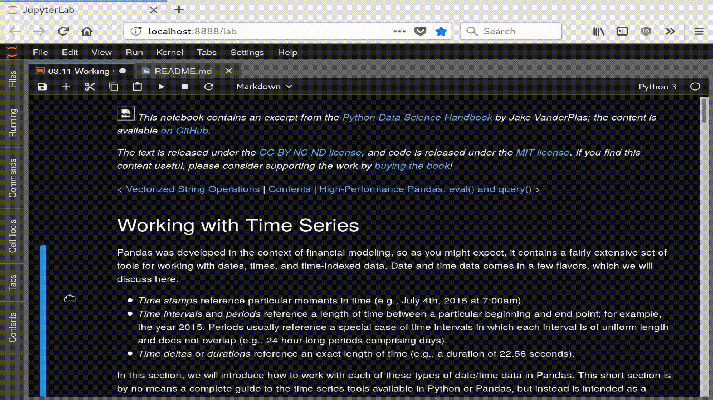

# jupyterlab-toc

A Table of Contents extension for JupyterLab.
This auto-generates a table of contents in the left area when you have a notebook
or markdown document open. The entries are clickable, and scroll the document
to the heading in question.

Here is an animation showing the extension's use, with a notebook from the
[Python Data Science Handbook](https://github.com/jakevdp/PythonDataScienceHandbook):



## Prerequisites

* JupyterLab v0.31

## Installation

```bash
jupyter labextension install jupyterlab-toc
```

## Development

For a development install (requires npm version 4 or later), do the following in the repository directory:

```bash
jlpm install
jlpm run build
jupyter labextension install .
```

To rebuild the package and the JupyterLab app:

```bash
jlpm run build
jupyter lab build
