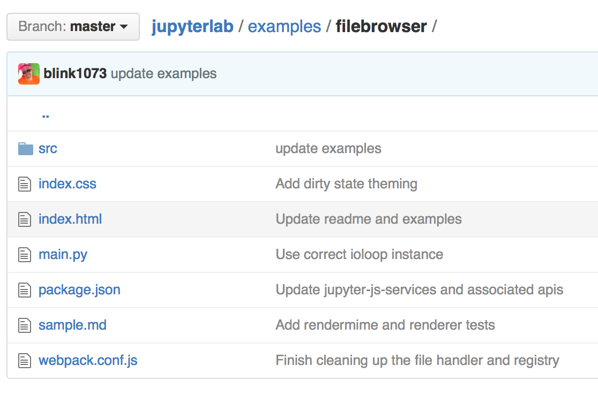

# Plugin Examples

The `examples` directory in the JupyterLab repo contains:
- several stand-alone plugin examples (`console`, `filebrowser`,
  `notebook`, `terminal`)
- a more complex example (`lab`).

Installation instructions for the examples are found in the project's
README.

After installing the jupyter notebook server 4.2+, follow the steps for
installing the development version of JupyterLab. To build the examples,
enter from the ``jupyterlab`` repo root directory: 

    npm run server:examples

To run a particular plugin, navigate to the plugin's subdirectory in the
``examples`` directory and enter: 

    python main.py

##  Dissecting the 'filebrowser' plugin

The filebrowser plugin provides a stand-alone implementation of a 
filebrowser.

Let's take a closer look at the source code for the plugin in
``examples/filebrowser``.

### Directory structure of 'filebrowser' plugin

The plugin in ``examples/file`` is comprised by a handful of files and
the ``src`` directory.

